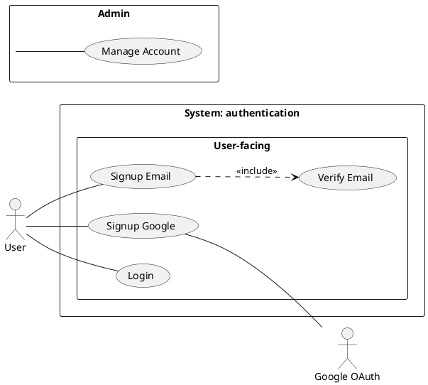

<!-- Licensed to mynguyen.cntt.px@gmail.com — Order XKLGKY9PA -->

# /usecase-diagram — Use Case Diagram (PlantUML native)‍​‌‌‌‌‌​​‌​​​‌​​‌‌​​‌​‌‌‌‌‌​‌​​‌​​‌​‌‌​​‌​​‌​‌​‌‌​​​‌​‌‌​‌‌‌‌‌​​‌​​‌​​​‌​​‌​‌‌‌‌​​‌‌​‌​‌​‌‌‌‌​‌‌​‌‌‌​​‌‌​‌‌​‌‌​​‌‌‌​​‌‌‌‌‌​​‌​‌​‌‍

## Goal‍​‌‌‌‌‌​​‌​​​‌​​‌‌​​‌​‌‌‌‌‌​‌​​‌​​‌​‌‌​​‌​​‌​‌​‌‌​​​‌​‌‌​‌‌‌‌‌​​‌​​‌​​​‌​​‌​‌‌‌‌​​‌‌​‌​‌​‌‌‌‌​‌‌​‌‌‌​​‌‌​‌‌​‌‌​​‌‌‌​​‌‌‌‌‌​​‌​‌​‌‍

Produce visual use case diagram cho 1 feature: actors (bên ngoài system) + use cases (bên trong system boundary, gom nhóm theo package khi nhiều) + relationships (`include`, `extend`, `generalization`). Phục vụ kickoff stakeholder và system scope overview — KHÔNG phải detail flow (đó là `/usecase` text doc).

Output trong `docs/{feature}/usecases/`:
1. `{feature}-usecase-diagram.puml` — __source__ PlantUML do AI viết (text, version git được). Sửa khi gọi lại skill (tự vào update mode).
2. `{feature}-usecase-diagram.svg` — render sẵn (mở bằng browser/IDE/Obsidian).

> **KHÔNG còn file `.md` wrapper riêng** (bỏ 2026-07-13). Ảnh `.svg` + bảng Actors/Use Cases/Relationships được nhúng/ghi thẳng vào **`{feature}-usecase-index.md`** (nơi đã giữ metadata UC) — tránh 2 file wrapper trùng dữ liệu + drift. `/preview` và Obsidian đọc `{feature}-usecase-index.md` là thấy ảnh.

## Tại sao PlantUML thay vì Mermaid workaround?‍​‌‌‌‌‌​​‌​​​‌​​‌‌​​‌​‌‌‌‌‌​‌​​‌​​‌​‌‌​​‌​​‌​‌​‌‌​​​‌​‌‌​‌‌‌‌‌​​‌​​‌​​​‌​​‌​‌‌‌‌​​‌‌​‌​‌​‌‌‌‌​‌‌​‌‌‌​​‌‌​‌‌​‌‌​​‌‌‌​​‌‌‌‌‌​​‌​‌​‌‍

Mermaid __không có cú pháp use-case-diagram gốc__ — bản trước dùng `flowchart` giả lập (`([Actor])` + `(Use Case)` + subgraph), chỉ approximation, không group được use case thành package rõ ràng, không phân biệt được `include`/`extend`/`generalization` bằng ký hiệu chuẩn. PlantUML có `actor`/`usecase`/`package` __native__ — đúng UML thật, group use case theo domain con dễ dàng, giảm crossing lines khi nhiều use case.

> __Trade-off đã xác nhận:__ không có Java runtime trên máy này để chạy PlantUML local — skill render qua **server công khai `plantuml.com`** (giống cách bpmn-js viewer dùng CDN). Nghĩa là nội dung diagram (tên actor/use case) được gửi qua internet mỗi lần render. Nếu nội dung nhạy cảm, cân nhắc cài Java + `plantuml.jar` local thay thế (xem Pitfalls).
>
> __PlantUML cũng không native-render trên GitHub/Obsidian__ (cần plugin/server, giống D2) — đây là lý do skill xuất `.svg` rồi nhúng `` vào `{feature}-usecase-index.md`, KHÔNG nhúng code `` ```plantuml `` fence trực tiếp (sẽ hiển thị raw text, không render).

## Constraints‍​‌‌‌‌‌​​‌​​​‌​​‌‌​​‌​‌‌‌‌‌​‌​​‌​​‌​‌‌​​‌​​‌​‌​‌‌​​​‌​‌‌​‌‌‌‌‌​​‌​​‌​​​‌​​‌​‌‌‌‌​​‌‌​‌​‌​‌‌‌‌​‌‌​‌‌‌​​‌‌​‌‌​‌‌​​‌‌‌​​‌‌‌‌‌​​‌​‌​‌‍

### Hard rules — never violate‍​‌‌‌‌‌​​‌​​​‌​​‌‌​​‌​‌‌‌‌‌​‌​​‌​​‌​‌‌​​‌​​‌​‌​‌‌​​​‌​‌‌​‌‌‌‌‌​​‌​​‌​​​‌​​‌​‌‌‌‌​​‌‌​‌​‌​‌‌‌‌​‌‌​‌‌‌​​‌‌​‌‌​‌‌​​‌‌‌​​‌‌‌‌‌​​‌​‌​‌‍

* __L1 approval__ trước Write — show path + actor count + use case count + package grouping (nếu áp dụng).
* __KHÔNG L3 iterate__ — PlantUML không render trong chat. User review từ `.svg`, muốn sửa thì gọi lại skill và nói cần đổi gì.
* **`--feature` optional** — auto-detect từ ngữ cảnh/feature đang làm dở; mơ hồ mới hỏi bằng picker.
* **Feature chưa tồn tại HOẶC thiếu cả `usecases/{feature}-usecase-index.md` lẫn `srs/{feature}-spec.md` → REFUSE + route `/usecase` hoặc `/srs`** (per `feature-bootstrap.md` nhóm B) — không có actor/UC nguồn thật thì diagram tự bịa sẽ sai. __Có ≥1 trong 2 nguồn (kể cả chưa approved) → proceed.__
* **Render qua `render.sh`** (dùng chung script trong `.claude/skills/usecase-diagram/`) — KHÔNG tự gọi curl/encode trực tiếp trong skill logic, script lo hết.
* __Compile phải PASS__ (HTTP 200 + SVG hợp lệ, không phải trang lỗi) trước khi báo xong.
* __System boundary BẮT BUỘC__ — mọi use case nằm trong 1 rectangle `rectangle "System: {feature}" { ... }` (hoặc package tên feature); actor ở ngoài. Diagram thiếu boundary = thiếu scope.
* __Package theo domain/subsystem THẬT, KHÔNG theo ngưỡng số__ — chỉ chia package khi có domain con thật (vd "User-facing" / "Admin" / "Integration"). KHÔNG dùng ngưỡng cơ học ">7-8 UC" (đếm số không phải lý do chia nhóm). Ít domain → 1 boundary duy nhất là đủ.
* __Relationship phải có evidence + rationale__ — KHÔNG tự suy include/extend/generalization. Chỉ vẽ khi UC text chứng minh (mandatory-shared / conditional-addition / specialization thật) + ghi được rationale. Mặc định chỉ vẽ actor `--` UC + boundary. `include` ≠ "tách bước dùng chung cho đẹp"; `extend` ≠ "mọi error/optional branch". Sai hướng mũi tên là lỗi hay gặp — xem syntax reference.
* __KHÔNG ghi câu meta giải thích lựa chọn relationship vào doc__ (vd "Không dùng `include` vì...", "Nguồn thật ở `.puml`, sửa qua render.sh..."). Đó là meta-text vi phạm `ba-conventions.md` Mục 0 — hướng dẫn/lý do thuộc SKILL.md, KHÔNG nằm trong index. Section `## Relationships` chỉ chứa bảng relationship THẬT (Type/From/To/Rationale nghiệp vụ); không có relationship thì để bảng rỗng hoặc bỏ section, KHÔNG viết câu giải thích "vì sao không có".
* __Auto-detect__ actors + use cases từ:
  * `docs/{feature}/usecases/uc-*.md` — pull title + primary actor.
  * `docs/{feature}/{feature}-urd.md` Mục 2 User Types.
  * `docs/{feature}/srs/{feature}-spec.md` actor mentions.
* __Vietnamese-first__ labels, auto-detect từ ngữ cảnh feature. Muốn tiếng Anh thì nói "viết bằng tiếng Anh". PlantUML syntax giữ English.
* __Per @../../rules/diagram-selection.md__ — nếu feature chỉ 1 actor + 1 use case → warn "overkill, có thể skip".
* **Ảnh + bảng nhúng vào `{feature}-usecase-index.md`** (section `## Diagram / Actors / Relationships`), KHÔNG tạo file `.md` wrapper riêng.
* __Render qua server công khai (plantuml.com)__ — nội dung diagram gửi qua internet mỗi lần render. Cần offline/không muốn gửi data ra ngoài → cài Java (`brew install openjdk`) + tải `plantuml.jar` (plantuml.com/download), rồi tự đổi `render.sh` sang gọi `java -jar plantuml.jar` local thay vì HTTP. Skill hiện tại KHÔNG tự làm việc này — chỉ báo gotcha cho user tự quyết.

### Pitfalls — easy to get wrong

* __Feature/nguồn hoàn toàn không tồn tại__ — refuse + route `/usecase {feature}` (hoặc `/srs {feature}`); KHÔNG tự tạo feature, KHÔNG bịa actor/use case. Đây KHÁC "có index/spec nhưng chưa approved" (case đó proceed bình thường).
* __Quá nhiều use cases (>10)__ vẫn rối dù đã group package — cân nhắc split thành 2 diagram riêng theo nhóm lớn (vd "User-facing" 1 file, "Admin" 1 file).
* __Package lồng nhau__ — PlantUML hỗ trợ nhưng render rối; giữ 1 tầng package duy nhất.
* __External system as actor__ — khai actor riêng, đặt ngoài mọi package, dùng alias khi tên có space (vd "Google OAuth").
* __3 mức "đúng" KHÁC nhau — đừng gộp thành 1 chữ PASS:__
  1. `Ngữ pháp: PASS` — `puml-usecase-lint` đã chặn (tất định, máy kiểm 100%).
  2. `Render: PASS` — có ảnh thật, không phải ảnh chứa chữ lỗi.
  3. `Nghiệp vụ: chưa kiểm` — __máy KHÔNG phán được__: goal level (UC cùng level, ưu tiên sea),
     actor có bị trùng vai/persona không, hướng include/extend có khớp UC text không (lint chỉ
     *cảnh báo* theo dấu hiệu số actor), tên UC có phải mục tiêu người dùng thay vì CRUD kỹ thuật.
     Phần này bắt buộc tự soi ở bước 7.5 + đối chiếu `{feature}-usecase-index.md`.
  Báo cáo cho user phải nói rõ mức 3 chưa được máy kiểm, KHÔNG viết "✅ đã verify" chung chung.
* __Diagram thừa khi__ feature chỉ 1 actor + vài goal rõ ràng, hoặc audience đang cần executable flow/AC hơn scope map → warn "có thể skip".
* **Nguồn thật là `.puml`** — ảnh + bảng nhúng trong `{feature}-usecase-index.md`. Sửa nội dung → sửa `.puml` rồi gọi lại skill (section trong index bị regen). KHÔNG sửa tay section `## Diagram/Actors/Relationships` (bị ghi đè).
* __Compile fail (HTTP non-200 hoặc SVG <200 bytes)__ — `render.sh` tự phát hiện, trả exit code khác 0. Đọc lỗi cụ thể, sửa `.puml` (thường do quote/alias thiếu), render lại. Tối đa 2 lần tự sửa trước khi báo user.
* **`/preview` đọc `{feature}-usecase-index.md`** — section `## Diagram` đã nhúng `` (HTML chuẩn) nên preview.html hiển thị ảnh bình thường. KHÔNG còn file `diagram.md` riêng.

## Inputs

```
/usecase-diagram --feature <slug>    # auto-detect actors + use cases; tự vào update mode nếu diagram.puml đã có
/usecase-diagram                     # feature auto-detect từ ngữ cảnh, mơ hồ mới hỏi
```

Actor list auto-detect; user confirm/sửa trong L1 prompt thay vì flag. Muốn tiếng Anh thì nói "viết bằng tiếng Anh".

## Context (dynamic)

Today: !`date +%Y-%m-%d`
Features có sẵn: !`ls -d docs/*/ 2>/dev/null | xargs -I{} basename {} | head -20`

## Approach

1. __Resolve feature__ — `--feature` explicit nếu có; else auto-detect (single in-progress) hoặc picker. Phân biệt 2 case (per `feature-bootstrap.md` nhóm B):
   * **Feature KHÔNG tồn tại HOẶC thiếu cả `usecases/{feature}-usecase-index.md` lẫn `srs/{feature}-spec.md`** (không có nguồn actor/UC nào) → __REFUSE tường minh + route__: "Chưa thể chạy `/usecase-diagram` cho `{feature}` — thiếu use case + SRS nguồn (cần actor + use case để vẽ). Feature hiện có: {list}. Chạy `/usecase {feature}` (hoặc `/srs {feature}`) trước, rồi quay lại." KHÔNG tự tạo feature.
   * __Có ≥1 nguồn__ (`{feature}-usecase-index.md` hoặc `srs/{feature}-spec.md`, kể cả chưa approved) → proceed.
2. __Validate existing__ — `docs/{feature}/usecases/{feature}-usecase-diagram.puml` đã tồn tại → tự chuyển sang update mode (L2 diff), báo user biết đang update.
3. __Auto-detect actors + use cases:__
   * Đọc `docs/{feature}/usecases/{feature}-usecase-index.md` table `## Use cases` — pull slug + actor + title (UC files zero-frontmatter, metadata sống ở file index).
   * Scan `docs/{feature}/{feature}-urd.md` Mục 2 — extract user types làm actor.
   * Scan `docs/{feature}/srs/{feature}-spec.md` — find actor mentions trong FR/flows.
   * Dedupe + present list cho user confirm (Y / sửa / thêm).
4. __Classify actors:__
   * Primary (trigger use case chính) — vd User, Customer.
   * Secondary (hỗ trợ / nhận output) — vd Admin, Manager.
   * System (external service) — vd Google OAuth, Stripe, Email Service.
5. __Identify relationships__ (chỉ primary — xem Constraints):
   * `include`: use case A luôn gọi B (vd "Checkout" includes "Validate Cart").
   * `extend`: use case B mở rộng A trong điều kiện cụ thể (vd "Apply Discount" extends "Checkout").
   * `generalization`: use case A là dạng cụ thể của B (hiếm — chỉ specialization thật).
   * __Chỉ suy relationship khi có evidence + rationale__ (per Constraints). Không giải thích được → KHÔNG vẽ, chỉ actor `--` UC.
6. __System boundary + package__ — mọi UC trong 1 boundary tên feature; chia package chỉ khi có __domain/subsystem thật__ (KHÔNG theo ngưỡng số UC). Present nhóm đề xuất cho user confirm ở L1.‍​‌‌‌‌‌​​‌​​​‌​​‌‌​​‌​‌‌‌‌‌​‌​​‌​​‌​‌‌​​‌​​‌​‌​‌‌​​​‌​‌‌​‌‌‌‌‌​​‌​​‌​​​‌​​‌​‌‌‌‌​​‌‌​‌​‌​‌‌‌‌​‌‌​‌‌‌​​‌‌​‌‌​‌‌​​‌‌‌​​‌‌‌‌‌​​‌​‌​‌‍
7. **Viết source `.puml`** (công thức bên dưới) — actor `--` UC (không hướng), include base→included, extend extending→base. AI mô tả cấu trúc, PlantUML lo layout.
7.5. __Tự-lint cạnh TRƯỚC L1 (BẮT BUỘC — soi từng dòng như máy, không đọc cho có):__
   * Mọi dòng có `-->` / `<--` mà 1 đầu là actor → sửa thành `--`. (Đây là lỗi #1 hay gặp nhất
     vì `-->` là token vẽ-cạnh phổ biến nhất ở mọi diagram khác — prior rất mạnh, phải chủ động soi.)
   * Mọi dòng có `..>`: (i) 2 đầu đều là alias __usecase__? (ii) nhãn đúng nguyên văn
     `<<include>>` / `<<extend>>`? Sai 1 trong 2 → sửa hoặc XÓA cạnh.
   * Mỗi `<<include>>`: base có đứng ở ĐUÔI mũi tên? Mỗi `<<extend>>`: kẻ-mở-rộng có ở ĐUÔI?
     Đối chiếu Main Success Scenario (include) / Extensions (extend) của `uc-*.md`.
   * Đếm relationship (`..>` + `--|>`) = số row bảng Relationships sẽ ghi vào index; mỗi row
     phải có Rationale từ UC text. Cạnh không có rationale → XÓA cạnh, không giữ lại.
   * Chạy `node .claude/skills/usecase-diagram/puml-usecase-lint.mjs <file.puml>` nếu file đã ghi.
     `render.sh` cũng tự chạy lint này và __DỪNG không render__ nếu fail — nhưng tự soi trước thì
     đỡ mất vòng fix.
8. __L1 plan preview__ — prose BA-friendly: "Em sẽ vẽ use case diagram cho {feature} với N actors + M use cases (system boundary + {K} package nếu có domain) + J relationships có rationale. Apply? (Y / sửa)". Kèm __ma trận relationship__ để user thấy hướng: mỗi dòng `{loại} | {từ} | {tới} | {rationale}` — không chỉ đếm số lượng.
9. __Write__ `docs/{feature}/usecases/{feature}-usecase-diagram.puml` → chạy `render.sh` → sinh `{feature}-usecase-diagram.svg`.
   * Compile fail (script exit != 0) → đọc lỗi, sửa source, render lại. Tối đa 2 lần tự sửa trước khi báo user.
10. **Ghi ảnh + bảng vào `{feature}-usecase-index.md`** (KHÔNG tạo file `.md` wrapper riêng) — section `## Diagram` nhúng `` + section `## Actors` (Actor/Loại/Mô tả/__Nguồn__) + `## Relationships` (Type/From/To/__Rationale__). Tạo `{feature}-usecase-index.md` từ `_templates/usecase-index.md` nếu chưa có. L2 diff nếu đã có.
11. **Update mode (`.puml` đã tồn tại)** → L2 diff cho `.puml`, re-render `.svg`, update các section trong `{feature}-usecase-index.md`. Update `updated: {date}`.
12. __Activity log__ — set env note (`{N} actors, {M} use cases, {K} packages — {note}`) trước Write — hook append changelog.md.
13. __Output report:__
    ```
    ✅ Use case diagram đã ghi: docs/{feature}/usecases/{feature}-usecase-diagram.svg (+ .puml source)
       Actors: {N} | Use cases: {M} | Packages: {K} | Relationships: {J}
       Ảnh + bảng nhúng trong: usecases/{feature}-usecase-index.md (§ Diagram / Actors / Relationships)

    Mở .svg bằng browser/IDE/Obsidian, hoặc xem trong {feature}-usecase-index.md.
    Cần sửa? Gọi lại /usecase-diagram --feature {feature}, em tự vào update mode.

    Detail từng use case: chạy /usecase {feature} để generate text docs (fully-dressed).
    ```

## Output

| File | Nội dung |
|---|---|
| `docs/{feature}/usecases/{feature}-usecase-diagram.puml` | Source PlantUML native (git được) |
| `docs/{feature}/usecases/{feature}-usecase-diagram.svg` | Render qua `plantuml.com` |
| `docs/{feature}/usecases/{feature}-usecase-index.md` | __Edit thêm__ section `## Diagram` (nhúng ``) + `## Actors` + `## Relationships` |

KHÔNG sinh file `.md` wrapper riêng cho diagram (bỏ 2026-07-13).

## PlantUML syntax reference (native use case diagram)



> Ví dụ trên __chỉ chứa quan hệ không gây tranh cãi__ (Signup luôn cần Verify Email ⇒ include).
> Cố ý KHÔNG đưa `extend` vào code mẫu: quan hệ extend gần như luôn cần caveat nghiệp vụ, và
> code mẫu thì bị bắt chước mạnh hơn caveat viết bằng chữ. Xem `extend` ở bảng ĐÚNG/SAI dưới.

## Ngữ pháp cạnh — ĐÓNG, chỉ 4 dòng hợp lệ (mọi dạng khác = SAI, `puml-usecase-lint` sẽ chặn)

| # | Pattern duy nhất được viết | Nghĩa | Cách nhớ hướng |
|---|---|---|---|
| 1 | `Actor -- UCx` | actor tham gia UC (2 chiều, KHÔNG mũi tên) | không có hướng để nhớ |
| 2 | `UCbase ..> UCcon : <<include>>` | base LUÔN cần UC con | mũi tên __rời khỏi__ UC to, đâm vào bước bắt buộc |
| 3 | `UCmởrộng ..> UCbase : <<extend>>` | UC mở rộng chèn vào base khi có điều kiện | mũi tên __rời khỏi kẻ-ăn-theo__, đâm vào base |
| 4 | `Con --\|> Cha` | generalization (hiếm), 2 đầu CÙNG loại | mũi tên rỗng đâm vào cái tổng quát |

Ràng buộc tuyệt đối:
* `..>` __cả 2 đầu phải là usecase__. Không bao giờ chạm actor — __kể cả hệ thống ngoài__
  (Email, Cổng thanh toán, Google OAuth): chúng là ACTOR, chỉ được nối `--`.
* Nhãn sau `..>` __chỉ nhận đúng 2 chuỗi__: `<<include>>` hoặc `<<extend>>` (có guillemet).
  `: include` / `: extend` trần, hay nhãn tự do (`: theo dõi ...`) đều SAI.
* __Không tồn tại loại cạnh thứ 5.__ Muốn diễn tả "CSKH theo dõi việc khóa tài khoản"
  → đó là association (`Support -- UC_KhoaTaiKhoan`), hoặc không vẽ.

### ĐÚNG / SAI — các lỗi ĐÃ XẢY RA THẬT, đừng lặp lại

```plantuml
' ❌ SAI (đã sinh thật)                      ' ✅ ĐÚNG
Learner --> UC1                              Learner -- UC1
UC1 --> Email                                UC1 -- Email
UC2 ..> UC1 : extend                         UC1 ..> UC2 : <<include>>
'   Đăng ký LUÔN cần Xác nhận email ⇒ include, và base (UC1) đứng ở ĐUÔI mũi tên
HoanTien ..> Gateway : <<include>>           HoanTien -- Gateway
'   include/extend không bao giờ chạm actor — Cổng thanh toán là ACTOR
HuyDon ..> HoanTien : <<extend>>             HoanTien ..> HuyDon : <<extend>>
'   Hoàn tiền là kẻ-ăn-theo có điều kiện ("khi đã thu tiền") ⇒ nó đứng ở ĐUÔI
Support ..> UC3 : theo dõi khóa tài khoản    Support -- UC3
'   không có loại cạnh "dependency nhãn tự do" trong use case diagram
```

> __KHÔNG tự suy include/extend/generalization__ khi không có evidence từ UC text. Mặc định chỉ vẽ
> actor `--` UC + system boundary. Chỉ thêm relationship khi UC text chứng minh: mandatory-shared
> (include) / conditional-addition tại extension point (extend) / specialization thật
> (generalization). Không giải thích được rationale → KHÔNG vẽ.

__Conventions:__
* `left to right direction` — thường rõ hơn cho use case (actors trái, use cases giữa/phải).
* `actor "Tên có space" as Alias` — dùng alias khi tên có khoảng trắng/ký tự đặc biệt.
* `usecase "Tên" as UCn` — luôn đặt alias ngắn để relationship dễ viết.
* `rectangle "System: {feature}" { ... }` — __system boundary bắt buộc__, mọi UC nằm trong; actor ở ngoài.
* `package "Tên nhóm" { ... }` — group use case theo __domain/subsystem thật__ (KHÔNG theo ngưỡng số UC). KHÔNG lồng package sâu (1 tầng package trong boundary là đủ).
* Association actor↔use-case: `Actor -- UCn` (đường __không hướng__ — participation, KHÔNG `-->`).
* `include`: `Base ..> Included : <<include>>` (base → included, hành vi luôn cần).
* `extend`: `Extending ..> Base : <<extend>>` (extending → base, hành vi có điều kiện; base vẫn đủ nếu không xảy ra).
* `generalization`: `Specific --|> General` (mũi tên rỗng, "Specific là dạng cụ thể của General"). Hiếm dùng — chỉ khi có specialization thật.
* External system actor (Google, Stripe): khai `actor "Tên" as Alias`, đặt NGOÀI mọi package (giống actor người dùng).

## References

* @../../rules/ba-conventions.md
* @../../rules/approval-gate.md
* @../../rules/naming-conventions.md
* @../../rules/feature-bootstrap.md
* @../../rules/changelog.md
* @../../rules/diagram-selection.md
* @../../rules/diagram-correctness.md
* @../../../_templates/usecase-index.md (ảnh + bảng Actors/Relationships nhúng vào đây, KHÔNG còn file wrapper riêng)
* @./render.sh (gate ngữ pháp → compile .puml → .svg qua plantuml.com; DỪNG nếu lint fail)
* @./plantuml_encode.py (PlantUML text-encoding, dùng bởi render.sh)
* @./puml-usecase-lint.mjs (gate ngữ pháp tất định — 7 luật R0-R7 + cảnh báo hướng include/extend)
* `fixtures/` — test hồi quy: `valid-basic.puml` (phải PASS) · `invalid-6-lois.puml` (phải FAIL, 6 lỗi đã xảy ra thật) · `invalid-direction.puml` (cú pháp đúng, sai hướng → chỉ cảnh báo). Sửa lint xong phải chạy lại 3 file này.‍​‌‌‌‌‌​​‌​​​‌​​‌‌​​‌​‌‌‌‌‌​‌​​‌​​‌​‌‌​​‌​​‌​‌​‌‌​​​‌​‌‌​‌‌‌‌‌​​‌​​‌​​​‌​​‌​‌‌‌‌​​‌‌​‌​‌​‌‌‌‌​‌‌​‌‌‌​​‌‌​‌‌​‌‌​​‌‌‌​​‌‌‌‌‌​​‌​‌​‌‍


<!-- wm:3c1439f8bef343fa73e072511039d247 -->
<sub>Tài liệu thuộc bộ AI4BA BA-Kit — bản quyền hoangphan.blog</sub>
