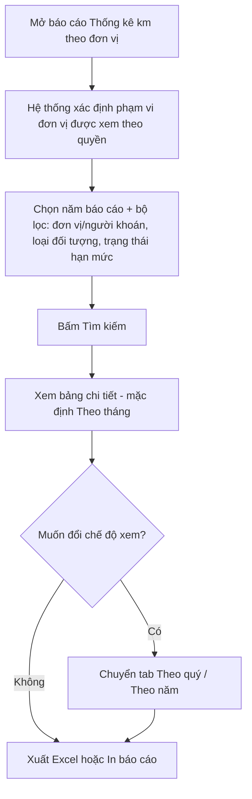

# TÀI LIỆU YÊU CẦU NGƯỜI DÙNG (URD)
## Hệ thống Quản lý đăng ký xe (iOffice V5 – TKV) — Báo cáo thống kê km theo đơn vị

| Thông tin | Nội dung |
|---|---|
| Khách hàng | TKV (Tập đoàn Công nghiệp Than – Khoáng sản Việt Nam) |
| Phiên bản | v1.0 |
| Ngày | 07/09/2026 |
| Người soạn | @mynguyen.cntt.px |
| Trạng thái | Dự thảo |
| Phiên chốt | Phiên 1/1 — Báo cáo thống kê km theo năm của từng đơn vị |

> **Ghi chú cho người đọc:** Tài liệu này mô tả **hệ thống sẽ hỗ trợ những công việc gì** và **giao diện thể hiện như thế nào ở mức tổng quan**, để quý khách hàng cùng rà soát và xác nhận trước khi đội ngũ kỹ thuật bắt đầu xây dựng chi tiết. Tài liệu **không** đi vào các chi tiết kỹ thuật (mã nguồn, cấu trúc dữ liệu, validation...) — những nội dung đó sẽ được đặc tả riêng ở giai đoạn sau (SRS) dành cho đội phát triển.
>
> **⚠️ Lưu ý khi gửi bản chính thức:** Trước khi gửi cho khách hàng, thay sơ đồ luồng (đánh dấu 🖼️ ở Mục 3) bằng ảnh đã render (Mermaid Live Editor/draw.io), và chèn ảnh chụp màn hình thật (đánh dấu 🖼️ ở Mục 4) — không để lại code sơ đồ dạng chữ.

---

## TÓM TẮT NHANH (dành cho người bận, đọc trong 3 phút)

| Mục | Nội dung |
|---|---|
| **Vấn đề đang gặp** | Tập đoàn khoán số km vận hành xe theo năm cho từng đơn vị/cá nhân, nhưng chưa có công cụ tổng hợp để biết ngay đơn vị nào sắp hết hoặc đã vượt hạn mức khoán — phải tổng hợp thủ công từ nhiều nơi. |
| **Mục tiêu hệ thống mới** | Một báo cáo duy nhất cho biết ngay số km đã dùng, còn lại, tỷ lệ hoàn thành và cảnh báo màu theo từng đơn vị/cá nhân, xem theo tháng/quý/năm. |
| **Phạm vi đợt này** | Báo cáo thống kê km theo năm của từng đơn vị (thuộc module Quản lý đăng ký xe). |
| **Số lượng màn hình chính** | 1 màn hình |
| **Số lượng yêu cầu cần chốt** | 9 yêu cầu |
| **Đối tượng sử dụng** | Người dùng thường (xem đơn vị mình) · Người được gán quyền xem theo đơn vị · Người được gán quyền xem toàn hệ thống |

🖼️ *[Chèn ảnh chụp màn hình khách hàng đã cung cấp — "Báo cáo thống kê km theo năm của từng đơn vị", tab Theo tháng]*

---

## MỤC LỤC

1. [Bối cảnh & Mục tiêu](#1-bối-cảnh--mục-tiêu)
2. [Đối tượng sử dụng](#2-đối-tượng-sử-dụng)
3. [Luồng nghiệp vụ tổng quan](#3-luồng-nghiệp-vụ-tổng-quan)
4. [Màn hình & thao tác](#4-màn-hình--thao-tác)
5. [Yêu cầu chức năng chi tiết](#5-yêu-cầu-chức-năng-chi-tiết)
6. [Ngoài phạm vi dự án](#6-ngoài-phạm-vi-dự-án)
7. [Tiêu chí nghiệm thu](#7-tiêu-chí-nghiệm-thu)
8. [Xác nhận chốt nghiệp vụ](#8-xác-nhận-chốt-nghiệp-vụ)

---

## 1. Bối cảnh & Mục tiêu

**Vấn đề hiện tại**
> TKV áp dụng cơ chế khoán số km vận hành xe theo năm cho từng đơn vị (Ban/Phòng) và một số cá nhân đặc thù, dựa trên 2 mốc: định biên được duyệt theo quyết định và mức khoán cụ thể đã ký trong hợp đồng. Hiện việc theo dõi đơn vị nào đang dùng gần hết, đơn vị nào đã vượt mức khoán phải tổng hợp thủ công theo từng tháng từ nhiều đơn vị, dễ phát hiện chậm tình trạng vượt định mức.

**Mục tiêu khi có hệ thống mới**
> Có 1 báo cáo tổng hợp ngay trên hệ thống, cho phép xem số km thực tế đã vận hành theo tháng/quý/năm của từng đơn vị, đối chiếu ngay với định biên và mức khoán, tự động tô màu cảnh báo khi tỷ lệ dùng km đạt từ 85% trở lên hoặc vượt 100% — giúp phát hiện sớm và chủ động điều chỉnh khoán cho năm sau.

**Phạm vi đợt triển khai này**
> - Xem báo cáo km theo 3 chế độ: Theo tháng, Theo quý, Theo năm.
> - Tìm kiếm/lọc theo đơn vị, người khoán, năm báo cáo, loại đối tượng, trạng thái sử dụng hạn mức.
> - Phân quyền xem dữ liệu theo phạm vi đơn vị (3 vai trò, xem Mục 2).
> - Xuất Excel, in báo cáo.

---

## 2. Đối tượng sử dụng

### 👤 Người dùng thông thường (nhân viên/lãnh đạo đơn vị)
- **Là ai:** Cán bộ hoặc lãnh đạo 1 Ban/Phòng, ví dụ anh Hùng — Trưởng ban Kỹ thuật Công nghệ Mỏ.
- **Công việc hàng ngày liên quan hệ thống:** Theo dõi số km xe của đơn vị mình đã dùng trong năm, biết còn bao nhiêu km trước khi hết mức khoán, báo cáo lên cấp trên khi cần.
- **Điều họ cần hệ thống hỗ trợ:** Tự tra cứu ngay số liệu của đơn vị mình mà không cần xin cấp trên tổng hợp; biết ngay đơn vị mình đang ở mức bình thường hay sắp hết km.

### 👤 Người được gán quyền xem theo đơn vị (quản lý theo dõi 1 nhóm đơn vị)
- **Là ai:** Ví dụ Trưởng phòng Vận tải phụ trách theo dõi khoán km cho 1 cụm đơn vị gồm nhiều Ban/Phòng.
- **Công việc hàng ngày liên quan hệ thống:** Tổng hợp, đối chiếu tình hình sử dụng km của các đơn vị mình phụ trách để nhắc nhở hoặc đề xuất điều chỉnh khoán.
- **Điều họ cần hệ thống hỗ trợ:** Xem được số liệu của nhiều đơn vị đã được gán cùng lúc, so sánh nhanh đơn vị nào đang cảnh báo hoặc đã vượt hạn mức.

### 👤 Người được gán quyền xem toàn hệ thống (Bộ phận quản lý đội xe Tập đoàn)
- **Là ai:** Cán bộ Bộ phận quản lý đội xe hoặc Lãnh đạo Tập đoàn phụ trách vận hành xe.
- **Công việc hàng ngày liên quan hệ thống:** Giám sát tổng thể tình hình sử dụng km khoán trên toàn Tập đoàn, làm căn cứ điều chỉnh định biên/khoán cho năm sau.
- **Điều họ cần hệ thống hỗ trợ:** Xem được toàn bộ đơn vị/cá nhân, dòng tổng cộng toàn hệ thống, xuất báo cáo gửi lãnh đạo cấp trên.

---

## 3. Luồng nghiệp vụ tổng quan

🖼️ *[Chèn ảnh sơ đồ luồng đã render từ khối mermaid bên dưới]*

**Diễn giải luồng bằng lời:**
1. Người dùng mở báo cáo "Thống kê km xe > Theo năm từng đơn vị" từ menu Báo cáo vận hành.
2. Hệ thống tự động xác định phạm vi dữ liệu người dùng được xem (đơn vị của mình / các đơn vị được gán quyền / toàn hệ thống) và hiển thị danh sách tương ứng — người dùng không cần tự chọn phạm vi.
3. Người dùng chọn năm báo cáo, có thể lọc thêm theo đơn vị/người khoán, loại đối tượng, trạng thái sử dụng hạn mức, rồi bấm Tìm kiếm.
4. Hệ thống hiển thị bảng chi tiết km theo tháng (mặc định); người dùng có thể chuyển sang xem Theo quý hoặc Theo năm.
5. **Điểm quyết định:** nếu 1 đơn vị đạt tỷ lệ hoàn thành từ 85% trở lên, dòng đó tô cảnh báo màu cam "Sắp hết km"; nếu vượt 100%, tô đỏ "Vượt hạn mức" — hệ thống chỉ hiển thị màu, không tự gửi thông báo cho ai.
6. Người dùng xuất Excel hoặc in báo cáo để lưu trữ/trình lãnh đạo.

---

## 4. Màn hình & thao tác

> Vì đợt này chỉ có 1 màn hình, toàn bộ thao tác được trình bày gọn trong 1 khối duy nhất.

### 🖥️ Màn hình 1 — Báo cáo thống kê km theo năm của từng đơn vị

**Ai dùng:** Cả 3 vai trò ở Mục 2 (phạm vi dữ liệu nhìn thấy khác nhau theo quyền) · **Dùng để:** Tra cứu, đối chiếu km thực tế vận hành so với định biên/mức khoán theo từng đơn vị, theo tháng/quý/năm.

🖼️ *[Chèn 3 ảnh chụp màn hình khách hàng đã cung cấp — tab Theo tháng, tab Theo quý, tab Theo năm]*

| # | Khu vực | Diễn giải |
|---|---|---|
| ① | Đường dẫn (breadcrumb) | "Báo cáo vận hành > Thống kê km xe > Theo năm từng đơn vị" — giúp người dùng biết đang ở đâu trong menu báo cáo. |
| ② | Ô tìm kiếm đơn vị/người khoán | Gõ tên Ban/Phòng hoặc tên cá nhân nhận khoán để lọc nhanh ra đúng dòng cần xem. |
| ③ | Bộ lọc Năm báo cáo / Loại đối tượng / Trạng thái sử dụng hạn mức | Loại đối tượng gồm "Ban/Phòng" và "Cá nhân đặc thù"; Trạng thái gồm Bình thường / Sắp hết km / Vượt hạn mức và tùy chọn "Tất cả trạng thái". |
| ④ | Nút Tìm kiếm, Xuất Excel, In báo cáo | Áp dụng đúng theo bộ lọc và chế độ xem (Tháng/Quý/Năm) đang chọn. |
| ⑤ | 3 tab chuyển chế độ xem | Theo tháng (mặc định, chi tiết T1-T12) / Theo quý (gộp thành Quý I-IV) / Theo năm (không chia nhỏ theo tháng/quý — xem ⑧). |
| ⑥ | Chú thích màu | Xanh — Bình thường (dưới 85%); Cam — Sắp hết km (từ 85% đến 100%); Đỏ — Vượt hạn mức (trên 100%). *Lưu ý: ảnh mẫu đang ghi 2 cách gọi khác nhau cho cùng ý nghĩa này tùy tab (xem câu hỏi mở ở Phụ lục) — cần thống nhất 1 tên gọi duy nhất.* |
| ⑦ | Bảng chi tiết số liệu | Mỗi dòng là 1 đơn vị/cá nhân: Định biên QĐ, Km khoán HĐ, số km thực tế (chia theo tháng/quý tùy tab đang chọn), Lũy kế thực hiện, Còn lại so với mức khoán, Tỷ lệ hoàn thành (thanh tiến độ + badge màu). |
| ⑧ | Cột cuối bảng — khác nhau theo tab | Tab Theo tháng/Theo quý: cột "Tổng cả năm" = đúng bằng Lũy kế thực hiện hiện có (chưa dự báo). Tab Theo năm: đổi thành cột **"Dự báo cả năm"** — ước tính tổng km cả năm theo tốc độ sử dụng trung bình đến hiện tại, kèm nhãn trạng thái dự báo "Bình thường" / "Sắp vượt mức" / "Quá hạn mức" (kèm % vượt nếu có) theo đúng ngưỡng 85%/100% (xem UR09). |
| ⑨ | Dòng "Tổng cộng toàn hệ thống" | Cộng dồn toàn bộ đơn vị đang hiển thị — chỉ những người xem được nhiều đơn vị/toàn hệ thống mới thấy dòng cộng dồn có ý nghĩa đầy đủ. |
| ⑩ | Phân trang | Hiển thị số dòng hiện tại / tổng số đối tượng quản lý, cho phép chọn số dòng hiển thị mỗi trang. |

### Luồng chuyển giữa các màn hình

Đợt này chỉ có 1 màn hình chính, không phát sinh màn hình con. Có 2 lối ra khỏi màn hình: **Xuất Excel** (tải file .xlsx về máy) và **In báo cáo** (mở hộp in của trình duyệt).

### Ví dụ tình huống thực tế

> **Tình huống 1:** Anh Hùng — Trưởng ban Kỹ thuật Công nghệ Mỏ — mở "Báo cáo vận hành > Thống kê km xe > Theo năm từng đơn vị". Vì chỉ có quyền xem đơn vị của mình, hệ thống tự động chỉ hiển thị đúng 1 dòng "Ban Kỹ thuật Công nghệ Mỏ". Anh thấy đơn vị mình đã dùng 31.500/40.000km khoán (78,8% — màu xanh Bình thường), còn lại 8.500km cho các tháng còn lại trong năm. Anh chuyển sang tab "Theo quý" để xem tổng km từng quý, thấy tình hình vẫn ổn định, rồi bấm "Xuất Excel" để lưu báo cáo gửi báo cáo nội bộ.
>
> **Tình huống 2:** Chị Hoa — Bộ phận quản lý đội xe Tập đoàn, được gán quyền xem toàn hệ thống — mở cùng báo cáo, thấy dòng "Ban Kế hoạch Chiến lược" đang ở 92,7%, badge cam "Sắp hết km". Chị lọc "Trạng thái sử dụng hạn mức" = "Sắp hết km" để xem nhanh còn đơn vị nào khác đang ở ngưỡng cảnh báo, rồi chủ động liên hệ đơn vị đó để nhắc nhở trước khi vượt định mức khoán.

---

## 5. Yêu cầu chức năng chi tiết

### Module: Báo cáo thống kê km theo đơn vị

#### UR01 — Xem báo cáo theo đúng phạm vi được phân quyền

Khi mở báo cáo, hệ thống cần tự nhận biết người dùng được xem dữ liệu của đơn vị nào, không bắt người dùng tự chọn hay xin cấp thêm quyền mỗi lần. Người dùng thông thường chỉ thấy đúng 1 dòng — đơn vị trực tiếp của mình; người được gán quyền xem theo đơn vị thấy đúng các đơn vị đã được gán; người được gán quyền xem toàn hệ thống thấy toàn bộ đơn vị kèm dòng "Tổng cộng toàn hệ thống".

- **Lưu ý đặc biệt:** Ví dụ anh Hùng thuộc Ban Kỹ thuật Công nghệ Mỏ, không được gán thêm quyền nào khác — dù anh gõ tên đơn vị khác vào ô tìm kiếm, hệ thống cũng không hiển thị dữ liệu ngoài đơn vị của anh.
- **Màn hình liên quan:** Báo cáo thống kê km theo năm của từng đơn vị
- **Mức độ ưu tiên:** Cao

#### UR02 — Tìm kiếm nhanh theo đơn vị/người khoán

Người xem báo cáo (đặc biệt người được xem nhiều đơn vị) cần gõ nhanh tên Ban/Phòng hoặc tên người nhận khoán vào ô tìm kiếm để lọc ra đúng dòng cần xem, thay vì dò qua nhiều trang. Kết quả tìm kiếm áp dụng cùng lúc với các bộ lọc Năm báo cáo, Loại đối tượng, Trạng thái sử dụng hạn mức đang chọn.

- **Màn hình liên quan:** Báo cáo thống kê km theo năm của từng đơn vị
- **Mức độ ưu tiên:** Cao

#### UR03 — Lọc theo loại đối tượng và trạng thái sử dụng hạn mức

Người dùng cần tách riêng được nhóm "Ban/Phòng" và nhóm "Cá nhân đặc thù" (những cá nhân được khoán km riêng, không tính chung vào đơn vị), cũng như lọc thẳng ra danh sách đang "Sắp hết km" hoặc đã "Vượt hạn mức" để ưu tiên xử lý trước.

- **Lưu ý đặc biệt:** "Sắp hết km" tương ứng đúng ngưỡng cảnh báo tiến độ từ 85% trở lên (badge cam); dưới 85% là "Bình thường" (xanh); trên 100% là "Vượt hạn mức" (đỏ).
- **Màn hình liên quan:** Báo cáo thống kê km theo năm của từng đơn vị
- **Mức độ ưu tiên:** Trung bình

#### UR04 — Xem số liệu theo 3 chế độ Tháng/Quý/Năm

Người dùng cần chuyển đổi nhanh giữa 3 cách nhìn số liệu trong cùng 1 bảng: theo từng tháng (chi tiết nhất, mặc định khi mở báo cáo), theo từng quý (gộp 3 tháng), hoặc theo cả năm (1 con số duy nhất) — tùy đang cần xem chi tiết hay xem tổng quan nhanh. Các bộ lọc đang áp dụng (đơn vị, năm, loại đối tượng, trạng thái) vẫn giữ nguyên khi đổi chế độ xem.

- **Màn hình liên quan:** Báo cáo thống kê km theo năm của từng đơn vị
- **Mức độ ưu tiên:** Cao

#### UR05 — Đối chiếu km thực tế với định biên và mức khoán

Với mỗi đơn vị/cá nhân, người dùng cần nhìn thấy song song 2 con số nền: Định biên QĐ (mức trần được duyệt theo quyết định) và Km khoán HĐ (mức cụ thể đã ký khoán cho đơn vị, có thể thấp hơn hoặc bằng định biên), cùng với số km thực tế đã chạy lũy kế, số còn lại, và tỷ lệ hoàn thành.

- **Lưu ý đặc biệt:** Tỷ lệ hoàn thành và số km còn lại luôn tính theo Km khoán HĐ (mức đã ký thực tế), không tính theo Định biên QĐ. Ví dụ Ban Kỹ thuật Công nghệ Mỏ có định biên 42.000km nhưng khoán hợp đồng chỉ 40.000km — số 8.500km còn lại và tỷ lệ 78,8% đều tính trên 40.000km khoán, không phải 42.000km định biên.
- **Màn hình liên quan:** Báo cáo thống kê km theo năm của từng đơn vị
- **Mức độ ưu tiên:** Cao

#### UR06 — Cảnh báo màu theo mức độ sử dụng hạn mức

Người dùng cần nhận biết ngay bằng màu sắc đơn vị nào đang bình thường, đơn vị nào sắp hết km, đơn vị nào đã vượt hạn mức mà không phải tự tính %, giúp quét nhanh cả danh sách nhiều đơn vị cùng lúc.

- **Lưu ý đặc biệt:** Khi vượt hạn mức, hệ thống chỉ cần tô đỏ ngay trên báo cáo để người xem tự theo dõi — không cần gửi thông báo/cảnh báo tự động cho ai.
- **Màn hình liên quan:** Báo cáo thống kê km theo năm của từng đơn vị
- **Mức độ ưu tiên:** Trung bình

#### UR07 — Xuất Excel và in báo cáo

Người dùng cần lưu lại số liệu đang xem (đúng theo bộ lọc và chế độ xem hiện tại) thành file Excel để lưu trữ hoặc gửi báo cáo nội bộ, hoặc in trực tiếp để trình ký/họp giao ban.

- **Màn hình liên quan:** Báo cáo thống kê km theo năm của từng đơn vị
- **Mức độ ưu tiên:** Trung bình

#### UR08 — Phân trang danh sách đơn vị/cá nhân

Với hệ thống có nhiều đơn vị/cá nhân (hiện tại 28 đối tượng), người dùng cần xem theo từng trang thay vì cuộn 1 danh sách dài, và tự chọn số dòng hiển thị mỗi trang cho phù hợp.

- **Màn hình liên quan:** Báo cáo thống kê km theo năm của từng đơn vị
- **Mức độ ưu tiên:** Thấp

#### UR09 — Dự báo tổng km cả năm theo tốc độ sử dụng hiện tại (tab Theo năm)

Ở tab "Theo năm", người dùng cần được ước tính trước tổng số km cả năm dựa trên tốc độ sử dụng trung bình từ đầu năm đến thời điểm hiện tại, để chủ động phát hiện sớm nguy cơ vượt mức khoán mà không cần đợi đủ 12 tháng mới biết.

- **Lưu ý đặc biệt:** Nhãn trạng thái ở cột Dự báo cả năm áp dụng đúng 3 mức ngưỡng quen thuộc (85%/100%), nhưng tính trên **tỷ lệ dự báo** (không phải tỷ lệ đã dùng thực tế đến hiện tại): dưới 85% → "Bình thường"; từ 85% đến 100% → "Sắp vượt mức"; trên 100% → "Quá hạn mức", kèm hiển thị thêm phần trăm hạn mức bị vượt (= tỷ lệ dự báo − 100%). Ví dụ: Ban Kế hoạch Chiến lược dự báo đạt 139% mức khoán → nhãn "Quá hạn mức — vượt 39%"; Văn phòng Tập đoàn dự báo đạt 106,5% → nhãn "Quá hạn mức — vượt 6,5%" (dù tỷ lệ hoàn thành *hiện tại* của Văn phòng Tập đoàn mới 71,0%, vẫn đang "Bình thường" — 2 nhãn này độc lập nhau vì một cái nhìn hiện tại, một cái nhìn dự báo cả năm); Ban Tổ chức - Cán bộ dự báo đạt 98,3% → nhãn "Sắp vượt mức".
- **Màn hình liên quan:** Báo cáo thống kê km theo năm của từng đơn vị (tab Theo năm)
- **Mức độ ưu tiên:** Trung bình

---

## 6. Ngoài phạm vi dự án

- Không cấu hình/chỉnh sửa định biên hoặc km khoán ngay trên màn hình báo cáo này — số liệu định biên/khoán được nhập và quản lý ở chức năng khác của module, ngoài phạm vi đợt này.
- Không gửi thông báo/cảnh báo tự động khi đơn vị vượt hạn mức — chỉ hiển thị màu trên báo cáo.
- Không có báo cáo so sánh số liệu giữa nhiều năm (chỉ xem 1 năm báo cáo tại 1 thời điểm).
- Không xuất báo cáo định dạng PDF (chỉ hỗ trợ Xuất Excel và In báo cáo qua trình duyệt).

---

## 7. Tiêu chí nghiệm thu

| # | Tiêu chí |
|---|---|
| 1 | **Khi** người dùng thông thường mở báo cáo, **thì** hệ thống chỉ hiển thị đúng 1 dòng — đơn vị trực tiếp của người đó, không thấy dữ liệu đơn vị khác. |
| 2 | **Khi** người được gán quyền xem theo đơn vị mở báo cáo, **thì** hệ thống chỉ hiển thị đúng các đơn vị đã được gán quyền, không thấy toàn hệ thống. |
| 3 | **Khi** người được gán quyền xem toàn hệ thống mở báo cáo, **thì** hệ thống hiển thị toàn bộ đơn vị/cá nhân và dòng "Tổng cộng toàn hệ thống". |
| 4 | **Khi** 1 đơn vị có tỷ lệ hoàn thành từ 85% đến 100%, **thì** dòng đó hiển thị badge "Sắp hết km" màu cam. |
| 5 | **Khi** 1 đơn vị có tỷ lệ hoàn thành trên 100%, **thì** dòng đó hiển thị badge "Vượt hạn mức" màu đỏ, hệ thống không gửi thông báo nào. |
| 6 | **Khi** người dùng chuyển tab Theo tháng/Theo quý/Theo năm, **thì** số liệu km trong bảng gộp lại đúng theo chế độ đã chọn, các bộ lọc đang áp dụng vẫn giữ nguyên. |
| 7 | **Khi** người dùng bấm "Xuất Excel", **thì** hệ thống tải về đúng file chứa số liệu đang hiển thị theo bộ lọc và chế độ xem hiện tại. |
| 8 | **Khi** người dùng chuyển sang tab "Theo năm", **thì** hệ thống hiển thị thêm cột "Dự báo cả năm" — ước tính theo tốc độ sử dụng trung bình đến thời điểm hiện tại, không cần chờ đủ dữ liệu 12 tháng. |
| 9 | **Khi** tỷ lệ dự báo cả năm của 1 đơn vị vượt quá 100% mức khoán, **thì** cột "Dự báo cả năm" hiển thị nhãn "Quá hạn mức" kèm đúng phần trăm hạn mức bị vượt (= tỷ lệ dự báo − 100%). |

---

## 8. Xác nhận chốt nghiệp vụ

| Đại diện | Họ tên | Chữ ký | Ngày |
|---|---|---|---|
| Khách hàng | | | |
| VNPT-IT (BA/PO) | | | |

---

## PHỤ LỤC

**Bảng thuật ngữ**

| Thuật ngữ | Giải thích |
|---|---|
| Định biên QĐ | Mức km/năm tối đa được phê duyệt theo quyết định cho 1 đơn vị hoặc cá nhân đặc thù. |
| Km khoán HĐ | Mức km/năm cụ thể đã ký khoán thực tế cho đơn vị/cá nhân (có thể bằng hoặc thấp hơn Định biên QĐ) — dùng làm mốc tính tỷ lệ hoàn thành. |
| Cá nhân đặc thù | Cá nhân được khoán km riêng, không tính chung vào 1 đơn vị/Ban Phòng. |
| Lũy kế thực hiện | Tổng số km thực tế đã vận hành, cộng dồn từ đầu năm đến thời điểm xem báo cáo (tab Theo năm ghi rõ số tháng đã có dữ liệu, ví dụ "Lũy kế thực tế (8T)"). |
| Dự báo cả năm | Chỉ có ở tab Theo năm — số km ước tính cho cả năm, tính theo tốc độ sử dụng trung bình từ đầu năm đến hiện tại (không phải số km thực tế đã dùng). |

**Danh sách câu hỏi mở / vấn đề cần làm rõ thêm ở giai đoạn SRS**

- Khi 1 đơn vị được gán quyền "xem theo đơn vị" có đơn vị con/trực thuộc, báo cáo có tự động gồm luôn dữ liệu của các đơn vị con đó không, hay chỉ đúng đơn vị được gán? `[GIẢ ĐỊNH cần xác nhận]`
- Chú thích màu ở tab Theo quý/Theo năm dùng chữ "Sắp hết hạn mức"/"Quá hạn mức", trong khi tab Theo tháng dùng chữ "Cảnh báo tiến độ"/"Vượt hạn mức" cho cùng 1 ý nghĩa (badge trạng thái *hiện tại* trong bảng thì cả 3 tab đều thống nhất ghi "Sắp hết km"/"Bình thường") — cần chốt 1 cách gọi duy nhất trước khi triển khai, tránh gây nhầm lẫn khi người dùng chuyển tab. Lưu ý: đây là nhãn trạng thái *hiện tại* (cột Tỷ lệ hoàn thành) — khác với nhãn trạng thái *dự báo* ("Bình thường"/"Sắp vượt mức"/"Quá hạn mức", chỉ có ở cột Dự báo cả năm, xem UR09). `[CẦN XÁC NHẬN]`
- Tab Theo quý/Theo năm dùng nhãn cột "CÒN LẠI / LỆCH" (Theo tháng, Theo quý) và "CÒN LẠI HẠN MỨC" (Theo năm) cho cùng 1 cách tính — cùng lý do cần chốt 1 tên gọi duy nhất. `[CẦN XÁC NHẬN]`

---

## CÁCH DÙNG FILE NÀY (hướng dẫn nội bộ cho BA — xóa mục này trước khi gửi khách hàng)

1. **Trước khi gửi khách:** render sơ đồ luồng ở Mục 3 thành ảnh PNG/JPG (Mermaid Live Editor), và chèn ảnh chụp màn hình thật khách hàng đã cung cấp vào các vị trí 🖼️ ở Mục "Tóm tắt nhanh" và Mục 4. Không gửi file còn code sơ đồ dạng chữ.
2. **Sau khi khách hàng ký chốt bản này:** chạy skill `urd-writer-vnpt` để tạo bản đối chiếu theo `BM_URD` chuẩn VNPT, phục vụ lưu hồ sơ/audit nội bộ.
3. **Trang Tóm tắt nhanh:** cập nhật lại số liệu (số màn hình, số UR) nếu nội dung Mục 4-5 thay đổi sau khi khách hàng góp ý.
