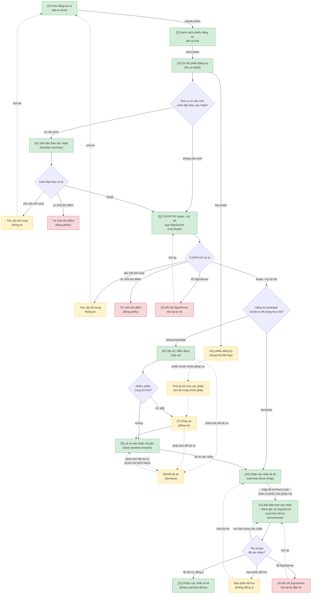
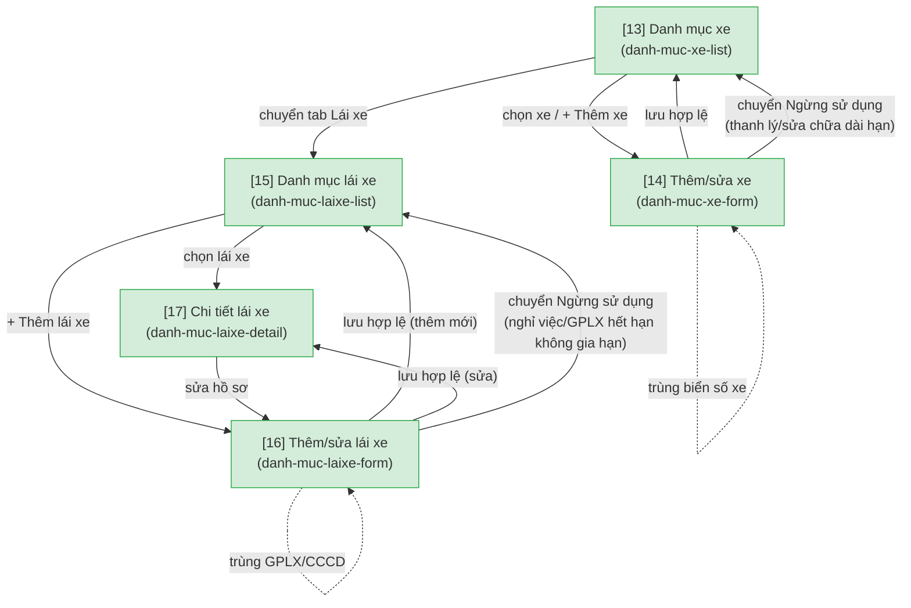
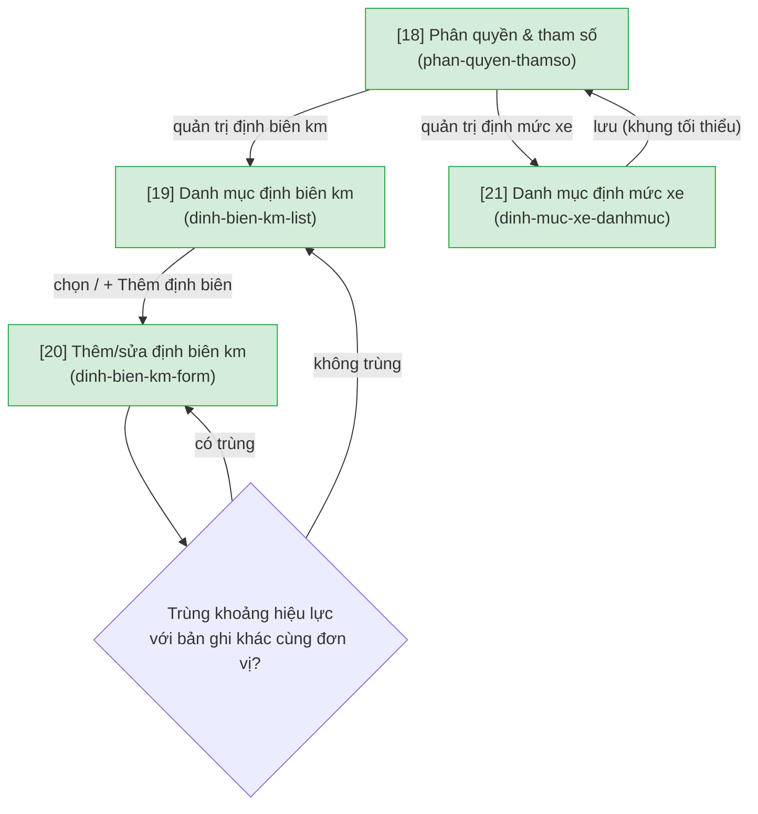

# Đăng ký xe TKV — User Flow

> Nguồn chia flow DUY NHẤT cho feature này. `/wireframe-ascii` và `/wireframe-html` đọc file này để biết flow nào gồm những màn nào — KHÔNG tự chia flow riêng.

> Phạm vi: luồng lõi theo GAP Analysis mục A3 (Form đăng ký), A4 (Luồng duyệt 5 bước), A5 (Cấp xe/Điều động), A6 (Xác nhận đi về), B3 (Ghép xe) — duyệt 2026-08-04; bổ sung 2026-08-13 nhóm danh mục/tham số nền A1 (Danh mục xe), A2 (Danh mục lái xe), A10 (Phân quyền & tham số), B1 (Định biên km theo đơn vị), B9 (Định mức xe). Nguồn: `GAP_Analysis_QLDKXe_TKV.md`. Các mục khác (A7-A9, B2, B4-B8, B10) chưa nằm trong đợt này.

## 1. User Flow (tổng)

> Phủ happy / error / edge cases. `[n]` = số màn hình đối chiếu Mục 2.

> Bổ sung 2026-08-13: nhóm màn hình danh mục/tham số nền (A1, A2, A10, B1, B9) — 2 flow dưới đây là màn quản trị dữ liệu, KHÔNG sửa nội dung 3 flow giao dịch phía trên. `cap-xe` (flow `cap-xe-dieudong`) đọc dữ liệu "lái xe biên chế" + trạng thái xe từ `danh-muc-xe-form`; `xacnhan-diove-nhap` (flow `xac-nhan-di-ve`) nên đối chiếu định biên từ `dinh-bien-km-list` khi tính năng cảnh báo định biên (A8/B7) được làm ở đợt sau — đợt này định biên km chỉ phục vụ nhập liệu, chưa đối chiếu real-time.

### Flow: Danh mục xe & lái xe

### Flow: Tham số & định mức

## 2. Danh sách màn hình

| [#] | Slug | Màn hình | Mục đích | Thuộc flow |
|-----|------|----------|----------|------------|
| 1 | dk-xe-form | Form đăng ký xe | Chuyên viên Ban tạo phiếu đăng ký: chọn nhiều đơn vị tham gia + số người mỗi đơn vị, link văn bản liên quan, chọn hạch toán (chung/ban/cá nhân đặc thù), nhập backdate, gen biểu mẫu đăng ký | dang-ky-va-duyet-xe |
| 2 | dk-xe-list | Danh sách phiếu đăng ký | Theo dõi trạng thái, tìm phiếu | dang-ky-va-duyet-xe |
| 3 | dk-xe-detail | Chi tiết phiếu đăng ký | Xem toàn bộ thông tin + trạng thái luồng duyệt + lịch sử + hành động theo role (kể cả hủy phiếu). Dùng chung xuyên suốt cả 3 flow (mọi role tra cứu 1 phiếu tại đây trong bất kỳ giai đoạn nào) | dang-ky-va-duyet-xe (chung với cap-xe-dieudong, xac-nhan-di-ve) |
| 4 | lanhdao-xacnhan | Lãnh đạo Ban xác nhận | Bước duyệt mới (cấu hình bật/tắt theo đơn vị): duyệt / yêu cầu bổ sung / từ chối dứt điểm | dang-ky-va-duyet-xe |
| 5 | cvp-duyet | CVP/PCVP duyệt + ký số | Duyệt + ký số trên biểu mẫu đăng ký qua SignServer; xử lý lỗi kết nối ký số | dang-ky-va-duyet-xe |
| 6 | cap-xe | Cấp xe / điều động | Đội trưởng/phó phân xe: gợi ý kế hoạch điều vận (xe trống + lái xe biên chế cố định theo xe, cho phép chọn khác) | cap-xe-dieudong |
| 7 | ghep-xe | Ghép xe | Gộp nhiều phiếu đăng ký (có thể khác đơn vị) cùng lộ trình vào 1 xe | cap-xe-dieudong |
| 8 | doi-laixe | Đổi lái xe | Đổi lái xe khi phát sinh — trigger được từ cấp xe, ghép xe, hoặc sau khi lái xe đã xác nhận chuyến (trước khi khởi hành) | cap-xe-dieudong |
| 9 | laixe-xacnhan-chuyen | Lái xe xác nhận chuyến | Lái xe + người đăng ký tiếp nhận; lái xe xác nhận chuyến (trạng thái "Lái xe đã xác nhận") | cap-xe-dieudong |
| 10 | xacnhan-diove-nhap | Nhập xác nhận đi về | Lái xe nhập km thực tế; hệ thống suggest chia km cho các đơn vị tham gia (chia đều, điều chỉnh nếu ghép/nối chuyến); chọn hạch toán cá nhân đặc thù; tính tháng theo ngày về | xac-nhan-di-ve |
| 11 | xacnhan-diove-banxacnhan | Đại diện ban xác nhận + đánh giá | Đại diện từng đơn vị tham gia xác nhận + đánh giá chuyến đi, ký điện tử qua SignServer. Bắt buộc đủ TẤT CẢ các ban mới hoàn tất; có thể phản đối km (không đồng ý) | xac-nhan-di-ve |
| 12 | phieu-xacnhan-diove | Phiếu xác nhận đi về | Xem/tải phiếu xác nhận đi về đã gen theo biểu mẫu chuẩn (ghép xe → mỗi đơn vị gốc có 1 phiếu riêng) | xac-nhan-di-ve |
| 13 | danh-muc-xe-list | Danh mục xe | Danh sách xe, tìm kiếm, thêm mới | danh-muc-xe-laixe |
| 14 | danh-muc-xe-form | Thêm/sửa xe | Biển số, đơn vị quản lý (VP trụ sở chính/VP Hạ Long — không đăng ký chéo trừ khi cấu hình mượn chéo cho phép), lái xe biên chế cố định theo xe, chu kỳ đăng kiểm/bảo hiểm/bảo dưỡng, tổng km theo đăng ký xe + km công tơ thực tế (readonly, cộng dồn theo vòng đời xe), trạng thái (Đang hoạt động/Ngừng sử dụng + lý do) | danh-muc-xe-laixe |
| 15 | danh-muc-laixe-list | Danh mục lái xe | Danh sách lái xe, tìm kiếm | danh-muc-xe-laixe |
| 16 | danh-muc-laixe-form | Thêm/sửa lái xe | Thông tin cá nhân + nhóm trường GPLX (hạng, ngày cấp, ngày hết hạn, ảnh đính kèm), trạng thái (Đang làm việc/Ngừng sử dụng + lý do) | danh-muc-xe-laixe |
| 17 | danh-muc-laixe-detail | Chi tiết lái xe | Hồ sơ + tab lịch sử phục vụ (từ dữ liệu chuyến đã lái, readonly) + tab đánh giá (tổng hợp từ `xacnhan-diove-banxacnhan`, readonly) | danh-muc-xe-laixe |
| 18 | phan-quyen-thamso | Phân quyền & tham số | Ma trận quyền theo role, phạm vi đơn vị (2 văn phòng; xe/lái xe dùng chung khối cơ quan tập đoàn và đảng, đoàn thể), cấu hình mượn xe chéo đơn vị (đơn vị nào được phép đăng ký mượn xe của đơn vị nào), bật/tắt cấu hình "Lãnh đạo Ban xác nhận" theo đơn vị, link audit log hệ thống | tham-so-dinh-muc |
| 19 | dinh-bien-km-list | Danh mục định biên km theo đơn vị | Danh sách bản ghi (đơn vị/cá nhân đặc thù, km/năm, hiệu lực từ-đến) | tham-so-dinh-muc |
| 20 | dinh-bien-km-form | Thêm/sửa định biên km | Nhập/điều chỉnh định biên, validate không chồng lấn hiệu lực cùng đơn vị | tham-so-dinh-muc |
| 21 | dinh-muc-xe-danhmuc | Danh mục định mức xe | Khung tối thiểu (tên định mức, mô tả, hiệu lực, file đính kèm quy định) — chờ TKV cung cấp quy định cụ thể (OQ-4) | tham-so-dinh-muc |

## 3. Danh sách flow

| Flow-slug | Tên flow | Màn hình gồm | Cases phủ |
|-----------|----------|--------------|-----------|
| dang-ky-va-duyet-xe | Đăng ký & duyệt xe | dk-xe-form → dk-xe-list → dk-xe-detail → lanhdao-xacnhan → cvp-duyet | happy (duyệt qua 2 cấp); error (yêu cầu bổ sung, từ chối dứt điểm, lỗi SignServer, hủy phiếu); edge (cấu hình Lãnh đạo Ban tắt, backdate) |
| cap-xe-dieudong | Cấp xe & điều động | cap-xe → ghep-xe → doi-laixe → laixe-xacnhan-chuyen | happy (cấp xe đơn); edge (ghép nhiều phiếu cùng lộ trình, đổi lái xe phát sinh đa điểm) |
| xac-nhan-di-ve | Xác nhận đi về | xacnhan-diove-nhap → xacnhan-diove-banxacnhan → phieu-xacnhan-diove | happy (đủ tất cả ban đồng ý); error (lỗi SignServer); edge (phản đối km, tách N phiếu khi ghép xe, tính lại km khi hủy phiếu trong nhóm ghép) |
| danh-muc-xe-laixe | Danh mục xe & lái xe | danh-muc-xe-list → danh-muc-xe-form, danh-muc-laixe-list → danh-muc-laixe-form / danh-muc-laixe-detail | happy (thêm/sửa thành công); error (thiếu trường bắt buộc, GPLX hết hạn, trùng biển số, trùng GPLX/CCCD); edge (chuyển trạng thái Ngừng sử dụng) |
| tham-so-dinh-muc | Tham số & định mức | phan-quyen-thamso → dinh-bien-km-list → dinh-bien-km-form, phan-quyen-thamso → dinh-muc-xe-danhmuc | happy (thêm/sửa định biên thành công); error (trùng khoảng hiệu lực cùng đơn vị) |

## 3.5. Chuyển màn (transitions)

| Từ màn [#] | Đến màn [#] | Trigger | Điều kiện |
|-----------|------------|---------|-----------|
| Form đăng ký xe [1] | Danh sách phiếu đăng ký [2] | Submit phiếu | - |
| Danh sách phiếu đăng ký [2] | Chi tiết phiếu đăng ký [3] | Chọn phiếu | - |
| Chi tiết phiếu đăng ký [3] | (giữ nguyên) [3] | Hủy phiếu | Trạng thái chuyển "Đã hủy"; nếu thuộc nhóm ghép xe → tính lại km cho các phiếu còn lại theo phần còn tham gia |
| Chi tiết phiếu đăng ký [3] | Lãnh đạo Ban xác nhận [4] | Điều hướng duyệt | Đơn vị có cấu hình Lãnh đạo Ban xác nhận |
| Chi tiết phiếu đăng ký [3] | CVP/PCVP duyệt [5] | Điều hướng duyệt | Đơn vị KHÔNG cấu hình Lãnh đạo Ban xác nhận |
| Lãnh đạo Ban xác nhận [4] | CVP/PCVP duyệt [5] | Duyệt | - |
| Lãnh đạo Ban xác nhận [4] | Form đăng ký xe [1] | Yêu cầu bổ sung / Từ chối dứt điểm | Chuyên viên sửa lại và submit lại |
| CVP/PCVP duyệt [5] | Cấp xe/điều động [6] | Duyệt + ký số OK | Không backdate |
| CVP/PCVP duyệt [5] | Nhập xác nhận đi về [10] | Duyệt + ký số OK | Backdate (xe/lái xe đã dùng thực tế, bỏ qua cấp xe/điều động) |
| CVP/PCVP duyệt [5] | Form đăng ký xe [1] | Yêu cầu bổ sung / Từ chối dứt điểm | Chuyên viên sửa lại và submit lại |
| CVP/PCVP duyệt [5] | (giữ nguyên) [5] | Lỗi kết nối SignServer | Thử lại ký số |
| Cấp xe/điều động [6] | Ghép xe [7] | Điều hướng | Nhiều phiếu cùng lộ trình |
| Cấp xe/điều động [6] | Lái xe xác nhận chuyến [9] | Điều hướng | Không ghép xe |
| Ghép xe [7] | Lái xe xác nhận chuyến [9] | Gán xe/lái xe chung | - |
| Cấp xe/điều động [6] | Đổi lái xe [8] | Phát sinh đổi lái xe | - |
| Ghép xe [7] | Đổi lái xe [8] | Phát sinh đổi lái xe | - |
| Lái xe xác nhận chuyến [9] | Đổi lái xe [8] | Phát sinh đổi lái xe | Trước khi khởi hành |
| Đổi lái xe [8] | Lái xe xác nhận chuyến [9] | Xác nhận đổi lái xe | - |
| Lái xe xác nhận chuyến [9] | Nhập xác nhận đi về [10] | Lái xe xác nhận | - |
| Nhập xác nhận đi về [10] | Đại diện ban xác nhận [11] | Nhập đủ km/hạch toán | Ghép xe → tách N phiếu xác nhận tương ứng N phiếu đăng ký gốc |
| Đại diện ban xác nhận [11] | Phiếu xác nhận đi về [12] | Tất cả ban đồng ý | - |
| Đại diện ban xác nhận [11] | Nhập xác nhận đi về [10] | Ban phản đối km | Chia lại km |
| Đại diện ban xác nhận [11] | (giữ nguyên) [11] | Lỗi kết nối SignServer | Thử lại ký điện tử |
| Danh mục xe [13] | Thêm/sửa xe [14] | Chọn xe / + Thêm xe | - |
| Thêm/sửa xe [14] | Danh mục xe [13] | Lưu hợp lệ / Chuyển Ngừng sử dụng | - |
| Thêm/sửa xe [14] | (giữ nguyên) [14] | Lưu | Thiếu trường bắt buộc, hoặc trùng biển số xe |
| Danh mục xe [13] | Danh mục lái xe [15] | Chuyển tab Lái xe | - |
| Danh mục lái xe [15] | Chi tiết lái xe [17] | Chọn lái xe | - |
| Danh mục lái xe [15] | Thêm/sửa lái xe [16] | + Thêm lái xe | - |
| Chi tiết lái xe [17] | Thêm/sửa lái xe [16] | Sửa hồ sơ | - |
| Thêm/sửa lái xe [16] | Danh mục lái xe [15] | Lưu hợp lệ (thêm mới) / Chuyển Ngừng sử dụng | - |
| Thêm/sửa lái xe [16] | Chi tiết lái xe [17] | Lưu hợp lệ (sửa) | - |
| Thêm/sửa lái xe [16] | (giữ nguyên) [16] | Lưu | Thiếu trường bắt buộc, GPLX hết hạn, hoặc trùng GPLX/CCCD |
| Phân quyền & tham số [18] | Danh mục định biên km [19] | Quản trị định biên km | - |
| Danh mục định biên km [19] | Thêm/sửa định biên km [20] | Chọn / + Thêm định biên | - |
| Thêm/sửa định biên km [20] | Danh mục định biên km [19] | Lưu | Không trùng khoảng hiệu lực cùng đơn vị |
| Thêm/sửa định biên km [20] | (giữ nguyên) [20] | Lưu | Trùng khoảng hiệu lực với bản ghi khác cùng đơn vị |
| Phân quyền & tham số [18] | Danh mục định mức xe [21] | Quản trị định mức xe | - |
| Danh mục định mức xe [21] | Phân quyền & tham số [18] | Lưu (khung tối thiểu) | - |

## 4. Open Questions

- [ ] OQ-4: B9 Danh mục định mức xe — cần TKV cung cấp quy định nội bộ cụ thể (văn bản chị Len gửi) để hoàn thiện trường dữ liệu; hiện vẽ khung tối thiểu.

(OQ-1, OQ-2, OQ-3 đã chốt ở đợt trước — bắt buộc tất cả ban xác nhận, ký qua SignServer, tính lại km khi hủy phiếu trong nhóm ghép. OQ-5 đã chốt thành business rule "cấu hình mượn xe chéo đơn vị" tại màn `phan-quyen-thamso` — Mục 2 dòng 18. OQ-6, OQ-7 đã được khách hàng quyết định bỏ qua ở đợt này.)
