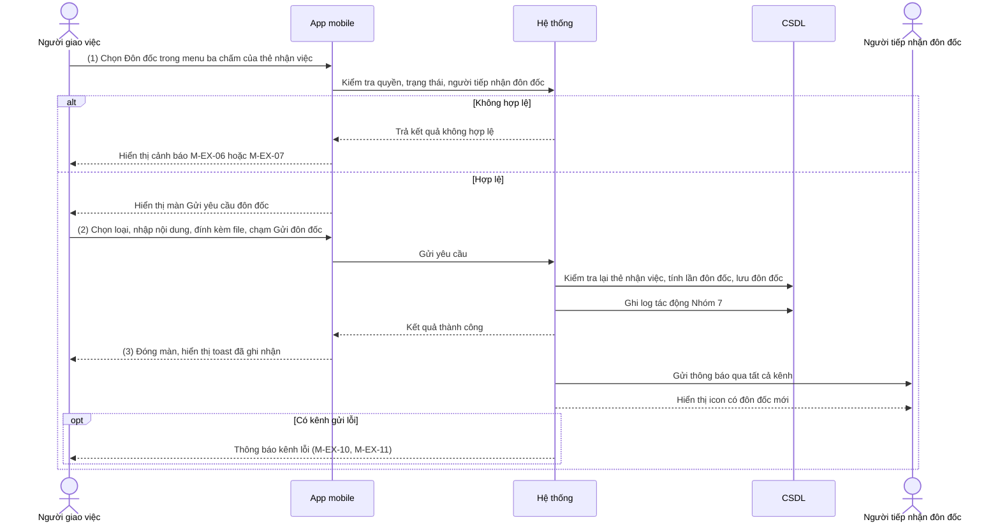
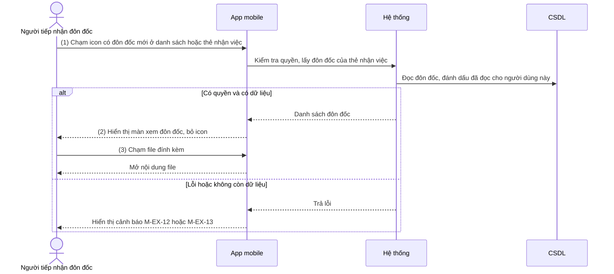

# NỘI DUNG

## ĐẶC TẢ YÊU CẦU CHỨC NĂNG HỆ THỐNG

### PHÂN HỆ QUẢN LÝ CÔNG VIỆC (APP MOBILE)

#### Module: Đôn đốc công việc

##### Mô tả tóm tắt

Người giao việc gửi yêu cầu đôn đốc đến từng cá nhân/đơn vị nhận việc, tại từng thẻ nhận việc trong box Phân công thực hiện của màn hình Chi tiết công việc đã giao trên app mobile, khi công việc sắp đến hạn hoặc chưa đúng tiến độ. Người nhận việc xem nội dung đôn đốc qua icon "có đôn đốc mới". Người giao việc và Lãnh đạo cấp trên xem lại nội dung đôn đốc ở Tab "Lịch sử tác động". Tài liệu thay thế mục "Chức năng Gửi đôn đốc/Xem thông tin đôn đốc" (II.2.1.9.7) của `IOFFICE_SRS_V6_QUAN_LY_CONG_VIEC_APP_v1.0.docx`. Nghiệp vụ thống nhất với bản web (`docs/don-doc-cong-viec-web/SRS.md`); tài liệu này chỉ khác ở cách thao tác và hiển thị trên mobile.

---

##### Bảng thuật ngữ & Actor tham gia

**Từ viết tắt & thuật ngữ**

| Từ viết tắt / Thuật ngữ | Giải thích                                                                                                                                                    |
| ----------------------- | ------------------------------------------------------------------------------------------------------------------------------------------------------------- |
| Thẻ nhận việc           | Một thẻ trong tab con "Phân công" của box Phân công thực hiện, thể hiện 1 cá nhân hoặc 1 đơn vị được giao công việc, kèm vai trò, hạn xử lý, trạng thái       |
| Đôn đốc                 | Yêu cầu nhắc nhở do Người giao việc gửi tới 1 thẻ nhận việc, gồm loại đôn đốc, nội dung, tệp đính kèm                                                         |
| Loại đôn đốc            | Nhắc nhở / Phê bình / Kiểm điểm, lấy từ danh mục tiêu chí đôn đốc; cũng là loại được thống kê ở cột "Số lần bị đôn đốc" trong báo cáo                         |
| Người tiếp nhận đôn đốc | Người thực tế nhận thông báo đôn đốc: với thẻ cá nhân là chính cá nhân đó; với thẻ đơn vị là Trưởng đơn vị hoặc người có quyền xử lý công việc trên đơn vị đó |
| Log tác động            | Lịch sử tác động công việc, hiển thị tại Tab "Lịch sử tác động", ghi theo bảng "Thông tin log tác động công việc" trong SRS Quản lý công việc                 |

**Actor tham gia**

| Actor                   | Vai trò / Mô tả trong phạm vi module này                                             |
| ----------------------- | ------------------------------------------------------------------------------------ |
| Người giao việc         | Người tạo/giao công việc; người duy nhất được gửi đôn đốc cho công việc do mình giao |
| Người tiếp nhận đôn đốc | Nhận thông báo đôn đốc, xem nội dung qua icon "có đôn đốc mới"                       |
| Lãnh đạo cấp trên       | Không có màn hình đôn đốc riêng; chỉ xem nội dung đôn đốc ở Tab "Lịch sử tác động"   |

---

##### Phạm vi chỉnh sửa

- Màn hình Chi tiết công việc đã giao (Mobile) — Tab "Thông tin công việc" — box Phân công thực hiện, tab con "Phân công" (menu ba chấm của thẻ nhận việc)
- Danh sách công việc (Mobile) — icon "có đôn đốc mới" trên thẻ công việc
- Tab "Lịch sử tác động" (dòng log Nhóm 7 — Đôn đốc/Nhắc nhở)
- Báo cáo thống kê — cột "Số lần bị đôn đốc" theo loại đôn đốc (Nhắc nhở, Phê bình, Kiểm điểm)
- Ảnh hưởng gián tiếp: chức năng Xóa thông tin nhận việc (xóa đôn đốc của thẻ bị xóa)

---

##### Yêu cầu giao diện

- Hình ảnh giao diện / mockup:
  
  `[CẦN BỔ SUNG ẢNH]` — `images/FC-001-gui-don-doc-mockup.png` (màn Gửi yêu cầu đôn đốc), `images/FC-002-xem-don-doc-mockup.png` (màn xem đôn đốc). Chưa có ảnh mockup từ người dùng.
  
  Hành vi UI đặc biệt:
  
  - Mỗi thẻ nhận việc mặc định hiển thị 2 icon chức năng, các chức năng còn lại nằm trong icon menu ba chấm theo thứ tự trong bảng quy định chức năng theo trạng thái. Chức năng "Đôn đốc" có thứ tự 5 nên nằm trong menu ba chấm.
  - Màn Gửi yêu cầu đôn đốc hiển thị dạng khung nổi từ dưới lên, nút [Gửi đôn đốc] cố định ở cuối khung; khi bàn phím mở, nút và ô nhập không bị che.

- Bảng mô tả các trường thông tin trên giao diện:

| Tên trường thông tin                        | Kiểu điều khiển             | Độ dài | Ràng buộc / Điều kiện                                                                                                                                                                                                                                                            | Kiểu dữ liệu |
| ------------------------------------------- | --------------------------- | ------ | -------------------------------------------------------------------------------------------------------------------------------------------------------------------------------------------------------------------------------------------------------------------------------- | ------------ |
| **Box Phân công thực hiện — thẻ nhận việc** |                             |        |                                                                                                                                                                                                                                                                                  |              |
| Mục "Đôn đốc" trong menu ba chấm            | Menu item                   | -      | Hiển thị theo từng thẻ nhận việc khi đồng thời thỏa: (1) người đăng nhập là Người giao việc/người tạo việc; (2) công việc ở trạng thái Chưa thực hiện hoặc Đang thực hiện; (3) trạng thái thẻ nhận việc khác "Đã hoàn thành". Không thỏa → ẩn. Chạm → mở màn Gửi yêu cầu đôn đốc | Action       |
| Icon "có đôn đốc mới" (thẻ nhận việc)       | Icon                        | -      | Hiển thị trên thẻ nhận việc có đôn đốc mà Người tiếp nhận đôn đốc đang đăng nhập chưa đọc. Chạm → mở màn xem đôn đốc (→ FC-002); đọc xong icon mất                                                                                                                               | Display      |
| **Danh sách công việc — thẻ công việc**     |                             |        |                                                                                                                                                                                                                                                                                  |              |
| Icon "có đôn đốc mới" (danh sách)           | Icon                        | -      | Hiển thị trên thẻ công việc có đôn đốc mới mà người đăng nhập là Người tiếp nhận đôn đốc và chưa đọc. Chạm → mở màn xem đôn đốc (→ FC-002); đọc xong icon mất                                                                                                                    | Display      |
| **Màn Gửi yêu cầu đôn đốc**                 |                             |        |                                                                                                                                                                                                                                                                                  |              |
| Tiêu đề                                     | Label                       | -      | Hiển thị cố định: "Gửi yêu cầu đôn đốc" kèm icon [X] đóng                                                                                                                                                                                                                        | String       |
| Cá nhân/Đơn vị nhận đôn đốc                 | Label (readonly)            | 200    | Họ tên cá nhân hoặc tên đơn vị của thẻ nhận việc đang chọn; không cho sửa                                                                                                                                                                                                        | String       |
| Loại đôn đốc                                | Picker                      | -      | Bắt buộc; chọn 1 giá trị từ danh mục: Nhắc nhở / Phê bình / Kiểm điểm; mặc định "Nhắc nhở"; không cho nhập tự do                                                                                                                                                                 | String       |
| Lần đôn đốc                                 | Label (readonly)            | -      | Bằng số lần đã đôn đốc thẻ nhận việc này + 1 (thẻ chưa từng đôn đốc → 1); không cho sửa (→ M-BR-03)                                                                                                                                                                              | Number       |
| Nội dung đôn đốc                            | Textarea                    | 1000   | Bắt buộc; 1–1000 ký tự; không cho nhập quá 1000. Bộ đếm "X/1000": màu xám khi < 900, màu cam khi từ 900 đến 1000                                                                                                                                                                 | String       |
| Nút "Đính kèm"                              | Button                      | -      | Không bắt buộc; chạm → chọn nguồn: Thư viện ảnh / Chụp ảnh / Chọn tệp; định dạng PDF, DOCX, XLSX, PNG, JPG, ZIP; tối đa 25MB/file; tối đa 3 file mỗi lần gửi (đồng bộ Tab Trao đổi thông tin)                                                                                    | Action       |
| Danh sách file đã chọn                      | List                        | 255    | Mỗi file hiển thị icon loại file, tên file, dung lượng và nút [X] để bỏ                                                                                                                                                                                                          | File         |
| Icon [X] đóng                               | Icon Button                 | -      | Đóng màn; nếu đã nhập dữ liệu → hiển thị xác nhận "Bạn có chắc muốn hủy? Dữ liệu đã nhập sẽ bị mất."                                                                                                                                                                             | Action       |
| Nút [Gửi đôn đốc]                           | Button (cố định cuối khung) | -      | Disable khi chưa có nội dung đôn đốc hoặc đang xử lý; chạm → thực hiện gửi (→ FC-001, Bước 2)                                                                                                                                                                                    | Action       |
| **Màn xem đôn đốc (người tiếp nhận)**       |                             |        |                                                                                                                                                                                                                                                                                  |              |
| Danh sách đôn đốc                           | Accordion                   | -      | Mỗi lần đôn đốc là 1 thẻ; sắp xếp mới nhất trước; thẻ mới nhất mở rộng, các thẻ cũ thu gọn; tải 10 thẻ mỗi lần, cuộn tới cuối để tải tiếp                                                                                                                                        | List         |
| Lần đôn đốc                                 | Label                       | -      | Chỉ đọc; số lần đôn đốc của thẻ nhận việc                                                                                                                                                                                                                                        | Number       |
| Loại đôn đốc                                | Label                       | -      | Chỉ đọc                                                                                                                                                                                                                                                                          | String       |
| Người gửi đôn đốc                           | Label                       | 200    | Chỉ đọc; họ tên + chức vụ + phòng ban của Người giao việc                                                                                                                                                                                                                        | String       |
| Thời gian gửi                               | Label                       | -      | Chỉ đọc; HH:mm DD/MM/YYYY                                                                                                                                                                                                                                                        | DateTime     |
| Nội dung đôn đốc                            | Label                       | 1000   | Chỉ đọc; hiển thị đầy đủ, không cắt bớt                                                                                                                                                                                                                                          | String       |
| File đính kèm                               | Link                        | 255    | Chỉ đọc; tên file + icon loại file; chạm → mở nội dung file; hiển thị icon lỗi nếu file không còn tồn tại                                                                                                                                                                        | File         |

---

##### Chức năng 1: Gửi đôn đốc

###### Quy trình

###### Chức năng nghiệp vụ

**① Luồng xử lý thành công**

Bước 1: Người giao việc chọn "Đôn đốc" trong menu ba chấm của thẻ nhận việc, hệ thống thực hiện:

- Kiểm tra quyền, trạng thái công việc, trạng thái thẻ nhận việc (→ M-EX-07, M-EX-08)
- Kiểm tra thẻ nhận việc có Người tiếp nhận đôn đốc (→ M-EX-06)
- Tính Lần đôn đốc, hiển thị màn Gửi yêu cầu đôn đốc

Bước 2: Người giao việc chọn Loại đôn đốc, nhập nội dung, đính kèm file (nếu có) và chạm [Gửi đôn đốc], hệ thống thực hiện:

- Validate nội dung và file (→ M-EX-01 đến M-EX-05)
- Kiểm tra lại quyền, trạng thái công việc, trạng thái thẻ nhận việc (→ M-EX-07)
- Tính lại Lần đôn đốc và lưu đôn đốc (→ M-BR-03)
- Ghi log tác động (→ M-BR-05)
- Đóng màn, hiển thị toast "Đã ghi nhận yêu cầu đôn đốc. Đang gửi thông báo..."

Bước 3: Hệ thống gửi thông báo đến Người tiếp nhận đôn đốc, thực hiện:

- Gửi thông báo qua tất cả kênh, gồm thông báo đẩy trên app (→ M-BR-08)
- Hiển thị icon "có đôn đốc mới" cho Người tiếp nhận đôn đốc ở danh sách công việc và trên thẻ nhận việc (→ M-BR-04)
- Nếu có kênh gửi lỗi → thông báo cho Người giao việc (→ M-EX-10, M-EX-11)

**② Luồng xử lý ngoại lệ**

| Mã      | Tình huống                                                                                                                       | Xử lý                                                                                                                                                                                                                              |
| ------- | -------------------------------------------------------------------------------------------------------------------------------- | ---------------------------------------------------------------------------------------------------------------------------------------------------------------------------------------------------------------------------------- |
| M-EX-01 | Chạm [Gửi đôn đốc] khi nội dung trống hoặc chỉ có khoảng trắng                                                                   | Highlight đỏ ô Nội dung; hiển thị "Yêu cầu nhập nội dung đôn đốc."; không gửi, không đóng màn                                                                                                                                      |
| M-EX-02 | Chọn file sai định dạng                                                                                                          | Không thêm file; toast "Định dạng file "{tên file}" không hỗ trợ. Chỉ chấp nhận: PDF, DOCX, XLSX, PNG, JPG, ZIP."                                                                                                                  |
| M-EX-03 | Chọn file lớn hơn 25MB                                                                                                           | Không thêm file; toast "File "{tên file}" vượt quá 25MB cho phép."                                                                                                                                                                 |
| M-EX-04 | Chọn quá 3 file trong 1 lần gửi                                                                                                  | Không thêm file vượt mức; toast "Chỉ được đính kèm tối đa 3 file mỗi lần gửi." `[GIẢ ĐỊNH — wording]`                                                                                                                              |
| M-EX-05 | Tải file lên lỗi, hoặc người dùng chưa cấp quyền truy cập thư viện/camera                                                        | Tải lỗi: toast "Không thể tải lên file "{tên file}". Vui lòng thử lại."; chưa cấp quyền: toast "Vui lòng cấp quyền truy cập để đính kèm file." `[GIẢ ĐỊNH — wording]`; file không được thêm; các file đã tải thành công giữ nguyên |
| M-EX-06 | Thẻ nhận việc là đơn vị nhưng đơn vị không có Trưởng đơn vị hoặc người có quyền xử lý công việc                                  | Toast "Đơn vị này chưa có người tiếp nhận đôn đốc." `[GIẢ ĐỊNH — wording]`; không mở màn, không gửi                                                                                                                                |
| M-EX-07 | Khi chạm [Gửi đôn đốc]: thẻ nhận việc đã "Đã hoàn thành" hoặc đã bị xóa, hoặc công việc đã Đã hoàn thành/Hủy                     | Toast "Không thể đôn đốc ở trạng thái hiện tại."; đóng màn; làm mới box Phân công thực hiện                                                                                                                                        |
| M-EX-08 | Người dùng không phải Người giao việc/người tạo việc                                                                             | Ẩn mục "Đôn đốc" trong menu ba chấm; nếu gọi trực tiếp API → trả lỗi 403, không thực hiện                                                                                                                                          |
| M-EX-09 | Mất kết nối mạng, lỗi máy chủ hoặc không phản hồi sau 10 giây `[GIẢ ĐỊNH — ngưỡng theo NFR chung của app]` trước khi lưu đôn đốc | Toast "Không thể gửi đôn đốc. Kiểm tra kết nối mạng và thử lại."; giữ nguyên màn và dữ liệu đã nhập; không lưu, không ghi log                                                                                                      |
| M-EX-10 | Đã lưu đôn đốc, gửi thông báo lỗi ở một số kênh                                                                                  | Đôn đốc vẫn hợp lệ; gửi thông báo trong ứng dụng cho Người giao việc: "Đôn đốc lần {N} đến [Tên cá nhân/đơn vị] đã ghi nhận nhưng kênh {Tên kênh lỗi} gặp sự cố."                                                                  |
| M-EX-11 | Đã lưu đôn đốc, gửi thông báo lỗi ở tất cả kênh                                                                                  | Đôn đốc vẫn hợp lệ; gửi thông báo trong ứng dụng cho Người giao việc: "Đôn đốc lần {N} đến [Tên cá nhân/đơn vị] gửi thất bại toàn bộ kênh. Vui lòng kiểm tra lại cấu hình thông báo."                                              |

**③ Quy tắc nghiệp vụ**

**Điều kiện gửi và người nhận**

- M-BR-01: Người giao việc mở box Phân công thực hiện → app hiển thị mục "Đôn đốc" trong menu ba chấm của từng thẻ nhận việc chỉ khi công việc ở trạng thái Chưa thực hiện/Đang thực hiện VÀ trạng thái thẻ nhận việc khác "Đã hoàn thành" → các trường hợp còn lại không hiển thị (→ M-EX-07, M-EX-08).
- M-BR-02: Người giao việc đôn đốc 1 thẻ nhận việc → hệ thống xác định Người tiếp nhận đôn đốc theo nguyên tắc nhận việc: thẻ cá nhân → chính cá nhân đó; thẻ đơn vị → Trưởng đơn vị hoặc người có quyền xử lý công việc trên đơn vị đó → mỗi lần đôn đốc chỉ gắn với đúng 1 thẻ nhận việc, không gửi cho các thẻ khác của công việc.

**Số lần đôn đốc**

- M-BR-03: Người giao việc gửi đôn đốc → hệ thống tính Lần đôn đốc = số đôn đốc đã có của thẻ nhận việc đó + 1, bắt đầu từ 1, việc tính và lưu thực hiện trong cùng 1 giao dịch → 2 lần gửi gần như đồng thời cho cùng 1 thẻ không được trùng số lần.

**Hiển thị và lưu vết**

- M-BR-04: Đôn đốc được lưu thành công → hệ thống hiển thị icon "có đôn đốc mới" cho từng Người tiếp nhận đôn đốc ở danh sách công việc và trên thẻ nhận việc; người đó mở nội dung đôn đốc thì icon mất với riêng người đó.
- M-BR-05: Đôn đốc được lưu thành công → hệ thống ghi log tác động Nhóm 7 "Đôn đốc/Nhắc nhở": nội dung, tệp đính kèm, số lần đôn đốc, loại đôn đốc, cá nhân/đơn vị nhận → Người giao việc và Lãnh đạo cấp trên xem lại ở Tab "Lịch sử tác động".
- M-BR-06: Đôn đốc đã lưu → người dùng không được sửa hoặc xóa từ giao diện; đôn đốc chỉ bị xóa cùng thẻ nhận việc khi Người giao việc thực hiện Xóa thông tin nhận việc (xóa nội dung, tệp và số liệu thống kê của thẻ đó; log ở Tab "Lịch sử tác động" vẫn giữ).
- M-BR-07: Đôn đốc được lưu thành công → hệ thống tính 1 lần vào cột "Số lần bị đôn đốc" theo Loại đôn đốc (Nhắc nhở/Phê bình/Kiểm điểm) của cá nhân/đơn vị nhận trong báo cáo thống kê.

**Gửi thông báo**

- M-BR-08: Đôn đốc được lưu thành công → hệ thống gửi thông báo đến Người tiếp nhận đôn đốc qua tất cả các kênh thông báo theo cấu hình thông báo chung của hệ thống (giống cách gửi của Tab Trao đổi thông tin); việc gửi thực hiện nền, không làm người giao việc phải chờ; timeout mỗi kênh 30 giây, thử lại tối đa 3 lần (cách nhau 5 giây, 10 giây, 20 giây).

###### Thông báo và thông tin lưu vết log

**Thông báo hệ thống**

| Sự kiện kích hoạt                            | Người nhận                            | Kênh                                                   | Nội dung thông báo                                                                                                                                                                      |
| -------------------------------------------- | ------------------------------------- | ------------------------------------------------------ | --------------------------------------------------------------------------------------------------------------------------------------------------------------------------------------- |
| Lưu đôn đốc thành công                       | Người giao việc (người đang thao tác) | Toast trên app                                         | "Đã ghi nhận yêu cầu đôn đốc. Đang gửi thông báo..."                                                                                                                                    |
| Lưu đôn đốc thành công                       | Người tiếp nhận đôn đốc               | Tất cả các kênh thông báo (gồm thông báo đẩy trên app) | "[Họ tên người giao] đôn đốc công việc [Tên công việc]. Hạn: [Hạn xử lý]. Lần thứ [N]." `[CẦN XÁC NHẬN — mã sự kiện cấu hình thông báo, nội dung theo Phụ lục cấu hình thông báo QLCV]` |
| Gửi thông báo lỗi một phần hoặc toàn bộ kênh | Người giao việc                       | Notify (in-app)                                        | Xem M-EX-10, M-EX-11                                                                                                                                                                    |

**Log hệ thống (Audit Trail)**

Lưu vào log tác động công việc (Nhóm 7 — "Đôn đốc/Nhắc nhở" trong bảng "Thông tin log tác động công việc"), với các thông tin:

- Người cập nhật (user ID + tên; lưu cả thông tin đăng nhập và thông tin switch nếu có)
- Thời gian thay đổi (giờ, phút, ngày, tháng, năm)
- Thao tác: "Đôn đốc"
- Nội dung: nội dung đôn đốc, tệp đính kèm, số lần đôn đốc, loại đôn đốc, cá nhân/đơn vị nhận đôn đốc

###### Edge cases

- Người giao việc gửi đôn đốc đúng lúc người nhận chuyển thẻ nhận việc sang "Đã hoàn thành" → thứ tự theo thời điểm hệ thống ghi nhận trước; bên sau nhận cảnh báo M-EX-07.
- Người giao việc gửi nhiều đôn đốc liên tiếp cho cùng 1 thẻ → mỗi lần là 1 bản ghi riêng, đếm Lần đôn đốc tăng dần; không giới hạn số lần `[CẦN XÁC NHẬN]`.
- App bị đóng hoặc mất mạng ngay sau khi chạm [Gửi đôn đốc], trước khi nhận phản hồi → khi mở lại, kiểm tra Tab "Lịch sử tác động" để biết đôn đốc đã lưu chưa; chạm gửi lần nữa tạo 1 đôn đốc mới, không tự loại trùng.
- Người nhận việc đã chuyển tiếp công việc cho người khác → chưa rõ người được chuyển tiếp có nhận đôn đốc của thẻ gốc hay không `[CẦN XÁC NHẬN]`.
- Thẻ nhận việc là đơn vị và Trưởng đơn vị/người có quyền xử lý thay đổi sau khi gửi → chưa rõ người mới có thấy icon và nội dung đôn đốc cũ hay không `[CẦN XÁC NHẬN]`.

---

##### Chức năng 2: Xem thông tin đôn đốc

###### Quy trình

###### Chức năng nghiệp vụ

**① Luồng xử lý thành công**

Bước 1: Người tiếp nhận đôn đốc chạm icon "có đôn đốc mới" ở danh sách công việc hoặc trên thẻ nhận việc, hệ thống thực hiện:

- Kiểm tra người dùng là Người tiếp nhận đôn đốc của thẻ nhận việc (→ M-BR-09, M-EX-14)
- Lấy danh sách đôn đốc của thẻ nhận việc, sắp xếp mới nhất trước (→ M-BR-10)
- Hiển thị màn xem đôn đốc: thẻ mới nhất mở rộng, các thẻ cũ thu gọn
- Đánh dấu đã đọc, bỏ icon "có đôn đốc mới" của người dùng này (→ M-BR-04, M-BR-11)

Bước 2: Người tiếp nhận đôn đốc cuộn xuống cuối danh sách khi có hơn 10 đôn đốc, hệ thống thực hiện:

- Tải 10 đôn đốc tiếp theo, thêm vào cuối danh sách, không tải lại toàn bộ

Bước 3: Người tiếp nhận đôn đốc chạm file đính kèm, hệ thống thực hiện:

- Mở nội dung file (→ M-EX-15 nếu file không còn tồn tại)

**② Luồng xử lý ngoại lệ**

| Mã      | Tình huống                                                      | Xử lý                                                                                            |
| ------- | --------------------------------------------------------------- | ------------------------------------------------------------------------------------------------ |
| M-EX-12 | Lỗi máy chủ hoặc mất kết nối khi tải danh sách đôn đốc          | Hiển thị "Không thể tải đôn đốc. Vui lòng thử lại." kèm nút [Thử lại]; không hiển thị dữ liệu cũ |
| M-EX-13 | Đôn đốc không còn tồn tại (thẻ nhận việc đã bị xóa)             | Toast "Đôn đốc này không còn tồn tại."; bỏ icon; làm mới danh sách/box Phân công thực hiện       |
| M-EX-14 | Người dùng không phải Người tiếp nhận đôn đốc của thẻ nhận việc | Không hiển thị icon; nếu gọi trực tiếp API → trả lỗi 403                                         |
| M-EX-15 | File đính kèm không còn tồn tại                                 | Hiển thị icon lỗi cạnh file; toast "Không thể mở file."; không chặn xem nội dung đôn đốc         |
| M-EX-16 | Tải danh sách chậm quá 5 giây                                   | Hiển thị vòng tải và "Đang tải... Kết nối chậm, vui lòng chờ."; quá 30 giây → hiển thị M-EX-12   |

**③ Quy tắc nghiệp vụ**

- M-BR-09: Người dùng chạm icon "có đôn đốc mới" → hệ thống chỉ cho xem đôn đốc của thẻ nhận việc mà người đó là Người tiếp nhận đôn đốc → Người giao việc, Lãnh đạo cấp trên và người nhận của thẻ khác không có icon này; muốn xem lại nội dung đôn đốc thì dùng Tab "Lịch sử tác động".
- M-BR-10: Người tiếp nhận đôn đốc mở màn xem → hệ thống sắp xếp đôn đốc theo Lần đôn đốc giảm dần, tải 10 đôn đốc mỗi lần → thẻ mới nhất mở rộng, các thẻ cũ thu gọn.
- M-BR-11: Người tiếp nhận đôn đốc mở màn xem → hệ thống đánh dấu đã đọc toàn bộ đôn đốc của thẻ nhận việc cho riêng người đó.

###### Thông báo và thông tin lưu vết log

**Thông báo hệ thống**

Không có thông báo hệ thống cho chức năng này.

**Log hệ thống (Audit Trail)**

Không ghi log riêng cho hành động xem. Trạng thái đã đọc chỉ dùng để bỏ icon "có đôn đốc mới".

###### Edge cases

- Thẻ nhận việc là đơn vị và có nhiều người cùng là Người tiếp nhận đôn đốc (Trưởng đơn vị, người có quyền xử lý) → mỗi người có icon riêng; icon của người nào mất sau khi chính người đó đọc.
- Có đôn đốc mới gửi đúng lúc người dùng đang mở màn xem → đôn đốc mới không tự chèn vào màn đang mở; icon xuất hiện lại khi đóng màn và làm mới (kéo để làm mới).
- Người dùng đang mở màn xem mà thẻ nhận việc bị xóa → đôn đốc bị xóa theo; thao tác tiếp theo nhận thông báo "Đôn đốc này không còn tồn tại." (→ M-EX-13) và màn đóng.
- Người dùng chưa từng có đôn đốc nào ở thẻ nhận việc → không có icon, không có màn hình xem.

---

## ĐIỀU KIỆN NGHIỆM THU HỆ THỐNG `[CẦN XÁC NHẬN]`

Hệ thống được nghiệm thu khi thỏa các điều kiện sau:

- Hệ thống được thiết kế và vận hành theo mô tả trong tài liệu này, đồng thời đáp ứng toàn bộ các Yêu cầu Chức năng ghi nhận trong tài liệu
- Hệ thống được hiệu chỉnh sau khi triển khai thử nghiệm
- Tổ chức hướng dẫn sử dụng cho người dùng
- Người sử dụng thao tác tốt trên hệ thống sau khi qua khóa đào tạo
- Tất cả tài liệu và source chương trình được bàn giao đầy đủ

---

# PHỤ LỤC

**Danh mục loại đôn đốc** (danh mục tiêu chí đôn đốc, giá trị mặc định của hệ thống)

| Giá trị   | Ghi chú                                 |
| --------- | --------------------------------------- |
| Nhắc nhở  | Mặc định khi mở màn Gửi yêu cầu đôn đốc |
| Phê bình  |                                         |
| Kiểm điểm |                                         |
