# ho-tro-cskh — Entity Relationship Diagram

> Scope: feature ho-tro-cskh (Hệ thống Hỗ trợ & Chăm sóc Khách hàng) — tổng hợp từ 12 module SRS đã duyệt (`dang-nhap-kich-hoat`, `quan-tri-nguoi-dung`, `tra-cuu-kb`, `hoi-dap-ai`, `cau-hinh-ai`, `quan-tri-noi-dung-kb`, `gui-yeu-cau-ho-tro`, `xu-ly-ticket-agent`, `hoi-dap-ai-noibo`, `trang-dau-noibo`, `thong-bao-trang-thai`, `danh-muc-thongbao-sla-onebss`). **Cập nhật 23/09/2026 (2)** — tách `KHACH_HANG_SITE` cũ thành `SITE` (thực thể kỹ thuật, khớp tenant/source code) và `KHACH_HANG` (thực thể nghiệp vụ) sau khi khách hàng làm rõ: 1 site có thể phục vụ nhiều khách hàng nhỏ lẻ dùng chung, không phải luôn 1:1. Xem Notes & Assumptions.

## Diagram

```mermaid
erDiagram
    DICH_VU ||--o{ SITE : "site thuộc dịch vụ"
    SITE }o--o{ KHACH_HANG : "phục vụ khách hàng"
    KHACH_HANG ||--o{ TAI_KHOAN : "có account"
    TEAM ||--o{ TAI_KHOAN : "gồm nhân viên"
    TAI_KHOAN ||--o{ LOI_MOI : "nhận lời mời"
    TAI_KHOAN ||--o{ NHAT_KY_TT : "thực hiện thao tác"
    TAI_KHOAN ||--o{ BAI_VIET_KB : "soạn bài"
    DICH_VU ||--o{ BAI_VIET_KB : "thuộc dịch vụ"
    SITE ||--o{ BAI_VIET_KB : "riêng của site"
    DANH_MUC_CHUNG ||--o{ BAI_VIET_KB : "loại nội dung"
    DANH_MUC_KB ||--o{ BAI_VIET_KB : "thuộc danh mục"
    DANH_MUC_KB ||--o{ DANH_MUC_KB : "danh mục con"
    DICH_VU ||--o{ DANH_MUC_KB : "thuộc dịch vụ"
    SITE ||--o{ DANH_MUC_KB : "riêng của site"
    TAI_KHOAN ||--o{ DANH_GIA : "đánh giá"
    BAI_VIET_KB ||--o{ DANH_GIA : "được đánh giá"
    TAI_KHOAN ||--o{ BAI_VIET_DA_LUU : "lưu bài"
    BAI_VIET_KB ||--o{ BAI_VIET_DA_LUU : "được lưu"
    DICH_VU ||--o{ THU_MUC_DRIVE : "thuộc dịch vụ"
    SITE ||--o{ THU_MUC_DRIVE : "riêng của site"
    TAI_KHOAN ||--o{ HOI_THOAI_AI : "tạo hội thoại"
    DICH_VU ||--o{ HOI_THOAI_AI : "phạm vi dịch vụ"
    SITE ||--o{ HOI_THOAI_AI : "phạm vi site"
    TICKET ||--o{ HOI_THOAI_AI : "mở từ ticket"
    HOI_THOAI_AI ||--o{ TIN_NHAN_AI : "gồm lượt hỏi-đáp"
    TAI_KHOAN ||--o{ NHAT_KY_AI : "phát sinh lượt gọi AI"
    TAI_KHOAN ||--o{ TICKET : "tạo ticket"
    SITE ||--o{ TICKET : "định tuyến theo site"
    DANH_MUC_CHUNG ||--o{ TICKET : "loại vấn đề"
    DANH_MUC_CHUNG ||--o{ TICKET : "mức ưu tiên"
    TEAM ||--o{ TICKET : "định tuyến team"
    TAI_KHOAN ||--o{ TICKET : "xử lý"
    TICKET ||--o{ TICKET : "tạo ticket tham chiếu"
    TICKET ||--o{ TICKET_TIN_NHAN : "trao đổi"
    TAI_KHOAN ||--o{ TICKET_TIN_NHAN : "gửi tin nhắn"
    TICKET_TIN_NHAN ||--o{ TICKET_DINH_KEM : "đính kèm"
    TICKET ||--o| PHIEU_ONEBSS : "chuyển OneBSS"
    DANH_MUC_CHUNG ||--o| SLA_MUC_UU_TIEN : "mức ưu tiên có SLA"
    DICH_VU ||--o{ AI_THAM_SO : "cấu hình theo dịch vụ"
    SITE ||--o{ AI_THAM_SO : "cấu hình theo site"
    TAI_KHOAN ||--o{ THONG_BAO : "nhận thông báo"

    SITE {
        string id PK
        string ten "mã/tên site, khớp tenant trong source code — dùng để định tuyến/tra nội dung"
        string dich_vu_id FK "1 site luôn thuộc đúng 1 dịch vụ"
        string mo_ta "vd site riêng 1 khách hàng lớn (UBND tỉnh), hoặc site dùng chung cho nhiều khách hàng nhỏ lẻ"
    }

    KHACH_HANG {
        string id PK
        string ten_don_vi "tên đơn vị/khách hàng"
        string loai_khach_hang "UBND tỉnh/thành | Doanh nghiệp | Trung ương"
        string dau_moi_ten "tên đầu mối, 1-3 đầu mối/đơn vị"
        string dau_moi_email "định danh đăng nhập của đầu mối"
        string dau_moi_sdt "số điện thoại đầu mối"
        string trang_thai "Hoạt động | Ngừng hoạt động"
        date created_at "ngày tạo"
    }

    TAI_KHOAN {
        string id PK
        string ho_ten "họ tên"
        string email "định danh đăng nhập, duy nhất toàn hệ thống"
        string sdt "số điện thoại, có thể rỗng"
        string mat_khau_hash "mật khẩu đã băm"
        string loai "Nội bộ | Khách hàng"
        string vai_tro "Khách hàng | Đầu mối | Agent tỉnh | Agent trung tâm | Biên tập nội dung | Quản trị viên | Chủ quản dịch vụ"
        string trang_thai "Hoạt động | Chờ kích hoạt | Vô hiệu hóa"
        string khach_hang_id FK "rỗng nếu là account nội bộ"
        string team_id FK "chỉ áp dụng vai trò Agent"
        date created_at "ngày tạo"
    }

    TEAM {
        string id PK
        string ten "tên team"
        string loai "Tỉnh | Trung tâm"
    }

    LOI_MOI {
        string id PK
        string tai_khoan_id FK "tài khoản được mời/đặt lại"
        string loai "Kích hoạt (7 ngày) | Đặt lại mật khẩu (30 phút)"
        string token "chuỗi liên kết"
        datetime het_han_luc "thời điểm hết hạn"
        boolean da_dung "đã dùng thì coi như hết hạn"
    }

    NHAT_KY_TT {
        string id PK
        string tai_khoan_id FK "người thực hiện"
        datetime thoi_gian "thời điểm thao tác"
        string hanh_dong "đổi quyền | xóa tài liệu | đổi định tuyến khách hàng | ..."
        string doi_tuong "đối tượng bị tác động"
        string chi_tiet "giá trị trước → sau"
    }

    DICH_VU {
        string id PK
        string ten "iOffice | iStorage"
    }

    DANH_MUC_CHUNG {
        string id PK
        string loai "Loại vấn đề ticket | Mức ưu tiên ticket | Loại nội dung tài liệu | Mẫu trả lời"
        string ten "tên mục, không trùng trong cùng loại"
        string mo_ta "mô tả, không bắt buộc"
        string trang_thai "Đang dùng | Ngừng dùng"
        string noi_dung_mau "chỉ dùng khi loai = Mẫu trả lời"
    }

    BAI_VIET_KB {
        string id PK
        string tieu_de "tiêu đề bài viết"
        string dich_vu_id FK "dịch vụ áp dụng"
        string site_id FK "rỗng nếu phạm vi Dùng chung (áp cho mọi site của dịch vụ)"
        string loai_noi_dung_id FK "Hướng dẫn sử dụng | FAQ | Xử lý lỗi-sự cố | Thông báo cập nhật"
        string danh_muc_id FK "vị trí trong cây danh mục"
        string noi_dung "nội dung rich text"
        boolean khong_dung_cho_ai "loại khỏi chỉ mục AI Q&A, không ảnh hưởng ai xem"
        string doi_tuong_xem "Khách hàng + Agent | Chỉ nội bộ"
        string trang_thai "Nháp | Chờ duyệt | Đã xuất bản | Bị từ chối | Ẩn"
        string nguon "Soạn tay | Import UM-SRS | Đồng bộ Drive | Từ ticket"
        string nguoi_soan_id FK "tài khoản soạn bài"
        string nguoi_duyet_id FK "tài khoản phê duyệt, rỗng nếu chưa duyệt"
        string ghi_chu_tu_choi "bắt buộc khi bị từ chối"
        string trang_thai_chi_muc_ai "Đã lập | Cần tái lập | Loại khỏi AI"
        date updated_at "ngày cập nhật gần nhất"
    }

    DANH_MUC_KB {
        string id PK
        string ten "tên nhóm chức năng"
        string cha_id FK "danh mục cha, rỗng nếu gốc"
        string dich_vu_id FK "dịch vụ áp dụng"
        string site_id FK "rỗng nếu dùng chung toàn dịch vụ"
    }

    DANH_GIA {
        string id PK
        string tai_khoan_id FK "người đánh giá"
        string bai_viet_id FK "bài được đánh giá"
        boolean huu_ich "true = Hữu ích, false = Không hữu ích"
        datetime updated_at "lần đổi ý gần nhất, ghi đè không cộng dồn"
    }

    BAI_VIET_DA_LUU {
        string id PK
        string tai_khoan_id FK "khách hàng lưu bài"
        string bai_viet_id FK "bài được lưu"
        date created_at "ngày lưu"
    }

    THU_MUC_DRIVE {
        string id PK
        string ten_thu_muc "tên thư mục Google Drive"
        string dich_vu_id FK "bắt buộc gắn dịch vụ"
        string site_id FK "rỗng nếu Dùng chung"
        boolean dang_bat "bật/tắt quét"
        string lich_dong_bo "chu kỳ quét định kỳ"
    }

    HOI_THOAI_AI {
        string id PK
        string tai_khoan_id FK "chủ hội thoại (khách hàng hoặc nhân viên)"
        string dich_vu_id FK "phạm vi dịch vụ"
        string site_id FK "phạm vi site — bắt buộc, RAG luôn lọc cứng theo đúng 1 site"
        string loai "Khách hàng | Nội bộ"
        string tieu_de "câu hỏi đầu tiên, cắt gọn"
        string ticket_id FK "rỗng nếu không mở từ 1 ticket cụ thể"
        datetime created_at "tạo lúc"
        date het_han_luc "tự xóa sau 90 ngày"
    }

    TIN_NHAN_AI {
        string id PK
        string hoi_thoai_id FK "thuộc hội thoại nào"
        string loai "Câu hỏi | Trả lời"
        string noi_dung "nội dung câu hỏi hoặc câu trả lời"
        decimal do_lien_quan "điểm liên quan so với ngưỡng tin cậy, chỉ có ở Trả lời"
        boolean danh_gia_huu_ich "sửa lại được nhiều lần, ghi đè, chỉ có ở Trả lời"
        string nguon_trich_dan "tối đa 2 bai_viet_id, chỉ có ở Trả lời"
        datetime created_at "thời điểm gửi"
    }

    NHAT_KY_AI {
        string id PK
        string tai_khoan_id FK "người hỏi"
        string che_do "Hỏi đáp KH | Hỏi đáp nội bộ | AI soạn | AI tự động | Thử nghiệm"
        string cau_hoi "nội dung đã hỏi"
        string ket_qua "Trả lời | Chuyển ticket | Lỗi | Đã dùng"
        decimal chi_phi_uoc_tinh "quy đổi từ số token, theo đơn giá nhà cung cấp"
        datetime created_at "thời điểm gọi AI, giữ tối đa 12 tháng, không xóa theo hội thoại"
    }

    AI_TICH_HOP {
        string id PK
        string nha_cung_cap "Anthropic Claude | Mô hình nội bộ VNPT"
        string model "model theo nhà cung cấp"
        string api_key_masked "che ký tự, không hiển thị lại sau khi lưu"
        string endpoint "URL bắt buộc với nhà cung cấp tự cấu hình"
        int gioi_han_request_ngay "số lượt gọi AI tối đa/ngày"
        string trang_thai_ket_noi "Chưa kiểm tra | Đang kiểm tra | Kết nối OK | Lỗi kết nối"
    }

    AI_THAM_SO {
        string id PK
        string dich_vu_id FK "rỗng nếu áp toàn hệ thống"
        string site_id FK "rỗng nếu áp toàn dịch vụ, ghi đè cấu hình rộng hơn"
        decimal nguong_tin_cay "0.50-0.95, mặc định 0.70"
        int top_k "1-10, mặc định 5"
        boolean bat_hoi_dap_kh "bật/tắt Hỏi đáp AI khách hàng ở phạm vi này"
        boolean bat_ai_soan "bật/tắt AI hỗ trợ soạn phản hồi agent"
        boolean bat_ai_tu_dong "mặc định tắt, chỉ bật chính thức từ Giai đoạn 4"
    }

    TICKET {
        string id PK
        string ma "mã hiển thị"
        string nguoi_tao_id FK "tài khoản khách hàng tạo ticket"
        string site_id FK "site của khách hàng lúc tạo — định tuyến/tra nội dung nhanh, KHÔNG giới hạn chia sẻ kiến thức chéo site (xem BAI_VIET_KB phạm vi Dùng chung)"
        string dich_vu_id FK "dịch vụ liên quan"
        string loai_van_de_id FK "theo danh mục dùng chung"
        string muc_uu_tien_id FK "quyết định SLA áp dụng"
        string mo_ta "mô tả vấn đề"
        string team_id FK "định tuyến theo loại khách hàng"
        string nguoi_xu_ly_id FK "agent đang xử lý, rỗng nếu chưa phân công"
        string trang_thai "Mới | Đang xử lý | Chờ khách hàng | Chờ khách hàng xác nhận | Đã đóng"
        string ly_do_dong "khách hàng xác nhận xong | tự động đóng do không phản hồi"
        int muc_hai_long "1-5 sao, không bắt buộc, sửa được trong 7 ngày sau đóng"
        string nhan_xet "tối đa 500 ký tự"
        string tham_chieu_ticket_id FK "ticket cũ được tham chiếu khi tạo ticket mới, rỗng nếu không có"
        date created_at "ngày tạo"
    }

    TICKET_TIN_NHAN {
        string id PK
        string ticket_id FK "thuộc ticket nào"
        string tai_khoan_id FK "người gửi, rỗng nếu AI tự động trả lời"
        string loai "Công khai | Ghi chú nội bộ"
        string noi_dung "nội dung trao đổi"
        boolean co_ho_tro_ai "gắn nhãn khi agent dùng gợi ý AI khi soạn"
        datetime created_at "thời điểm gửi"
    }

    TICKET_DINH_KEM {
        string id PK
        string ticket_tin_nhan_id FK "thuộc tin nhắn nào (kể cả mô tả ban đầu)"
        string ten_file "tên tệp"
        string loai_file "png | jpg | pdf | docx | xlsx | txt"
        int kich_thuoc_kb "dung lượng, tối đa 10MB/tệp"
    }

    PHIEU_ONEBSS {
        string id PK
        string ticket_id FK "ticket được chuyển"
        string ma_phieu "mã phiếu phía OneBSS"
        string ly_do_chuyen "Lỗi hệ thống | Cần đội dự án | Khác"
        string ghi_chu "ghi chú gửi kèm"
        string ket_qua_gui "Thành công | Thất bại"
        datetime created_at "thời điểm gửi"
    }

    CAU_HINH_ONEBSS {
        string id PK
        string dia_chi_dich_vu "URL https bắt buộc"
        string client_id "mã xác thực"
        string client_secret_masked "che ký tự, không hiển thị lại sau khi lưu"
        string trang_thai_ket_noi "kết quả lần kiểm tra kết nối gần nhất"
    }

    CAU_HINH_SLA {
        string id PK
        string gio_bat_dau "khung giờ làm việc tính SLA"
        string gio_ket_thuc "khung giờ làm việc tính SLA"
        int nguong_canh_bao_pct "1-90%, đề xuất 20%"
        int thoi_gian_tu_dong_ngay "số ngày làm việc trước khi tự đóng, đề xuất 3"
        string tam_dung_dong_ho "Chờ khách hàng | Chờ khách hàng xác nhận"
    }

    SLA_MUC_UU_TIEN {
        string id PK
        string muc_uu_tien_id FK "1 dòng/mức ưu tiên trong danh mục dùng chung"
        string thoi_gian_phan_hoi "mặc định Khẩn cấp 30 phút, Cao 2 giờ, Bình thường 4 giờ"
        string thoi_gian_xu_ly "phải >= thời gian phản hồi"
    }

    NGAY_NGHI_LE {
        string id PK
        date ngay "ngày nghỉ lễ, tự thêm theo từng năm, không hard-code"
    }

    CH_THONG_BAO {
        string id PK
        boolean email_bat "bật/tắt gửi Email toàn hệ thống"
        boolean sms_bat "bật/tắt gửi SMS toàn hệ thống"
        string brandname_sms "tối đa 11 ký tự không dấu, bắt buộc khi SMS bật"
    }

    MAU_THONG_BAO {
        string id PK
        string kenh "Email | SMS"
        string loai_thong_bao "Phản hồi mới | Đổi trạng thái | Chờ xác nhận-tự đóng | Lời mời kích hoạt | Cảnh báo SLA nội bộ"
        string tieu_de "bắt buộc với Email"
        string noi_dung "phải giữ đủ biến bắt buộc của loại thông báo"
    }

    THONG_BAO {
        string id PK
        string tai_khoan_id FK "người nhận"
        string loai "Ticket | Hệ thống"
        string tieu_de "tiêu đề thông báo"
        string mo_ta "mô tả ngắn"
        string link_nguon "điều hướng đúng màn nguồn khi bấm vào"
        boolean da_doc "false = chưa đọc, chấm xanh"
        datetime created_at "giữ 90 ngày rồi tự xóa"
    }
```

## Entity Reference

| Entity | Purpose | Key attributes |
|--------|---------|----------------|
| SITE | Tenant kỹ thuật khớp source code, 1 site thuộc đúng 1 dịch vụ — 1 site có thể phục vụ 1 khách hàng lớn riêng hoặc nhiều khách hàng nhỏ dùng chung | tên/mã, dịch vụ |
| KHACH_HANG | Đơn vị/khách hàng ở tầng nghiệp vụ (CRM) — 1 khách hàng dùng ≥2 dịch vụ thì gắn với ≥2 site (mỗi site 1 dịch vụ) | tên đơn vị, loại KH, đầu mối |
| TAI_KHOAN | Account dùng chung khách hàng + nội bộ, 1 vai trò cố định/lúc | email (duy nhất), vai trò, trạng thái |
| TEAM | Phạm vi tổ chức của Agent — tỉnh hoặc trung tâm | tên, loại |
| LOI_MOI | Liên kết kích hoạt/đặt lại mật khẩu, có hạn dùng | loại, hết hạn lúc, đã dùng |
| NHAT_KY_TT | Nhật ký thao tác nhạy cảm, chỉ Quản trị viên xem, giữ 12 tháng | hành động, đối tượng, chi tiết |
| DICH_VU | Sản phẩm khách hàng dùng — iOffice / iStorage | tên |
| DANH_MUC_CHUNG | Danh mục dùng chung — gộp Loại vấn đề/Mức ưu tiên/Loại nội dung/Mẫu trả lời (cùng 1 màn CRUD) | loại, tên, trạng thái |
| BAI_VIET_KB | Bài viết tri thức tự phục vụ, nguồn cho tra cứu + AI trả lời | tiêu đề, phạm vi, trạng thái, nguồn |
| DANH_MUC_KB | Cây danh mục phân loại bài viết: dịch vụ → site → nhóm chức năng | tên, cha, dịch vụ |
| DANH_GIA | Đánh giá hữu ích của khách hàng cho 1 bài viết, ghi đè khi đổi ý | hữu ích, cập nhật lần cuối |
| BAI_VIET_DA_LUU | Bookmark bài viết vào "Tài khoản cá nhân" | tài khoản, bài viết |
| THU_MUC_DRIVE | Thư mục Google Drive cấu hình đồng bộ vào KB | tên, dịch vụ, phạm vi, bật/tắt |
| HOI_THOAI_AI | Hội thoại Hỏi đáp AI (khách hàng hoặc nội bộ), tự xóa sau 90 ngày | dịch vụ/site, loại, hết hạn |
| TIN_NHAN_AI | 1 lượt hỏi hoặc trả lời trong 1 hội thoại | loại, nội dung, độ liên quan |
| NHAT_KY_AI | Nhật ký admin mọi lượt gọi AI (mọi chế độ), giữ 12 tháng, không xóa theo hội thoại | chế độ, kết quả, chi phí |
| AI_TICH_HOP | Cấu hình nhà cung cấp/model AI, API key, giới hạn request | nhà cung cấp, model, endpoint |
| AI_THAM_SO | Ngưỡng tin cậy/top-k/bật-tắt chế độ AI, theo phạm vi ghi đè | ngưỡng tin cậy, top-k |
| TICKET | Yêu cầu hỗ trợ của khách hàng, có SLA theo mức ưu tiên, gắn trực tiếp site để tra nội dung nhanh | mã, trạng thái, mức ưu tiên, site |
| TICKET_TIN_NHAN | Trao đổi công khai hoặc ghi chú nội bộ trong 1 ticket | loại, nội dung, có hỗ trợ AI |
| TICKET_DINH_KEM | Tệp đính kèm của 1 tin nhắn ticket | tên file, loại, kích thước |
| PHIEU_ONEBSS | Lần chuyển 1 ticket sang hệ thống OneBSS | mã phiếu, lý do chuyển, kết quả |
| CAU_HINH_ONEBSS | Cấu hình kết nối API OneBSS (singleton) | địa chỉ, client id/secret |
| CAU_HINH_SLA | Cấu hình chung giờ làm việc + ngưỡng cảnh báo + tự đóng (singleton) | giờ làm việc, ngưỡng cảnh báo |
| SLA_MUC_UU_TIEN | Ngưỡng phản hồi/xử lý cho từng mức ưu tiên | thời gian phản hồi, xử lý |
| NGAY_NGHI_LE | Danh sách ngày nghỉ lễ, đồng hồ SLA không chạy | ngày |
| CH_THONG_BAO | Bật/tắt kênh Email/SMS toàn hệ thống + brandname (singleton) | email bật, sms bật, brandname |
| MAU_THONG_BAO | Mẫu nội dung Email/SMS theo từng loại thông báo | kênh, loại, nội dung |
| THONG_BAO | Thông báo trong ứng dụng (Trung tâm thông báo), tự xóa sau 90 ngày | loại, đã đọc |

## Notes & Assumptions

* **Tách `SITE` (kỹ thuật) và `KHACH_HANG` (nghiệp vụ) — cập nhật 23/09/2026, theo xác nhận trực tiếp của khách hàng.** Bản đầu gộp chung 1 entity `KHACH_HANG_SITE`, ngầm định 1 khách hàng = 1 site. Thực tế: khách hàng lớn (UBND tỉnh) có site riêng, nhưng khách hàng nhỏ lẻ dùng CHUNG 1 site theo dịch vụ.
* **`SITE` ↔ `KHACH_HANG` là N:N, không phải N:1** (xác nhận lần 2, 23/09/2026) — vì field gốc "Dịch vụ đang dùng" ở `quan-tri-nguoi-dung/SRS.md` cho chọn ≥1 (iOffice, iStorage) là có thật: 1 khách hàng dùng đồng thời 2 dịch vụ sẽ gắn với 2 site khác nhau (mỗi site chỉ thuộc 1 dịch vụ). Khớp với `tra-cuu-kb/SRS.md` BR-03 đã có sẵn: "chọn dịch vụ đang xem chỉ hiện khi khách hàng dùng từ 2 dịch vụ trở lên" — hành vi multi-dịch-vụ này đã được tính tới ở tầng khách hàng-facing từ trước, ERD chỉ đang khớp lại đúng model đó ở tầng dữ liệu. Cảnh báo "N:N trực tiếp nên tách junction" của `mermaid-verify.mjs` là hợp lệ ở tầng ERD nghiệp vụ (Mermaid có ký hiệu N:N native); bảng trung gian vật lý (`KHACH_HANG_SITE` mapping) là việc của `/dbdiagram` khi bàn giao schema thật.
* **Nội dung/tri thức/cấu hình AI scope theo SITE, không theo KHACH_HANG** (khách hàng xác nhận 23/09/2026) — các khách hàng nhỏ dùng chung 1 site sẽ thấy CHUNG 1 bộ nội dung/tri thức của site đó, không tách riêng theo từng khách hàng. Do đó `BAI_VIET_KB`, `DANH_MUC_KB`, `THU_MUC_DRIVE`, `HOI_THOAI_AI`, `AI_THAM_SO` đều tham chiếu `site_id` (không phải `khach_hang_id`).
* **TICKET gắn trực tiếp `site_id`** (khách hàng xác nhận 23/09/2026, để định tuyến/tra nội dung nhanh theo site — khớp source code — không cần join qua khách hàng). Điều này KHÔNG giới hạn việc chia sẻ kiến thức giữa các site: khi 1 vấn đề chung xảy ra ở nhiều site, Agent chuyển ticket thành FAQ với phạm vi "Dùng chung" (`quan-tri-noi-dung-kb/SRS.md` Chức năng 6 BR-03) — khi đó bài viết áp dụng cho MỌI site của dịch vụ, không riêng site phát sinh ticket gốc. `TICKET.site_id` chỉ ghi nhận site phát sinh, không phải phạm vi hưởng lợi từ giải pháp.
* **Dịch vụ của khách hàng suy ra qua SITE, không cần quan hệ N:N trực tiếp `KHACH_HANG ↔ DỊCH_VỤ`** — vì `SITE` luôn thuộc đúng 1 dịch vụ (`quan-tri-nguoi-dung/SRS.md`: "Site/tenant... trong phạm vi 1 dịch vụ"). 1 khách hàng dùng 2 dịch vụ (iOffice + iStorage) vẫn là **1 bản ghi `KHACH_HANG` duy nhất** (cùng tên đơn vị, cùng đầu mối), chỉ gắn thêm với `SITE` thứ 2 (mỗi site 1 dịch vụ) qua quan hệ N:N `SITE ↔ KHACH_HANG` — KHÔNG tạo khách hàng trùng lặp theo dịch vụ.
* **NHAT_KY_AI tách riêng khỏi HOI_THOAI_AI** — SRS `hoi-dap-ai/SRS.md` BR-02 và `hoi-dap-ai-noibo/SRS.md` BR-02 đều nói rõ: xóa hội thoại (90 ngày hoặc chủ động) KHÔNG kéo theo xóa nhật ký AI (12 tháng, phục vụ chất lượng/chi phí — `cau-hinh-ai/SRS.md` BR-03). Đây là 2 vòng đời lưu trữ độc lập trên cùng 1 sự kiện "hỏi AI".
* **DANH_MUC_CHUNG gộp 4 loại danh mục** (Loại vấn đề ticket, Mức ưu tiên ticket, Loại nội dung tài liệu, Mẫu trả lời) theo đúng `danh-muc-thongbao-sla-onebss/SRS.md` Chức năng 1 — cùng 1 màn 5-tab CRUD, cùng field Tên/Mô tả/Trạng thái.
* **Mức ưu tiên mới thêm chưa có SLA → không chọn được ở form tạo ticket** (`danh-muc-thongbao-sla-onebss/SRS.md` BR-04) — thể hiện qua quan hệ `DANH_MUC_CHUNG ||--o| SLA_MUC_UU_TIEN` là optional (0 hoặc 1), không phải bắt buộc.
* **TICKET tự tham chiếu** (`tham_chieu_ticket_id`) — ticket đã đóng không mở lại được trong mọi trường hợp; khách hàng tạo ticket mới có tham chiếu ticket cũ (`gui-yeu-cau-ho-tro/SRS.md` BR-03, đã chốt 23/09/2026, thay cho đề xuất "mở lại trong 7 ngày" ở bản gốc).
* **PHIEU_ONEBSS tách khỏi TICKET** thay vì thêm cột trực tiếp — vì có thể có nhiều lần "Thử lại" gửi phiếu (`xu-ly-ticket-agent/SRS.md` BR-04: phải kiểm tra đã có mã phiếu chưa trước khi thử lại), nên là quan hệ 1 ticket : 0-1 phiếu thành công (không mô hình hoá lịch sử thử-lại-thất bại trong ERD này, chỉ giữ bản ghi kết quả).
* **API key / Client secret không lưu dạng đọc được** — `AI_TICH_HOP.api_key_masked` và `CAU_HINH_ONEBSS.client_secret_masked` chỉ đại diện giá trị đã che; nghiệp vụ chốt "sau khi lưu không hiển thị lại nguyên văn" (`cau-hinh-ai/SRS.md` BR-01, `danh-muc-thongbao-sla-onebss/SRS.md` BR-01 Chức năng 4).
* **6 entity không có quan hệ vẽ ra** (`AI_TICH_HOP`, `CAU_HINH_ONEBSS`, `CAU_HINH_SLA`, `NGAY_NGHI_LE`, `CH_THONG_BAO`, `MAU_THONG_BAO`) — đều là cấu hình singleton/toàn hệ thống do Quản trị viên quản lý, không có FK tự nhiên tới entity nghiệp vụ khác trong phạm vi MVP.
* **TICKET_DINH_KEM gắn vào TICKET_TIN_NHAN, không gắn trực tiếp TICKET** — giả định mô tả ban đầu khi tạo ticket được lưu như tin nhắn đầu tiên của ticket đó, nên tệp đính kèm lúc tạo ticket cũng là đính kèm của tin nhắn đầu tiên.
* **Vai trò (TAI_KHOAN.vai_tro) là enum cố định, không tách entity riêng** — `quan-tri-nguoi-dung/SRS.md` BR-01 nói rõ RBAC 6 vai trò cố định, "không tạo được vai trò tùy chỉnh hoặc chỉnh tay từng quyền" trong MVP, nên không cần bảng ROLE/PERMISSION độc lập.
* **Loại khách hàng quyết định TEAM khi định tuyến ticket** (`quan-tri-nguoi-dung/SRS.md` BR-01: UBND tỉnh/thành → team tỉnh; Doanh nghiệp/Trung ương → team trung tâm) — không mô hình hoá thành bảng mapping riêng, quy tắc suy ra từ `KHACH_HANG.loai_khach_hang` tại thời điểm tạo ticket.
* **Phạm vi MVP** — chưa mô hình hoá: import job (UM/SRS) như 1 entity riêng (coi là quy trình tạo hàng loạt `BAI_VIET_KB` nháp, không giữ lại bản ghi "lần import"); chọn kênh thông báo riêng theo từng khách hàng (để giai đoạn sau, OQ-22e); phân quyền chi tiết theo từng tài khoản (OQ-34, để giai đoạn sau).
* **Cảnh báo "không thấy cột FK tương ứng" từ `mermaid-verify.mjs` đã soát tay — false positive do quy ước tên cột nghiệp vụ (không lặp lại y nguyên tên entity), KHÔNG phải quan hệ thừa:** `TAI_KHOAN→BAI_VIET_KB` ("soạn bài") = cột `nguoi_soan_id`; `DANH_MUC_KB→DANH_MUC_KB` ("danh mục con") = cột `cha_id`; `TAI_KHOAN→TICKET` ("tạo ticket"/"xử lý") = cột `nguoi_tao_id`/`nguoi_xu_ly_id`; `DANH_MUC_CHUNG→TICKET` ("loại vấn đề"/"mức ưu tiên") = cột `loai_van_de_id`/`muc_uu_tien_id`.
