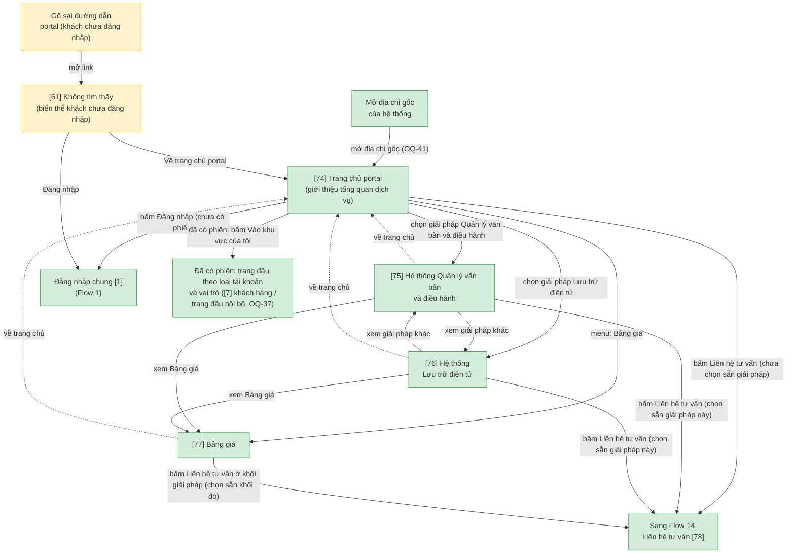
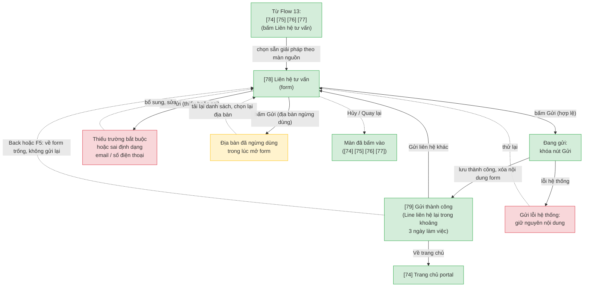
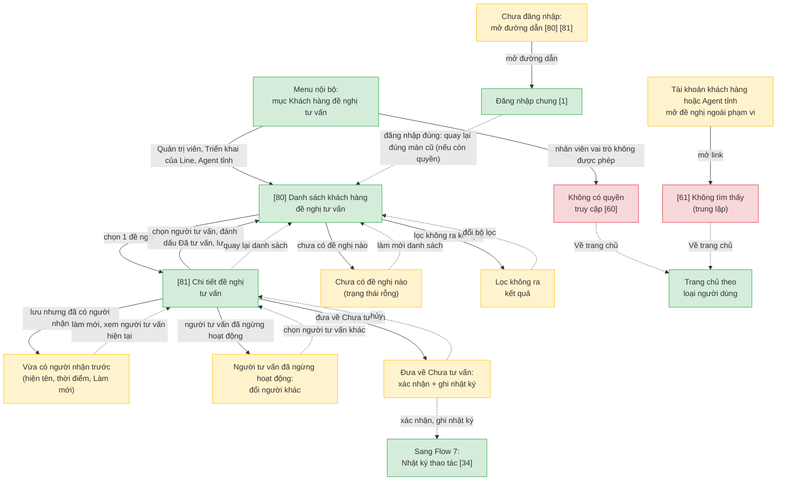

# Hệ thống Hỗ trợ & Chăm sóc Khách hàng — User Flow bổ sung: Portal công khai & quản lý liên hệ tư vấn

> File bổ sung cho `docs/ho-tro-cskh/srs/ho-tro-cskh-userflow.md` (Flow 1-12, màn [1]-[73]). File chính CHƯA được cập nhật theo nội dung này; khi cần gộp một nguồn duy nhất, chạy lại `/user-flow ho-tro-cskh` (update mode). Số màn tiếp nối từ [74], số flow tiếp nối từ 13.
>
> Nguồn nghiệp vụ: yêu cầu BA ngày 28/09/2026 — thêm trang portal công khai (chưa đăng nhập) giới thiệu dịch vụ Line Văn phòng số, chi tiết 2 giải pháp (Hệ thống Quản lý văn bản và điều hành, Hệ thống Lưu trữ điện tử), Bảng giá, Liên hệ tư vấn, Đăng nhập; KHÔNG có đăng ký (thống nhất với quyết định "không có đăng ký công khai" của ho-tro-cskh). Nhân viên có danh sách khách hàng đề nghị tư vấn. Đã qua review của UX_Reviewer (flow-reviewer) trước khi chốt.

## 1. User Flow (tổng)

> Chỉ gồm 3 flow bổ sung (13-15). Các màn dùng chung nằm ở `ho-tro-cskh-userflow.md`: [1] Đăng nhập chung, [7] Trang chủ tra cứu, [34] Nhật ký thao tác, [60] Không có quyền, [61] Không tìm thấy, [73] Danh mục Địa bàn. Sơ đồ ở đây ghi các màn đó dưới dạng node "Sang/Từ Flow N".

### Flow: portal-gioi-thieu — Portal giới thiệu dịch vụ & bảng giá

### Flow: portal-lien-he — Gửi thông tin liên hệ tư vấn

### Flow: quan-ly-lien-he-tu-van — Quản lý khách hàng đề nghị tư vấn (nội bộ)

## 2. Danh sách màn hình

> Cột `Slug` = định danh máy-đọc DUY NHẤT của màn (khớp `## Screen: {slug}` bên wireframe). `[#]` chỉ để đối chiếu Mục 1/3.5.

| [#] | Slug | Màn hình | Mục đích | Thuộc flow |
|-----|------|----------|----------|------------|
| 74 | portal-trang-chu | Trang chủ portal | Trang chủ công khai (chưa đăng nhập) giới thiệu tổng quan dịch vụ Line Văn phòng số: thẻ 2 giải pháp, lối tới Bảng giá, nút Liên hệ tư vấn và Đăng nhập; người đã có phiên thấy nút "Vào khu vực của tôi" thay cho Đăng nhập; địa chỉ gốc của hệ thống mở màn này, đăng xuất vẫn về [1]; nội dung cố định [đề xuất bổ sung 28/09/2026, OQ-41] | portal-gioi-thieu |
| 75 | portal-giai-phap-qlvb | Giải pháp: Hệ thống Quản lý văn bản và điều hành | Giới thiệu chi tiết giải pháp (tổng quan, tính năng nổi bật, lợi ích); nút Liên hệ tư vấn chọn sẵn giải pháp này [đề xuất bổ sung 28/09/2026] | portal-gioi-thieu |
| 76 | portal-giai-phap-luu-tru | Giải pháp: Hệ thống Lưu trữ điện tử | Giới thiệu chi tiết giải pháp (tổng quan, tính năng nổi bật, lợi ích); nút Liên hệ tư vấn chọn sẵn giải pháp này [đề xuất bổ sung 28/09/2026] | portal-gioi-thieu |
| 77 | portal-bang-gia | Bảng giá | Bảng giá các giải pháp trên một trang, chia khối theo giải pháp; nút Liên hệ tư vấn ở từng khối chọn sẵn giải pháp tương ứng [đề xuất bổ sung 28/09/2026] | portal-gioi-thieu |
| 78 | portal-lien-he | Liên hệ tư vấn | Form khách chưa đăng nhập gửi thông tin: họ tên, email, số điện thoại, địa bàn (34 tỉnh/TP và "Bộ, ban, ngành" theo danh mục [73], OQ-44), giải pháp quan tâm (chọn một hoặc nhiều, bắt buộc ít nhất một, chọn sẵn theo màn nguồn), nội dung quan tâm (tùy chọn); lưu vào danh sách đề nghị tư vấn [80], không gửi email, không chống spam; khóa nút Gửi khi đang gửi; lỗi thiếu/sai định dạng, lỗi hệ thống giữ nguyên nội dung, địa bàn ngừng dùng giữa chừng; Hủy/Quay lại về màn đã bấm vào [đề xuất bổ sung 28/09/2026, OQ-44, OQ-47, OQ-48] | portal-lien-he |
| 79 | portal-lien-he-thanh-cong | Gửi liên hệ thành công | Xác nhận đã nhận, ghi "Line sẽ liên hệ lại trong khoảng 3 ngày làm việc" (OQ-48); nội dung form đã xóa, Back/F5 không gửi lại; nút Về trang chủ [74] và Gửi liên hệ khác [đề xuất bổ sung 28/09/2026] | portal-lien-he |
| 80 | tv-danh-sach-lien-he | Danh sách khách hàng đề nghị tư vấn | Nội bộ: đề nghị từ form [78], sắp mới nhất trước, lọc theo trạng thái (Chưa tư vấn / Đã tư vấn), giải pháp, địa bàn, người tư vấn (gồm "Chưa có người tư vấn" và "Của tôi"); Quản trị viên và Triển khai của Line thấy toàn bộ, Agent tỉnh chỉ thấy khách thuộc địa bàn mình (bộ lọc địa bàn khóa sẵn), vai trò khác → [60]; 2 trạng thái rỗng (chưa có đề nghị / lọc không ra); không có thông báo trong ứng dụng khi có khách mới [đề xuất bổ sung 28/09/2026, OQ-43, OQ-45] | quan-ly-lien-he-tu-van |
| 81 | tv-chi-tiet-lien-he | Chi tiết đề nghị tư vấn | Xem thông tin khách nhập (chỉ đọc), chọn người tư vấn (tài khoản nội bộ), đánh dấu Đã tư vấn (bắt buộc có người tư vấn) hoặc đưa về Chưa tư vấn (xác nhận, ghi [34]); mỗi khách một người tư vấn, người lưu sau thấy "Vừa có người nhận trước"; người tư vấn đã ngừng hoạt động hiện kèm nhãn để đổi người khác; chỉ 2 trạng thái, không ghi chú kết quả [đề xuất bổ sung 28/09/2026, OQ-43, OQ-46] | quan-ly-lien-he-tu-van |

## 3. Danh sách flow

| Flow-slug | Tên flow | Màn hình gồm | Cases phủ |
|-----------|----------|--------------|-----------|
| portal-gioi-thieu | Portal giới thiệu dịch vụ & bảng giá | portal-trang-chu → portal-giai-phap-qlvb → portal-giai-phap-luu-tru → portal-bang-gia | happy (xem giới thiệu, chi tiết từng giải pháp, bảng giá, sang Liên hệ hoặc Đăng nhập), edge (người đã có phiên thấy "Vào khu vực của tôi", đường dẫn sai → [61] biến thể khách chưa đăng nhập); màn dùng chung [1], [61] |
| portal-lien-he | Gửi thông tin liên hệ tư vấn | portal-lien-he → portal-lien-he-thanh-cong | happy (điền form → gửi thành công), error (thiếu trường bắt buộc, sai định dạng email/số điện thoại, lỗi hệ thống giữ nguyên nội dung), edge (địa bàn ngừng dùng giữa chừng, bấm gửi 2 lần, Back/F5 sau khi gửi, Hủy về màn đã bấm vào); [78] có 4 lối vào ([74] [75] [76] [77]) |
| quan-ly-lien-he-tu-van | Quản lý khách hàng đề nghị tư vấn (nội bộ) | tv-danh-sach-lien-he → tv-chi-tiet-lien-he | happy (xem danh sách → chọn người tư vấn → đánh dấu Đã tư vấn), error (không đủ quyền → [60], ngoài phạm vi → [61]), edge (hai nhân viên cùng nhận một khách, đưa về Chưa tư vấn có ghi nhật ký, người tư vấn đã ngừng hoạt động, hai trạng thái rỗng, khách chưa đăng nhập mở link → [1]) |

## 3.5. Chuyển màn (transitions)

> Nguồn DUY NHẤT cho chuyển màn màn→màn của các flow bổ sung. 1 dòng = 1 chuyển; đủ phủ happy + error + edge của Mục 1.

**Flow: portal-gioi-thieu**

| Từ màn | Đến màn | Trigger | Điều kiện |
|--------|---------|---------|-----------|
| Địa chỉ gốc của hệ thống | Trang chủ portal [74] | Mở địa chỉ | Mọi người dùng, kể cả đã có phiên (OQ-41) |
| Trang chủ portal [74] | Giải pháp Quản lý văn bản và điều hành [75] | Chọn thẻ hoặc menu giải pháp | — |
| Trang chủ portal [74] | Giải pháp Lưu trữ điện tử [76] | Chọn thẻ hoặc menu giải pháp | — |
| Trang chủ portal [74] | Bảng giá [77] | Menu "Bảng giá" | — |
| Giải pháp Quản lý văn bản và điều hành [75] | Giải pháp Lưu trữ điện tử [76] | Xem giải pháp khác | — |
| Giải pháp Lưu trữ điện tử [76] | Giải pháp Quản lý văn bản và điều hành [75] | Xem giải pháp khác | — |
| Giải pháp [75] / [76] | Bảng giá [77] | Bấm "Xem Bảng giá" | — |
| Giải pháp [75] / [76] / Bảng giá [77] | Trang chủ portal [74] | Về trang chủ | — |
| Trang chủ portal [74] / Giải pháp [75] / [76] / Bảng giá [77] | Liên hệ tư vấn [78] | Bấm "Liên hệ tư vấn" | [74] không chọn sẵn giải pháp; [75]/[76] chọn sẵn giải pháp của màn; [77] chọn sẵn giải pháp của khối được bấm |
| Trang chủ portal [74] | Đăng nhập chung [1] | Bấm "Đăng nhập" | Chưa có phiên |
| Trang chủ portal [74] | Trang đầu theo loại tài khoản và vai trò | Bấm "Vào khu vực của tôi" | Đã có phiên: khách hàng → [7]; nội bộ → trang đầu theo vai trò (OQ-18, OQ-37); người có cả hai loại vào nội bộ trước (OQ-33) |
| Đường dẫn portal không tồn tại | Không tìm thấy nội dung [61] (biến thể khách chưa đăng nhập) | Mở link | Khách chưa đăng nhập (OQ-42) |

**Flow: portal-lien-he**

| Từ màn | Đến màn | Trigger | Điều kiện |
|--------|---------|---------|-----------|
| Trang chủ portal [74] / Giải pháp [75] / [76] / Bảng giá [77] | Liên hệ tư vấn [78] | Bấm "Liên hệ tư vấn" | Giải pháp chọn sẵn theo màn nguồn; người dùng đổi được |
| Liên hệ tư vấn [78] | Gửi liên hệ thành công [79] | Bấm "Gửi" | Hợp lệ; lưu vào danh sách đề nghị tư vấn [80]; không gửi email; không chống spam (chốt 28/09/2026); nút Gửi khóa khi đang gửi; xóa nội dung form |
| Liên hệ tư vấn [78] | (giữ nguyên) [78] | Bấm "Gửi" | Thiếu trường bắt buộc (họ tên, email, số điện thoại, địa bàn, giải pháp) hoặc sai định dạng → báo tại ô; nội dung quan tâm tùy chọn [GIẢ ĐỊNH, OQ-48] |
| Liên hệ tư vấn [78] | (giữ nguyên) [78] | Bấm "Gửi" | Lỗi hệ thống → báo, giữ nguyên nội dung, cho thử lại |
| Liên hệ tư vấn [78] | (giữ nguyên) [78] | Bấm "Gửi" | Địa bàn đã ngừng dùng trong lúc mở form → báo tại ô địa bàn, tải lại danh sách, chọn lại (OQ-44) |
| Liên hệ tư vấn [78] | Màn đã bấm vào ([74] / [75] / [76] / [77]) | Bấm "Hủy" hoặc "Quay lại" | Về đúng màn nguồn |
| Gửi liên hệ thành công [79] | Trang chủ portal [74] | Bấm "Về trang chủ" | — |
| Gửi liên hệ thành công [79] | Liên hệ tư vấn [78] | Bấm "Gửi liên hệ khác", hoặc Back/F5 | Form trống; không tạo liên hệ thứ hai |

**Flow: quan-ly-lien-he-tu-van**

| Từ màn | Đến màn | Trigger | Điều kiện |
|--------|---------|---------|-----------|
| Menu nội bộ | Danh sách khách hàng đề nghị tư vấn [80] | Bấm menu "Khách hàng đề nghị tư vấn" | Quản trị viên, Triển khai của Line (toàn bộ); Agent tỉnh (theo địa bàn được gán); không có thông báo trong ứng dụng khi có khách mới (chốt 28/09/2026) |
| Menu nội bộ | Không có quyền truy cập [60] | Vào chức năng bằng link | Nhân viên vai trò không được phép (Agent helpdesk, Chủ quản dịch vụ, Biên tập nội dung) |
| Đường dẫn [80] / [81] | Đăng nhập chung [1] | Mở khi chưa đăng nhập | Sau đăng nhập quay lại đúng màn cũ nếu còn quyền |
| Đường dẫn [80] / [81] | Không tìm thấy nội dung [61] | Mở link | Tài khoản khách hàng, hoặc Agent tỉnh mở đề nghị ngoài địa bàn; lời lẽ trung lập, không xác nhận đề nghị có tồn tại |
| Danh sách [80] | (giữ nguyên) [80] | Mở khi chưa có đề nghị nào | Trạng thái rỗng |
| Danh sách [80] | (giữ nguyên) [80] | Lọc không ra kết quả | Trạng thái rỗng khác: gợi ý đổi bộ lọc |
| Danh sách [80] | Chi tiết đề nghị tư vấn [81] | Chọn 1 đề nghị | — |
| Chi tiết [81] | Danh sách [80] | Bấm "Lưu" | Chọn người tư vấn + đánh dấu Đã tư vấn (bắt buộc có người tư vấn); chỉ sửa người tư vấn và trạng thái, không sửa thông tin khách nhập |
| Chi tiết [81] | (giữ nguyên) [81] | Bấm "Lưu" | Người khác vừa nhận trước → báo "Vừa có người nhận trước" kèm tên và thời điểm, nút Làm mới; mỗi khách chỉ một người tư vấn (OQ-43) |
| Chi tiết [81] | (giữ nguyên) [81] | Đưa về "Chưa tư vấn" | Có xác nhận; chỉ người tư vấn hiện tại hoặc Quản trị viên; ghi Nhật ký thao tác [34] (OQ-43) |
| Chi tiết [81] | (giữ nguyên) [81] | Mở khi người tư vấn đã ngừng hoạt động | Hiện tên kèm nhãn "đã ngừng"; đổi người tư vấn do người tư vấn hiện tại hoặc Quản trị viên, khi đã ngừng hoạt động thì Quản trị viên hoặc Triển khai của Line; ghi [34] |
| Chi tiết [81] | Danh sách [80] | Bấm "Quay lại danh sách" | — |

**Bổ sung vào flow đã có (chưa sửa file chính)**

| Từ màn | Đến màn | Trigger | Điều kiện |
|--------|---------|---------|-----------|
| Đăng nhập chung [1] | Trang chủ portal [74] | Bấm "Về trang chủ portal" | Chưa đăng nhập; địa chỉ gốc mở [74], đăng xuất vẫn về [1] (OQ-41) |
| Không tìm thấy nội dung [61] (biến thể khách chưa đăng nhập) | Trang chủ portal [74] | Bấm "Về trang chủ portal" | Khách chưa đăng nhập gõ sai đường dẫn portal; [62] không áp cho trang portal công khai (OQ-42) |
| Không tìm thấy nội dung [61] (biến thể khách chưa đăng nhập) | Đăng nhập chung [1] | Bấm "Đăng nhập" | Như trên |

> Dòng 1 thuộc Flow 1 (dang-nhap-kich-hoat-kh); 2 dòng sau thuộc Flow 11 (thong-bao-loi-chung).

## 4. Quyết định và Open Question bổ sung

**Điều chỉnh luồng đã áp dụng ngày 28/09/2026 (theo yêu cầu BA, đã qua UX_Reviewer):**
- Thêm 8 màn [74]-[81] và 3 flow mới: `portal-gioi-thieu` (13), `portal-lien-he` (14), `quan-ly-lien-he-tu-van` (15). Portal công khai gồm trang chủ, chi tiết 2 giải pháp (Quản lý văn bản và điều hành, Lưu trữ điện tử), Bảng giá và form Liên hệ tư vấn; nhân viên có danh sách khách hàng đề nghị tư vấn. KHÔNG có đăng ký công khai (thống nhất với quyết định trước).
- Flow 1: thêm lối [1] ↔ [74]; địa chỉ gốc mở [74], đăng xuất vẫn về [1] (OQ-41).
- Flow 11: [61] có biến thể khách chưa đăng nhập; [62] không áp cho trang portal công khai (OQ-42).
- Đã chốt: form liên hệ không gửi email, không chống spam; nhân viên không nhận thông báo trong ứng dụng khi có khách mới, chỉ mở [80].
- Cần cập nhật khi vẽ lại các màn liên quan (ghi để không sót): [34] thêm loại hành động "đưa Đã tư vấn về Chưa tư vấn" và "đổi người tư vấn"; [58] thêm quyền "Xem và xử lý đề nghị tư vấn"; menu nội bộ thêm mục "Khách hàng đề nghị tư vấn".

### Open Question bổ sung ngày 28/09/2026

| Mã | Nội dung cần chốt | Đề xuất | Trạng thái |
|----|-------------------|---------|------------|
| OQ-41 | Địa chỉ gốc, người đã đăng nhập mở portal, đăng xuất (bổ sung OQ-32) | Địa chỉ gốc mở [74]; người đã có phiên vẫn xem được portal, nút Đăng nhập đổi thành "Vào khu vực của tôi" (trang đầu theo OQ-37); [1] vẫn là màn đăng nhập duy nhất; đăng xuất vẫn về [1] | Đã chốt (khách hàng xác nhận, 28/09/2026) |
| OQ-42 | Trang không tìm thấy và hết phiên trên portal | Dùng lại [61] với biến thể khách chưa đăng nhập (Về trang chủ portal [74], Đăng nhập); [62] không áp cho trang portal công khai; khách mở link [80]/[81] khi chưa đăng nhập → [1] rồi quay lại đúng màn cũ | Đã chốt (khách hàng xác nhận, 28/09/2026) |
| OQ-43 | Vòng đời tư vấn, người tư vấn | Mỗi khách một người tư vấn; người lưu sau bị báo "Vừa có người nhận trước"; "Đã tư vấn" bắt buộc có người tư vấn; đổi người tư vấn hoặc đưa về Chưa tư vấn do người tư vấn hiện tại hoặc Quản trị viên, có xác nhận, ghi [34]; người tư vấn đã ngừng hoạt động: Quản trị viên hoặc Triển khai của Line đổi người khác | Đã chốt (khách hàng xác nhận, 28/09/2026) |
| OQ-44 | Danh sách địa bàn ở form [78] | 34 tỉnh/TP và giá trị "Bộ, ban, ngành" (dòng hệ thống Trung ương của [73] hiển thị nhãn này trên form); địa bàn ngừng dùng giữa chừng → báo tại ô, tải lại danh sách | Đã chốt (khách hàng xác nhận, 28/09/2026) |
| OQ-45 | Phạm vi xem danh sách tư vấn của Agent tỉnh | Chỉ giới hạn theo địa bàn được gán, không thêm phạm vi Dịch vụ × Đối tượng; khách chọn "Bộ, ban, ngành" chỉ Quản trị viên và Triển khai của Line thấy; ngoài phạm vi → [61] | Đã chốt (khách hàng xác nhận, 28/09/2026) |
| OQ-46 | Trạng thái và ghi chú tư vấn | Chỉ 2 trạng thái Chưa tư vấn / Đã tư vấn; không có "Không hợp lệ/Trùng", ghi chú kết quả hay thời điểm tư vấn | Đã chốt (khách hàng xác nhận, 28/09/2026) |
| OQ-47 | Dữ liệu cá nhân từ form Liên hệ tư vấn [78] | Có ô đồng ý xử lý dữ liệu cá nhân và thời hạn lưu (tự xóa) không | Mở — chờ khách hàng |
| OQ-48 | Chi tiết form và màn thành công | Đã chốt: [79] ghi "Line sẽ liên hệ lại trong khoảng 3 ngày làm việc". Còn mở (chốt ở bước wireframe): độ dài tối đa nội dung quan tâm, định dạng số điện thoại; trường bắt buộc tạm coi họ tên, email, số điện thoại, địa bàn, giải pháp là bắt buộc, nội dung quan tâm tùy chọn [GIẢ ĐỊNH] | Một phần đã chốt (khách hàng xác nhận, 28/09/2026) |

## 5. Quy tắc trang trạng thái (bổ sung — chống lộ dữ liệu)

| Loại tài nguyên | Người truy cập | Trang hiển thị | Ghi chú |
|-----------------|----------------|----------------|---------|
| Đề nghị tư vấn ([80]/[81]) ngoài phạm vi | Khách hàng; Agent tỉnh ngoài địa bàn | [61] | Lời lẽ trung lập, không xác nhận đề nghị có tồn tại |
| Chức năng đề nghị tư vấn ([80]/[81]) | Nhân viên vai trò không được phép | [60] | Chỉ Quản trị viên, Triển khai của Line, Agent tỉnh được dùng |
| Đề nghị tư vấn ([80]/[81]) | Chưa đăng nhập | [1] | Sau đăng nhập quay lại đúng màn cũ nếu còn quyền |
| Đường dẫn portal không tồn tại | Khách chưa đăng nhập | [61] (biến thể khách chưa đăng nhập) | Nút Về trang chủ portal [74] và Đăng nhập; [62] không áp cho trang portal công khai |
