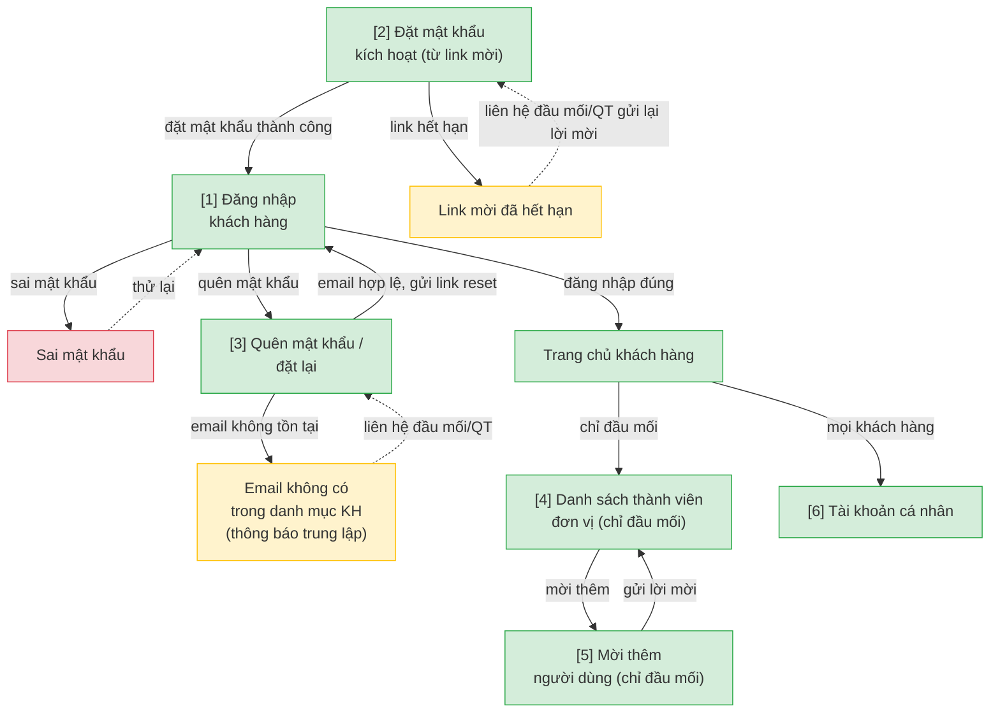
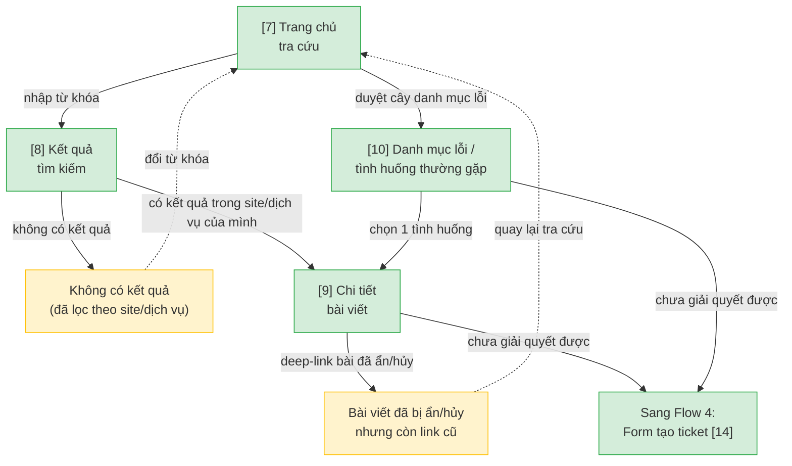
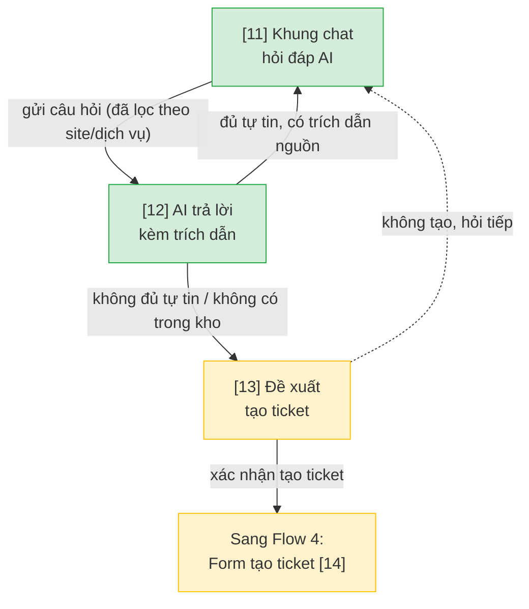
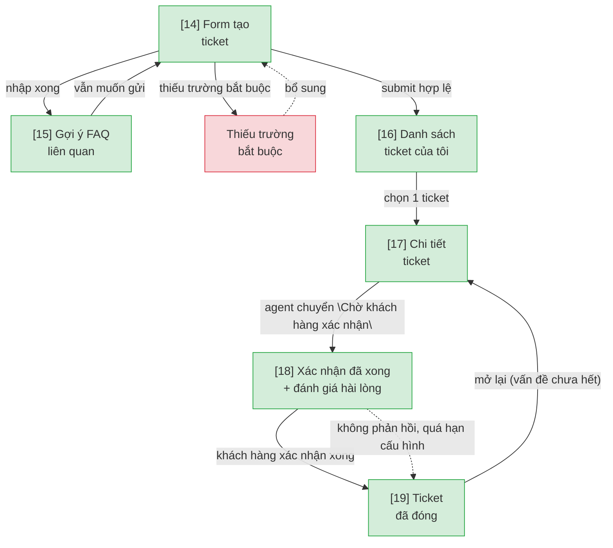
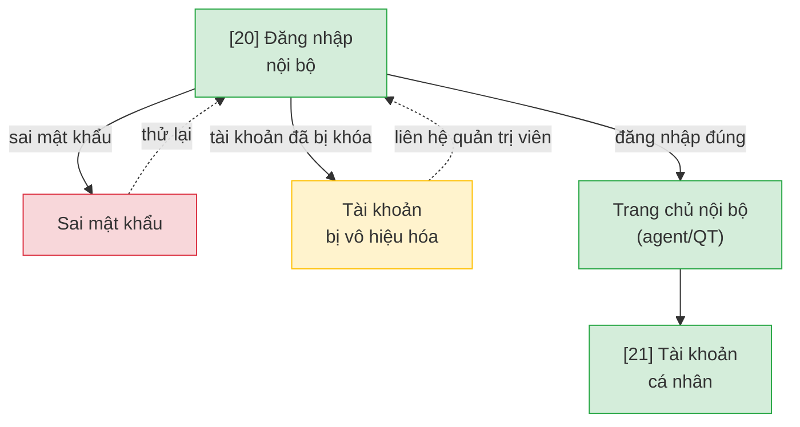
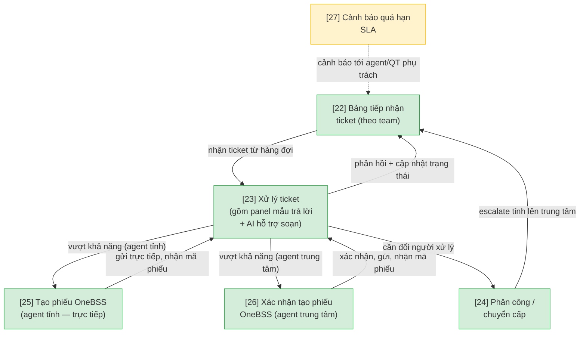
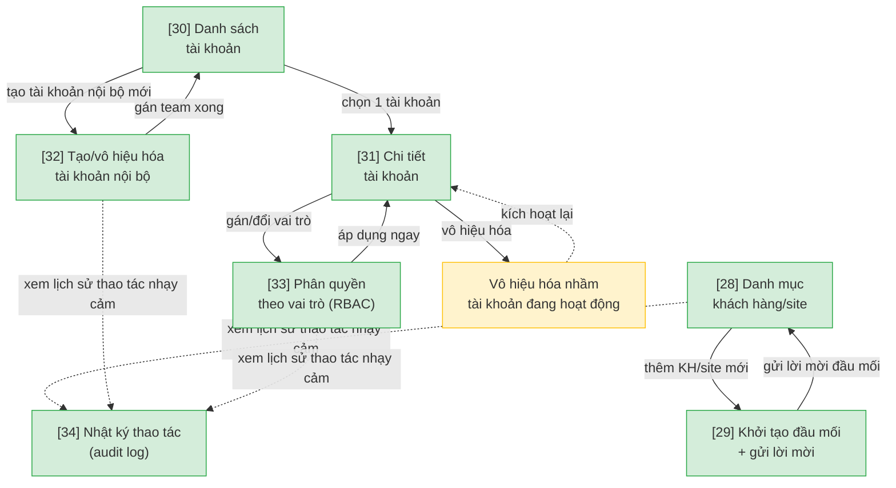
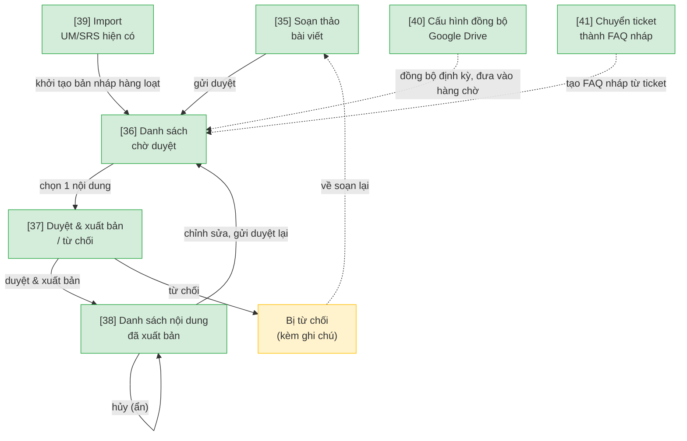
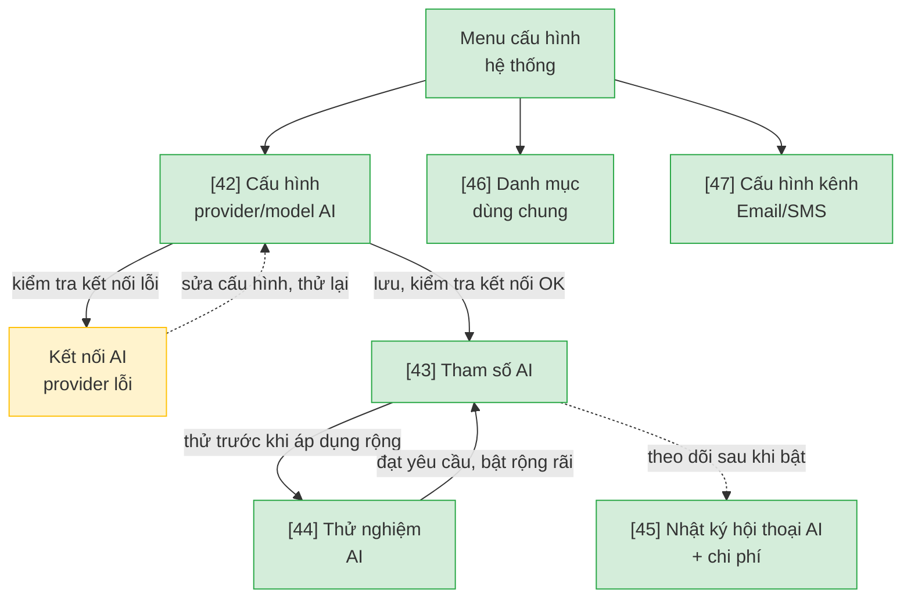
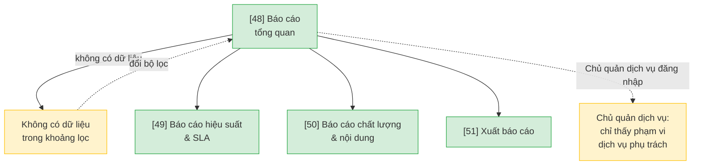

# Hệ thống Hỗ trợ & Chăm sóc Khách hàng — User Flow

> Nguồn chia flow DUY NHẤT cho feature này. `/wireframe-ascii` và `/wireframe-html` đọc file này để biết flow nào gồm những màn nào — KHÔNG tự chia flow riêng.
>
> Nguồn nghiệp vụ: bản đề xuất "Đề xuất Hệ thống Hỗ trợ & Chăm sóc Khách hàng.docx" (mục tiêu, mô hình vận hành, tính năng theo actor, RBAC, RAG, roadmap) + "DanhSach_UC_HeThongHoTroCSKH.xlsx" (45 Use Case, 7 nhóm). Đã qua review của UX_Reviewer (flow-reviewer) trước khi chốt.

## 1. User Flow (tổng)

> Phủ happy / error / edge cases. `[n]` = số màn hình đối chiếu Mục 2. Chia thành 10 block theo flow (feature quá rộng cho 1 flowchart duy nhất, theo quy ước Mục "Mermaid user flow convention").

### Flow: dang-nhap-kich-hoat-kh — Đăng nhập & kích hoạt tài khoản khách hàng

### Flow: tra-cuu-kb — Tra cứu HDSD + FAQ lỗi

### Flow: hoi-dap-ai — Hỏi đáp AI

### Flow: gui-theo-doi-ticket — Khách hàng gửi & theo dõi ticket

### Flow: dang-nhap-noi-bo — Agent/Quản trị viên đăng nhập

### Flow: xu-ly-ticket-agent — Agent xử lý ticket

### Flow: quan-tri-nguoi-dung — Quản trị người dùng & phân quyền

### Flow: quan-tri-noi-dung-kb — Quản trị nội dung tri thức

### Flow: cau-hinh-ai-danh-muc — Cấu hình AI + danh mục hệ thống

### Flow: bao-cao-thong-ke — Báo cáo & thống kê vận hành

## 2. Danh sách màn hình

> Cột `Slug` = định danh máy-đọc DUY NHẤT của màn (khớp `## Screen: {slug}` bên wireframe). `[#]` chỉ để đối chiếu Mục 1/3.5.

| [#] | Slug | Màn hình | Mục đích | Thuộc flow |
|-----|------|----------|----------|------------|
| 1 | kh-dang-nhap | Đăng nhập khách hàng | Khách hàng đăng nhập bằng tài khoản do đơn vị cấp/đầu mối mời | dang-nhap-kich-hoat-kh |
| 2 | kh-kich-hoat-tk | Đặt mật khẩu kích hoạt | Khách hàng mới nhận lời mời (Email/SMS) đặt mật khẩu lần đầu để kích hoạt tài khoản | dang-nhap-kich-hoat-kh |
| 3 | kh-quen-mat-khau | Quên mật khẩu / đặt lại | Khách hàng tự reset mật khẩu qua email; không tồn tại email trong danh mục thì báo trung lập (anti-enumeration) | dang-nhap-kich-hoat-kh |
| 4 | kh-danh-sach-thanh-vien | Danh sách thành viên đơn vị | Chỉ tài khoản đầu mối xem được danh sách người dùng khác trong cùng đơn vị/site | dang-nhap-kich-hoat-kh |
| 5 | kh-moi-thanh-vien | Mời thêm người dùng | Đầu mối nhập thông tin người dùng cần mời; người được mời tự động gắn cố định vào site của đầu mối | dang-nhap-kich-hoat-kh |
| 6 | kh-tai-khoan-ca-nhan | Tài khoản cá nhân | Đổi mật khẩu/thông tin cá nhân; xem danh sách tài liệu đã lưu/theo dõi | dang-nhap-kich-hoat-kh |
| 7 | kb-trang-chu | Trang chủ tra cứu | Tìm kiếm theo từ khóa hoặc duyệt theo cây danh mục chức năng | tra-cuu-kb |
| 8 | kb-ket-qua-tim-kiem | Kết quả tìm kiếm | Hiển thị kết quả đã lọc cứng theo đúng dịch vụ + site khách hàng đang đăng nhập | tra-cuu-kb |
| 9 | kb-chi-tiet-bai-viet | Chi tiết bài viết | Nội dung HDSD/FAQ chi tiết; đánh giá hữu ích; CTA tạo ticket nếu chưa giải quyết được | tra-cuu-kb |
| 10 | kb-danh-muc-loi | Danh mục lỗi / tình huống thường gặp | Tra theo mã lỗi/thông báo/module, hướng dẫn khắc phục từng bước kèm ảnh minh họa | tra-cuu-kb |
| 11 | ai-khung-chat | Khung chat hỏi đáp AI | Khách hàng nhập câu hỏi tự nhiên; hệ thống lọc cứng theo site/dịch vụ trước khi tìm câu trả lời | hoi-dap-ai |
| 12 | ai-tra-loi | AI trả lời kèm trích dẫn | Câu trả lời tổng hợp từ RAG, kèm trích dẫn nguồn bài viết để khách hàng tự kiểm chứng | hoi-dap-ai |
| 13 | ai-de-xuat-tao-ticket | Đề xuất tạo ticket | AI không đủ tự tin hoặc không có trong kho → đề xuất tạo ticket, tự đính kèm nội dung đã hỏi | hoi-dap-ai |
| 14 | ticket-tao-moi | Form tạo ticket | Chọn dịch vụ, loại vấn đề, mức ưu tiên, mô tả, đính kèm ảnh/file | gui-theo-doi-ticket |
| 15 | ticket-goi-y-faq | Gợi ý FAQ liên quan | Gợi ý bài viết/FAQ liên quan trước khi cho gửi, giảm ticket trùng lặp nội dung đã có | gui-theo-doi-ticket |
| 16 | ticket-danh-sach-kh | Danh sách ticket của tôi | Khách hàng xem danh sách ticket đã gửi, lọc theo trạng thái | gui-theo-doi-ticket |
| 17 | ticket-chi-tiet-kh | Chi tiết ticket | Lịch sử trao đổi, mốc thời gian (tạo/phản hồi/đóng/mở lại) | gui-theo-doi-ticket |
| 18 | ticket-xac-nhan | Xác nhận đã xong + đánh giá hài lòng | Khách hàng xác nhận ticket đã giải quyết xong; đánh giá mức hài lòng đơn giản | gui-theo-doi-ticket |
| 19 | ticket-da-dong | Ticket đã đóng | Phân biệt lý do đóng (khách xác nhận / tự động do quá hạn); có nút mở lại nếu vấn đề chưa hết | gui-theo-doi-ticket |
| 20 | noibo-dang-nhap | Đăng nhập nội bộ | Agent/Quản trị viên đăng nhập bằng tài khoản nội bộ (MVP chưa SSO) | dang-nhap-noi-bo |
| 21 | noibo-tai-khoan-ca-nhan | Tài khoản cá nhân (nội bộ) | Agent/Quản trị viên đổi mật khẩu/thông tin cá nhân | dang-nhap-noi-bo |
| 22 | agent-hang-doi | Bảng tiếp nhận ticket | Hàng đợi riêng theo team (tỉnh/trung tâm), lọc trạng thái/ưu tiên/dịch vụ; lọc riêng "AI đã tự trả lời - cần review"; Quản trị viên xem được toàn bộ không giới hạn team | xu-ly-ticket-agent |
| 23 | agent-chi-tiet-ticket | Xử lý ticket | Phản hồi công khai + ghi chú nội bộ; gồm panel chọn mẫu trả lời dựng sẵn và panel AI hỗ trợ soạn phản hồi; hiển thị nhãn "Đã trả lời tự động bởi AI" kèm nút can thiệp khi áp dụng | xu-ly-ticket-agent |
| 24 | agent-phan-cong | Phân công / chuyển cấp | Phân công thủ công cho agent trong team hoặc escalate tỉnh lên trung tâm; Quản trị viên gán được mọi team, Agent chỉ gán trong team mình | xu-ly-ticket-agent |
| 25 | agent-tao-phieu-onebss | Tạo phiếu OneBSS (agent tỉnh) | Agent tỉnh tự quyết định và gửi thẳng, không qua bước xác nhận trung gian | xu-ly-ticket-agent |
| 26 | agent-xac-nhan-phieu-onebss | Xác nhận tạo phiếu OneBSS (agent trung tâm) | Agent trung tâm xem form xác nhận thông tin trước khi gửi sang OneBSS | xu-ly-ticket-agent |
| 27 | agent-canh-bao-sla | Cảnh báo quá hạn SLA | Cảnh báo ticket sắp/đã quá hạn SLA cho agent và Quản trị viên phụ trách | xu-ly-ticket-agent |
| 28 | qt-danh-muc-khach-hang | Danh mục khách hàng/site | Thêm/sửa đơn vị, dịch vụ dùng, site/tenant, đầu mối liên hệ (gồm sửa/chi tiết inline) | quan-tri-nguoi-dung |
| 29 | qt-moi-dau-moi | Khởi tạo đầu mối + gửi lời mời | Khởi tạo tài khoản đầu mối đầu tiên cho đơn vị/site, gửi lời mời kích hoạt | quan-tri-nguoi-dung |
| 30 | qt-danh-sach-tai-khoan | Danh sách tài khoản | Xem danh sách tài khoản (nội bộ + khách hàng) trong phạm vi quản lý | quan-tri-nguoi-dung |
| 31 | qt-chi-tiet-tai-khoan | Chi tiết tài khoản | Thông tin chi tiết, vai trò/site gắn kèm; vô hiệu hóa tài khoản | quan-tri-nguoi-dung |
| 32 | qt-tao-tai-khoan-noibo | Tạo/vô hiệu hóa tài khoản nội bộ | Gán team (trung tâm hoặc tỉnh/thành cụ thể) cho tài khoản agent/admin mới | quan-tri-nguoi-dung |
| 33 | qt-phan-quyen | Phân quyền theo vai trò (RBAC) | Gán/đổi vai trò cho tài khoản, áp dụng quyền tương ứng ngay | quan-tri-nguoi-dung |
| 34 | qt-nhat-ky-thao-tac | Nhật ký thao tác (audit log) | Lọc nhật ký theo hành động/người/thời gian cho các thao tác quản trị nhạy cảm (đổi quyền, xóa tài liệu, đổi định tuyến khách hàng) | quan-tri-nguoi-dung |
| 35 | kb-soan-thao | Soạn thảo bài viết | Biên tập viên nhập nội dung, gắn phạm vi dịch vụ/site hoặc "dùng chung" | quan-tri-noi-dung-kb |
| 36 | kb-cho-duyet | Danh sách chờ duyệt | Nội dung chờ duyệt (thủ công, import UM/SRS, đồng bộ Drive, hoặc từ ticket); gắn nhãn nguồn khi đến từ đồng bộ Drive | quan-tri-noi-dung-kb |
| 37 | kb-duyet-xuat-ban | Duyệt & xuất bản / từ chối | Phê duyệt & xuất bản (tái lập chỉ mục AI) hoặc từ chối kèm ghi chú — phạm vi vai trò được duyệt: xem OQ-4 | quan-tri-noi-dung-kb |
| 38 | kb-danh-sach-noi-dung | Danh sách nội dung đã xuất bản | Sửa nội dung đã xuất bản (gửi duyệt lại) hoặc hủy (ẩn khỏi tra cứu/AI, giữ lịch sử) | quan-tri-noi-dung-kb |
| 39 | kb-import-um | Import UM/SRS hiện có | Nạp tài liệu UM/SRS đã có theo mẫu BM_UM_BM_AI để khởi tạo kho nhanh | quan-tri-noi-dung-kb |
| 40 | kb-cau-hinh-dong-bo-drive | Cấu hình đồng bộ Google Drive | Cấu hình thư mục Drive cần đồng bộ định kỳ, gắn nhãn dịch vụ/site | quan-tri-noi-dung-kb |
| 41 | kb-tu-ticket-thanh-faq | Chuyển ticket thành FAQ nháp | Agent chọn ticket có câu hỏi/trả lời hữu ích, hệ thống gợi ý dựa trên câu hỏi lặp lại nhiều | quan-tri-noi-dung-kb |
| 42 | cauhinh-tich-hop-ai | Cấu hình provider/model AI | Nhập provider/model, API key, endpoint, giới hạn request; kiểm tra kết nối | cau-hinh-ai-danh-muc |
| 43 | cauhinh-tham-so-ai | Tham số AI | Ngưỡng tin cậy, top-k, bật/tắt từng chế độ AI theo dịch vụ/site (Hỏi đáp AI / AI hỗ trợ soạn / AI tự động phản hồi) | cau-hinh-ai-danh-muc |
| 44 | cauhinh-thu-nghiem-ai | Thử nghiệm AI | Quản trị viên/Biên tập viên đặt câu hỏi thử để kiểm tra chất lượng trả lời trước khi áp dụng rộng rãi | cau-hinh-ai-danh-muc |
| 45 | cauhinh-nhat-ky-ai | Nhật ký hội thoại AI + chi phí | Lưu câu hỏi & câu trả lời AI để kiểm tra chất lượng; theo dõi số lượt gọi và chi phí ước tính | cau-hinh-ai-danh-muc |
| 46 | danhmuc-dich-vu-loai-van-de | Danh mục dùng chung | Thêm/sửa/xóa dịch vụ, loại vấn đề ticket, mức ưu tiên, loại nội dung tài liệu, mẫu trả lời dựng sẵn | cau-hinh-ai-danh-muc |
| 47 | cauhinh-kenh-thongbao | Cấu hình kênh thông báo | Bật/tắt kênh Email/SMS, cấu hình brandname SMS, kênh nhận mặc định theo khách hàng/loại thông báo | cau-hinh-ai-danh-muc |
| 48 | baocao-tong-quan | Báo cáo tổng quan | Số ticket theo trạng thái/team/dịch vụ/khách hàng, backlog; landing mặc định cho Chủ quản dịch vụ | bao-cao-thong-ke |
| 49 | baocao-hieusuat-sla | Báo cáo hiệu suất & SLA | Thời gian xử lý trung bình, tỷ lệ đúng/quá hạn SLA theo team/tỉnh/agent, số ticket escalate/đẩy OneBSS | bao-cao-thong-ke |
| 50 | baocao-chatluong | Báo cáo chất lượng & nội dung | CSAT, AI deflection rate, bài viết KB hữu ích nhiều/ít nhất | bao-cao-thong-ke |
| 51 | baocao-xuat | Xuất báo cáo | 2 chế độ: xuất ngay (Excel/PDF) hoặc cấu hình lịch gửi tự động định kỳ kèm danh sách người nhận | bao-cao-thong-ke |

## 3. Danh sách flow

> Flow 7/8/9 (quản trị) là khu vực dạng menu — nhiều màn truy cập độc lập từ 1 menu cấu hình, KHÔNG phải luồng tuyến tính từng bước bắt buộc đi hết. Flow 1-6, 10 là luồng thao tác có trình tự rõ.

| Flow-slug | Tên flow | Màn hình gồm | Cases phủ |
|-----------|----------|--------------|-----------|
| dang-nhap-kich-hoat-kh | Đăng nhập & kích hoạt tài khoản khách hàng | kh-dang-nhap → kh-kich-hoat-tk → kh-quen-mat-khau → kh-danh-sach-thanh-vien → kh-moi-thanh-vien → kh-tai-khoan-ca-nhan | happy (đăng nhập, kích hoạt qua lời mời), error (sai mật khẩu, link mời hết hạn), edge (quên mật khẩu, email không có trong danh mục) |
| tra-cuu-kb | Tra cứu HDSD + FAQ lỗi | kb-trang-chu → kb-ket-qua-tim-kiem → kb-chi-tiet-bai-viet → kb-danh-muc-loi | happy (tìm/duyệt danh mục, xem chi tiết), error (không có kết quả), edge (lọc theo site/dịch vụ, bài viết đã ẩn còn link cũ, CTA tạo ticket) |
| hoi-dap-ai | Hỏi đáp AI | ai-khung-chat → ai-tra-loi → ai-de-xuat-tao-ticket | happy (hỏi & AI trả lời kèm trích dẫn), edge (AI không đủ tự tin → đề xuất tạo ticket, lọc theo site/dịch vụ) |
| gui-theo-doi-ticket | Khách hàng gửi & theo dõi ticket | ticket-tao-moi → ticket-goi-y-faq → ticket-danh-sach-kh → ticket-chi-tiet-kh → ticket-xac-nhan → ticket-da-dong | happy (tạo → theo dõi → xác nhận xong → đóng), error (thiếu trường bắt buộc), edge (không phản hồi → tự đóng, mở lại ticket đã đóng) |
| dang-nhap-noi-bo | Agent/Quản trị viên đăng nhập | noibo-dang-nhap → noibo-tai-khoan-ca-nhan | happy (đăng nhập nội bộ), error (sai mật khẩu), edge (tài khoản bị vô hiệu hóa) |
| xu-ly-ticket-agent | Agent xử lý ticket | agent-hang-doi → agent-chi-tiet-ticket → agent-phan-cong → agent-tao-phieu-onebss → agent-xac-nhan-phieu-onebss → agent-canh-bao-sla | happy (nhận → phản hồi → đóng), error (vượt khả năng xử lý), edge (cảnh báo SLA, escalate tỉnh→trung tâm, OneBSS 1-bước/2-bước theo loại agent, AI tự động phản hồi cần review) |
| quan-tri-nguoi-dung | Quản trị người dùng & phân quyền | qt-danh-muc-khach-hang → qt-moi-dau-moi → qt-danh-sach-tai-khoan → qt-chi-tiet-tai-khoan → qt-tao-tai-khoan-noibo → qt-phan-quyen → qt-nhat-ky-thao-tac | happy (thêm KH/site → mời đầu mối → gán vai trò), error (vô hiệu hóa nhầm tài khoản đang hoạt động), edge (audit log thao tác nhạy cảm) |
| quan-tri-noi-dung-kb | Quản trị nội dung tri thức | kb-soan-thao → kb-cho-duyet → kb-duyet-xuat-ban → kb-danh-sach-noi-dung → kb-import-um → kb-cau-hinh-dong-bo-drive → kb-tu-ticket-thanh-faq | happy (soạn → duyệt → xuất bản → tái lập chỉ mục AI), error (bị từ chối duyệt kèm ghi chú), edge (đồng bộ Drive định kỳ, import UM/SRS, ticket→FAQ nháp) |
| cau-hinh-ai-danh-muc | Cấu hình AI + danh mục hệ thống | cauhinh-tich-hop-ai → cauhinh-tham-so-ai → cauhinh-thu-nghiem-ai → cauhinh-nhat-ky-ai → danhmuc-dich-vu-loai-van-de → cauhinh-kenh-thongbao | happy (cấu hình → thử nghiệm → bật rộng rãi), error (kết nối AI provider lỗi), edge (ticket khẩn cấp luôn cần agent duyệt trước khi AI gửi thẳng) |
| bao-cao-thong-ke | Báo cáo & thống kê vận hành | baocao-tong-quan → baocao-hieusuat-sla → baocao-chatluong → baocao-xuat | happy (chọn bộ lọc → xem dashboard → xuất file), edge (không có dữ liệu trong khoảng lọc, Chủ quản dịch vụ chỉ thấy phạm vi phụ trách) |

## 3.5. Chuyển màn (transitions)

> Nguồn DUY NHẤT cho chuyển màn màn→màn (edge NAVIGATES_TO). `/wireframe-html` + `/prototype-html` đọc bảng này để nối nút/điều hướng. 1 dòng = 1 chuyển; đủ phủ happy + error + edge của Mục 1. Gộp theo flow cho dễ tra.

**Flow: dang-nhap-kich-hoat-kh**

| Từ màn | Đến màn | Trigger | Điều kiện |
|--------|---------|---------|-----------|
| Đặt mật khẩu kích hoạt [2] | Đăng nhập khách hàng [1] | Đặt mật khẩu thành công | Kích hoạt hợp lệ |
| Đặt mật khẩu kích hoạt [2] | (giữ nguyên) [2] | Đặt mật khẩu | Link mời đã hết hạn → báo lỗi, hướng dẫn liên hệ đầu mối/QT |
| Đăng nhập khách hàng [1] | Trang chủ khách hàng | Submit đăng nhập | Đúng tài khoản/mật khẩu |
| Đăng nhập khách hàng [1] | (giữ nguyên) [1] | Submit đăng nhập | Sai mật khẩu → báo lỗi, cho thử lại |
| Đăng nhập khách hàng [1] | Quên mật khẩu / đặt lại [3] | Bấm "Quên mật khẩu" | — |
| Quên mật khẩu / đặt lại [3] | Đăng nhập khách hàng [1] | Submit email | Email hợp lệ, gửi link đặt lại |
| Quên mật khẩu / đặt lại [3] | (giữ nguyên) [3] | Submit email | Email không có trong danh mục KH → thông báo trung lập, không xác nhận tồn tại/không tồn tại |
| Trang chủ khách hàng | Danh sách thành viên đơn vị [4] | Vào mục "Thành viên đơn vị" | Chỉ tài khoản đầu mối thấy mục này |
| Danh sách thành viên đơn vị [4] | Mời thêm người dùng [5] | Bấm "Mời thêm" | — |
| Mời thêm người dùng [5] | Danh sách thành viên đơn vị [4] | Gửi lời mời | Người được mời tự động gắn cố định vào site của đầu mối |
| Trang chủ khách hàng | Tài khoản cá nhân [6] | Vào mục "Tài khoản cá nhân" | Mọi khách hàng |

**Flow: tra-cuu-kb**

| Từ màn | Đến màn | Trigger | Điều kiện |
|--------|---------|---------|-----------|
| Trang chủ tra cứu [7] | Kết quả tìm kiếm [8] | Nhập từ khóa tìm kiếm | — |
| Trang chủ tra cứu [7] | Danh mục lỗi / tình huống thường gặp [10] | Duyệt cây danh mục lỗi | — |
| Kết quả tìm kiếm [8] | Chi tiết bài viết [9] | Chọn 1 kết quả | Kết quả đã lọc đúng site/dịch vụ đang đăng nhập |
| Kết quả tìm kiếm [8] | (giữ nguyên) [8] | Tìm kiếm | Không có kết quả (kể cả do ngoài phạm vi site/dịch vụ) |
| Danh mục lỗi / tình huống thường gặp [10] | Chi tiết bài viết [9] | Chọn 1 tình huống | — |
| Chi tiết bài viết [9] | Trang tra cứu [7] | Truy cập bài đã bị ẩn/hủy qua link cũ | Báo không tìm thấy, gợi ý quay lại tra cứu |
| Chi tiết bài viết [9] | Form tạo ticket [14] | Bấm "Chưa giải quyết được" | — |
| Danh mục lỗi / tình huống thường gặp [10] | Form tạo ticket [14] | Bấm "Chưa giải quyết được" | — |

**Flow: hoi-dap-ai**

| Từ màn | Đến màn | Trigger | Điều kiện |
|--------|---------|---------|-----------|
| Khung chat hỏi đáp AI [11] | AI trả lời kèm trích dẫn [12] | Gửi câu hỏi tự nhiên | Đã lọc cứng theo site/dịch vụ của người hỏi trước khi tìm câu trả lời |
| AI trả lời kèm trích dẫn [12] | Khung chat hỏi đáp AI [11] | Xem câu trả lời | Đủ tự tin, kèm trích dẫn nguồn bài viết |
| AI trả lời kèm trích dẫn [12] | Đề xuất tạo ticket [13] | Xem câu trả lời | Không đủ tự tin / không có trong kho tri thức |
| Đề xuất tạo ticket [13] | Form tạo ticket [14] | Xác nhận tạo ticket | Tự động đính kèm nội dung đã hỏi |
| Đề xuất tạo ticket [13] | Khung chat hỏi đáp AI [11] | Không tạo ticket | Quay lại hỏi tiếp |

**Flow: gui-theo-doi-ticket**

| Từ màn | Đến màn | Trigger | Điều kiện |
|--------|---------|---------|-----------|
| Form tạo ticket [14] | Gợi ý FAQ liên quan [15] | Nhập xong form | Gợi ý FAQ liên quan trước khi cho gửi |
| Gợi ý FAQ liên quan [15] | Form tạo ticket [14] | Vẫn muốn gửi | — |
| Form tạo ticket [14] | Danh sách ticket của tôi [16] | Submit ticket | Đủ trường bắt buộc |
| Form tạo ticket [14] | (giữ nguyên) [14] | Submit ticket | Thiếu trường bắt buộc → báo lỗi |
| Danh sách ticket của tôi [16] | Chi tiết ticket [17] | Chọn 1 ticket | — |
| Chi tiết ticket [17] | Xác nhận đã xong + đánh giá hài lòng [18] | Agent chuyển trạng thái | "Chờ khách hàng xác nhận" |
| Xác nhận đã xong + đánh giá hài lòng [18] | Ticket đã đóng [19] | Khách hàng xác nhận xong | Đóng chính thức + đánh giá hài lòng |
| Xác nhận đã xong + đánh giá hài lòng [18] | Ticket đã đóng [19] | Không phản hồi | Quá thời gian cấu hình → hệ thống tự động đóng |
| Ticket đã đóng [19] | Chi tiết ticket [17] | Bấm "Mở lại" | Vấn đề chưa hết hẳn, không cần tạo ticket mới |

**Flow: dang-nhap-noi-bo**

| Từ màn | Đến màn | Trigger | Điều kiện |
|--------|---------|---------|-----------|
| Đăng nhập nội bộ [20] | Trang chủ nội bộ | Submit đăng nhập | Đúng tài khoản/mật khẩu |
| Đăng nhập nội bộ [20] | (giữ nguyên) [20] | Submit đăng nhập | Sai mật khẩu → báo lỗi, cho thử lại |
| Đăng nhập nội bộ [20] | (giữ nguyên) [20] | Submit đăng nhập | Tài khoản đã bị vô hiệu hóa → báo lỗi, hướng dẫn liên hệ quản trị viên |
| Trang chủ nội bộ | Tài khoản cá nhân (nội bộ) [21] | Vào mục "Tài khoản cá nhân" | — |

**Flow: xu-ly-ticket-agent**

| Từ màn | Đến màn | Trigger | Điều kiện |
|--------|---------|---------|-----------|
| Bảng tiếp nhận ticket [22] | Xử lý ticket [23] | Nhận ticket từ hàng đợi | Hàng đợi có lọc riêng "AI đã tự trả lời — cần review"; Quản trị viên xem được mọi team |
| Xử lý ticket [23] | Bảng tiếp nhận ticket [22] | Phản hồi + cập nhật trạng thái | — |
| Xử lý ticket [23] | Tạo phiếu OneBSS (agent tỉnh) [25] | Bấm "Chuyển OneBSS" | Agent tỉnh, vượt khả năng xử lý |
| Xử lý ticket [23] | Xác nhận tạo phiếu OneBSS (agent trung tâm) [26] | Bấm "Chuyển OneBSS" | Agent trung tâm, vượt khả năng xử lý |
| Tạo phiếu OneBSS (agent tỉnh) [25] | Xử lý ticket [23] | Gửi trực tiếp | Không qua bước xác nhận trung gian, nhận mã phiếu |
| Xác nhận tạo phiếu OneBSS (agent trung tâm) [26] | Xử lý ticket [23] | Xác nhận & gửi | Nhận mã phiếu, lưu liên kết |
| Xử lý ticket [23] | Phân công / chuyển cấp [24] | Cần đổi người xử lý | Phân công thủ công hoặc escalate |
| Phân công / chuyển cấp [24] | Bảng tiếp nhận ticket [22] | Escalate tỉnh lên trung tâm | — |
| Cảnh báo quá hạn SLA [27] | Bảng tiếp nhận ticket [22] | Cảnh báo tự động | Ticket sắp/đã quá hạn SLA, báo agent và Quản trị viên phụ trách |

**Flow: quan-tri-nguoi-dung**

| Từ màn | Đến màn | Trigger | Điều kiện |
|--------|---------|---------|-----------|
| Danh mục khách hàng/site [28] | Khởi tạo đầu mối + gửi lời mời [29] | Bấm "Thêm khách hàng/site" | — |
| Khởi tạo đầu mối + gửi lời mời [29] | Danh mục khách hàng/site [28] | Gửi lời mời đầu mối | — |
| Danh sách tài khoản [30] | Chi tiết tài khoản [31] | Chọn 1 tài khoản | — |
| Chi tiết tài khoản [31] | (giữ nguyên) [31] | Vô hiệu hóa | Cảnh báo nếu tài khoản đang hoạt động, cho phép kích hoạt lại |
| Danh sách tài khoản [30] | Tạo/vô hiệu hóa tài khoản nội bộ [32] | Bấm "Tạo tài khoản nội bộ" | — |
| Tạo/vô hiệu hóa tài khoản nội bộ [32] | Danh sách tài khoản [30] | Gán team xong | — |
| Chi tiết tài khoản [31] | Phân quyền theo vai trò (RBAC) [33] | Bấm "Phân quyền" | — |
| Phân quyền theo vai trò (RBAC) [33] | Chi tiết tài khoản [31] | Gán/đổi vai trò | Áp dụng quyền tương ứng ngay |
| Danh mục khách hàng/site [28] | Nhật ký thao tác (audit log) [34] | Xem nhật ký | Thao tác nhạy cảm: đổi định tuyến khách hàng |
| Tạo/vô hiệu hóa tài khoản nội bộ [32] | Nhật ký thao tác (audit log) [34] | Xem nhật ký | Thao tác nhạy cảm: tạo/vô hiệu hóa tài khoản |
| Phân quyền theo vai trò (RBAC) [33] | Nhật ký thao tác (audit log) [34] | Xem nhật ký | Thao tác nhạy cảm: đổi quyền |

**Flow: quan-tri-noi-dung-kb**

| Từ màn | Đến màn | Trigger | Điều kiện |
|--------|---------|---------|-----------|
| Soạn thảo bài viết [35] | Danh sách chờ duyệt [36] | Gửi duyệt | — |
| Import UM/SRS hiện có [39] | Danh sách chờ duyệt [36] | Import xong | Khởi tạo hàng loạt bản nháp chờ duyệt |
| Cấu hình đồng bộ Google Drive [40] | Danh sách chờ duyệt [36] | Đồng bộ định kỳ chạy | Tài liệu mới/thay đổi vào hàng chờ duyệt, gắn nhãn nguồn "Đồng bộ từ Drive" |
| Chuyển ticket thành FAQ nháp [41] | Danh sách chờ duyệt [36] | Tạo FAQ nháp từ ticket | Vẫn phải qua duyệt như nội dung khác |
| Danh sách chờ duyệt [36] | Duyệt & xuất bản / từ chối [37] | Chọn 1 nội dung | — |
| Duyệt & xuất bản / từ chối [37] | Danh sách nội dung đã xuất bản [38] | Duyệt & xuất bản | Tái lập chỉ mục AI |
| Duyệt & xuất bản / từ chối [37] | (giữ nguyên) [37] | Từ chối | Kèm ghi chú, quay về soạn lại |
| Danh sách nội dung đã xuất bản [38] | Danh sách chờ duyệt [36] | Chỉnh sửa nội dung đã xuất bản | Chuyển về trạng thái chờ duyệt lại |
| Danh sách nội dung đã xuất bản [38] | (giữ nguyên) [38] | Hủy (ẩn) | Ẩn khỏi tra cứu/AI nhưng giữ lịch sử |

**Flow: cau-hinh-ai-danh-muc**

| Từ màn | Đến màn | Trigger | Điều kiện |
|--------|---------|---------|-----------|
| Menu cấu hình hệ thống | Cấu hình provider/model AI [42] | Vào mục "Tích hợp AI" | — |
| Menu cấu hình hệ thống | Danh mục dùng chung [46] | Vào mục "Danh mục dùng chung" | — |
| Menu cấu hình hệ thống | Cấu hình kênh thông báo [47] | Vào mục "Kênh thông báo" | — |
| Cấu hình provider/model AI [42] | Tham số AI [43] | Lưu cấu hình | Kiểm tra kết nối OK |
| Cấu hình provider/model AI [42] | (giữ nguyên) [42] | Lưu cấu hình | Kiểm tra kết nối lỗi → báo lỗi, sửa lại |
| Tham số AI [43] | Thử nghiệm AI [44] | Muốn kiểm tra trước khi bật rộng | — |
| Thử nghiệm AI [44] | Tham số AI [43] | Đạt yêu cầu | Bật rộng rãi theo dịch vụ/site |
| Tham số AI [43] | Nhật ký hội thoại AI + chi phí [45] | Sau khi bật | Theo dõi nhật ký hội thoại + chi phí |

**Flow: bao-cao-thong-ke**

| Từ màn | Đến màn | Trigger | Điều kiện |
|--------|---------|---------|-----------|
| Báo cáo tổng quan [48] | (giữ nguyên) [48] | Chọn bộ lọc | Không có dữ liệu trong khoảng lọc → báo trống, gợi ý đổi bộ lọc |
| Báo cáo tổng quan [48] | Báo cáo hiệu suất & SLA [49] | Chuyển tab "Hiệu suất & SLA" | — |
| Báo cáo tổng quan [48] | Báo cáo chất lượng & nội dung [50] | Chuyển tab "Chất lượng" | — |
| Báo cáo tổng quan [48] | Xuất báo cáo [51] | Bấm "Xuất báo cáo" | Chế độ xuất ngay hoặc cấu hình lịch gửi tự động |
| Báo cáo tổng quan [48] | (giữ nguyên) [48] | Chủ quản dịch vụ đăng nhập | Landing mặc định, chỉ thấy phạm vi dịch vụ phụ trách |

## 4. Open Questions

- [ ] OQ-1: Thời gian timeout cụ thể cho "chờ khách hàng xác nhận → tự động đóng ticket" — đề xuất chỉ nói "một khoảng thời gian cấu hình được", chưa cho số giờ/ngày mặc định.
- [ ] OQ-2: Ngưỡng SLA cụ thể theo từng mức ưu tiên (khẩn cấp / cao / bình thường) — đề xuất chưa cho số giờ.
- [ ] OQ-3: Thang đánh giá mức độ hài lòng khi đóng ticket là dạng gì (sao 1-5? emoji 3 mức? khác?) — đề xuất chỉ nói "đơn giản".
- [ ] OQ-4: Biên tập nội dung có quyền duyệt & xuất bản bài viết không, hay chỉ Quản trị viên duyệt? Bảng RBAC trong đề xuất ghi actor "Biên tập nội dung" có quyền "Soạn/duyệt tài liệu", nhưng UC12 trong danh sách Use Case chỉ định actor duy nhất là "Quản trị viên" cho hành động duyệt & xuất bản — 2 nguồn mâu thuẫn nhau, cần user chốt trước khi gắn RBAC vào wireframe màn `kb-duyet-xuat-ban` [37].
