# Hệ thống Hỗ trợ & Chăm sóc Khách hàng — User Flow

> Nguồn chia flow DUY NHẤT cho feature này. `/wireframe-ascii` và `/wireframe-html` đọc file này để biết flow nào gồm những màn nào — KHÔNG tự chia flow riêng.
>
> Nguồn nghiệp vụ: bản đề xuất "Đề xuất Hệ thống Hỗ trợ & Chăm sóc Khách hàng.docx" (mục tiêu, mô hình vận hành, tính năng theo actor, RBAC, RAG, roadmap) + "DanhSach_UC_HeThongHoTroCSKH.xlsx" (62 Use Case, 7 nhóm — UC46 cấu hình SLA gắn [52]; UC47–UC62 bổ sung 21/09/2026 trong file UC, gắn theo cột "Used by functions" của chỉ mục wireframe). Đã qua review của UX_Reviewer (flow-reviewer) trước khi chốt; bản cập nhật 19/09/2026 áp dụng các quyết định đề xuất; bản cập nhật 21/09/2026 bổ sung 13 màn + 1 flow theo thiết kế Figma (đã qua UX_Reviewer lần 2), đánh dấu là đề xuất bổ sung chờ khách hàng xác nhận; bản cập nhật 21/09/2026 (lần 2) gộp đăng nhập thành một màn chung [1], thêm Hỏi đáp AI cho nhân viên (flow 12) và Lịch sử hỏi đáp AI cho khách hàng và nhân viên.

## 1. User Flow (tổng)

> Phủ happy / error / edge cases. `[n]` = số màn hình đối chiếu Mục 2. Chia thành 12 block theo flow (feature quá rộng cho 1 flowchart duy nhất, theo quy ước Mục "Mermaid user flow convention").

### Flow: dang-nhap-kich-hoat-kh — Đăng nhập chung & kích hoạt tài khoản

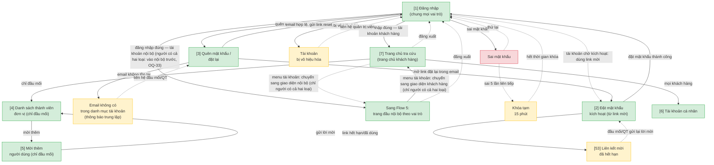

### Flow: tra-cuu-kb — Tra cứu HDSD + FAQ lỗi

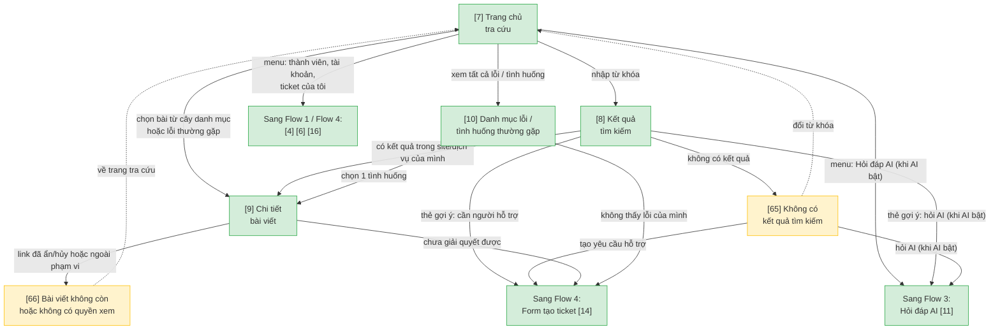

### Flow: hoi-dap-ai — Hỏi đáp AI

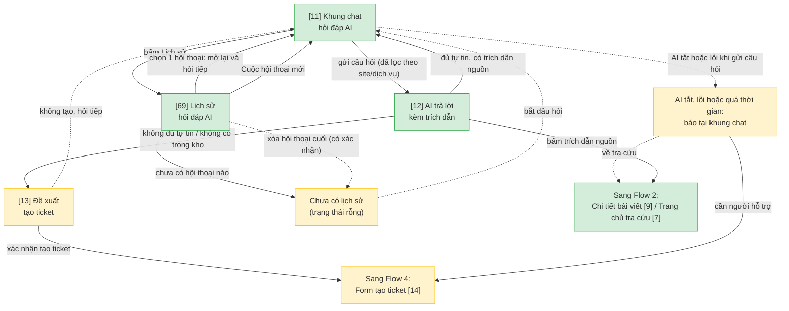

### Flow: gui-theo-doi-ticket — Khách hàng gửi & theo dõi ticket

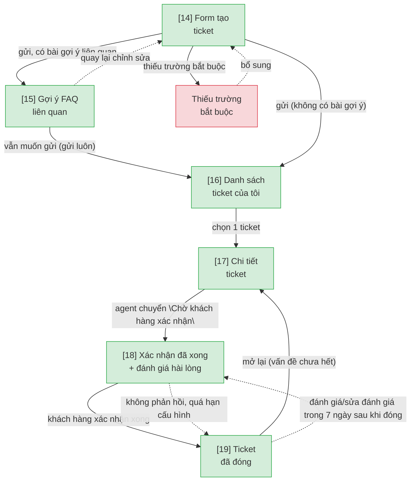

### Flow: dang-nhap-noi-bo — Trang đầu & tổng quan nội bộ theo vai trò

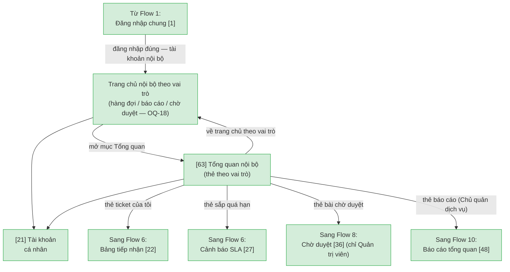

### Flow: xu-ly-ticket-agent — Agent xử lý ticket

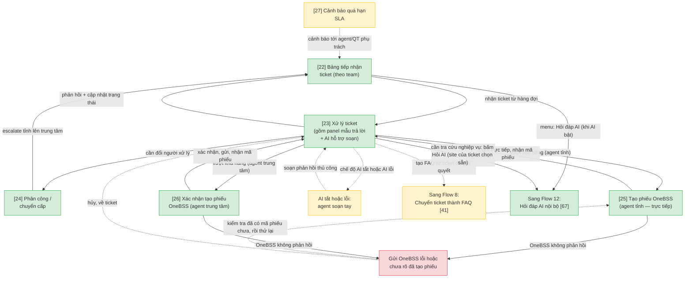

### Flow: quan-tri-nguoi-dung — Quản trị người dùng & phân quyền

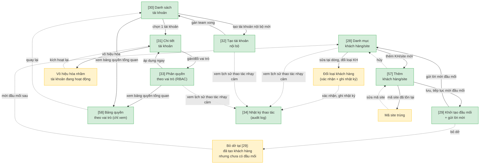

### Flow: quan-tri-noi-dung-kb — Quản trị nội dung tri thức

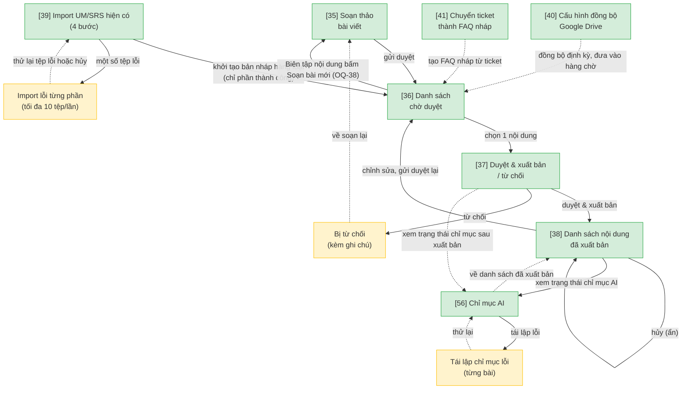

### Flow: cau-hinh-ai-danh-muc — Cấu hình AI + danh mục hệ thống

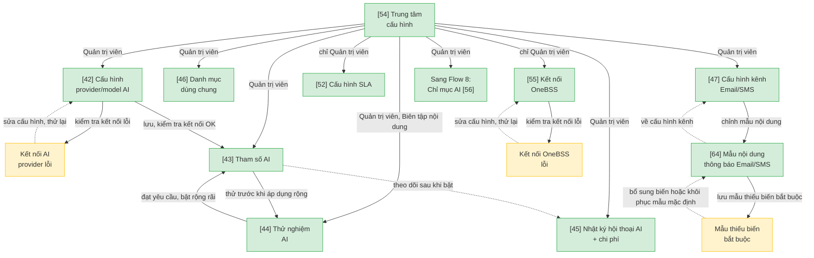

### Flow: bao-cao-thong-ke — Báo cáo & thống kê vận hành

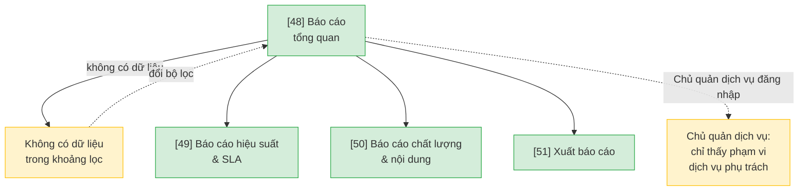

### Flow: thong-bao-loi-chung — Thông báo & trang trạng thái hệ thống

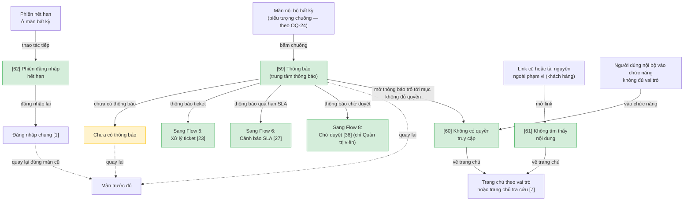

### Flow: noibo-hoi-dap-ai — Hỏi đáp AI cho nhân viên

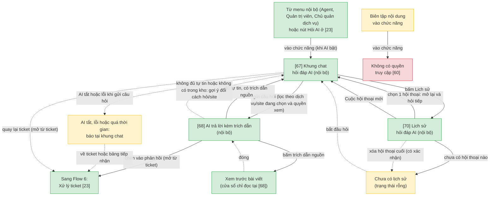

## 2. Danh sách màn hình

> Cột `Slug` = định danh máy-đọc DUY NHẤT của màn (khớp `## Screen: {slug}` bên wireframe). `[#]` chỉ để đối chiếu Mục 1/3.5.

| [#] | Slug | Màn hình | Mục đích | Thuộc flow |
|-----|------|----------|----------|------------|
| 1 | kh-dang-nhap | Đăng nhập (dùng chung mọi vai trò) | Khách hàng và nhân viên đăng nhập bằng tài khoản do đơn vị/quản trị viên cấp hoặc mời; sau khi đăng nhập đúng hệ thống chuyển tới trang đầu theo loại tài khoản và vai trò (khách hàng [7]; Agent/Quản trị viên [22]; Chủ quản dịch vụ [48]; Biên tập nội dung [36]); tài khoản bị vô hiệu hóa hiện thông báo tại màn [đề xuất bổ sung, OQ-32, OQ-33] | dang-nhap-kich-hoat-kh (màn dùng chung) |
| 2 | kh-kich-hoat-tk | Đặt mật khẩu kích hoạt | Người được mời (khách hàng hoặc nhân viên) đặt mật khẩu lần đầu để kích hoạt tài khoản; cũng dùng để đặt mật khẩu mới khi mở link đặt lại từ [3] (tiêu đề đổi thành "Đặt lại mật khẩu", OQ-40) | dang-nhap-kich-hoat-kh |
| 3 | kh-quen-mat-khau | Quên mật khẩu / đặt lại | Người dùng (khách hàng hoặc nhân viên) tự reset mật khẩu qua email; không tồn tại email trong danh mục tài khoản thì báo trung lập (anti-enumeration) | dang-nhap-kich-hoat-kh |
| 4 | kh-danh-sach-thanh-vien | Danh sách thành viên đơn vị | Chỉ tài khoản đầu mối xem được danh sách người dùng khác trong cùng đơn vị/site | dang-nhap-kich-hoat-kh |
| 5 | kh-moi-thanh-vien | Mời thêm người dùng | Đầu mối nhập thông tin người dùng cần mời; người được mời tự động gắn cố định vào site của đầu mối | dang-nhap-kich-hoat-kh |
| 6 | kh-tai-khoan-ca-nhan | Tài khoản cá nhân | Đổi mật khẩu/thông tin cá nhân; xem danh sách tài liệu đã lưu | dang-nhap-kich-hoat-kh |
| 7 | kb-trang-chu | Trang chủ tra cứu | Tìm kiếm theo từ khóa hoặc duyệt theo cây danh mục chức năng Bản chính: hiện phạm vi nội dung (dịch vụ + site), cây danh mục mở nhánh, lỗi thường gặp, thẻ Hỏi đáp AI (ẩn khi tắt AI theo site); là trang chủ khách hàng, nối tới [4] (đầu mối), [6], [11], [14], [16]. | tra-cuu-kb |
| 8 | kb-ket-qua-tim-kiem | Kết quả tìm kiếm | Hiển thị kết quả đã lọc cứng theo đúng dịch vụ + site khách hàng đang đăng nhập Có thẻ gợi ý Hỏi đáp AI (ẩn khi tắt AI theo site) và tạo yêu cầu hỗ trợ. Không có kết quả → [65]. | tra-cuu-kb |
| 9 | kb-chi-tiet-bai-viet | Chi tiết bài viết | Nội dung HDSD/FAQ chi tiết; đánh giá hữu ích; CTA tạo ticket nếu chưa giải quyết được Có thẻ 'Chưa giải quyết được' và thẻ 'Bài viết liên quan' ([GIẢ ĐỊNH], OQ-30, cùng bộ lọc site/dịch vụ); bài đã ẩn/hủy/ngoài phạm vi → [66]. Biến thể: đã đánh giá hữu ích và đã lưu. | tra-cuu-kb |
| 10 | kb-danh-muc-loi | Danh mục lỗi / tình huống thường gặp | Tra theo mã lỗi/thông báo/module, hướng dẫn khắc phục từng bước kèm ảnh minh họa Có thẻ tạo yêu cầu hỗ trợ khi không thấy lỗi của mình. | tra-cuu-kb |
| 11 | ai-khung-chat | Khung chat hỏi đáp AI | Khách hàng nhập câu hỏi tự nhiên; hệ thống lọc cứng theo site/dịch vụ trước khi tìm câu trả lời; có nút Lịch sử sang [69]; AI tắt/lỗi/quá thời gian: báo tại khung chat, gợi ý tạo yêu cầu hỗ trợ [14] hoặc về tra cứu [7], vẫn xem/xóa được lịch sử [đề xuất bổ sung, UC62] | hoi-dap-ai |
| 12 | ai-tra-loi | AI trả lời kèm trích dẫn | Câu trả lời tổng hợp từ RAG, kèm trích dẫn nguồn bài viết để khách hàng tự kiểm chứng; bấm trích dẫn sang [9] (bài đã ẩn hoặc ngoài phạm vi → [66]) | hoi-dap-ai |
| 13 | ai-de-xuat-tao-ticket | Đề xuất tạo ticket | AI không đủ tự tin hoặc không có trong kho → đề xuất tạo ticket, tự đính kèm nội dung đã hỏi | hoi-dap-ai |
| 14 | ticket-tao-moi | Form tạo ticket | Chọn dịch vụ, loại vấn đề, mức ưu tiên, mô tả, đính kèm ảnh/file | gui-theo-doi-ticket |
| 15 | ticket-goi-y-faq | Gợi ý FAQ liên quan | Gợi ý bài viết/FAQ liên quan trước khi cho gửi, giảm ticket trùng lặp nội dung đã có | gui-theo-doi-ticket |
| 16 | ticket-danh-sach-kh | Danh sách ticket của tôi | Khách hàng xem danh sách ticket đã gửi, lọc theo trạng thái | gui-theo-doi-ticket |
| 17 | ticket-chi-tiet-kh | Chi tiết ticket | Lịch sử trao đổi, mốc thời gian (tạo/phản hồi/đóng/mở lại) | gui-theo-doi-ticket |
| 18 | ticket-xac-nhan | Xác nhận đã xong + đánh giá hài lòng | Khách hàng xác nhận ticket đã giải quyết xong; đánh giá mức hài lòng đơn giản Đánh giá 5 sao + nhận xét tùy chọn ≤500 ký tự (OQ-3); thêm/sửa trong 7 ngày sau khi đóng, gồm cả ticket tự đóng — từ [19]. | gui-theo-doi-ticket |
| 19 | ticket-da-dong | Ticket đã đóng | Phân biệt lý do đóng (khách xác nhận / tự động do quá hạn); có nút mở lại nếu vấn đề chưa hết | gui-theo-doi-ticket |
| 20 | — | Đăng nhập nội bộ — đã gộp vào Đăng nhập chung [1] | Không còn màn riêng; số thứ tự [20] giữ lại để không lệch đối chiếu với tài liệu và Figma [đề xuất bổ sung, OQ-32] | dang-nhap-kich-hoat-kh |
| 21 | noibo-tai-khoan-ca-nhan | Tài khoản cá nhân (nội bộ) | Agent/Quản trị viên đổi mật khẩu/thông tin cá nhân | dang-nhap-noi-bo |
| 22 | agent-hang-doi | Bảng tiếp nhận ticket | Hàng đợi riêng theo team (tỉnh/trung tâm), lọc trạng thái/ưu tiên/dịch vụ; lọc riêng "AI đã tự trả lời - cần review"; Quản trị viên xem được toàn bộ không giới hạn team | xu-ly-ticket-agent |
| 23 | agent-chi-tiet-ticket | Xử lý ticket | Phản hồi công khai + ghi chú nội bộ; gồm panel chọn mẫu trả lời dựng sẵn và panel AI hỗ trợ soạn phản hồi; hiển thị nhãn "Đã trả lời tự động bởi AI" kèm nút can thiệp khi áp dụng Panel AI soạn phản hồi hiển thị khi chế độ AI bật; AI tắt hoặc lỗi/quá thời gian → agent soạn tay. | xu-ly-ticket-agent |
| 24 | agent-phan-cong | Phân công / chuyển cấp | Phân công thủ công cho agent trong team hoặc escalate tỉnh lên trung tâm; Quản trị viên gán được mọi team, Agent chỉ gán trong team mình | xu-ly-ticket-agent |
| 25 | agent-tao-phieu-onebss | Tạo phiếu OneBSS (agent tỉnh) | Agent tỉnh tự quyết định và gửi thẳng, không qua bước xác nhận trung gian; form bắt buộc chọn lý do (Lỗi hệ thống / Cần đội dự án / Khác) + ghi chú gửi kèm (OQ-19c) Có trạng thái phụ Đang gửi / Gửi lỗi (Thử lại): kiểm tra ticket đã có mã phiếu chưa trước khi gửi lại để không tạo trùng phiếu; có lối Hủy về [23]. [26] áp dụng tương tự. | xu-ly-ticket-agent |
| 26 | agent-xac-nhan-phieu-onebss | Xác nhận tạo phiếu OneBSS (agent trung tâm) | Agent trung tâm xem form xác nhận thông tin trước khi gửi sang OneBSS; bắt buộc chọn lý do (3 lựa chọn) + ghi chú gửi kèm (OQ-19c) | xu-ly-ticket-agent |
| 27 | agent-canh-bao-sla | Cảnh báo quá hạn SLA | Cảnh báo ticket sắp/đã quá hạn SLA cho agent và Quản trị viên phụ trách | xu-ly-ticket-agent |
| 28 | qt-danh-muc-khach-hang | Danh mục khách hàng/site | Thêm/sửa đơn vị, dịch vụ dùng, site/tenant, đầu mối liên hệ (gồm sửa/chi tiết inline) Sửa và đổi loại khách hàng tại chỗ (có xác nhận, ghi [34]); thêm mới qua [57]. | quan-tri-nguoi-dung |
| 29 | qt-moi-dau-moi | Khởi tạo đầu mối + gửi lời mời | Khởi tạo tài khoản đầu mối đầu tiên cho đơn vị/site, gửi lời mời kích hoạt Điền sẵn đầu mối đã lưu ở [57]/danh mục (không nhập lại); xác nhận kênh gửi và tạo tài khoản chờ kích hoạt (UC9). | quan-tri-nguoi-dung |
| 30 | qt-danh-sach-tai-khoan | Danh sách tài khoản | Xem danh sách tài khoản (nội bộ + khách hàng) trong phạm vi quản lý Có lối xem bảng quyền tổng quan [58]. | quan-tri-nguoi-dung |
| 31 | qt-chi-tiet-tai-khoan | Chi tiết tài khoản | Thông tin chi tiết, vai trò/site gắn kèm; vô hiệu hóa tài khoản | quan-tri-nguoi-dung |
| 32 | qt-tao-tai-khoan-noibo | Tạo tài khoản nội bộ | Gán vai trò và team (trung tâm hoặc tỉnh/thành cụ thể) cho tài khoản agent/admin mới; vô hiệu hóa làm ở chi tiết tài khoản | quan-tri-nguoi-dung |
| 33 | qt-phan-quyen | Phân quyền theo vai trò (RBAC) | Gán/đổi vai trò cho tài khoản, áp dụng quyền tương ứng ngay Có link xem bảng quyền tổng quan [58]. Quyền "Xem nghiệp vụ toàn bộ khách hàng trong Hỏi đáp AI" gắn cố định theo vai trò (xem [58]); tại đây Quản trị viên chỉ gán vai trò cho tài khoản, chỉnh quyền theo vai trò ngoài MVP (OQ-34) [đề xuất bổ sung]. | quan-tri-nguoi-dung |
| 34 | qt-nhat-ky-thao-tac | Nhật ký thao tác (audit log) | Lọc nhật ký theo hành động/người/thời gian cho các thao tác quản trị nhạy cảm (đổi quyền, xóa tài liệu, đổi định tuyến khách hàng) | quan-tri-nguoi-dung |
| 35 | kb-soan-thao | Soạn thảo bài viết | Biên tập viên nhập nội dung, gắn phạm vi dịch vụ/site hoặc "dùng chung" | quan-tri-noi-dung-kb |
| 36 | kb-cho-duyet | Danh sách chờ duyệt | Nội dung chờ duyệt (thủ công, import UM/SRS, đồng bộ Drive, hoặc từ ticket); gắn nhãn nguồn khi đến từ đồng bộ Drive | quan-tri-noi-dung-kb |
| 37 | kb-duyet-xuat-ban | Duyệt & xuất bản / từ chối | Phê duyệt & xuất bản (tái lập chỉ mục AI) hoặc từ chối kèm ghi chú — phạm vi vai trò được duyệt: xem OQ-4 | quan-tri-noi-dung-kb |
| 38 | kb-danh-sach-noi-dung | Danh sách nội dung đã xuất bản | Sửa nội dung đã xuất bản (gửi duyệt lại) hoặc hủy (ẩn khỏi tra cứu/AI, giữ lịch sử) Có lối xem trạng thái chỉ mục AI [56]. | quan-tri-noi-dung-kb |
| 39 | kb-import-um | Import UM/SRS hiện có | Nạp tài liệu UM/SRS đã có theo mẫu BM_UM_BM_AI để khởi tạo kho nhanh Dạng 4 bước (chọn tệp, cấu hình, xử lý, kết quả); Quay lại/Hủy ở bước 1-3; kết quả liệt kê từng tệp (tối đa 10 tệp/lần), thử lại tệp lỗi, chỉ phần thành công sang [36]. | quan-tri-noi-dung-kb |
| 40 | kb-cau-hinh-dong-bo-drive | Cấu hình đồng bộ Google Drive | Cấu hình thư mục Drive cần đồng bộ định kỳ, gắn nhãn dịch vụ/site | quan-tri-noi-dung-kb |
| 41 | kb-tu-ticket-thanh-faq | Chuyển ticket thành FAQ nháp | Agent chọn ticket có câu hỏi/trả lời hữu ích, hệ thống gợi ý dựa trên câu hỏi lặp lại nhiều | quan-tri-noi-dung-kb |
| 42 | cauhinh-tich-hop-ai | Cấu hình provider/model AI | Nhập provider/model, API key, endpoint, giới hạn request; kiểm tra kết nối | cau-hinh-ai-danh-muc |
| 43 | cauhinh-tham-so-ai | Tham số AI | Ngưỡng tin cậy, top-k, bật/tắt từng chế độ AI theo dịch vụ/site (Hỏi đáp AI / AI hỗ trợ soạn / AI tự động phản hồi) | cau-hinh-ai-danh-muc |
| 44 | cauhinh-thu-nghiem-ai | Thử nghiệm AI | Quản trị viên/Biên tập viên đặt câu hỏi thử để kiểm tra chất lượng trả lời trước khi áp dụng rộng rãi | cau-hinh-ai-danh-muc |
| 45 | cauhinh-nhat-ky-ai | Nhật ký hội thoại AI + chi phí | Lưu câu hỏi & câu trả lời AI để kiểm tra chất lượng; theo dõi số lượt gọi và chi phí ước tính | cau-hinh-ai-danh-muc |
| 46 | danhmuc-dich-vu-loai-van-de | Danh mục dùng chung | Thêm/sửa/xóa dịch vụ, loại vấn đề ticket, mức ưu tiên, loại nội dung tài liệu, mẫu trả lời dựng sẵn Mỗi danh mục 1 tab (5 tab). | cau-hinh-ai-danh-muc |
| 47 | cauhinh-kenh-thongbao | Cấu hình kênh thông báo | Bật/tắt kênh Email/SMS, cấu hình brandname SMS, kênh nhận mặc định theo khách hàng/loại thông báo Chỉnh mẫu nội dung Email/SMS qua [64]. | cau-hinh-ai-danh-muc |
| 48 | baocao-tong-quan | Báo cáo tổng quan | Số ticket theo trạng thái/team/dịch vụ/khách hàng, backlog; landing mặc định cho Chủ quản dịch vụ | bao-cao-thong-ke |
| 49 | baocao-hieusuat-sla | Báo cáo hiệu suất & SLA | Thời gian xử lý trung bình, tỷ lệ đúng/quá hạn SLA theo team/tỉnh/agent, số ticket escalate/đẩy OneBSS | bao-cao-thong-ke |
| 50 | baocao-chatluong | Báo cáo chất lượng & nội dung | CSAT, AI deflection rate, bài viết KB hữu ích nhiều/ít nhất | bao-cao-thong-ke |
| 51 | baocao-xuat | Xuất báo cáo | 2 chế độ: xuất ngay (Excel/PDF) hoặc cấu hình lịch gửi tự động định kỳ kèm danh sách người nhận | bao-cao-thong-ke |
| 52 | cauhinh-sla | Cấu hình SLA | Quản trị viên cấu hình thời gian phản hồi/xử lý theo mức ưu tiên, giờ làm việc, ngưỡng cảnh báo và thời gian tự đóng ticket | cau-hinh-ai-danh-muc |
| 53 | kh-kich-hoat-tk-het-han | Liên kết mời hết hạn | Thông báo liên kết mời đã hết hạn hoặc đã dùng, hướng dẫn liên hệ đầu mối/quản trị viên để gửi lại lời mời | dang-nhap-kich-hoat-kh |
| 54 | cauhinh-hub | Trung tâm cấu hình | Cửa vào các mục cấu hình (tích hợp AI, tham số, thử nghiệm, nhật ký AI, chỉ mục AI, danh mục, kênh và mẫu thông báo, SLA, kết nối OneBSS), hiện trạng thái từng mục; mục hiển thị theo vai trò [đề xuất bổ sung] | cau-hinh-ai-danh-muc |
| 55 | cauhinh-onebss | Kết nối OneBSS | Nhập địa chỉ dịch vụ, mã client, bí mật client (che, chỉ nhập lại để thay); kiểm tra kết nối (có nhánh lỗi); xem dữ liệu đẩy sang và nhật ký gửi phiếu gần đây; chỉ Quản trị viên [đề xuất bổ sung, OQ-29] | cau-hinh-ai-danh-muc |
| 56 | kb-chi-muc-ai | Chỉ mục AI | Xem số bài đã lập / cần tái lập / loại khỏi AI, trạng thái từng bài (đang xử lý, lỗi), tái lập chỉ mục có xác nhận khi hàng loạt [đề xuất bổ sung, OQ-27] | quan-tri-noi-dung-kb |
| 57 | qt-form-khach-hang | Thêm khách hàng/site | Tạo đơn vị: tên, loại khách hàng (quyết định team tiếp nhận), dịch vụ, mã site duy nhất, đầu mối liên hệ chính thức (tên, email, SĐT — OQ-20b); lưu xong sang [29] để tạo tài khoản đầu mối + mời (điền sẵn đầu mối vừa nhập). Sửa và đổi loại vẫn làm tại [28] | quan-tri-nguoi-dung |
| 58 | qt-ma-tran-phan-quyen | Bảng quyền theo vai trò (chỉ xem) | Xem tổng quan vai trò × chức năng; nhãn tham khảo, chờ khách hàng xác nhận; có dòng quyền Hỏi đáp AI nội bộ và xem nghiệp vụ toàn bộ khách hàng [đề xuất bổ sung, OQ-28, OQ-34] | quan-tri-nguoi-dung |
| 59 | thong-bao | Thông báo | Trung tâm thông báo trong ứng dụng cho tài khoản nội bộ, lọc tất cả/chưa đọc/ticket/hệ thống; từng thông báo dẫn tới [23]/[27]/[36]; có trạng thái rỗng [đề xuất bổ sung, có điều kiện OQ-24] | thong-bao-loi-chung |
| 60 | loi-403 | Không có quyền truy cập | Dành cho người dùng nội bộ vào chức năng có thật nhưng vai trò không được phép; khách hàng không thấy trang này | thong-bao-loi-chung (màn dùng chung) |
| 61 | loi-404 | Không tìm thấy nội dung | Link cũ hoặc tài nguyên (ticket, tài khoản...) ngoài phạm vi của khách hàng; lời lẽ trung lập, không xác nhận tài nguyên có tồn tại | thong-bao-loi-chung (màn dùng chung) |
| 62 | phien-het-han | Phiên đăng nhập hết hạn | Yêu cầu đăng nhập lại; sau đăng nhập quay lại đúng màn cũ; hành động đang gửi dở xử lý theo OQ-31 | thong-bao-loi-chung (màn dùng chung) |
| 63 | noibo-tong-quan | Tổng quan nội bộ | Việc cần làm theo vai trò (ticket của tôi, sắp quá hạn SLA, bài chờ duyệt cho Quản trị viên, báo cáo cho Chủ quản dịch vụ) và hoạt động gần đây; không thay landing mặc định [đề xuất bổ sung, OQ-25] | dang-nhap-noi-bo |
| 64 | cauhinh-mau-thong-bao | Mẫu nội dung thông báo Email/SMS | Chọn loại thông báo, sửa tiêu đề/nội dung, chèn biến, xem trước, đếm độ dài SMS, khôi phục mẫu mặc định; không cho lưu khi thiếu biến bắt buộc (link kích hoạt/đặt lại) [đề xuất bổ sung, OQ-26] | cau-hinh-ai-danh-muc |
| 65 | kb-khong-co-ket-qua | Không có kết quả tìm kiếm | Trạng thái không có kết quả (kể cả do ngoài phạm vi site — không tiết lộ bài site khác); gợi ý đổi từ khóa, hỏi AI (khi AI bật), tạo yêu cầu hỗ trợ | tra-cuu-kb |
| 66 | kb-bai-viet-khong-con | Bài viết không còn hoặc không có quyền xem | Thông báo gộp cho bài đã ẩn/hủy hoặc ngoài phạm vi (không phân biệt hai trường hợp); nút về trang tra cứu | tra-cuu-kb |
| 67 | noibo-ai-khung-chat | Khung chat hỏi đáp AI (nội bộ) | Nhân viên tra cứu nghiệp vụ để hỗ trợ khách hàng; chọn dịch vụ + site đang hỗ trợ (site theo quyền xem, OQ-34); lọc cứng theo lựa chọn; mở từ ticket [23] thì site của ticket chọn sẵn; có nút Lịch sử sang [70]; chỉ hiện khi Hỏi đáp AI bật theo dịch vụ/site (AI tắt, lỗi hoặc quá thời gian: báo tại khung chat, về ticket/hàng đợi); mở từ menu nội bộ cho Agent, Quản trị viên, Chủ quản dịch vụ [đề xuất bổ sung, UC61, OQ-34] | noibo-hoi-dap-ai |
| 68 | noibo-ai-tra-loi | AI trả lời kèm trích dẫn (nội bộ) | Câu trả lời kèm trích dẫn nguồn; nút Sao chép và "Chèn vào phản hồi" (khi mở từ ticket); trạng thái phụ không đủ tự tin: báo rõ, gợi ý đổi cách hỏi hoặc site, KHÔNG đề xuất tạo ticket; bấm trích dẫn mở xem trước bài viết chỉ đọc tại chỗ, bài đã ẩn báo "bài không còn" (OQ-39) [đề xuất bổ sung, UC61] | noibo-hoi-dap-ai |
| 69 | ai-lich-su | Lịch sử hỏi đáp AI (khách hàng) | Danh sách hội thoại của chính mình (tiêu đề = câu hỏi đầu tiên, thời gian, dịch vụ/site, số lượt), tìm theo từ khóa, mở lại để hỏi tiếp, xóa từng hội thoại có xác nhận; tự xóa sau 90 ngày; có trạng thái rỗng [đề xuất bổ sung, UC62, OQ-36] | hoi-dap-ai |
| 70 | noibo-ai-lich-su | Lịch sử hỏi đáp AI (nội bộ) | Như [69] cho tài khoản nội bộ; chỉ thấy hội thoại của chính mình, Quản trị viên không xem lịch sử cá nhân của người khác [đề xuất bổ sung, UC62, OQ-36] | noibo-hoi-dap-ai |

## 3. Danh sách flow

> Flow 7/8/9 (quản trị) là khu vực dạng menu — nhiều màn truy cập độc lập từ 1 menu cấu hình, KHÔNG phải luồng tuyến tính từng bước bắt buộc đi hết. Flow 1-6, 10, 11, 12 là luồng thao tác có trình tự rõ.

| Flow-slug | Tên flow | Màn hình gồm | Cases phủ |
|-----------|----------|--------------|-----------|
| dang-nhap-kich-hoat-kh | Đăng nhập chung & kích hoạt tài khoản | kh-dang-nhap → kh-kich-hoat-tk → kh-kich-hoat-tk-het-han → kh-quen-mat-khau → kh-danh-sach-thanh-vien → kh-moi-thanh-vien → kh-tai-khoan-ca-nhan | happy (đăng nhập chung rồi rẽ theo loại tài khoản, kích hoạt qua lời mời), error (sai mật khẩu, link mời hết hạn → màn riêng), edge (quên mật khẩu, email không có trong danh mục tài khoản, tài khoản bị vô hiệu hóa) |
| tra-cuu-kb | Tra cứu HDSD + FAQ lỗi | kb-trang-chu → kb-ket-qua-tim-kiem → kb-khong-co-ket-qua → kb-chi-tiet-bai-viet → kb-bai-viet-khong-con → kb-danh-muc-loi | happy (tìm/duyệt danh mục, xem chi tiết), error (không có kết quả), edge (lọc theo site/dịch vụ, bài viết đã ẩn còn link cũ, CTA tạo ticket); màn riêng cho không có kết quả và bài không còn/không có quyền xem; ẩn thẻ AI khi tắt AI theo site |
| hoi-dap-ai | Hỏi đáp AI | ai-khung-chat → ai-tra-loi → ai-de-xuat-tao-ticket → ai-lich-su | happy (hỏi & AI trả lời kèm trích dẫn), edge (AI không đủ tự tin → đề xuất tạo ticket, lọc theo site/dịch vụ); lịch sử hỏi đáp lưu 90 ngày, mở lại hội thoại cũ, xóa từng hội thoại, trạng thái rỗng (OQ-36) |
| gui-theo-doi-ticket | Khách hàng gửi & theo dõi ticket | ticket-tao-moi → ticket-goi-y-faq → ticket-danh-sach-kh → ticket-chi-tiet-kh → ticket-xac-nhan → ticket-da-dong | happy (tạo → theo dõi → xác nhận xong → đóng), error (thiếu trường bắt buộc), edge (không phản hồi → tự đóng, mở lại ticket đã đóng); đánh giá/sửa đánh giá trong 7 ngày sau khi đóng (từ ticket-da-dong) |
| dang-nhap-noi-bo | Trang đầu & tổng quan nội bộ theo vai trò | noibo-tai-khoan-ca-nhan → noibo-tong-quan (vào từ Đăng nhập chung [1]; màn noibo-dang-nhap [20] đã gộp vào [1]) | happy (đăng nhập → trang đầu theo vai trò), edge (tổng quan nội bộ theo vai trò, không thay landing OQ-18) |
| xu-ly-ticket-agent | Agent xử lý ticket | agent-hang-doi → agent-chi-tiet-ticket → agent-phan-cong → agent-tao-phieu-onebss → agent-xac-nhan-phieu-onebss → agent-canh-bao-sla | happy (nhận → phản hồi → đóng), error (vượt khả năng xử lý), edge (cảnh báo SLA, escalate tỉnh→trung tâm, OneBSS 1-bước/2-bước theo loại agent, AI tự động phản hồi cần review); gửi OneBSS lỗi/chưa rõ đã tạo phiếu → kiểm tra mã phiếu trước khi thử lại, AI tắt/lỗi → soạn tay |
| quan-tri-nguoi-dung | Quản trị người dùng & phân quyền | qt-danh-muc-khach-hang → qt-form-khach-hang → qt-moi-dau-moi → qt-danh-sach-tai-khoan → qt-chi-tiet-tai-khoan → qt-tao-tai-khoan-noibo → qt-phan-quyen → qt-ma-tran-phan-quyen → qt-nhat-ky-thao-tac | happy (thêm KH/site → mời đầu mối → gán vai trò), error (vô hiệu hóa nhầm tài khoản đang hoạt động), edge (audit log thao tác nhạy cảm); thêm KH/site → mời đầu mối, mã site trùng, bỏ dở giữa chừng, đổi loại KH có xác nhận và ghi nhật ký |
| quan-tri-noi-dung-kb | Quản trị nội dung tri thức | kb-soan-thao → kb-cho-duyet → kb-duyet-xuat-ban → kb-danh-sach-noi-dung → kb-chi-muc-ai → kb-import-um → kb-cau-hinh-dong-bo-drive → kb-tu-ticket-thanh-faq | happy (soạn → duyệt → xuất bản → tái lập chỉ mục AI), error (bị từ chối duyệt kèm ghi chú), edge (đồng bộ Drive định kỳ, import UM/SRS, ticket→FAQ nháp); chỉ mục AI (đang tái lập/lỗi), import lỗi từng phần |
| cau-hinh-ai-danh-muc | Cấu hình AI + danh mục hệ thống | cauhinh-hub → cauhinh-tich-hop-ai → cauhinh-tham-so-ai → cauhinh-thu-nghiem-ai → cauhinh-nhat-ky-ai → danhmuc-dich-vu-loai-van-de → cauhinh-kenh-thongbao → cauhinh-mau-thong-bao → cauhinh-sla → cauhinh-onebss | happy (cấu hình → thử nghiệm → bật rộng rãi), error (kết nối AI provider lỗi), edge (ticket khẩn cấp luôn cần agent duyệt trước khi AI gửi thẳng; cấu hình SLA); kết nối OneBSS lỗi, mẫu thông báo thiếu biến bắt buộc |
| bao-cao-thong-ke | Báo cáo & thống kê vận hành | baocao-tong-quan → baocao-hieusuat-sla → baocao-chatluong → baocao-xuat | happy (chọn bộ lọc → xem dashboard → xuất file), edge (không có dữ liệu trong khoảng lọc, Chủ quản dịch vụ chỉ thấy phạm vi phụ trách) |
| thong-bao-loi-chung | Thông báo & trang trạng thái hệ thống | thong-bao (+ loi-403, loi-404, phien-het-han là màn dùng chung nhiều flow) | happy (mở thông báo → tới ticket/SLA/chờ duyệt), error (không đủ quyền, link hỏng, hết phiên), edge (chưa có thông báo, quay lại đúng màn cũ sau đăng nhập lại) |
| noibo-hoi-dap-ai | Hỏi đáp AI cho nhân viên | noibo-ai-khung-chat → noibo-ai-tra-loi → noibo-ai-lich-su | happy (hỏi nghiệp vụ → nhận trả lời kèm trích dẫn → chèn vào phản hồi ticket), edge (không đủ tự tin, lọc theo dịch vụ/site và quyền xem, vai trò không được dùng → [60], xem lại và xóa lịch sử, trạng thái rỗng) |

## 3.5. Chuyển màn (transitions)

> Nguồn DUY NHẤT cho chuyển màn màn→màn (edge NAVIGATES_TO). `/wireframe-html` + `/prototype-html` đọc bảng này để nối nút/điều hướng. 1 dòng = 1 chuyển; đủ phủ happy + error + edge của Mục 1. Gộp theo flow cho dễ tra.

**Flow: dang-nhap-kich-hoat-kh**

| Từ màn | Đến màn | Trigger | Điều kiện |
|--------|---------|---------|-----------|
| Đặt mật khẩu kích hoạt [2] | Đăng nhập chung [1] | Đặt mật khẩu thành công | Kích hoạt hợp lệ |
| Đặt mật khẩu kích hoạt [2] | Liên kết mời hết hạn [53] | Mở link mời | Link đã hết hạn hoặc đã dùng → không hiện form, sang màn thông báo |
| Liên kết mời hết hạn [53] | Đặt mật khẩu kích hoạt [2] | Đầu mối/QT gửi lại lời mời | Người dùng mở link mới trong email/SMS |
| Đăng nhập chung [1] | Trang chủ tra cứu [7] | Submit đăng nhập | Đúng tài khoản/mật khẩu; tài khoản khách hàng |
| Đăng nhập chung [1] | Trang chủ nội bộ theo vai trò (Flow 5) | Submit đăng nhập | Tài khoản nội bộ: Agent, Quản trị viên → Bảng tiếp nhận [22]; Chủ quản dịch vụ → Báo cáo [48]; Biên tập nội dung → Danh sách chờ duyệt [36] (OQ-18); người có cả hai loại tài khoản vào nội bộ trước (OQ-33); nhiều vai trò → trang đầu của vai trò cao nhất; chưa có vai trò → [60] (OQ-37) |
| Đăng nhập chung [1] | (giữ nguyên) [1] | Submit đăng nhập | Chỉ báo sau khi mật khẩu đúng: tài khoản đã bị vô hiệu hóa → hướng dẫn liên hệ quản trị viên |
| Đăng nhập chung [1] | Đặt mật khẩu kích hoạt [2] | Submit đăng nhập | Tài khoản chờ kích hoạt → báo dùng link mời trong email; link hết hạn xem [53] |
| Menu tài khoản (mọi màn) | Đăng nhập chung [1] | Bấm "Đăng xuất" | Kết thúc phiên, cả khách hàng và nhân viên |
| Menu tài khoản (giao diện nội bộ) | Trang chủ tra cứu [7] | Bấm "Chuyển sang giao diện khách hàng" | Chỉ người có cả tài khoản khách hàng lẫn vai trò nội bộ (OQ-33) |
| Menu tài khoản (giao diện khách hàng) | Trang chủ nội bộ theo vai trò | Bấm "Chuyển sang giao diện nội bộ" | Chỉ người có cả hai loại (OQ-33) |
| Đăng nhập chung [1] | (giữ nguyên) [1] | Submit đăng nhập | Sai email hoặc mật khẩu → báo chung, không phân biệt email không tồn tại; sai 5 lần liên tiếp khóa 15 phút (UC47) |
| Đăng nhập chung [1] | Quên mật khẩu / đặt lại [3] | Bấm "Quên mật khẩu" | — |
| Quên mật khẩu / đặt lại [3] | Đăng nhập chung [1] | Submit email | Email hợp lệ, gửi link đặt lại |
| Quên mật khẩu / đặt lại [3] | Đặt mật khẩu kích hoạt [2] | Mở link đặt lại trong email | Màn [2] dùng chung với tiêu đề "Đặt lại mật khẩu"; link 30 phút, hết hạn hoặc đã dùng → [53] (OQ-40) |
| Quên mật khẩu / đặt lại [3] | (giữ nguyên) [3] | Submit email | Email không có trong danh mục tài khoản → thông báo trung lập, không xác nhận tồn tại/không tồn tại |
| Trang chủ tra cứu [7] | Danh sách thành viên đơn vị [4] | Vào mục "Thành viên đơn vị" | Chỉ tài khoản đầu mối thấy mục này |
| Danh sách thành viên đơn vị [4] | Mời thêm người dùng [5] | Bấm "Mời thêm" | — |
| Mời thêm người dùng [5] | Danh sách thành viên đơn vị [4] | Gửi lời mời | Người được mời tự động gắn cố định vào site của đầu mối |
| Trang chủ tra cứu [7] | Tài khoản cá nhân [6] | Vào mục "Tài khoản cá nhân" | Mọi khách hàng |

**Flow: tra-cuu-kb**

| Từ màn | Đến màn | Trigger | Điều kiện |
|--------|---------|---------|-----------|
| Trang chủ tra cứu [7] | Kết quả tìm kiếm [8] | Nhập từ khóa tìm kiếm | — |
| Trang chủ tra cứu [7] | Danh mục lỗi / tình huống thường gặp [10] | Bấm "Xem tất cả lỗi" | — |
| Trang chủ tra cứu [7] | Chi tiết bài viết [9] | Chọn bài từ cây danh mục hoặc lỗi thường gặp | Cây danh mục chỉ dẫn tới bài; muốn lọc theo từ khóa thì tìm ở ô tìm kiếm |
| Trang chủ tra cứu [7] | Khung chat hỏi đáp AI [11] | Bấm menu hoặc thẻ "Hỏi đáp AI" | Chế độ Hỏi đáp AI đang bật cho dịch vụ/site (OQ-15); tắt thì ẩn mục và thẻ |
| Trang chủ tra cứu [7] | Danh sách thành viên đơn vị [4] | Vào mục "Thành viên đơn vị" | Chỉ tài khoản đầu mối |
| Trang chủ tra cứu [7] | Tài khoản cá nhân [6] | Vào mục "Tài khoản cá nhân" | Mọi khách hàng |
| Trang chủ tra cứu [7] | Danh sách ticket của tôi [16] | Bấm menu "Ticket của tôi" | — |
| Kết quả tìm kiếm [8] | Chi tiết bài viết [9] | Chọn 1 kết quả | Kết quả đã lọc đúng site/dịch vụ đang đăng nhập |
| Kết quả tìm kiếm [8] | Không có kết quả tìm kiếm [65] | Tìm kiếm | Không có kết quả (kể cả do ngoài phạm vi site/dịch vụ), không tiết lộ có/không bài ở site khác |
| Kết quả tìm kiếm [8] | Khung chat hỏi đáp AI [11] | Bấm thẻ "Hỏi AI về từ khóa" | Chế độ Hỏi đáp AI đang bật |
| Kết quả tìm kiếm [8] | Form tạo ticket [14] | Bấm thẻ "Tạo yêu cầu hỗ trợ" | — |
| Không có kết quả tìm kiếm [65] | Trang chủ tra cứu [7] | Đổi từ khóa | — |
| Không có kết quả tìm kiếm [65] | Khung chat hỏi đáp AI [11] | Bấm "Hỏi AI" | Chế độ Hỏi đáp AI đang bật |
| Không có kết quả tìm kiếm [65] | Form tạo ticket [14] | Bấm "Tạo yêu cầu hỗ trợ" | — |
| Danh mục lỗi / tình huống thường gặp [10] | Chi tiết bài viết [9] | Chọn 1 tình huống | — |
| Chi tiết bài viết [9] | Bài viết không còn hoặc không có quyền xem [66] | Mở link cũ / bài đã ẩn-hủy / ngoài phạm vi | Không phân biệt ẩn hay thiếu quyền (tránh lộ dữ liệu site khác) |
| Bài viết không còn hoặc không có quyền xem [66] | Trang chủ tra cứu [7] | Bấm "Về trang tra cứu" | — |
| Chi tiết bài viết [9] | Form tạo ticket [14] | Bấm "Chưa giải quyết được" | Tự điền dịch vụ, gắn bài đang xem làm tham chiếu [GIẢ ĐỊNH] |
| Danh mục lỗi / tình huống thường gặp [10] | Form tạo ticket [14] | Bấm "Không thấy lỗi của bạn" | — |

**Flow: hoi-dap-ai**

| Từ màn | Đến màn | Trigger | Điều kiện |
|--------|---------|---------|-----------|
| Khung chat hỏi đáp AI [11] | AI trả lời kèm trích dẫn [12] | Gửi câu hỏi tự nhiên | Đã lọc cứng theo site/dịch vụ của người hỏi trước khi tìm câu trả lời |
| AI trả lời kèm trích dẫn [12] | Khung chat hỏi đáp AI [11] | Xem câu trả lời | Đủ tự tin, kèm trích dẫn nguồn bài viết |
| AI trả lời kèm trích dẫn [12] | Đề xuất tạo ticket [13] | Xem câu trả lời | Không đủ tự tin / không có trong kho tri thức |
| Đề xuất tạo ticket [13] | Form tạo ticket [14] | Xác nhận tạo ticket | Tự động đính kèm nội dung đã hỏi |
| Đề xuất tạo ticket [13] | Khung chat hỏi đáp AI [11] | Không tạo ticket | Quay lại hỏi tiếp |
| Khung chat hỏi đáp AI [11] | Lịch sử hỏi đáp AI [69] | Bấm "Lịch sử" | Khách hàng đang dùng được Hỏi đáp AI |
| Lịch sử hỏi đáp AI [69] | Khung chat hỏi đáp AI [11] | Chọn 1 hội thoại | Mở lại đúng hội thoại cũ, hỏi tiếp trong cùng hội thoại |
| Lịch sử hỏi đáp AI [69] | Khung chat hỏi đáp AI [11] | Bấm "Cuộc hội thoại mới" | Khung chat trống |
| Lịch sử hỏi đáp AI [69] | (giữ nguyên) [69] | Xóa hội thoại | Có xác nhận; chỉ xóa hội thoại của chính mình |
| Lịch sử hỏi đáp AI [69] | (giữ nguyên) [69] | Mở khi chưa có hội thoại, hoặc vừa xóa hội thoại cuối | Trạng thái rỗng, gợi ý bắt đầu hỏi |
| Lịch sử hỏi đáp AI [69] | Khung chat hỏi đáp AI [11] | Mở hội thoại cũ | Site/dịch vụ đã đổi hoặc mất quyền: chỉ xem, không hỏi tiếp; bài trích dẫn đã ẩn ghi "bài không còn"; AI tắt: chỉ xem và xóa (OQ-36) |
| Khung chat hỏi đáp AI [11] | (giữ nguyên) [11] | Gửi câu hỏi khi AI tắt, lỗi hoặc quá thời gian | Báo tại khung chat, gợi ý Form tạo ticket [14] hoặc Trang chủ tra cứu [7]; vẫn xem/xóa được lịch sử |
| AI trả lời kèm trích dẫn [12] | Chi tiết bài viết [9] | Bấm trích dẫn nguồn | Bài đã ẩn hoặc ngoài phạm vi → [66] |

**Flow: gui-theo-doi-ticket**

| Từ màn | Đến màn | Trigger | Điều kiện |
|--------|---------|---------|-----------|
| Form tạo ticket [14] | Gợi ý FAQ liên quan [15] | Bấm "Gửi yêu cầu" | Đủ trường bắt buộc và có bài gợi ý liên quan |
| Gợi ý FAQ liên quan [15] | Danh sách ticket của tôi [16] | Vẫn muốn gửi yêu cầu | Tạo ticket luôn (không quay lại form) |
| Gợi ý FAQ liên quan [15] | Form tạo ticket [14] | Quay lại chỉnh sửa | Giữ nguyên nội dung đã nhập |
| Form tạo ticket [14] | Danh sách ticket của tôi [16] | Bấm "Gửi yêu cầu" | Đủ trường bắt buộc, không có bài gợi ý → tạo ticket luôn |
| Form tạo ticket [14] | (giữ nguyên) [14] | Submit ticket | Thiếu trường bắt buộc → báo lỗi |
| Danh sách ticket của tôi [16] | Chi tiết ticket [17] | Chọn 1 ticket | — |
| Chi tiết ticket [17] | Xác nhận đã xong + đánh giá hài lòng [18] | Agent chuyển trạng thái | "Chờ khách hàng xác nhận" |
| Xác nhận đã xong + đánh giá hài lòng [18] | Ticket đã đóng [19] | Khách hàng xác nhận xong | Đóng chính thức + đánh giá hài lòng |
| Xác nhận đã xong + đánh giá hài lòng [18] | Ticket đã đóng [19] | Không phản hồi | Quá thời gian cấu hình → hệ thống tự động đóng |
| Ticket đã đóng [19] | Chi tiết ticket [17] | Bấm "Mở lại" | Vấn đề chưa hết hẳn, không cần tạo ticket mới |
| Ticket đã đóng [19] | Xác nhận đã xong + đánh giá hài lòng [18] | Bấm "Đánh giá / sửa đánh giá" | Trong 7 ngày sau khi đóng, gồm cả ticket tự đóng do quá hạn (OQ-3) |

**Flow: dang-nhap-noi-bo**

| Từ màn | Đến màn | Trigger | Điều kiện |
|--------|---------|---------|-----------|
| Trang chủ nội bộ theo vai trò | Tài khoản cá nhân (nội bộ) [21] | Vào mục "Tài khoản cá nhân" | — |
| Trang chủ nội bộ theo vai trò | Tổng quan nội bộ [63] | Vào mục "Tổng quan" | Mọi tài khoản nội bộ; thẻ hiển thị theo vai trò (OQ-25) |
| Tổng quan nội bộ [63] | Tài khoản cá nhân (nội bộ) [21] | Vào mục "Tài khoản cá nhân" | — |
| Tổng quan nội bộ [63] | Trang chủ nội bộ theo vai trò | Bấm logo / về trang chủ | — |
| Tổng quan nội bộ [63] | Bảng tiếp nhận ticket [22] | Bấm thẻ "Ticket mới cho tôi" / "Xem hàng đợi" | Vai trò Agent, Quản trị viên |
| Tổng quan nội bộ [63] | Cảnh báo quá hạn SLA [27] | Bấm thẻ "Sắp quá hạn SLA" | Vai trò Agent, Quản trị viên |
| Tổng quan nội bộ [63] | Danh sách chờ duyệt [36] | Bấm thẻ "Bài chờ duyệt" | Chỉ Quản trị viên (OQ-4); vai trò khác không hiện thẻ |
| Tổng quan nội bộ [63] | Báo cáo tổng quan [48] | Bấm thẻ báo cáo | Chủ quản dịch vụ, chỉ phạm vi phụ trách |

**Flow: xu-ly-ticket-agent**

| Từ màn | Đến màn | Trigger | Điều kiện |
|--------|---------|---------|-----------|
| Bảng tiếp nhận ticket [22] | Xử lý ticket [23] | Nhận ticket từ hàng đợi | Hàng đợi có lọc riêng "AI đã tự trả lời — cần review"; Quản trị viên xem được mọi team |
| Xử lý ticket [23] | Bảng tiếp nhận ticket [22] | Phản hồi + cập nhật trạng thái | — |
| Bảng tiếp nhận ticket [22] | Khung chat hỏi đáp AI nội bộ [67] | Bấm menu "Hỏi đáp AI" | Hỏi đáp AI đang bật; vai trò được dùng (OQ-34) |
| Xử lý ticket [23] | Khung chat hỏi đáp AI nội bộ [67] | Bấm "Hỏi AI" | Dịch vụ/site của ticket được chọn sẵn |
| Xử lý ticket [23] | Tạo phiếu OneBSS (agent tỉnh) [25] | Bấm "Chuyển OneBSS" | Agent tỉnh, vượt khả năng xử lý |
| Xử lý ticket [23] | Xác nhận tạo phiếu OneBSS (agent trung tâm) [26] | Bấm "Chuyển OneBSS" | Agent trung tâm, vượt khả năng xử lý |
| Tạo phiếu OneBSS (agent tỉnh) [25] | Xử lý ticket [23] | Bấm "Gửi sang OneBSS" | Đã chọn lý do; gửi trực tiếp, không qua bước xác nhận trung gian, nhận mã phiếu |
| Tạo phiếu OneBSS (agent tỉnh) [25] | (giữ nguyên) [25] | Bấm "Gửi sang OneBSS" | Chưa chọn lý do → báo lỗi tại ô, không gửi |
| Xác nhận tạo phiếu OneBSS (agent trung tâm) [26] | Xử lý ticket [23] | Xác nhận & gửi | Đã chọn lý do (Lỗi hệ thống / Cần đội dự án / Khác); nhận mã phiếu, lưu liên kết |
| Xử lý ticket [23] | Phân công / chuyển cấp [24] | Cần đổi người xử lý | Phân công thủ công hoặc escalate |
| Phân công / chuyển cấp [24] | Bảng tiếp nhận ticket [22] | Escalate tỉnh lên trung tâm | — |
| Xử lý ticket [23] | Chuyển ticket thành FAQ nháp [41] | Bấm "Tạo FAQ từ ticket này" | Ticket đã giải quyết; chỉ Agent/Quản trị viên |
| Cảnh báo quá hạn SLA [27] | Bảng tiếp nhận ticket [22] | Cảnh báo tự động | Ticket sắp/đã quá hạn SLA, báo agent và Quản trị viên phụ trách |
| Tạo phiếu OneBSS (agent tỉnh) [25] | (giữ nguyên) [25] | Gửi trực tiếp | OneBSS không phản hồi → báo lỗi, ticket giữ nguyên, chưa lưu liên kết; trước khi Thử lại phải kiểm tra ticket đã có mã phiếu chưa (tránh tạo trùng) |
| Xác nhận tạo phiếu OneBSS (agent trung tâm) [26] | (giữ nguyên) [26] | Xác nhận & gửi | OneBSS không phản hồi → báo lỗi + thử lại, cùng quy tắc kiểm tra mã phiếu |
| Tạo phiếu OneBSS (agent tỉnh) [25] | Xử lý ticket [23] | Bấm "Hủy, về ticket" | Khi gửi lỗi hoặc chưa rõ đã tạo phiếu |
| Xử lý ticket [23] | (giữ nguyên) [23] | Soạn phản hồi | Chế độ AI tắt hoặc AI lỗi/quá thời gian → panel AI ẩn/báo lỗi, agent soạn tay |

**Flow: quan-tri-nguoi-dung**

| Từ màn | Đến màn | Trigger | Điều kiện |
|--------|---------|---------|-----------|
| Danh mục khách hàng/site [28] | Thêm khách hàng/site [57] | Bấm "Thêm khách hàng/site" | — |
| Thêm khách hàng/site [57] | Khởi tạo đầu mối + gửi lời mời [29] | Bấm "Lưu và tiếp tục mời đầu mối" | Đủ tên đơn vị, loại khách hàng, dịch vụ, mã site và đầu mối (tên, email, SĐT) hợp lệ; [29] điền sẵn đầu mối |
| Thêm khách hàng/site [57] | Danh mục khách hàng/site [28] | Bấm "Hủy" | Không lưu gì |
| Thêm khách hàng/site [57] | (giữ nguyên) [57] | Bấm "Lưu và tiếp tục mời đầu mối" | Mã site đã tồn tại → báo lỗi ngay tại ô (OQ-20b) |
| Khởi tạo đầu mối + gửi lời mời [29] | Danh mục khách hàng/site [28] | Gửi lời mời đầu mối | — |
| Khởi tạo đầu mối + gửi lời mời [29] | Danh mục khách hàng/site [28] | Bỏ dở / quay lại | Khách hàng đã tạo nhưng chưa có đầu mối → [28] hiện nhãn "chưa có đầu mối", mời sau |
| Danh mục khách hàng/site [28] | (giữ nguyên) [28] | Sửa tại dòng, đổi loại khách hàng | Hộp xác nhận; ghi Nhật ký thao tác [34]; ticket đang mở giữ team cũ (OQ-20c) |
| Danh sách tài khoản [30] | Chi tiết tài khoản [31] | Chọn 1 tài khoản | — |
| Chi tiết tài khoản [31] | (giữ nguyên) [31] | Vô hiệu hóa | Cảnh báo nếu tài khoản đang hoạt động, cho phép kích hoạt lại |
| Danh sách tài khoản [30] | Tạo tài khoản nội bộ [32] | Bấm "Tạo tài khoản nội bộ" | — |
| Tạo tài khoản nội bộ [32] | Danh sách tài khoản [30] | Gán team xong | — |
| Chi tiết tài khoản [31] | Phân quyền theo vai trò (RBAC) [33] | Bấm "Phân quyền" | — |
| Phân quyền theo vai trò (RBAC) [33] | Chi tiết tài khoản [31] | Gán/đổi vai trò | Áp dụng quyền tương ứng ngay |
| Phân quyền theo vai trò (RBAC) [33] | Bảng quyền theo vai trò [58] | Bấm "Xem bảng quyền tổng quan" | Chỉ xem; nhãn tham khảo, chờ xác nhận (OQ-28) |
| Danh sách tài khoản [30] | Bảng quyền theo vai trò [58] | Bấm "Xem bảng quyền" | Chỉ Quản trị viên |
| Bảng quyền theo vai trò [58] | Danh sách tài khoản [30] | Quay lại | — |
| Danh mục khách hàng/site [28] | Nhật ký thao tác (audit log) [34] | Xem nhật ký | Thao tác nhạy cảm: đổi định tuyến khách hàng |
| Tạo tài khoản nội bộ [32] | Nhật ký thao tác (audit log) [34] | Xem nhật ký | Thao tác nhạy cảm: tạo/vô hiệu hóa tài khoản |
| Phân quyền theo vai trò (RBAC) [33] | Nhật ký thao tác (audit log) [34] | Xem nhật ký | Thao tác nhạy cảm: đổi quyền |

**Flow: quan-tri-noi-dung-kb**

| Từ màn | Đến màn | Trigger | Điều kiện |
|--------|---------|---------|-----------|
| Soạn thảo bài viết [35] | Danh sách chờ duyệt [36] | Gửi duyệt | — |
| Import UM/SRS hiện có [39] | Danh sách chờ duyệt [36] | Import xong | Chỉ phần tệp thành công khởi tạo bản nháp hàng loạt chờ duyệt |
| Import UM/SRS hiện có [39] | (giữ nguyên) [39] | Xử lý xong | Một số tệp lỗi (tối đa 10 tệp/lần, OQ-21a) → liệt kê từng tệp, thử lại tệp lỗi hoặc hủy; Quay lại/Hủy ở bước 1-3; rời trang khi đang xử lý → hỏi xác nhận |
| Cấu hình đồng bộ Google Drive [40] | Danh sách chờ duyệt [36] | Đồng bộ định kỳ chạy | Tài liệu mới/thay đổi vào hàng chờ duyệt, gắn nhãn nguồn "Đồng bộ từ Drive" |
| Chuyển ticket thành FAQ nháp [41] | Danh sách chờ duyệt [36] | Tạo FAQ nháp từ ticket | Vẫn phải qua duyệt như nội dung khác |
| Danh sách chờ duyệt [36] | Duyệt & xuất bản / từ chối [37] | Chọn 1 nội dung | — |
| Danh sách chờ duyệt [36] | Soạn thảo bài viết [35] | Bấm "Soạn bài mới" | Biên tập nội dung: tại [36] chỉ thấy bài do mình gửi và trạng thái duyệt (OQ-38) |
| Duyệt & xuất bản / từ chối [37] | Danh sách nội dung đã xuất bản [38] | Duyệt & xuất bản | Tái lập chỉ mục AI |
| Duyệt & xuất bản / từ chối [37] | (giữ nguyên) [37] | Từ chối | Kèm ghi chú, quay về soạn lại |
| Duyệt & xuất bản / từ chối [37] | Chỉ mục AI [56] | Bấm "Xem trạng thái chỉ mục" | Sau khi xuất bản; chỉ xem |
| Danh sách nội dung đã xuất bản [38] | Danh sách chờ duyệt [36] | Chỉnh sửa nội dung đã xuất bản | Chuyển về trạng thái chờ duyệt lại |
| Danh sách nội dung đã xuất bản [38] | (giữ nguyên) [38] | Hủy (ẩn) | Ẩn khỏi tra cứu/AI nhưng giữ lịch sử |
| Danh sách nội dung đã xuất bản [38] | Chỉ mục AI [56] | Bấm "Chỉ mục AI" | — |
| Chỉ mục AI [56] | Danh sách nội dung đã xuất bản [38] | Quay lại | — |
| Chỉ mục AI [56] | (giữ nguyên) [56] | Bấm "Tái lập" | Xác nhận khi tái lập hàng loạt (tốn chi phí AI); trạng thái đang xử lý; tái lập lỗi từng bài → báo lỗi, thử lại (OQ-27) |

**Flow: cau-hinh-ai-danh-muc**

| Từ màn | Đến màn | Trigger | Điều kiện |
|--------|---------|---------|-----------|
| Trung tâm cấu hình [54] | Cấu hình provider/model AI [42] | Vào mục "Tích hợp AI" | Chỉ Quản trị viên |
| Trung tâm cấu hình [54] | Tham số AI [43] | Vào mục "Tham số & chế độ AI" | Chỉ Quản trị viên |
| Trung tâm cấu hình [54] | Thử nghiệm AI [44] | Vào mục "Thử nghiệm AI" | Quản trị viên và Biên tập nội dung |
| Trung tâm cấu hình [54] | Nhật ký hội thoại AI + chi phí [45] | Vào mục "Nhật ký hội thoại AI" | Chỉ Quản trị viên |
| Trung tâm cấu hình [54] | Chỉ mục AI [56] | Vào mục "Chỉ mục AI" | Quản trị viên |
| Trung tâm cấu hình [54] | Danh mục dùng chung [46] | Vào mục "Danh mục dùng chung" | — |
| Trung tâm cấu hình [54] | Cấu hình kênh thông báo [47] | Vào mục "Kênh & mẫu thông báo" | — |
| Trung tâm cấu hình [54] | Cấu hình SLA [52] | Vào mục "Cấu hình SLA" | Chỉ Quản trị viên |
| Trung tâm cấu hình [54] | Kết nối OneBSS [55] | Vào mục "Kết nối OneBSS" | Chỉ Quản trị viên |
| Cấu hình provider/model AI [42] | Tham số AI [43] | Lưu cấu hình | Kiểm tra kết nối OK |
| Cấu hình provider/model AI [42] | (giữ nguyên) [42] | Lưu cấu hình | Kiểm tra kết nối lỗi → báo lỗi, sửa lại |
| Tham số AI [43] | Thử nghiệm AI [44] | Muốn kiểm tra trước khi bật rộng | — |
| Thử nghiệm AI [44] | Tham số AI [43] | Đạt yêu cầu | Bật rộng rãi theo dịch vụ/site |
| Tham số AI [43] | Nhật ký hội thoại AI + chi phí [45] | Sau khi bật | Theo dõi nhật ký hội thoại + chi phí |
| Kết nối OneBSS [55] | (giữ nguyên) [55] | Bấm "Kiểm tra kết nối" | Lỗi → báo lỗi, sửa lại; bí mật client che, chỉ nhập lại để thay; chỉ Quản trị viên (OQ-29) |
| Cấu hình kênh thông báo [47] | Mẫu nội dung thông báo Email/SMS [64] | Bấm "Chỉnh mẫu nội dung" | — |
| Mẫu nội dung thông báo Email/SMS [64] | Cấu hình kênh thông báo [47] | Quay lại | — |
| Mẫu nội dung thông báo Email/SMS [64] | (giữ nguyên) [64] | Bấm "Lưu mẫu" | Thiếu biến bắt buộc (link kích hoạt/đặt lại) → báo lỗi, cho khôi phục mẫu mặc định; cảnh báo vượt độ dài SMS (OQ-26) |

**Flow: bao-cao-thong-ke**

| Từ màn | Đến màn | Trigger | Điều kiện |
|--------|---------|---------|-----------|
| Báo cáo tổng quan [48] | (giữ nguyên) [48] | Chọn bộ lọc | Không có dữ liệu trong khoảng lọc → báo trống, gợi ý đổi bộ lọc |
| Báo cáo tổng quan [48] | Báo cáo hiệu suất & SLA [49] | Chuyển tab "Hiệu suất & SLA" | — |
| Báo cáo tổng quan [48] | Báo cáo chất lượng & nội dung [50] | Chuyển tab "Chất lượng" | — |
| Báo cáo tổng quan [48] | Xuất báo cáo [51] | Bấm "Xuất báo cáo" | Chế độ xuất ngay hoặc cấu hình lịch gửi tự động |
| Báo cáo tổng quan [48] | (giữ nguyên) [48] | Chủ quản dịch vụ đăng nhập | Landing mặc định, chỉ thấy phạm vi dịch vụ phụ trách |

**Flow: thong-bao-loi-chung**

| Từ màn | Đến màn | Trigger | Điều kiện |
|--------|---------|---------|-----------|
| Màn nội bộ bất kỳ | Thông báo [59] | Bấm biểu tượng chuông | Tài khoản nội bộ; có điều kiện OQ-24 |
| Thông báo [59] | Xử lý ticket [23] | Bấm thông báo ticket | Người nhận còn quyền với ticket |
| Thông báo [59] | Cảnh báo quá hạn SLA [27] | Bấm thông báo quá hạn SLA | Agent, Quản trị viên phụ trách |
| Thông báo [59] | Danh sách chờ duyệt [36] | Bấm thông báo chờ duyệt | Chỉ Quản trị viên |
| Thông báo [59] | Không có quyền truy cập [60] | Bấm thông báo trỏ tới mục không đủ quyền | Người dùng nội bộ |
| Thông báo [59] | Màn trước đó | Bấm "Quay lại" | Có thể ở trạng thái chưa có thông báo |
| Không có quyền truy cập [60] | Trang chủ nội bộ theo vai trò | Bấm "Về trang chủ" | Chỉ người dùng nội bộ |
| Không tìm thấy nội dung [61] | Trang chủ nội bộ theo vai trò / Trang chủ tra cứu [7] | Bấm "Về trang chủ" | Theo loại người dùng |
| Phiên đăng nhập hết hạn [62] | Đăng nhập chung [1] | Bấm "Đăng nhập lại" | Mọi người dùng; sau đăng nhập quay lại đúng màn cũ nếu cùng loại tài khoản và còn quyền (khác loại hoặc mất quyền → trang đầu tương ứng, hoặc [60]/[61]); hành động đang gửi dở xử lý theo OQ-31 |

**Flow: noibo-hoi-dap-ai**

| Từ màn | Đến màn | Trigger | Điều kiện |
|--------|---------|---------|-----------|
| Menu nội bộ | Khung chat hỏi đáp AI nội bộ [67] | Bấm menu "Hỏi đáp AI" | Agent, Quản trị viên, Chủ quản dịch vụ; Hỏi đáp AI đang bật theo dịch vụ/site (OQ-34) |
| Khung chat hỏi đáp AI nội bộ [67] | AI trả lời kèm trích dẫn nội bộ [68] | Gửi câu hỏi | Lọc cứng theo dịch vụ/site đang chọn và phạm vi quyền xem của người hỏi (OQ-34) |
| AI trả lời kèm trích dẫn nội bộ [68] | Khung chat hỏi đáp AI nội bộ [67] | Xem câu trả lời | Đủ tự tin, kèm trích dẫn nguồn bài viết |
| AI trả lời kèm trích dẫn nội bộ [68] | Khung chat hỏi đáp AI nội bộ [67] | Xem câu trả lời | Không đủ tự tin / không có trong kho: báo rõ, gợi ý đổi cách hỏi hoặc site; không đề xuất tạo ticket |
| AI trả lời kèm trích dẫn nội bộ [68] | Xử lý ticket [23] | Bấm "Chèn vào phản hồi" | Chỉ khi mở từ ticket; nội dung vào ô soạn phản hồi, agent duyệt trước khi gửi; hội thoại mở lại từ [70] không thuộc ticket hiện tại thì ẩn nút chèn |
| AI trả lời kèm trích dẫn nội bộ [68] | Xem trước bài viết (tại [68]) | Bấm trích dẫn nguồn | Cửa sổ chỉ đọc, không có màn Tra cứu cho nhân viên (OQ-35); bài đã ẩn báo "bài không còn" (OQ-39) |
| Khung chat hỏi đáp AI nội bộ [67] | (giữ nguyên) [67] | Gửi câu hỏi khi AI tắt, lỗi hoặc quá thời gian | Báo tại khung chat, gợi ý về ticket hoặc bảng tiếp nhận; vẫn xem/xóa được lịch sử |
| Khung chat hỏi đáp AI nội bộ [67] | Xử lý ticket [23] | Bấm "Quay lại ticket" | Chỉ khi mở từ ticket |
| Khung chat hỏi đáp AI nội bộ [67] | Lịch sử hỏi đáp AI nội bộ [70] | Bấm "Lịch sử" | — |
| Lịch sử hỏi đáp AI nội bộ [70] | Khung chat hỏi đáp AI nội bộ [67] | Chọn 1 hội thoại | Mở lại đúng hội thoại cũ, hỏi tiếp trong cùng hội thoại |
| Lịch sử hỏi đáp AI nội bộ [70] | Khung chat hỏi đáp AI nội bộ [67] | Bấm "Cuộc hội thoại mới" | Khung chat trống |
| Lịch sử hỏi đáp AI nội bộ [70] | (giữ nguyên) [70] | Xóa hội thoại | Có xác nhận; chỉ xóa hội thoại của chính mình, Quản trị viên không xem lịch sử cá nhân (OQ-36) |
| Lịch sử hỏi đáp AI nội bộ [70] | (giữ nguyên) [70] | Mở khi chưa có hội thoại, hoặc vừa xóa hội thoại cuối | Trạng thái rỗng |
| Menu nội bộ | Không có quyền truy cập [60] | Vào chức năng bằng link | Vai trò không được dùng (Biên tập nội dung) |

## 4. Quyết định đề xuất (chờ khách hàng xác nhận)

> Các điểm dưới đây đã được đề xuất giá trị và ghi vào tài liệu "Đề xuất Hệ thống Hỗ trợ & Chăm sóc Khách hàng.docx" (mục "Bổ sung: quy tắc nghiệp vụ và cấu hình mặc định đề xuất"). Còn chờ khách hàng xác nhận; các Open Question chi tiết của từng flow nằm cuối file `ascii-wireframe/{flow-slug}.md`.

| Mã | Nội dung cần chốt | Đề xuất | Trạng thái |
|----|-------------------|---------|------------|
| OQ-1 | Thời gian tự đóng ticket khi "chờ khách hàng xác nhận" | 3 ngày làm việc, nhắc 1 lần trước 1 ngày; khách nhắn thêm thì ticket về "Đang xử lý". Cấu hình được ở màn Cấu hình SLA | Chờ xác nhận |
| OQ-2 | Ngưỡng SLA theo mức ưu tiên | Giờ làm việc T2-T6 08:00-17:00. Khẩn cấp: phản hồi 30 phút, xử lý 4 giờ. Cao: 2 giờ, 1 ngày làm việc. Bình thường: 4 giờ, 3 ngày làm việc; tạm dừng khi "Chờ khách hàng"/"Chờ khách hàng xác nhận" | Chờ xác nhận |
| OQ-3 | Thang đánh giá hài lòng | 5 sao + nhận xét tùy chọn (≤500 ký tự), không bắt buộc, sửa/bổ sung trong 7 ngày sau khi đóng | Chờ xác nhận |
| OQ-4 | Ai được duyệt và xuất bản bài KB | Chỉ Quản trị viên duyệt; Biên tập nội dung soạn và gửi duyệt, không tự duyệt bài mình soạn (đã sửa bảng vai trò trong tài liệu đề xuất) | Chờ xác nhận |

**Điều chỉnh luồng đã áp dụng ngày 19/09/2026:** thêm màn `cauhinh-sla` [52] (Flow 9) và `kh-kich-hoat-tk-het-han` [53] (Flow 1); "Vẫn muốn gửi yêu cầu" ở `ticket-goi-y-faq` gửi luôn ticket; thêm lối vào `kb-tu-ticket-thanh-faq` từ `agent-chi-tiet-ticket`; đổi tên màn [32] thành "Tạo tài khoản nội bộ".

**Điều chỉnh luồng đã áp dụng ngày 21/09/2026 (đề xuất bổ sung theo thiết kế Figma, đã qua UX_Reviewer):**
- Thêm 13 màn hình [54]-[66] và flow thứ 11 `thong-bao-loi-chung`; tách [65]/[66] khỏi [8]/[9] theo quy tắc mỗi trạng thái loại trừ là một màn.
- `dang-nhap-noi-bo`: [63] là màn tổng quan mở từ menu, KHÔNG thay landing theo vai trò (OQ-18).
- `quan-tri-nguoi-dung`: [57] tạo mới khách hàng/site kèm đầu mối liên hệ chính thức (UC1, OQ-20b); [29] điền sẵn đầu mối đó để tạo tài khoản + mời (UC9); sửa và đổi loại vẫn tại [28].
- `cau-hinh-ai-danh-muc`: [54] thành màn thật (thay node "Menu cấu hình hệ thống"), có lối vào trực tiếp [43]/[44]/[45]; thêm [55], [64] và nhánh lỗi; flow này hiện có 10 màn, có thể tách thành 2 flow (cấu hình AI / cấu hình hệ thống và kết nối) nếu khách hàng muốn.
- `xu-ly-ticket-agent`: [25]/[26] bắt buộc chọn lý do + ghi chú gửi kèm (OQ-19c); thêm nhánh gửi lỗi, kiểm tra mã phiếu trước khi thử lại, Hủy về [23]; [23] thêm nhánh AI tắt/lỗi.
- `gui-theo-doi-ticket`: thêm [19]→[18] để đánh giá/sửa đánh giá trong 7 ngày sau khi đóng.
- `tra-cuu-kb`: [7] nay là trang chủ khách hàng (nối [4], [6], [11], [14], [16]); thẻ Hỏi đáp AI ẩn khi tắt AI theo site.
- `quan-tri-noi-dung-kb`: thêm [56]; [39] dạng 4 bước, lỗi từng phần.

**Điều chỉnh luồng đã áp dụng ngày 21/09/2026 (lần 2, theo yêu cầu BA):**
- `dang-nhap-kich-hoat-kh`: [1] thành màn đăng nhập chung cho mọi vai trò; sau đăng nhập rẽ theo loại tài khoản và vai trò (khách hàng [7]; Agent/Quản trị viên [22]; Chủ quản dịch vụ [48]; Biên tập nội dung [36]). Màn [20] gộp vào [1], giữ số thứ tự; flow `dang-nhap-noi-bo` chỉ còn [21], [63]; [3] và [62] dùng chung.
- Thêm flow thứ 12 `noibo-hoi-dap-ai` với [67], [68], [70] (UC61, UC62): nhân viên hỏi đáp AI theo dịch vụ/site đang chọn và quyền xem; chèn câu trả lời vào phản hồi ticket; không có màn Tra cứu bài viết cho nhân viên (OQ-35).
- `hoi-dap-ai`: thêm [69] Lịch sử hỏi đáp AI cho khách hàng (UC62); lưu 90 ngày, chỉ chủ tài khoản xem.
- `quan-tri-nguoi-dung`: [33]/[58] thêm quyền "Xem nghiệp vụ toàn bộ khách hàng trong Hỏi đáp AI" (OQ-34).

### Open Question bổ sung ngày 21/09/2026 (chỉ hỏi phần còn thiếu, tham chiếu OQ cũ)

| Mã | Nội dung cần chốt | Đề xuất | Trạng thái |
|----|-------------------|---------|------------|
| OQ-24 | Trung tâm thông báo trong ứng dụng cho tài khoản nội bộ (bổ sung OQ-19d: huy hiệu + màn Cảnh báo SLA) | Có; giữ 30 ngày, loại: ticket được giao/khách phản hồi, sắp quá hạn SLA, bài chờ duyệt (chỉ Quản trị viên), lỗi hệ thống (đồng bộ Drive, OneBSS); [27] vẫn là màn riêng, không thay bằng [59] | Chờ xác nhận |
| OQ-25 | [63] Tổng quan nội bộ có dùng làm landing không (bổ sung OQ-18) | Không; landing giữ theo OQ-18, [63] mở từ menu, thẻ chỉ hiện theo vai trò | Chờ xác nhận |
| OQ-26 | Mẫu nội dung Email/SMS (bổ sung OQ-22e) | Quản trị viên sửa được tiêu đề/nội dung; bắt buộc giữ biến link kích hoạt/đặt lại; có khôi phục mẫu mặc định; SMS cảnh báo khi vượt độ dài; thông báo trung lập của [3] không nằm trong mẫu sửa được | Chờ xác nhận |
| OQ-27 | Chỉ mục AI: ai tái lập thủ công, loại bài khỏi AI ở đâu (bổ sung OQ-21b/c) | Chỉ Quản trị viên tái lập; loại khỏi AI vẫn đặt ở [35] (cờ "không dùng cho AI"), [56] chỉ hiển thị trạng thái; xác nhận khi tái lập hàng loạt | Chờ xác nhận |
| OQ-28 | Bảng quyền vai trò × chức năng chính thức (bổ sung OQ-23b) | Dùng bảng ở [58] làm tham khảo; ô "Agent tỉnh xem báo cáo" chỉ xem cơ bản của team mình | Chờ xác nhận |
| OQ-29 | Kết nối OneBSS: nơi cấu hình và chống tạo trùng phiếu (bổ sung OQ-22a) | Cấu hình tại [55], chỉ Quản trị viên; bí mật client che, chỉ nhập lại để thay; trước khi Thử lại kiểm tra ticket đã có mã phiếu | Chờ xác nhận |
| OQ-30 | Bài viết liên quan ở [9] | Tối đa 3 bài cùng nhóm chức năng, cùng bộ lọc site/dịch vụ; bài đã ẩn dẫn tới [66] | Chờ xác nhận |
| OQ-31 | Hết phiên (bổ sung OQ-5) | Sau đăng nhập lại quay về đúng màn cũ; nội dung đang soạn chưa gửi không giữ lại; hành động đang gửi dở kiểm tra kết quả trước khi cho làm lại | Chờ xác nhận |
| OQ-32 | Đường truy cập đăng nhập (bổ sung OQ-18) | [GIẢ ĐỊNH] Một địa chỉ duy nhất; hệ thống nhận biết loại tài khoản (khách hàng hoặc nội bộ) và chuyển tới trang đầu tương ứng, không tách hai cổng | Chờ xác nhận |
| OQ-33 | Người có cả tài khoản khách hàng và nội bộ | [GIẢ ĐỊNH] Định danh đăng nhập là email duy nhất toàn hệ thống; một email có thể gắn cả quyền khách hàng lẫn vai trò nội bộ; đăng nhập vào giao diện nội bộ trước, có nút chuyển giao diện ở menu tài khoản của cả hai giao diện | Chờ xác nhận |
| OQ-34 | Phạm vi nghiệp vụ nhân viên xem được trong Hỏi đáp AI | Một số vai trò được phân quyền xem nghiệp vụ của toàn bộ khách hàng/site (quyền gắn cố định theo vai trò, hiển thị ở [58]; Quản trị viên gán vai trò ở [33], chỉnh quyền theo vai trò ngoài MVP); vai trò còn lại chỉ thấy site thuộc team mình; nội dung dành riêng cho nội bộ chưa thuộc phạm vi | BA đã thống nhất 21/09/2026, chờ khách hàng xác nhận |
| OQ-35 | Màn Tra cứu bài viết cho nhân viên | Không làm; nhân viên chỉ dùng Hỏi đáp AI | Đã chốt (BA, 21/09/2026) |
| OQ-36 | Lịch sử hỏi đáp AI | Lưu tự động, chỉ chủ tài khoản xem, giữ 90 ngày rồi tự xóa, xóa được từng hội thoại; Quản trị viên không xem lịch sử cá nhân; nhật ký [45] theo chính sách riêng, khi xóa có thông báo bản ghi phục vụ kiểm tra chất lượng vẫn được giữ theo chính sách quản trị; mở lại hội thoại cũ mà site/quyền đã đổi thì chỉ xem, trích dẫn bài đã ẩn ghi "bài không còn"; AI tắt vẫn xem/xóa được | BA đã thống nhất 21/09/2026, chờ khách hàng xác nhận |
| OQ-37 | Nhiều vai trò hoặc chưa có vai trò sau đăng nhập (bổ sung OQ-18) | [GIẢ ĐỊNH] Nhiều vai trò: trang đầu của vai trò cao nhất (Quản trị viên, Chủ quản dịch vụ, Agent, Biên tập nội dung); chưa có vai trò hoặc chưa có team: [60] | Chờ xác nhận |
| OQ-38 | Biên tập nội dung tại [36] (bổ sung OQ-4, OQ-18) | [GIẢ ĐỊNH] Landing của Biên tập là [36] nhưng chỉ thấy bài do mình soạn và trạng thái duyệt (chờ duyệt, bị từ chối), có nút Soạn bài mới sang [35]; không duyệt được | Chờ xác nhận |
| OQ-39 | Trích dẫn nguồn ở [68] cho nhân viên (bổ sung OQ-35) | [GIẢ ĐỊNH] Mở xem trước bài viết chỉ đọc tại chỗ, không có màn Tra cứu; bài đã ẩn ghi "bài không còn" | Chờ xác nhận |
| OQ-40 | Đặt lại mật khẩu (bổ sung OQ-6, OQ-18) | [GIẢ ĐỊNH] Dùng chung màn [2] với tiêu đề "Đặt lại mật khẩu"; link hiệu lực 30 phút, hết hạn hoặc đã dùng sang [53]; áp dụng cho cả nhân viên | Chờ xác nhận |

## 5. Quy tắc trang trạng thái (đề xuất bổ sung — chống lộ dữ liệu)

| Loại tài nguyên | Người truy cập | Trang hiển thị | Ghi chú |
|-----------------|----------------|----------------|---------|
| Bài KB đã ẩn/hủy hoặc ngoài phạm vi site | Khách hàng | [66] | Thông báo gộp, không phân biệt hai trường hợp |
| Ticket, tài khoản, khách hàng ngoài phạm vi | Khách hàng | [61] | Lời lẽ trung lập, không xác nhận tài nguyên có tồn tại |
| Chức năng có thật nhưng vai trò không được phép | Người dùng nội bộ | [60] | Khách hàng không bao giờ thấy [60] |
| Link không tồn tại | Mọi người dùng | [61] | — |
| Phiên hết hạn | Mọi người dùng | [62] | Đăng nhập lại, quay về màn cũ |
| Lịch sử hỏi đáp AI của người khác | Mọi người dùng | [61] | Chỉ xem được lịch sử của chính mình |
