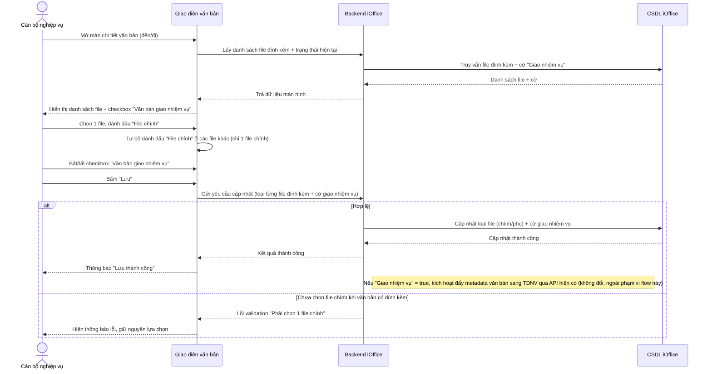
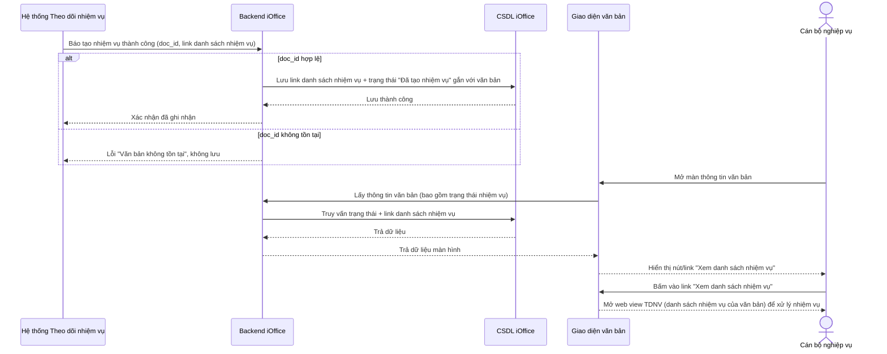
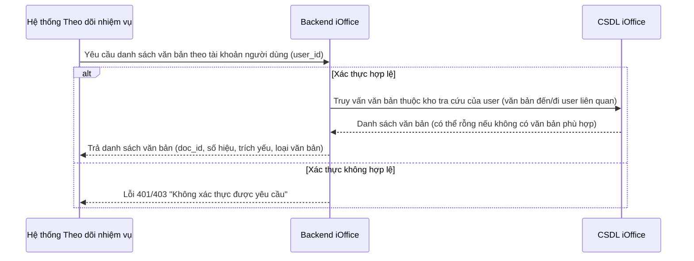
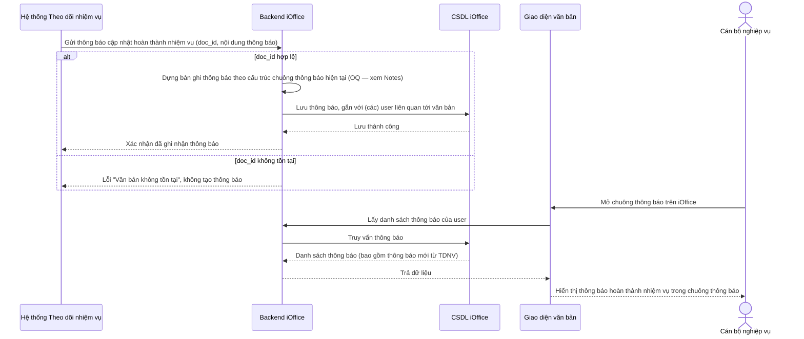
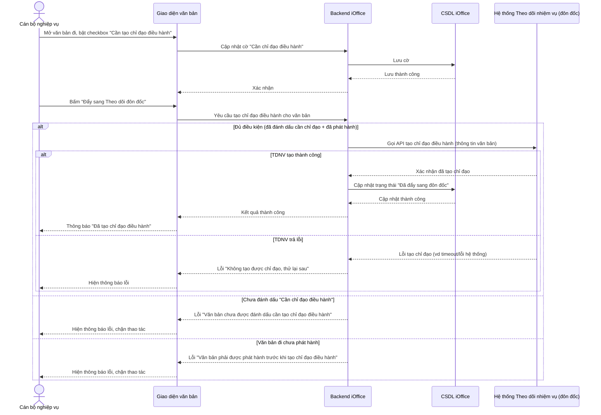

# Tích hợp iOffice – TDNV — Flows

## Flow: Cập nhật thuộc tính văn bản (file chính/phụ + giao nhiệm vụ)
**Trigger**: Cán bộ nghiệp vụ mở màn chi tiết văn bản (đến/đi) để đánh dấu file chính/phụ và bật/tắt cờ giao nhiệm vụ.
**Related UC**: TBD — chưa có use case
**Related FR**: TBD — chưa chạy `/srs`

## Flow: TDNV callback báo tạo nhiệm vụ thành công
**Trigger**: TDNV đã nhận metadata văn bản qua API hiện có (không đổi) và tạo xong các nhiệm vụ tương ứng với văn bản đó.
**Related UC**: TBD — chưa có use case
**Related FR**: TBD — chưa chạy `/srs`

## Flow: TDNV tra cứu danh sách văn bản theo tài khoản người dùng
**Trigger**: Người dùng trên TDNV đang cập nhật nhiệm vụ, cần chọn văn bản gắn với nhiệm vụ đó.
**Related UC**: TBD — chưa có use case
**Related FR**: TBD — chưa chạy `/srs`

## Flow: TDNV gửi thông báo cập nhật hoàn thành nhiệm vụ
**Trigger**: Nhiệm vụ liên quan tới văn bản được cập nhật hoàn thành trên TDNV.
**Related UC**: TBD — chưa có use case
**Related FR**: TBD — chưa chạy `/srs`

## Flow: Đẩy văn bản đi sang Theo dõi đôn đốc (tạo chỉ đạo điều hành)
**Trigger**: Cán bộ nghiệp vụ bấm "Đẩy sang Theo dõi đôn đốc" trên văn bản đi.
**Related UC**: TBD — chưa có use case
**Related FR**: TBD — chưa chạy `/srs`

## Notes

- **TDNV gộp cả module đôn đốc** — theo xác nhận, "Theo dõi đôn đốc" là cùng hệ thống TDNV (không tách participant riêng), nên flow "Đẩy sang Theo dõi đôn đốc" vẫn gọi participant `TDNV`.
- **Flow đẩy metadata sang TDNV khi tạo nhiệm vụ giữ nguyên hiện trạng** — không vẽ lại trong file này (theo yêu cầu); chỉ tham chiếu làm trigger cho *TDNV callback báo tạo nhiệm vụ thành công*.
- **OQ — cấu trúc thông báo trên chuông thông báo**: chưa xác nhận field cụ thể (tiêu đề/nội dung/loại/link...) khi TDNV gửi thông báo hoàn thành nhiệm vụ sang. Cần bổ sung khi có thông tin cấu trúc thông báo hiện tại của iOffice, rồi cập nhật lại flow *TDNV gửi thông báo cập nhật hoàn thành nhiệm vụ*.
- **Giả định — "File chính" bắt buộc chọn** khi văn bản có đính kèm (flow *Cập nhật thuộc tính văn bản*). Nếu nghiệp vụ thực tế cho phép không chọn file chính, cần sửa lại nhánh lỗi tương ứng.
- **Điều kiện phát hành trước khi tạo chỉ đạo** — validate tại thời điểm bấm nút "Đẩy sang Theo dõi đôn đốc" (theo xác nhận), không phải bước workflow trung gian riêng.
