# NỘI DUNG

## ĐẶC TẢ YÊU CẦU CHỨC NĂNG HỆ THỐNG

### PHÂN HỆ: Quản lý văn bản (Mobile App)

#### Module 1: Lấy ý kiến

##### Mô tả tóm tắt

Module cho phép Lãnh đạo/Chuyên viên phụ trách văn bản (Người xin ý kiến) gửi văn bản đi đã ban hành và được đánh dấu "VB có lấy ý kiến" tới các cá nhân liên quan (Người được xin ý kiến) để thu thập ý kiến trước khi hoàn tất, đồng thời cho phép Người được xin ý kiến xem và phản hồi ý kiến trực tiếp trên VNPT iOffice Mobile App. Module tương ứng chức năng "Lấy ý kiến" đã triển khai trên VNPT iOffice Web V5 (UBND Tỉnh Phú Yên), được rút gọn phù hợp với app (không có màn hình soạn thảo văn bản đi).

##### Bảng thuật ngữ & Actor tham gia

**Từ viết tắt & thuật ngữ**

| Từ viết tắt / Thuật ngữ | Giải thích |
|---|---|
| VB có lấy ý kiến | Trường đánh dấu trên văn bản đi (được thiết lập từ web khi soạn thảo) cho biết văn bản có cần thu thập ý kiến trước khi phát hành/hoàn tất hay không |
| Người xin ý kiến | Người tạo văn bản đi (hoặc người được chọn là Người soạn thảo), thực hiện gửi yêu cầu lấy ý kiến |
| Người được xin ý kiến | Cá nhân được chọn để cho ý kiến về nội dung văn bản |

**Actor tham gia**

| Actor | Vai trò / Mô tả trong phạm vi module này |
|---|---|
| Người xin ý kiến | Xem danh sách văn bản đi cần lấy ý kiến, gửi yêu cầu xin ý kiến, gia hạn hạn xử lý, xem tổng hợp ý kiến, kết thúc lấy ý kiến, xuất báo cáo tổng hợp ý kiến |
| Người được xin ý kiến | Xem danh sách văn bản cần cho ý kiến, nhập và gửi ý kiến (kèm ký số file đính kèm nếu cần), kết thúc cho ý kiến |
| Văn thư | Cá nhân được cấp quyền `QUYEN_LAY_Y_KIEN`, có thể được chọn làm Người xin ý kiến/Người được xin ý kiến như mọi cá nhân khác trong đơn vị — không có nghiệp vụ riêng biệt trong module này |

##### Phạm vi chỉnh sửa

- Bổ sung 2 menu mới vào nhóm "Văn bản đi" trên app:
  - "Văn bản đi cần lấy ý kiến" — key menu `DI_LAY_Y_KIEN`
  - "Văn bản cần cho ý kiến" — key menu `DI_CHO_Y_KIEN`
  - Cả 2 menu cấu hình hiển thị qua tham số `QLVB_APP_CONFIG_VIEW_MENU` hiện có của app (bổ sung 2 key mới vào danh sách giá trị hợp lệ)
- Chỉnh sửa màn hình "Chi tiết văn bản" (dùng chung cho văn bản đi, đã có sẵn trên app) — bổ sung hiển thị trường "VB có lấy ý kiến" (chi tiết tại Chức năng 6)
- Không chỉnh sửa màn hình soạn thảo/tạo mới văn bản đi — ngoài phạm vi vì app hiện không có màn hình này (checkbox "VB có lấy ý kiến" chỉ được thiết lập trên web)

##### Yêu cầu giao diện

- Hình ảnh / mockup (mobile — nguồn: thư mục ảnh do người dùng cung cấp, đã copy vào `images/`):

  - Chức năng 1 — Danh sách "Văn bản đi cần lấy ý kiến": 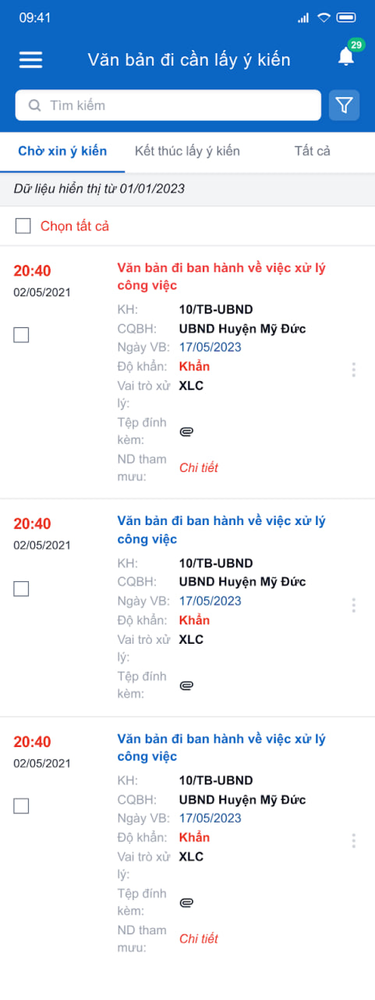
  - Chức năng 2 — Màn hình xem nhanh văn bản (kèm nút Lấy ý kiến/Kết thúc lấy ý kiến): 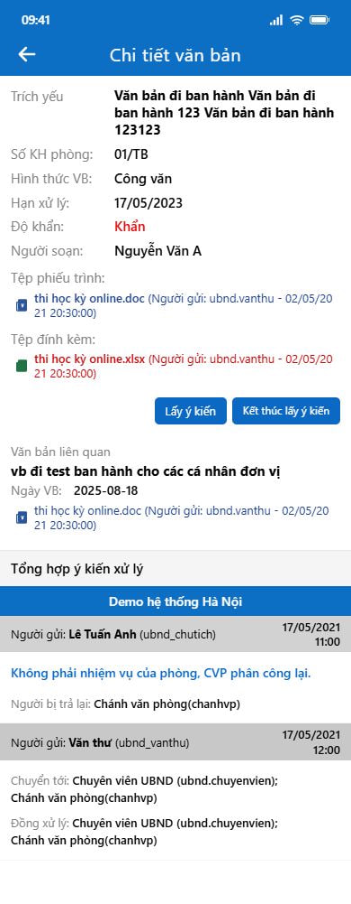
  - Chức năng 2 — Màn hình Xin ý kiến: 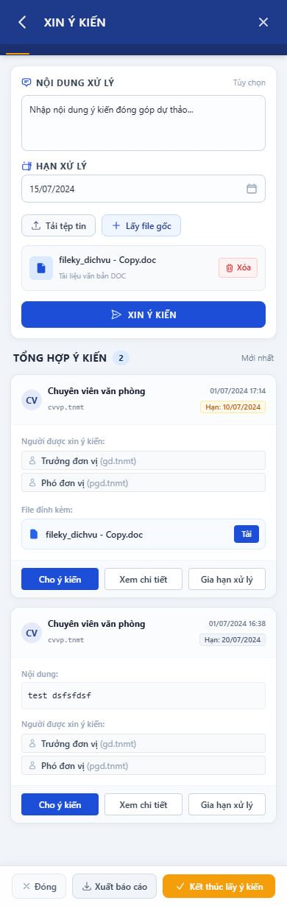
  - Chức năng 2 — Màn hình Chọn người xin ý kiến: 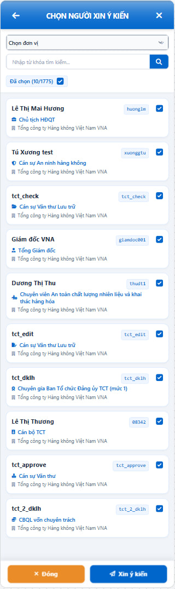
  - Chức năng 2 — Popup Gia hạn hạn xử lý: 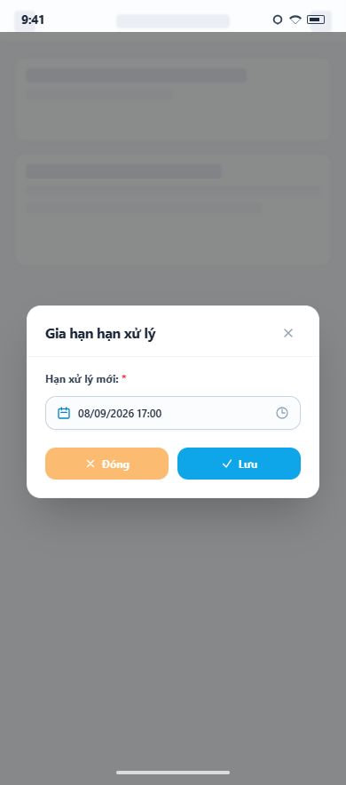
  - Chức năng 2 — Màn hình Chi tiết cho ý kiến (xem lại các ý kiến đã nhận): 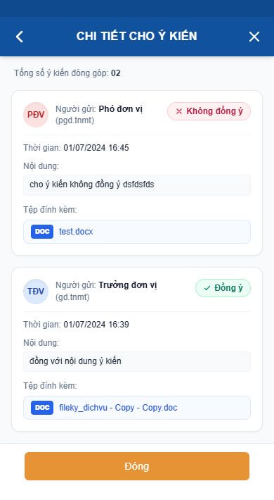
  - Chức năng 4 — Danh sách "Văn bản cần cho ý kiến": 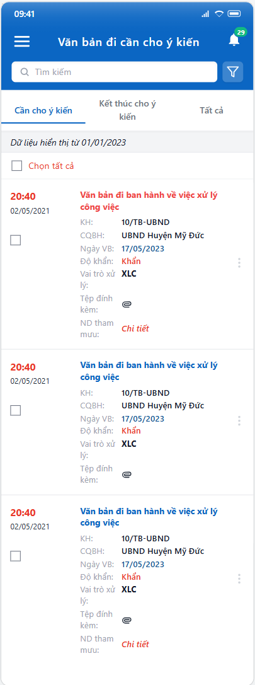
    > Lưu ý: ảnh mockup được cung cấp cho màn này trùng nội dung với ảnh danh sách "Văn bản đi cần lấy ý kiến" ở trên (khả năng trùng khi xuất ảnh demo) — bố cục/loại control áp dụng tương tự, riêng tiêu đề màn hình và tab trạng thái đổi đúng theo nghiệp vụ "cho ý kiến" như mô tả trong bảng field bên dưới.
  - Chức năng 5 — Màn hình xem nhanh văn bản (kèm nút Cho ý kiến/Kết thúc cho ý kiến): 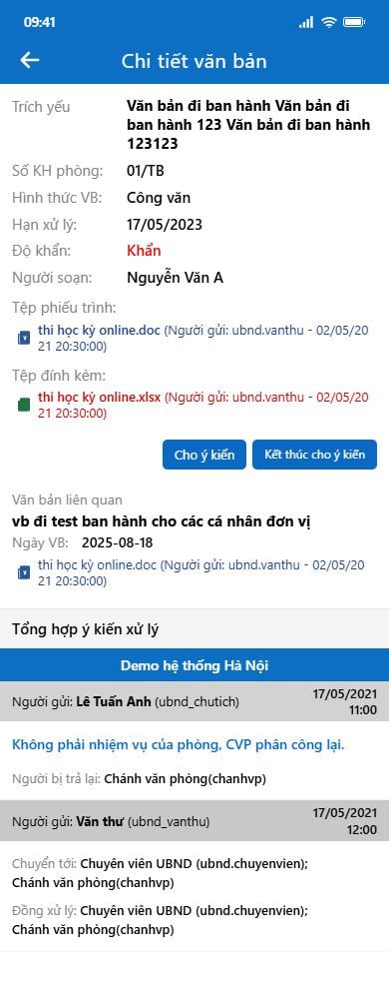
  - Chức năng 5 — Màn hình Cho ý kiến: 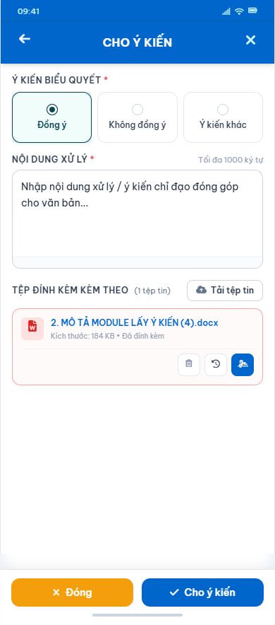

- Bảng mô tả các trường thông tin trên giao diện:

> Với 2 màn hình Danh sách và màn hình Xem nhanh văn bản (quick-view khi bấm vào 1 văn bản trong danh sách): các trường thông tin văn bản (Trích yếu, KH, CQBH, Ngày VB, Độ khẩn, Vai trò xử lý, Tệp đính kèm, ND tham mưu, Tệp phiếu trình, Văn bản liên quan, Log xử lý...) **giữ nguyên theo đúng nghiệp vụ màn hình danh sách/xem nhanh văn bản đi hiện có của app** (`IOFFICE_SRS_APP_1.0.docx`, mục Văn bản đi) — không mô tả lại ở đây. Bảng dưới đây **chỉ liệt kê phần bổ sung riêng cho module Lấy ý kiến**.

| Tên trường thông tin | Kiểu điều khiển | Độ dài | Ràng buộc / Điều kiện | Kiểu dữ liệu |
|---|---|---|---|---|
| **Danh sách "Văn bản đi cần lấy ý kiến" — phần bổ sung** | | | | |
| Tab trạng thái | Tab | - | 3 tab: "Chờ xin ý kiến" (mặc định) / "Kết thúc lấy ý kiến" / "Tất cả" | - |
| Badge số đếm trên menu | Label | - | Đếm số bản ghi trạng thái "Chờ xin ý kiến" theo tham số `CONFIG_COUNT_LAYYKIEN_MOBILE` (1: đếm tất cả, 0: đếm chưa xem) | Number |
| Checkbox chọn dòng + "Chọn tất cả" | Checkbox | - | Dùng chung cơ chế chọn nhiều bản ghi để xử lý hàng loạt đã có của app (vd Kết thúc hàng loạt, APP_QLVB_II.7.11) — không định nghĩa lại nghiệp vụ ở đây | - |
| **Danh sách "Văn bản cần cho ý kiến" — phần bổ sung** | | | | |
| Tab trạng thái | Tab | - | 3 tab: "Cần cho ý kiến" (mặc định) / "Kết thúc cho ý kiến" / "Tất cả" | - |
| Badge số đếm trên menu | Label | - | Đếm số bản ghi trạng thái "Cần cho ý kiến" theo tham số `CONFIG_COUNT_CHOYKIEN_MOBILE` (1: đếm tất cả, 0: đếm chưa xem) | Number |
| **Màn hình xem nhanh văn bản (quick-view) — phần bổ sung** | | | | |
| Nút [Lấy ý kiến] | Button | - | Chỉ hiển thị khi mở từ danh sách "Văn bản đi cần lấy ý kiến" và văn bản ở trạng thái "Chờ xin ý kiến". Chi tiết Chức năng 2 | - |
| Nút [Kết thúc lấy ý kiến] | Button | - | Chỉ hiển thị khi mở từ danh sách "Văn bản đi cần lấy ý kiến" và văn bản chưa kết thúc lấy ý kiến. Chi tiết Chức năng 2 | - |
| Nút [Cho ý kiến] | Button | - | Chỉ hiển thị khi mở từ danh sách "Văn bản cần cho ý kiến" và trạng thái người dùng = "Cần cho ý kiến". Chi tiết Chức năng 5 | - |
| Nút [Kết thúc cho ý kiến] | Button | - | Chỉ hiển thị khi mở từ danh sách "Văn bản cần cho ý kiến" và trạng thái người dùng = "Cần cho ý kiến". Chi tiết Chức năng 5 | - |
| **Màn hình Xin ý kiến** (tiêu đề trên app: "XIN Ý KIẾN") | | | | |
| Textarea Nội dung xử lý | Textarea | Tối đa 2000 ký tự | Nhãn "Tùy chọn". Không bắt buộc nhập. Placeholder "Nhập nội dung ý kiến đóng góp dự thảo..." | String |
| Hạn xử lý | DateTimePicker | - | Chọn từ lịch, định dạng dd/mm/yyyy. Không bắt buộc nhập | Date |
| Nút [Tải tệp tin] | Button | - | Chọn file từ thiết bị. Định dạng/dung lượng theo quy định chung của hệ thống với file văn bản | - |
| Nút [+ Lấy file gốc] | Button | - | Lấy toàn bộ file ở mục file phiếu trình/trình ký, file đính kèm, file phát hành của văn bản đang xin ý kiến, đính kèm vào danh sách tệp | - |
| Danh sách tệp đã chọn | List | - | Mỗi dòng: tên file + loại file, nút [Xóa] để bỏ khỏi danh sách | - |
| Nút [XIN Ý KIẾN] | Button | - | Chỉ hiển thị khi văn bản đang ở trạng thái "Chờ xin ý kiến". Chuyển sang màn hình Chọn người xin ý kiến | - |
| Khối "TỔNG HỢP Ý KIẾN (n)" | List (card) | - | n = tổng số lần đã xin ý kiến, sắp xếp mới nhất lên đầu. Mỗi thẻ gồm: avatar + Họ tên + tài khoản Người xin ý kiến, thời gian gửi, tag "Hạn: dd/mm/yyyy", Nội dung (nếu có nhập), danh sách "Người được xin ý kiến", danh sách File đính kèm kèm nút [Tải] | - |
| Nút [Cho ý kiến] (trong mỗi thẻ) | Button | - | Chỉ actionable với Người được xin ý kiến của đúng thẻ đó, khi trạng thái = "Cần cho ý kiến" và chưa Kết thúc. Chi tiết Chức năng 5 | - |
| Nút [Xem chi tiết] (trong mỗi thẻ) | Button | - | Mở màn hình "Chi tiết cho ý kiến" của đúng lần xin ý kiến đó | - |
| Nút [Gia hạn xử lý] (trong mỗi thẻ) | Button | - | Chỉ hiển thị với Người xin ý kiến, khi văn bản ở trạng thái "Chờ xin ý kiến". Mở popup Gia hạn hạn xử lý | - |
| Thanh dưới cùng — Nút [Đóng] | Button | - | Đóng màn hình, quay về màn trước | - |
| Thanh dưới cùng — Nút [Xuất báo cáo] | Button | - | Chi tiết Chức năng 3 | - |
| Thanh dưới cùng — Nút [Kết thúc lấy ý kiến] | Button | - | Chỉ hiển thị với Người xin ý kiến và khi văn bản chưa kết thúc lấy ý kiến | - |
| **Popup Gia hạn hạn xử lý** | | | | |
| Hạn xử lý mới | DateTimePicker | - | Bắt buộc nhập (đánh dấu `*`). Định dạng dd/mm/yyyy hh:mm. Hạn xử lý >= thời điểm hiện tại | Date |
| Nút [Lưu] | Button | - | Cập nhật hạn xử lý tại thẻ đang xử lý | - |
| Nút [Đóng] | Button | - | Đóng popup, không xử lý gì | - |
| **Màn hình Chi tiết cho ý kiến** | | | | |
| "Tổng số ý kiến đóng góp: n" | Label | - | n = tổng số ý kiến hiển thị được ở màn hình này (theo đúng phân quyền xem — xem BR-04 Chức năng 2) | Number |
| Danh sách ý kiến (card) | List (card) | - | Mỗi thẻ gồm: avatar + Họ tên + tài khoản Người gửi, tag trạng thái (✓ "Đồng ý" xanh / ✕ "Không đồng ý" đỏ / "Ý kiến khác"), Thời gian (dd/mm/yyyy hh:mm), Nội dung, Tệp đính kèm. Sắp xếp thời gian mới nhất lên đầu | - |
| Nút [Đóng] | Button | - | Đóng màn hình, quay về màn hình Xin ý kiến | - |
| **Popup Chọn người xin ý kiến** (tiêu đề: "CHỌN NGƯỜI XIN Ý KIẾN") | | | | |
| Combobox Chọn đơn vị | Combobox | - | Lọc danh sách người dùng theo đơn vị đã chọn. Không bắt buộc chọn (mặc định toàn bộ phạm vi được phép) | Data list |
| Ô tìm kiếm + nút Tìm kiếm | Textbox + Button | - | Tìm theo họ tên/tài khoản chứa từ khóa | String |
| Nhãn "Đã chọn (x/y)" + checkbox chọn tất cả | Label + Checkbox | - | x = số đang chọn, y = tổng số người trong danh sách hiện tại (theo bộ lọc đơn vị + tìm kiếm). Checkbox cho phép chọn/bỏ chọn toàn bộ danh sách đang hiển thị | - |
| Danh sách người dùng | List + Checkbox | - | Hiển thị cá nhân có quyền `QUYEN_LAY_Y_KIEN` trong phạm vi đơn vị đã lọc. Mỗi dòng: Họ và tên, Tên tài khoản, Chức danh, Đơn vị. Mặc định check chọn tất cả. Sắp xếp theo chức danh tăng dần, cùng chức danh thì theo tên ABC | Data list |
| Nút [Xin ý kiến] | Button | - | Gửi yêu cầu tới các cá nhân đã tích chọn | - |
| Nút [Đóng] | Button | - | Đóng màn hình, không xử lý gì | - |
| **Màn hình Cho ý kiến** (tiêu đề: "CHO Ý KIẾN") | | | | |
| "Ý KIẾN BIỂU QUYẾT" | Radio | - | Bắt buộc chọn (đánh dấu `*`). 3 lựa chọn: Đồng ý / Không đồng ý / Ý kiến khác. Mặc định không chọn | - |
| "NỘI DUNG XỬ LÝ" | Textarea | Tối đa 1000 ký tự | Bắt buộc nhập (đánh dấu `*`). Placeholder "Nhập nội dung xử lý / ý kiến chỉ đạo đóng góp cho văn bản..." | String |
| "TỆP ĐÍNH KÈM KÈM THEO (n)" + nút [Tải tệp tin] | Upload | - | Không bắt buộc. n = số tệp đã đính kèm. Định dạng/dung lượng theo quy định chung của hệ thống với file văn bản | - |
| Mỗi dòng tệp — icon [Xóa] | Button | - | Bỏ tệp khỏi danh sách đính kèm | - |
| Mỗi dòng tệp — icon [Lịch sử] | Button | - | Xem lịch sử version chỉnh sửa của tệp — dùng chung chức năng Lịch sử file hiện có của app | - |
| Mỗi dòng tệp — icon [Ký số] | Button | - | Mở giao diện ký số theo hình thức đã cấu hình ở Thông tin cá nhân (Token/SmartCA/PKI/VGCA) — dùng chung cơ chế Ký số văn bản hiện có của app | - |
| Nút [Đóng] | Button | - | Đóng màn hình, không gửi | - |
| Nút [Cho ý kiến] | Button | - | Gửi ý kiến, chi tiết Chức năng 5 | - |
| **Chi tiết văn bản đi (bổ sung — Chức năng 6)** | | | | |
| VB có lấy ý kiến | Label | - | Read-only. Giá trị "Có" nếu văn bản được đánh dấu từ web, "Không" nếu chưa đánh dấu hoặc tạo trước khi có tính năng này | String |

##### Chức năng 1: Xem danh sách và tìm kiếm "Văn bản đi cần lấy ý kiến"

###### Chức năng nghiệp vụ

**① Luồng xử lý thành công**

Người xin ý kiến mở menu "Văn bản đi cần lấy ý kiến", hệ thống thực hiện:
- Lấy danh sách văn bản đi đã ban hành, có Người tạo (hoặc Người soạn thảo được chọn trên văn bản) = người đăng nhập và được đánh dấu "VB có lấy ý kiến" = Có
- Mặc định chọn tab "Chờ xin ý kiến", sắp xếp theo Ngày ban hành giảm dần
- Đếm số bản ghi trạng thái "Chờ xin ý kiến" hiển thị lên badge menu theo tham số `CONFIG_COUNT_LAYYKIEN_MOBILE`
- Các trường thông tin hiển thị trên mỗi dòng (Trích yếu, KH, CQBH, Ngày VB, Độ khẩn, Vai trò xử lý, Tệp đính kèm, ND tham mưu...) giữ nguyên theo nghiệp vụ màn hình danh sách văn bản đi hiện có của app

Bước 2: Người xin ý kiến chuyển tab trạng thái ("Chờ xin ý kiến" / "Kết thúc lấy ý kiến" / "Tất cả"), hệ thống thực hiện:
- Lọc lại danh sách theo đúng trạng thái của tab đang chọn (→ BR-03)

Bước 3: Người xin ý kiến tìm kiếm bằng ô tìm kiếm/bộ lọc, hệ thống thực hiện:
- Áp dụng đúng cơ chế tìm kiếm/lọc chung của danh sách văn bản đi hiện có của app — không định nghĩa lại ở tài liệu này

Bước 4: Người xin ý kiến nhấn vào 1 văn bản trong danh sách, hệ thống thực hiện:
- Hiển thị màn hình xem nhanh thông tin văn bản đi (dùng chung màn hình xem nhanh hiện có của app), bổ sung hiển thị các nút chức năng [Lấy ý kiến], [Kết thúc lấy ý kiến] (xem bảng field mục Yêu cầu giao diện)

**② Luồng xử lý ngoại lệ**

| Mã | Tình huống | Xử lý |
|----|-----------|-------|
| EX-01 | Mất kết nối/API timeout khi tải danh sách | Hiển thị thông báo lỗi kết nối, cho phép kéo để tải lại (pull-to-refresh) |

**③ Quy tắc nghiệp vụ**

- BR-01: Trigger: Mở màn hình danh sách → Logic: điều kiện lọc = Văn bản đi đã ban hành AND (Người tạo = người đăng nhập OR Người soạn thảo = người đăng nhập) AND VB có lấy ý kiến = Có → Output: hiển thị đúng tập văn bản của người đăng nhập
- BR-02: Trigger: Tính số đếm badge menu → Logic: đếm bản ghi trạng thái "Chờ xin ý kiến" theo cấu hình `CONFIG_COUNT_LAYYKIEN_MOBILE` (1: đếm tất cả, 0: đếm chưa xem) → Output: số hiển thị trên badge menu
- BR-03: Trigger: Chọn tab trạng thái → Logic: "Chờ xin ý kiến" = văn bản chưa kết thúc lấy ý kiến; "Kết thúc lấy ý kiến" = văn bản đã kết thúc; "Tất cả" = bỏ qua điều kiện lọc trạng thái → Output: danh sách đúng theo tab đang chọn

###### Thông báo và thông tin lưu vết log

Không phát sinh thông báo/log riêng ở chức năng xem danh sách.

###### Edge cases

- Danh sách rỗng (chưa có văn bản nào được đánh dấu lấy ý kiến) → hiển thị "Không có dữ liệu"
- Tìm kiếm không có kết quả khớp bộ lọc

##### Chức năng 2: Lấy ý kiến

###### Quy trình

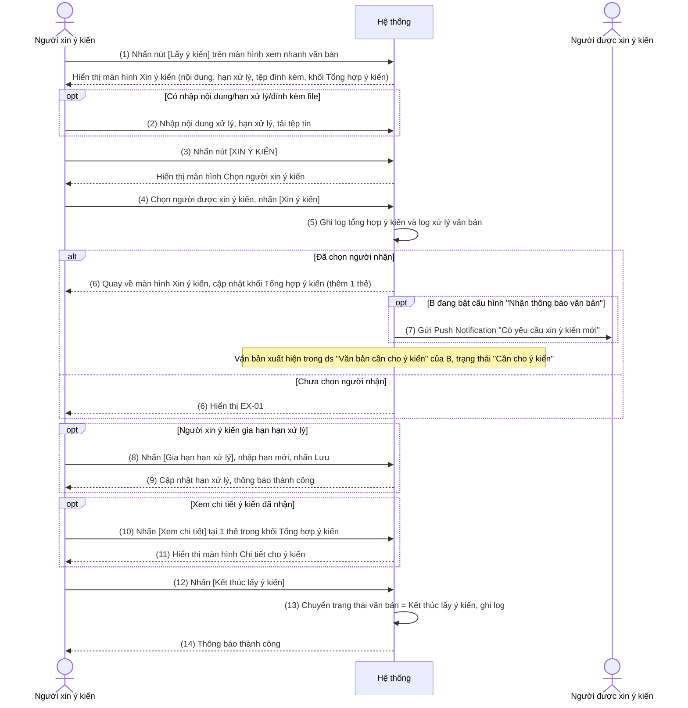

###### Chức năng nghiệp vụ

**① Luồng xử lý thành công**

Bước 1: Người xin ý kiến nhấn nút [Lấy ý kiến] trên màn hình xem nhanh văn bản, hệ thống thực hiện:
- Hiển thị màn hình Xin ý kiến gồm: nội dung xử lý, hạn xử lý, tệp đính kèm, khối "Tổng hợp ý kiến"
- Hiển thị nút [XIN Ý KIẾN] nếu văn bản đang ở trạng thái "Chờ xin ý kiến" (→ BR-01)

Bước 2: Người xin ý kiến nhập nội dung xử lý/hạn xử lý và tải tệp tin đính kèm (không bắt buộc), hệ thống thực hiện:
- Validate nội dung xử lý tối đa 2000 ký tự
- Validate định dạng/dung lượng file theo quy định chung của hệ thống với file văn bản
- Cho phép nhấn [+ Lấy file gốc] để tự động đính kèm toàn bộ file phiếu trình/trình ký, file đính kèm, file phát hành của văn bản đang xin ý kiến (→ BR-02)

Bước 3: Người xin ý kiến nhấn nút [XIN Ý KIẾN], hệ thống thực hiện:
- Hiển thị màn hình Chọn người xin ý kiến, mặc định check chọn tất cả cá nhân đang có trên danh sách hiện tại (theo bộ lọc đơn vị/tìm kiếm)

Bước 4: Người xin ý kiến chọn đơn vị/tìm kiếm để tùy chỉnh danh sách người nhận và nhấn [Xin ý kiến], hệ thống thực hiện:
- Kiểm tra đã chọn người nhận chưa (→ EX-01)
- Thêm 1 thẻ mới vào khối "Tổng hợp ý kiến" (thời gian, người gửi, nội dung, hạn xử lý, danh sách người được xin ý kiến, file đính kèm)
- Ghi 1 dòng log vào log xử lý của văn bản
- Chuyển trạng thái văn bản với từng người được xin ý kiến = "Cần cho ý kiến"
- Gửi Push Notification cho từng người được xin ý kiến (→ BR-05)
- Quay về màn hình Xin ý kiến, cập nhật lại khối "Tổng hợp ý kiến"

Bước 5: Người xin ý kiến nhấn nút [Gia hạn xử lý] trên 1 thẻ (→ BR-03), hệ thống thực hiện:
- Hiển thị popup "Gia hạn hạn xử lý" với ô nhập hạn xử lý mới
- Validate bắt buộc nhập, hạn xử lý >= thời điểm hiện tại (→ EX-02, EX-03)
- Cập nhật hạn xử lý tại thẻ đang xử lý, đóng popup, thông báo thành công

Bước 6: Người dùng nhấn nút [Xem chi tiết] tại 1 thẻ trong khối "Tổng hợp ý kiến", hệ thống thực hiện:
- Mở màn hình Chi tiết cho ý kiến, hiển thị "Tổng số ý kiến đóng góp: n"
- Với Người xin ý kiến: n = toàn bộ ý kiến đã cho của tất cả Người được xin ý kiến ở lần xin ý kiến đó (→ BR-04)
- Với Người được xin ý kiến: n = chỉ ý kiến của chính họ, không thấy ý kiến người khác (→ BR-04)
- Mỗi ý kiến hiển thị dạng thẻ kèm tag trạng thái (Đồng ý/Không đồng ý/Ý kiến khác), sắp xếp theo thời gian cho ý kiến mới nhất lên đầu

Bước 7: Người xin ý kiến nhấn nút [Kết thúc lấy ý kiến] (chỉ hiển thị khi văn bản chưa kết thúc lấy ý kiến), hệ thống thực hiện:
- Chuyển trạng thái văn bản sang "Kết thúc lấy ý kiến"
- Ghi 1 dòng log vào log xử lý của văn bản
- Với Người được xin ý kiến chưa cho ý kiến: tự động cập nhật trạng thái của họ = "Kết thúc cho ý kiến"
- Thông báo thành công

**② Luồng xử lý ngoại lệ**

| Mã | Tình huống | Xử lý |
|----|-----------|-------|
| EX-01 | Nhấn [Xin ý kiến] nhưng chưa chọn Người được xin ý kiến | Hiển thị cảnh báo "Chưa chọn đơn vị/cá nhân nhận theo nhóm", không gửi yêu cầu |
| EX-02 | Gia hạn hạn xử lý nhưng để trống | Hiển thị cảnh báo bắt buộc nhập, không lưu |
| EX-03 | Gia hạn hạn xử lý nhập hạn < ngày hiện tại | Hiển thị cảnh báo "Hạn xử lý phải lớn hơn hoặc bằng ngày hiện tại", không lưu |
| EX-04 | Mất kết nối/API timeout khi xin ý kiến, gia hạn hoặc kết thúc | Hiển thị thông báo lỗi kết nối, không thay đổi trạng thái văn bản |

**③ Quy tắc nghiệp vụ**

- BR-01: Trigger: Mở màn hình Lấy ý kiến → Logic: điều kiện hiển thị nút [Xin ý kiến] = văn bản đang có trạng thái "Chờ xin ý kiến" → Output: chỉ hiển thị nút khi thỏa điều kiện
- BR-02: Trigger: Nhấn [Lấy file gốc] → Logic: lấy toàn bộ file ở mục file phiếu trình/trình ký, file đính kèm, file phát hành của văn bản đang xin ý kiến → Output: đính kèm vào tệp đính kèm của yêu cầu xin ý kiến
- BR-03: Trigger: Hiển thị nút [Gia hạn hạn xử lý] → Logic: chỉ hiển thị với Người xin ý kiến, không hiển thị với Người được xin ý kiến, và chỉ khi văn bản ở trạng thái "Chờ xin ý kiến" → Output: ẩn/hiện nút theo đúng vai trò
- BR-04: Trigger: Hiển thị nút [Cho ý kiến] trong thẻ / phân quyền xem màn hình Chi tiết cho ý kiến → Logic: nút [Cho ý kiến] chỉ actionable với Người được xin ý kiến của đúng thẻ đó khi trạng thái của họ = "Cần cho ý kiến" và chưa nhấn Kết thúc; màn hình Chi tiết cho ý kiến hiển thị toàn bộ ý kiến nếu người xem = Người xin ý kiến, chỉ hiển thị ý kiến của chính mình nếu người xem = Người được xin ý kiến → Output: điều kiện enable nút và phạm vi dữ liệu hiển thị đúng theo từng người dùng
- BR-05: Trigger: Gửi Push Notification khi xin ý kiến → Logic: chỉ gửi cho Người được xin ý kiến đang bật cấu hình "Nhận thông báo văn bản" tại Thông tin cá nhân trên app; người đã tắt cấu hình này sẽ không nhận Push Notification (nhưng văn bản vẫn xuất hiện bình thường trong danh sách "Văn bản cần cho ý kiến" khi họ tự mở app), nội dung theo mẫu "[Họ tên Người xin ý kiến] đã gửi yêu cầu xin ý kiến văn bản [Trích yếu văn bản]" → Output: đẩy Push Notification tới đúng tập thiết bị thỏa điều kiện

###### Thông báo và thông tin lưu vết log

**Thông báo hệ thống**

| Sự kiện kích hoạt | Người nhận | Kênh | Nội dung thông báo |
|------------------|-----------|------|-------------------|
| Xin ý kiến thành công | Người được xin ý kiến đang bật cấu hình "Nhận thông báo văn bản" (Thông tin cá nhân) | Push Notification | "[Họ tên Người xin ý kiến] đã gửi yêu cầu xin ý kiến văn bản [Trích yếu văn bản]" |
| Sắp đến hạn / quá hạn lấy ý kiến (tiến trình quét dùng chung với web, chạy 8h sáng hàng ngày, theo tham số `CONFIG_SO_NGAY_GUI_THONG_BAO_LAY_YKIEN`) | Người được xin ý kiến | SMS | Dùng chung nội dung/cú pháp tiến trình quét đã đặc tả trên web — không định nghĩa lại ở tài liệu app này |

**Log hệ thống (Audit Trail)**

Lưu lại log thao tác vào log xử lý văn bản và khối "Tổng hợp ý kiến" với các thông tin:
- Người thao tác (tài khoản đăng nhập + tài khoản switch nếu có)
- Thời gian (timestamp)
- Hành động (xin ý kiến / gia hạn / kết thúc lấy ý kiến)
- Dữ liệu trước và sau thay đổi (hạn xử lý, trạng thái)

###### Edge cases

- Người xin ý kiến thao tác gia hạn hạn xử lý đồng thời trên 2 thiết bị
- Mất kết nối giữa chừng khi đang tải tệp đính kèm dung lượng lớn
- Danh sách người được xin ý kiến quá dài (ví dụ hàng nghìn tài khoản), cần cuộn/tải thêm mượt khi tìm kiếm tại màn hình Chọn người xin ý kiến

##### Chức năng 3: Xuất báo cáo tổng hợp ý kiến

###### Chức năng nghiệp vụ

**① Luồng xử lý thành công**

Người xin ý kiến nhấn nút [Xuất báo cáo] (chỉ hiển thị với văn bản cần xin ý kiến và với Người xin ý kiến), hệ thống thực hiện:
- Gọi API xuất báo cáo dùng chung với web theo biểu mẫu Word có sẵn
- Với trường hợp có nhiều nội dung xin ý kiến (nhiều lần xin ý kiến), xuất mỗi nội dung xin ý kiến thành 1 báo cáo, nối tiếp theo thứ tự thời gian xin ý kiến tăng dần
- Tải file về thiết bị hoặc mở xem trực tiếp trên app

**② Luồng xử lý ngoại lệ**

| Mã | Tình huống | Xử lý |
|----|-----------|-------|
| EX-01 | Mất kết nối/API timeout khi xuất báo cáo | Hiển thị thông báo lỗi, không tạo file |

**③ Quy tắc nghiệp vụ**

- BR-01: Trigger: Tính tổng số người xin ý kiến trên báo cáo → Logic: dựa trên tổng số người mà Người xin ý kiến đã xin ý kiến cho 1 nội dung xin ý kiến (xin nhiều lần thì gộp theo số người, 1 người xin nhiều lần chỉ tính 1) → Output: số liệu "Tổng số người đã cho ý kiến / Tổng số người được xin ý kiến"
- BR-02: Trigger: Tính tỷ lệ đồng ý không kèm nội dung → Logic: đếm số người cho ý kiến "Đồng ý" và không nhập Nội dung xử lý (lấy theo lần cho ý kiến mới nhất nếu cho nhiều lần) / Tổng số người được xin ý kiến → Output: số liệu tương ứng trên báo cáo
- BR-03: Trigger: Tính tỷ lệ đồng ý kèm nội dung → Logic: đếm số người cho ý kiến "Đồng ý" và có nhập Nội dung xử lý (lấy theo lần cho ý kiến mới nhất) / Tổng số người được xin ý kiến → Output: số liệu tương ứng trên báo cáo
- BR-04: Trigger: Liệt kê danh sách ý kiến trên báo cáo → Logic: mỗi ý kiến của 1 người là 1 gạch đầu dòng, format "Ý kiến của [Họ tên]: [Đồng ý/Không đồng ý/Ý kiến khác] + [Nội dung xử lý]", lấy theo lần cho ý kiến gần nhất nếu cho nhiều lần → Output: danh sách ý kiến đầy đủ trên báo cáo
- BR-05: Trigger: Các nội dung khác trên báo cáo (Trích yếu, Nội dung xin ý kiến...) → Logic: lấy đúng dữ liệu tại thời điểm xuất báo cáo, các nội dung fix theo biểu mẫu cung cấp → Output: báo cáo đúng biểu mẫu chuẩn

###### Thông báo và thông tin lưu vết log

Không phát sinh thông báo/log riêng ở chức năng xuất báo cáo.

###### Edge cases

- Văn bản có số lượng nội dung xin ý kiến lớn → thời gian xuất báo cáo kéo dài, cần hiển thị trạng thái đang xử lý
- Thiết bị không đủ dung lượng lưu file tải về

##### Chức năng 4: Xem danh sách và tìm kiếm "Văn bản cần cho ý kiến"

###### Chức năng nghiệp vụ

**① Luồng xử lý thành công**

Người được xin ý kiến mở menu "Văn bản cần cho ý kiến", hệ thống thực hiện:
- Lấy danh sách văn bản được người khác xin ý kiến bằng chức năng Lấy ý kiến (mô tả tại Chức năng 2)
- Mặc định chọn tab "Cần cho ý kiến", sắp xếp theo Thời gian được xin ý kiến giảm dần (mới nhất lên đầu)
- Đếm số bản ghi trạng thái "Cần cho ý kiến" hiển thị lên badge menu theo tham số `CONFIG_COUNT_CHOYKIEN_MOBILE`
- Các trường thông tin hiển thị trên mỗi dòng giữ nguyên theo nghiệp vụ màn hình danh sách văn bản đi hiện có của app

Bước 2: Người được xin ý kiến chuyển tab trạng thái ("Cần cho ý kiến" / "Kết thúc cho ý kiến" / "Tất cả"), hệ thống thực hiện:
- Lọc lại danh sách theo đúng trạng thái của tab đang chọn (→ BR-03)

Bước 3: Người được xin ý kiến tìm kiếm bằng ô tìm kiếm/bộ lọc, hệ thống thực hiện:
- Áp dụng đúng cơ chế tìm kiếm/lọc chung của danh sách văn bản đi hiện có của app — không định nghĩa lại ở tài liệu này

Bước 4: Người được xin ý kiến nhấn vào 1 văn bản trong danh sách, hệ thống thực hiện:
- Hiển thị màn hình xem nhanh thông tin văn bản đi (dùng chung màn hình xem nhanh hiện có của app), bổ sung hiển thị các nút chức năng [Cho ý kiến], [Kết thúc cho ý kiến] (xem bảng field mục Yêu cầu giao diện)

**② Luồng xử lý ngoại lệ**

| Mã | Tình huống | Xử lý |
|----|-----------|-------|
| EX-01 | Mất kết nối/API timeout khi tải danh sách | Hiển thị thông báo lỗi kết nối, cho phép kéo để tải lại |

**③ Quy tắc nghiệp vụ**

- BR-01: Trigger: Mở màn hình danh sách → Logic: điều kiện lọc = văn bản mà người đăng nhập được người khác xin ý kiến (là 1 Người được xin ý kiến của văn bản đó) → Output: hiển thị đúng tập văn bản của người đăng nhập
- BR-02: Trigger: Tính số đếm badge menu → Logic: đếm bản ghi trạng thái "Cần cho ý kiến" theo cấu hình `CONFIG_COUNT_CHOYKIEN_MOBILE` (1: đếm tất cả, 0: đếm chưa xem) → Output: số hiển thị trên badge menu
- BR-03: Trigger: Chọn tab trạng thái → Logic: "Cần cho ý kiến" = trạng thái của người đăng nhập với văn bản đó chưa kết thúc; "Kết thúc cho ý kiến" = đã kết thúc; "Tất cả" = bỏ qua điều kiện lọc trạng thái → Output: danh sách đúng theo tab đang chọn

###### Thông báo và thông tin lưu vết log

Không phát sinh thông báo/log riêng ở chức năng xem danh sách.

###### Edge cases

- Danh sách rỗng (chưa được ai xin ý kiến) → hiển thị "Không có dữ liệu"
- Tìm kiếm không có kết quả khớp bộ lọc

##### Chức năng 5: Cho ý kiến

###### Quy trình

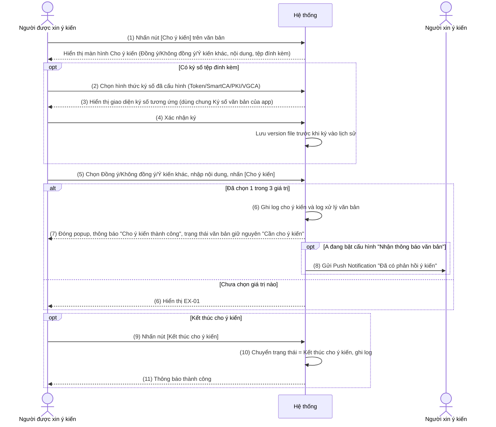

###### Chức năng nghiệp vụ

**① Luồng xử lý thành công**

Bước 1: Người được xin ý kiến nhấn nút [Cho ý kiến] trên màn hình xem nhanh văn bản (→ BR-01), hệ thống thực hiện:
- Hiển thị màn hình Cho ý kiến gồm: radio Ý kiến biểu quyết (Đồng ý/Không đồng ý/Ý kiến khác), nội dung xử lý, tệp đính kèm

Bước 2: Người được xin ý kiến thao tác trên tệp đính kèm (không bắt buộc) — xóa tệp, xem lịch sử version, hoặc ký số, hệ thống thực hiện:
- Ký số: hiển thị giao diện ký số theo đúng hình thức người dùng đã cấu hình ở Thông tin cá nhân (Token/SmartCA/PKI/VGCA) — áp dụng đúng cơ chế Ký số văn bản hiện có trên app (tìm vị trí ký theo tên hoặc theo thiết lập ký nháy, lưu version file trước khi ký vào lịch sử)
- Lịch sử: hiển thị các version đã lưu của tệp — dùng chung chức năng Lịch sử file hiện có của app
- Xóa: bỏ tệp khỏi danh sách đính kèm

Bước 3: Người được xin ý kiến chọn Đồng ý/Không đồng ý/Ý kiến khác, nhập nội dung và nhấn nút [Cho ý kiến], hệ thống thực hiện:
- Kiểm tra đã chọn 1 trong 3 giá trị chưa (→ EX-01)
- Kiểm tra đã nhập Nội dung xử lý chưa — bắt buộc nhập trên mobile (→ EX-02)
- Validate nội dung xử lý tối đa 1000 ký tự (→ EX-03)
- Ghi 1 dòng log vào bảng log cho ý kiến (thời gian, người gửi, nội dung, file)
- Ghi 1 dòng log vào log xử lý của văn bản
- Đóng popup cho ý kiến, quay về màn hình trước đó, hiển thị thông báo "Cho ý kiến thành công"
- Giữ nguyên trạng thái văn bản là "Cần cho ý kiến" (cho phép cho ý kiến lại nhiều lần cho tới khi kết thúc)
- Gửi Push Notification cho Người xin ý kiến (→ BR-03)

Bước 4: Người được xin ý kiến nhấn nút [Kết thúc cho ý kiến] (→ BR-02), hệ thống thực hiện:
- Chuyển trạng thái văn bản (với người đăng nhập) sang "Kết thúc cho ý kiến"
- Ghi 1 dòng log vào log xử lý của văn bản

**② Luồng xử lý ngoại lệ**

| Mã | Tình huống | Xử lý |
|----|-----------|-------|
| EX-01 | Không chọn Đồng ý/Không đồng ý/Ý kiến khác mà nhấn [Cho ý kiến] | Hiển thị cảnh báo bắt buộc chọn, không gửi |
| EX-02 | Để trống Nội dung xử lý mà nhấn [Cho ý kiến] | Hiển thị cảnh báo bắt buộc nhập, không gửi |
| EX-03 | Nhập Nội dung xử lý vượt quá 1000 ký tự | Hiển thị cảnh báo quá giới hạn ký tự, không gửi |
| EX-04 | Mất kết nối/API timeout khi cho ý kiến hoặc kết thúc | Hiển thị thông báo lỗi kết nối, không thay đổi trạng thái |

**③ Quy tắc nghiệp vụ**

- BR-01: Trigger: Hiển thị nút [Cho ý kiến] → Logic: chỉ hiển thị với Người được xin ý kiến, khi trạng thái của người đó = "Cần cho ý kiến" và chưa nhấn Kết thúc → Output: ẩn/hiện nút theo đúng điều kiện
- BR-02: Trigger: Hiển thị nút [Kết thúc cho ý kiến] → Logic: chỉ hiển thị khi trạng thái của người đăng nhập đang là "Cần cho ý kiến" → Output: ẩn/hiện nút theo đúng điều kiện
- BR-03: Trigger: Gửi Push Notification khi có ý kiến mới → Logic: chỉ gửi khi Người xin ý kiến đang bật cấu hình "Nhận thông báo văn bản" tại Thông tin cá nhân trên app; nếu đã tắt cấu hình thì không gửi (nhưng khối "Tổng hợp ý kiến" ở màn hình Xin ý kiến vẫn cập nhật bình thường khi họ tự mở lại), nội dung theo mẫu "[Họ tên Người được xin ý kiến] đã phản hồi ý kiến văn bản [Trích yếu văn bản]" → Output: đẩy Push Notification tới đúng thiết bị thỏa điều kiện

###### Thông báo và thông tin lưu vết log

**Thông báo hệ thống**

| Sự kiện kích hoạt | Người nhận | Kênh | Nội dung thông báo |
|------------------|-----------|------|-------------------|
| Cho ý kiến thành công | Người xin ý kiến đang bật cấu hình "Nhận thông báo văn bản" (Thông tin cá nhân) | Push Notification | "[Họ tên Người được xin ý kiến] đã phản hồi ý kiến văn bản [Trích yếu văn bản]" |

**Log hệ thống (Audit Trail)**

Lưu lại log thao tác vào bảng log cho ý kiến và bảng log xử lý văn bản với các thông tin:
- Người thao tác (tài khoản đăng nhập + tài khoản switch nếu có)
- Thời gian (timestamp)
- Hành động (cho ý kiến / kết thúc cho ý kiến)
- Dữ liệu trước và sau thay đổi (nội dung, file đính kèm)

###### Edge cases

- Ký số xong nhưng mất kết nối trước khi nhấn [Cho ý kiến] → cần giữ lại nội dung đã nhập/file đã ký để người dùng gửi lại, không bắt ký lại từ đầu
- Cho ý kiến nhiều lần liên tiếp trên cùng 1 văn bản
- File đính kèm vượt dung lượng cho phép

##### Chức năng 6: Bổ sung trường "VB có lấy ý kiến" trên màn hình Chi tiết văn bản đi

###### Chức năng nghiệp vụ

**① Luồng xử lý thành công**

Người dùng mở màn hình Chi tiết văn bản đi (màn hình dùng chung hiện có của app), hệ thống thực hiện:
- Hiển thị thêm trường "VB có lấy ý kiến" trong nhóm thông tin văn bản, lấy đúng giá trị đã được đánh dấu từ web
- Trường chỉ hiển thị (read-only), không cho phép chỉnh sửa trên app

**③ Quy tắc nghiệp vụ**

- BR-01: Trigger: Hiển thị trường "VB có lấy ý kiến" → Logic: có check chọn checkbox "VB có lấy ý kiến" ở web → "Có"; không check chọn (hoặc văn bản tạo trước khi có tính năng này) → "Không" → Output: hiển thị đúng giá trị tương ứng

###### Thông báo và thông tin lưu vết log

Không phát sinh thông báo/log riêng — trường thuộc thông tin hiển thị của văn bản, đã được ghi log khi xử lý trên web.

###### Edge cases

- Văn bản được tạo trước thời điểm tính năng "VB có lấy ý kiến" ra mắt trên web → mặc định hiển thị "Không"

---

## ĐIỀU KIỆN NGHIỆM THU HỆ THỐNG

Hệ thống được nghiệm thu khi thỏa các điều kiện sau:

- App vận hành đúng theo mô tả trong tài liệu này, đáp ứng toàn bộ các chức năng đã ghi nhận (FC-001 đến FC-006)
- Đồng bộ đúng dữ liệu và trạng thái với chức năng Lấy ý kiến/Cho ý kiến đã triển khai trên VNPT iOffice Web V5 (không phát sinh lệch trạng thái giữa web và app)
- Đã hiệu chỉnh sau khi triển khai thử nghiệm
- Đã tổ chức hướng dẫn sử dụng cho người dùng
- Bàn giao đầy đủ tài liệu và mã nguồn liên quan

---

# PHỤ LỤC

**Danh mục quyền/tham số bổ sung**

| Loại | Tên | Ý nghĩa |
|---|---|---|
| Quyền | `QUYEN_LAY_Y_KIEN` | Tái sử dụng quyền đã có trên web — cá nhân được cấp quyền này mới xuất hiện trong danh sách chọn người xin ý kiến |
| Menu key | `DI_LAY_Y_KIEN` | Menu "Văn bản đi cần lấy ý kiến", cấu hình qua `QLVB_APP_CONFIG_VIEW_MENU` |
| Menu key | `DI_CHO_Y_KIEN` | Menu "Văn bản cần cho ý kiến", cấu hình qua `QLVB_APP_CONFIG_VIEW_MENU` |
| Tham số đếm badge | `CONFIG_COUNT_LAYYKIEN_MOBILE` | 1: đếm tất cả bản ghi "Chờ xin ý kiến" / 0: chỉ đếm chưa xem |
| Tham số đếm badge | `CONFIG_COUNT_CHOYKIEN_MOBILE` | 1: đếm tất cả bản ghi "Cần cho ý kiến" / 0: chỉ đếm chưa xem |

**Tham chiếu**

- Nghiệp vụ gốc trên web: mục "II.3.3. Lấy ý kiến" đến "II.3.5. Cho ý kiến", tài liệu SRS_YCTD_PYN_12062024.docx (CR VNPT iOffice V5 UBND Tỉnh Phú Yên)
- Quy ước UI/tham số app dùng chung: tài liệu IOFFICE_SRS_APP_1.0.docx, mục "QUẢN LÝ VĂN BẢN" > "Văn bản đi" và "Các chức năng chung của xử lý văn bản" (Chi tiết văn bản, Đánh dấu/Hủy đánh dấu, Ký số văn bản)
- Mockup mobile: bộ 9 ảnh chụp màn hình thực tế do người dùng cung cấp (thư mục nguồn `C:\Users\USA\OneDrive\Documents\TQG_Lay y kien`), đã copy vào `images/` theo convention `<FC-ID>-<mô-tả-ngắn>.jpg`
