# Quản lý đăng ký xe (TKV) — User Flow: Đăng ký, Duyệt, Xác nhận tham gia và Xác nhận đi về

> Nguồn chia flow DUY NHẤT cho feature này. `/wireframe-ascii` và `/wireframe-html` đọc file này để biết flow nào gồm những màn nào — KHÔNG tự chia flow riêng.

## 1. User Flow (tổng)

> Phủ happy / error / edge cases. `[n]` = số màn hình đối chiếu Mục 2. Chia 3 block theo flow-slug.

### Flow: lap-phieu-dang-ky

```mermaid
flowchart TD
    s1["[1] Danh sách đăng ký xe"]
    s2["[2] Lập/Sửa phiếu đăng ký xe"]
    s3["[3] Popup chọn văn bản liên quan"]
    s4["[4] Popup chọn mẫu biểu mẫu"]
    s5["[5] Ký số SignServer<br/>form ký nâng cao"]
    s7["[7] Popup xác nhận xóa file"]
    s8["[8] Popup xác nhận gửi backdate"]
    s9["[9] Popup xác nhận rời form"]
    s10["[10] Chi tiết đăng ký xe"]
    s15["[15] Popup xác nhận hủy phiếu"]

    d_mau{"Số mẫu biểu mẫu<br/>đã upload?"}
    e_nomau["Báo chưa có mẫu,<br/>ở lại form"]
    d_gen{"Sinh file Word<br/>thành công?"}
    e_gen["Báo lỗi sinh file,<br/>không thêm file"]
    w_file["Thêm file Word vào<br/>Tệp tin đính kèm"]
    d_pos{"Tìm thấy vị trí ký<br/>theo họ tên người ký?"}
    d_sign{"SignServer trả kết quả?"}
    e_sign["Báo lỗi ký số,<br/>file giữ nguyên"]
    w_sign["File đã ký, khóa ký lại,<br/>lưu phiên bản mới"]
    d_dirty{"Có thay đổi<br/>chưa lưu?"}
    n_draft["Lưu nháp không kiểm tra,<br/>phiếu ở trạng thái Nháp"]
    w_edit["Lưu thay đổi, phiếu giữ nguyên<br/>người đang xử lý, thông báo<br/>người đang giữ phiếu"]
    d_val{"Kiểm tra khi<br/>Gửi đăng ký"}
    e_val["Báo lỗi: thiếu trường bắt buộc,<br/>đơn vị trùng hoặc bảng đơn vị trống,<br/>chưa chọn xe/lái xe backdate"]
    e_cap1["Báo chưa có người duyệt Cấp 1<br/>của đơn vị, liên hệ quản trị"]
    w_cho["Phiếu Chờ duyệt Cấp 1/N,<br/>thông báo người Cấp 1"]
    d_bd{"Xe hoặc lái xe<br/>trùng giờ phiếu khác?"}
    e_bd["Báo xe/lái xe bận<br/>trong khung giờ này"]
    w_done["Phiếu Đã cấp xe,<br/>SMS người đăng ký và lái xe"]
    d_huy{"Trạng thái phiếu<br/>lúc xác nhận hủy?"}
    w_huy1["Đã hủy,<br/>không thông báo"]
    w_huy2["Đã hủy, thông báo người<br/>đã và đang trong chuỗi duyệt"]
    e_stale["Báo phiếu đã thay đổi,<br/>tải lại danh sách"]

    s1 -->|"Đăng ký lịch mới"| s2
    s1 -->|"Xem chi tiết"| s10
    s10 -->|"Sửa phiếu: Nháp, Chờ duyệt, Từ chối"| s2
    s10 -->|"Hủy phiếu: người tạo phiếu, phiếu chưa Chờ cấp xe"| s15

    s2 -->|"Chọn văn bản liên quan"| s3
    s3 -->|"Chọn 1 văn bản hoặc đóng"| s2

    s2 -->|"Tạo biểu mẫu đăng ký xe"| d_mau
    d_mau -->|"0 mẫu"| e_nomau
    d_mau -->|"1 mẫu"| d_gen
    d_mau -->|"nhiều mẫu"| s4
    s4 -->|"Chọn mẫu"| d_gen
    s4 -->|"Đóng"| s2
    d_gen -->|"lỗi"| e_gen
    d_gen -->|"thành công"| w_file
    e_nomau -.->|"đóng thông báo"| s2
    e_gen -.->|"đóng thông báo"| s2
    w_file -->|"không tự lưu hay gửi"| s2

    s2 -->|"Ký số trên file đính kèm"| d_pos
    d_pos -->|"có"| d_sign
    d_pos -->|"không"| s5
    s5 -->|"Ký"| d_sign
    s5 -->|"Đóng form giữa chừng"| s2
    d_sign -->|"thành công"| w_sign
    d_sign -->|"lỗi hoặc quá thời gian"| e_sign
    w_sign -->|"về form"| s2
    e_sign -.->|"đóng thông báo"| s2

    s2 -->|"Xóa file"| s7
    s7 -->|"Đồng ý hoặc Không"| s2

    s2 -->|"Đóng hoặc Esc"| d_dirty
    d_dirty -->|"không"| s1
    d_dirty -->|"có"| s9
    s9 -->|"Lưu nháp rồi thoát"| n_draft
    s9 -->|"Thoát không lưu"| s1
    s9 -->|"Ở lại"| s2

    s2 -->|"Lưu khi phiếu Nháp"| n_draft
    s2 -->|"Lưu khi phiếu đang Chờ duyệt"| w_edit
    n_draft -->|"thông báo lưu nháp thành công"| s1
    w_edit -->|"về Chi tiết"| s10

    s2 -->|"Gửi đăng ký"| d_val
    d_val -->|"thiếu hoặc sai dữ liệu"| e_val
    d_val -->|"chưa có ai giữ quyền Cấp 1"| e_cap1
    d_val -->|"hợp lệ, không backdate"| w_cho
    d_val -->|"hợp lệ, có backdate"| s8
    e_val -.->|"sửa lại"| s2
    e_cap1 -.->|"đóng thông báo"| s2
    w_cho -->|"về Danh sách"| s1
    s8 -->|"Quay lại"| s2
    s8 -->|"Xác nhận"| d_bd
    d_bd -->|"trùng"| e_bd
    d_bd -->|"không trùng"| w_done
    e_bd -.->|"chọn lại"| s2
    w_done -->|"về Danh sách"| s1

    s15 -->|"Không"| s10
    s15 -->|"Xác nhận"| d_huy
    d_huy -->|"Nháp"| w_huy1
    d_huy -->|"Chờ duyệt hoặc Từ chối"| w_huy2
    d_huy -->|"phiếu đã bị xử lý trong lúc mở"| e_stale
    w_huy1 -->|"về Danh sách"| s1
    w_huy2 -->|"về Danh sách"| s1
    e_stale -.->|"tải lại"| s1

    classDef happy fill:#d4edda,stroke:#28a745
    classDef error fill:#f8d7da,stroke:#dc3545
    classDef edge fill:#fff3cd,stroke:#ffc107

    class s1,s2,s10,w_cho,n_draft,w_file,w_sign happy
    class e_nomau,e_gen,e_sign,e_val,e_cap1,e_bd,e_stale error
    class s3,s4,s5,s7,s8,s9,s15,w_edit,w_done,w_huy1,w_huy2 edge
```

### Flow: duyet-phieu-nhieu-cap

```mermaid
flowchart TD
    s1["[1] Danh sách đăng ký xe"]
    s2["[2] Lập/Sửa phiếu đăng ký xe"]
    s5["[5] Ký số SignServer<br/>form ký nâng cao"]
    s10["[10] Chi tiết đăng ký xe"]
    s12["[12] Modal xử lý duyệt<br/>biến thể Trình duyệt"]
    s13["[13] Modal xử lý duyệt<br/>biến thể Duyệt"]
    s14["[14] Modal xử lý duyệt<br/>biến thể Duyệt và Cấp xe"]
    s16["[16] Popup xác nhận hủy duyệt"]
    s17["[17] Màn Cấp xe<br/>sang luồng b"]
    s4["[4] Popup chọn mẫu biểu mẫu"]
    s6["[6] Popup xem trước file"]
    s11["[11] Popup lịch sử file"]

    x_notif["Mở từ thông báo:<br/>chuông, SMS, email, notify app"]
    x_dd["Mở từ màn Xác nhận đi về<br/>ngoài luồng a"]
    d_perm{"Người mở có quyền<br/>xem phiếu?"}
    e_perm["Báo: Bạn không có quyền<br/>xem phiếu đăng ký xe này"]
    d_lvl{"Người xử lý ở cấp nào<br/>và có quyền Cấp xe?"}
    d_cbo{"Còn người giữ quyền cấp kế<br/>trừ chính mình?"}
    e_cbo["Báo chưa có người cấp kế tiếp,<br/>liên hệ quản trị, chỉ còn Từ chối"]
    d_pick{"Đã chọn Lãnh đạo<br/>duyệt cấp kế?"}
    e_pick["Báo: Vui lòng chọn lãnh đạo<br/>duyệt cấp kế tiếp"]
    w_trinh["Giữ Chờ duyệt, chuyển Cấp k+1,<br/>ghi log, thông báo người nhận"]
    w_ok["Chuyển Chờ cấp xe,<br/>thông báo người có quyền Cấp xe"]
    d_yk{"Đã nhập ý kiến?"}
    e_yk["Báo: Vui lòng nhập ý kiến<br/>trước khi từ chối"]
    w_tc["Từ chối: phiếu về người đăng ký<br/>kèm ý kiến, thông báo"]
    w_resub["Chờ duyệt Cấp 1/N,<br/>chọn lại người Cấp 1"]
    w_huyx["Người đăng ký hủy phiếu,<br/>xem flow lap-phieu-dang-ky"]
    w_hd["Đã hủy, trạng thái cuối,<br/>không xử lý tiếp"]
    e_stale["Báo phiếu đã thay đổi,<br/>tải lại danh sách"]
    x_vb["Chi tiết văn bản liên quan<br/>màn ngoài module"]
    e_empty["Bảng lịch sử file trống,<br/>file chưa có phiên bản nào"]
    d_mau{"Số mẫu biểu mẫu<br/>đã upload?"}
    e_nomau["Báo chưa có mẫu,<br/>ở lại Chi tiết"]
    d_gen{"Sinh file Word<br/>thành công?"}
    e_gen["Báo lỗi sinh file,<br/>không tải về"]
    w_dl["Tải file Word về máy"]

    x_notif --> d_perm
    x_dd --> d_perm
    s1 -->|"Xem chi tiết"| s10
    d_perm -->|"có"| s10
    d_perm -->|"không"| e_perm
    e_perm -.->|"đóng thông báo"| s1
    s10 -->|"Đóng"| s1

    s10 -->|"Ký số file đính kèm"| s5
    s5 -->|"Ký xong, lỗi hoặc đóng"| s10

    s10 -->|"Mở xử lý duyệt"| d_lvl
    d_lvl -->|"chưa phải cấp cuối"| s12
    d_lvl -->|"cấp cuối, không có quyền Cấp xe, hoặc đơn vị 1 cấp"| s13
    d_lvl -->|"cấp cuối, có quyền Cấp xe"| s14

    s12 -->|"Mở modal"| d_cbo
    d_cbo -->|"không còn ai"| e_cbo
    d_cbo -->|"còn"| d_pick
    e_cbo -.->|"đóng modal"| s10
    d_pick -->|"chưa chọn"| e_pick
    d_pick -->|"đã chọn, bấm Trình duyệt"| w_trinh
    e_pick -.->|"chọn lại"| s12
    w_trinh -->|"người nhận mở phiếu"| s10

    s13 -->|"Duyệt"| w_ok
    s14 -->|"Duyệt và Cấp xe"| s17
    w_ok -->|"người cấp xe xử lý ở luồng b"| s17

    s12 -->|"Từ chối"| d_yk
    s13 -->|"Từ chối"| d_yk
    s14 -->|"Từ chối"| d_yk
    d_yk -->|"chưa nhập"| e_yk
    d_yk -->|"đã nhập"| w_tc
    e_yk -.->|"quay lại modal"| s10
    w_tc -->|"người đăng ký mở phiếu, Sửa phiếu"| s2
    w_tc -->|"người đăng ký không sửa nữa"| w_huyx
    s2 -->|"Gửi đăng ký lại"| w_resub
    w_resub -->|"người Cấp 1 mở phiếu"| s10
    w_huyx -->|"xác nhận hủy"| w_hd

    s12 -->|"phiếu đã bị xử lý, sửa hoặc hủy trong lúc mở"| e_stale
    s13 -->|"phiếu đã bị xử lý, sửa hoặc hủy trong lúc mở"| e_stale
    s14 -->|"phiếu đã bị xử lý, sửa hoặc hủy trong lúc mở"| e_stale
    e_stale -.->|"tải lại"| s1

    s10 -->|"Hủy duyệt: Chờ cấp xe, tham số bật"| s16
    s16 -->|"Không"| s10
    s16 -->|"Xác nhận"| w_hd
    w_hd -->|"về Danh sách"| s1

    s10 -->|"Bấm tên file hoặc Xem"| s6
    s6 -->|"Đóng"| s10
    s10 -->|"Lịch sử file"| s11
    s11 -->|"Xem 1 phiên bản"| s6
    s11 -->|"File chưa có phiên bản"| e_empty
    s11 -->|"Đóng"| s10
    e_empty -.->|"đóng"| s10
    s10 -->|"Bấm văn bản liên quan"| x_vb
    x_vb -->|"Đóng"| s10
    s10 -->|"Xuất Word, mọi trạng thái"| d_mau
    d_mau -->|"0 mẫu"| e_nomau
    d_mau -->|"1 mẫu"| d_gen
    d_mau -->|"nhiều mẫu"| s4
    s4 -->|"Chọn mẫu"| d_gen
    s4 -->|"Đóng"| s10
    d_gen -->|"thành công"| w_dl
    d_gen -->|"lỗi"| e_gen
    w_dl -.->|"tải xong"| s10
    e_nomau -.->|"đóng thông báo"| s10
    e_gen -.->|"đóng thông báo"| s10

    classDef happy fill:#d4edda,stroke:#28a745
    classDef error fill:#f8d7da,stroke:#dc3545
    classDef edge fill:#fff3cd,stroke:#ffc107

    class s1,s10,s12,s13,w_trinh,w_ok,s17,w_dl happy
    class e_perm,e_cbo,e_pick,e_yk,e_stale,e_empty,e_nomau,e_gen error
    class s2,s5,s14,s16,w_tc,w_resub,w_huyx,w_hd,x_notif,x_dd,s4,s6,s11,x_vb edge
```

### Flow: xac-nhan-di-ve

```mermaid
flowchart TD
    m19["[18] Danh sách xác nhận đi về"]
    m11["[19] Xác nhận xe về của lái xe"]
    m10["[20] Xác nhận của đơn vị tham gia<br/>đánh giá lái xe"]
    s21["[21] Chi tiết phiếu mở từ danh sách xác nhận đi về<br/>có khối đánh giá lái xe"]
    s4["[4] Popup chọn mẫu biểu mẫu"]
    s5["[5] Ký số SignServer<br/>form ký nâng cao"]
    s6["[6] Popup xem trước file"]
    s11["[11] Popup lịch sử file"]

    x_notif["Mở từ thông báo:<br/>chuông, SMS, email, notify app"]
    d_who{"Người mở thông báo<br/>là ai?"}
    d_odo{"Số công tơ cuối lớn hơn<br/>số công tơ đầu?"}
    e_odo["Báo: Số công tơ cuối phải lớn hơn<br/>số công tơ đầu, không tính km"]
    w_km["Tự tính km thực tế,<br/>gợi ý chia đều theo đơn vị"]
    d_mau{"Số mẫu file xác nhận<br/>đã upload?"}
    e_nomau["Báo chưa có mẫu,<br/>ở lại form"]
    d_gen{"Sinh file xác nhận<br/>thành công?"}
    e_gen["Báo lỗi sinh file,<br/>không thêm file"]
    w_file["Thêm file xác nhận vào<br/>mục File xác nhận"]
    d_pos{"Tìm thấy vị trí ký<br/>theo họ tên người ký?"}
    d_sign{"SignServer trả kết quả?"}
    e_sign["Báo lỗi ký số,<br/>file giữ nguyên"]
    w_sign["File đã ký, khóa phần ký của người này,<br/>lưu phiên bản mới"]
    d_send{"Kiểm tra khi<br/>Gửi xác nhận"}
    e_req["Báo lỗi: thiếu ngày về, công tơ<br/>hoặc người đại diện của đơn vị"]
    e_sum["Báo: Tổng km đã chia chưa khớp<br/>số km thực tế, kèm chênh lệch"]
    e_stale["Báo phiếu đã thay đổi trạng thái,<br/>tải lại danh sách"]
    w_sent["Lái xe đã xác nhận, thông báo đại diện<br/>từng đơn vị và người đăng ký.<br/>Gửi lại sau từ chối: mọi đơn vị,<br/>kể cả đã xác nhận, xác nhận lại"]
    d_conf{"Kiểm tra khi<br/>đơn vị Xác nhận"}
    e_dg["Báo chưa chọn đủ 3 tiêu chí<br/>đánh giá lái xe"]
    e_done["Báo: Đơn vị của bạn đã xử lý chuyến này,<br/>xem lại kết quả ở chế độ chỉ xem"]
    w_unit["Đơn vị đã xác nhận, lưu đánh giá<br/>vào hồ sơ lái xe,<br/>thông báo lái xe và đội xe"]
    d_all{"Tất cả đơn vị<br/>đã xác nhận?"}
    w_fin["Chuyến hoàn thành, cộng km vào định mức<br/>của các đơn vị, thông báo<br/>người đăng ký và đội xe"]
    d_rs{"Đã nhập lý do<br/>từ chối?"}
    e_rs["Báo: Vui lòng nhập lý do"]
    w_rej["Đơn vị từ chối: bản ghi về Lái xe chưa xác nhận,<br/>thông báo lái xe và đội xe kèm lý do"]

    m19 -->|"Lái xe: Xác nhận đi về, dòng Lái xe chưa xác nhận"| m11
    m19 -->|"Đại diện đơn vị: icon Xác nhận đi về, dòng Lái xe đã xác nhận"| m10
    m19 -->|"Xem chi tiết"| s21
    s21 -->|"Đóng"| m19
    x_notif --> d_who
    d_who -->|"lái xe, đơn vị đã từ chối"| m11
    d_who -->|"đại diện đơn vị, lái xe đã gửi"| m10
    d_who -->|"người đăng ký hoặc đội xe, chuyến hoàn thành"| s21

    m11 -->|"Nhập ngày về thực tế, công tơ đầu và cuối"| d_odo
    d_odo -->|"không"| e_odo
    d_odo -->|"có"| w_km
    e_odo -.->|"nhập lại"| m11
    w_km -->|"chỉnh km chia khi nối hoặc ghép chuyến, chọn người đại diện, hạch toán cá nhân đặc thù nếu có"| m11

    m11 -->|"Tạo file xác nhận"| d_mau
    d_mau -->|"0 mẫu"| e_nomau
    d_mau -->|"1 mẫu"| d_gen
    d_mau -->|"nhiều mẫu"| s4
    s4 -->|"Chọn mẫu"| d_gen
    s4 -->|"Đóng"| m11
    d_gen -->|"lỗi"| e_gen
    d_gen -->|"thành công"| w_file
    e_nomau -.->|"đóng thông báo"| m11
    e_gen -.->|"đóng thông báo"| m11
    w_file -->|"không tự gửi xác nhận"| m11

    m11 -->|"Ký số file xác nhận"| d_pos
    d_pos -->|"có"| d_sign
    d_pos -->|"không"| s5
    s5 -->|"Ký"| d_sign
    s5 -->|"Đóng form giữa chừng"| m11
    d_sign -->|"thành công"| w_sign
    d_sign -->|"lỗi hoặc quá thời gian"| e_sign
    w_sign -->|"về form"| m11
    e_sign -.->|"đóng thông báo"| m11

    m11 -->|"Xem file"| s6
    s6 -->|"Đóng"| m11
    m11 -->|"Lịch sử file"| s11
    s11 -->|"Đóng"| m11

    m11 -->|"Gửi xác nhận"| d_send
    d_send -->|"thiếu trường bắt buộc"| e_req
    d_send -->|"tổng km chia khác km thực tế"| e_sum
    d_send -->|"phiếu đã đổi trạng thái hoặc đã gửi rồi"| e_stale
    d_send -->|"hợp lệ"| w_sent
    e_req -.->|"bổ sung"| m11
    e_sum -.->|"chỉnh km chia"| m11
    e_stale -.->|"tải lại"| m19
    w_sent -->|"về danh sách"| m19
    m11 -->|"Đóng"| m19

    m10 -->|"Ký số file xác nhận, tùy chọn"| s5
    s5 -->|"Ký xong, lỗi hoặc đóng"| m10
    m10 -->|"Xem file"| s6
    s6 -->|"Đóng khi mở từ đơn vị"| m10
    m10 -->|"Xác nhận"| d_conf
    d_conf -->|"chưa đủ 3 tiêu chí"| e_dg
    d_conf -->|"đơn vị đã xử lý trước đó"| e_done
    d_conf -->|"hợp lệ"| w_unit
    e_dg -.->|"chọn lại"| m10
    e_done -.->|"đóng thông báo"| m19
    w_unit --> d_all
    d_all -->|"chưa"| m19
    d_all -->|"rồi"| w_fin
    w_fin -->|"về danh sách"| m19

    m10 -->|"Từ chối xác nhận"| d_rs
    d_rs -->|"chưa nhập"| e_rs
    d_rs -->|"đã nhập"| w_rej
    e_rs -.->|"nhập lý do"| m10
    w_rej -->|"lái xe mở lại form, sửa số liệu, tạo lại file và ký lại"| m11
    m10 -->|"Đóng"| m19

    classDef happy fill:#d4edda,stroke:#28a745
    classDef error fill:#f8d7da,stroke:#dc3545
    classDef edge fill:#fff3cd,stroke:#ffc107

    class m19,m11,m10,w_km,w_file,w_sign,w_sent,w_unit,w_fin happy
    class e_odo,e_nomau,e_gen,e_sign,e_req,e_sum,e_stale,e_dg,e_done,e_rs error
    class s21,s4,s5,s6,s11,x_notif,w_rej edge
```

### Flow: xac-nhan-tham-gia-doi-lai-xe

```mermaid
flowchart TD
    s17["[17] Màn Cấp xe<br/>từ luồng b"]
    s22["[22] Danh sách chuyến cần lái xe xác nhận"]
    s23["[23] Popup yêu cầu đổi lái xe"]
    s24["[24] Popup đổi lái xe"]
    s18["[18] Danh sách xác nhận đi về<br/>sang flow xac-nhan-di-ve"]

    x_menu["Vào từ menu"]
    x_ncap["Mở từ thông báo được cấp xe<br/>hoặc được cấp thay:<br/>lọc Chờ xác nhận tham gia"]
    x_nyc["Mở từ thông báo yêu cầu đổi:<br/>lọc Yêu cầu đổi lái xe"]
    d_tk{"Kiểm tra bộ lọc<br/>khi Tìm kiếm"}
    e_tk["Báo: Từ ngày không được<br/>lớn hơn Đến ngày"]
    e_none["Báo: Không có chuyến<br/>nào cần xác nhận"]
    d_xn{"Dòng còn ở<br/>Chờ xác nhận tham gia?"}
    e_stale["Báo: chuyến đã đổi lái xe hoặc bị hủy cấp xe,<br/>loại khỏi danh sách"]
    w_xn["Đã xác nhận tham gia, ghi log,<br/>thông báo người đăng ký<br/>và đội trưởng/phó"]
    d_bulk{"Đã tick ít nhất<br/>1 dòng?"}
    e_bulk["Nút bị khóa, hoặc báo:<br/>Vui lòng chọn ít nhất 1 chuyến"]
    d_part{"Các dòng đã tick<br/>còn hợp lệ?"}
    w_part["Xác nhận các dòng hợp lệ, hiển thị chi tiết<br/>dòng thành công và dòng bị bỏ qua kèm lý do"]
    e_net["Mất kết nối giữa chừng: báo chuyến nào<br/>đã xác nhận, chuyến nào chưa"]
    d_yc{"Kiểm tra khi<br/>Gửi yêu cầu đổi"}
    e_ly["Báo: Vui lòng nhập lý do"]
    e_noq["Báo: Chưa có người có quyền đổi lái xe,<br/>liên hệ quản trị"]
    w_yc["Trạng thái Yêu cầu đổi lái xe, ghi log,<br/>thông báo đội trưởng/phó<br/>và người đăng ký"]
    d_perm{"Người mở có quyền<br/>đổi lái xe?"}
    e_perm["Báo: Bạn không có quyền<br/>đổi lái xe cho chuyến này"]
    d_free{"Còn lái xe rảnh<br/>trong khung giờ chuyến?"}
    e_free["Báo: Không có lái xe rảnh trong khung giờ này,<br/>chuyến giữ Yêu cầu đổi lái xe"]
    d_doi{"Kiểm tra khi<br/>Xác nhận đổi"}
    e_lx["Báo: Vui lòng chọn lái xe mới"]
    e_trung["Báo: Lái xe hoặc xe vừa được cấp<br/>cho chuyến khác, chọn lại"]
    w_doi["Cập nhật lái xe và xe vào phiếu và các màn liên quan,<br/>dòng về Chờ xác nhận tham gia,<br/>thông báo lái xe mới, lái xe cũ, người đăng ký.<br/>Dòng ghép: áp cho mọi phiếu"]

    s17 -->|"cấp xe xong, lái xe nhận thông báo"| x_ncap
    x_menu --> s22
    x_ncap -->|"mở danh sách"| s22
    x_nyc -->|"mở danh sách"| s22

    s22 -->|"Tìm kiếm"| d_tk
    d_tk -->|"Từ ngày lớn hơn Đến ngày"| e_tk
    d_tk -->|"không có chuyến khớp"| e_none
    d_tk -->|"có kết quả"| s22
    e_tk -.->|"sửa bộ lọc"| s22
    e_none -.->|"đổi bộ lọc"| s22

    s22 -->|"Xác nhận tham gia 1 dòng"| d_xn
    d_xn -->|"đã đổi lái xe hoặc hủy cấp xe"| e_stale
    d_xn -->|"còn"| w_xn
    e_stale -.->|"tải lại"| s22
    w_xn -->|"làm mới danh sách"| s22
    w_xn -->|"sau chuyến, lái xe xác nhận xe về"| s18

    s22 -->|"Xác nhận hàng loạt"| d_bulk
    d_bulk -->|"chưa tick"| e_bulk
    d_bulk -->|"đã tick"| d_part
    d_part -->|"tất cả hợp lệ"| w_xn
    d_part -->|"một phần hợp lệ"| w_part
    d_part -->|"mất kết nối"| e_net
    e_bulk -.->|"chọn dòng"| s22
    w_part -->|"làm mới danh sách"| s22
    e_net -.->|"tải lại"| s22

    s22 -->|"Yêu cầu đổi lái xe, dòng Chờ xác nhận"| s23
    s23 -->|"Đóng"| s22
    s23 -->|"Gửi yêu cầu, không thể rút"| d_yc
    d_yc -->|"chưa nhập lý do"| e_ly
    d_yc -->|"chuyến đã đổi, đã hủy cấp hoặc bấm hai lần"| e_stale
    d_yc -->|"không ai giữ quyền đổi lái xe"| e_noq
    d_yc -->|"hợp lệ"| w_yc
    e_ly -.->|"nhập lý do"| s23
    e_noq -.->|"đóng thông báo"| s22
    w_yc -->|"làm mới danh sách"| s22

    s22 -->|"Đổi lái xe, dòng Yêu cầu đổi"| d_perm
    d_perm -->|"không"| e_perm
    d_perm -->|"có"| d_free
    d_free -->|"không còn"| e_free
    d_free -->|"còn"| s24
    e_perm -.->|"đóng thông báo"| s22
    e_free -.->|"đóng thông báo"| s22
    s24 -->|"Hủy"| s22
    s24 -->|"Xác nhận đổi"| d_doi
    d_doi -->|"chưa chọn lái xe mới"| e_lx
    d_doi -->|"lái xe hoặc xe mới vừa bị cấp trùng"| e_trung
    d_doi -->|"chuyến đã đổi trạng thái"| e_stale
    d_doi -->|"hợp lệ"| w_doi
    e_lx -.->|"chọn lại"| s24
    e_trung -.->|"chọn lại"| s24
    w_doi -->|"lái xe mới nhận thông báo, xác nhận tham gia"| x_ncap

    classDef happy fill:#d4edda,stroke:#28a745
    classDef error fill:#f8d7da,stroke:#dc3545
    classDef edge fill:#fff3cd,stroke:#ffc107

    class s22,w_xn,w_yc,w_doi happy
    class e_tk,e_none,e_stale,e_bulk,e_net,e_ly,e_noq,e_perm,e_free,e_lx,e_trung error
    class s17,s23,s24,s18,x_menu,x_ncap,x_nyc,w_part edge
```

## 2. Danh sách màn hình

> Cột `Slug` = định danh máy-đọc DUY NHẤT của màn. `[#]` chỉ để đối chiếu Mục 1/3.5. Cột Figma ghi node đã có trong file `ioffice_v5`, "chưa có" = cần bổ sung thiết kế.

> Cột Figma: 11 màn trước đây "chưa có" đã được vẽ ngày 2026-09-29 trong Section "Bổ sung thiết kế · 11 màn cho user flow" (page Web). Nội dung suy ra từ SRS được đánh dấu [GIẢ ĐỊNH] ngay trên frame; riêng [5] ký số dùng lại form chung của hệ thống.

| [#] | Slug | Màn hình | Mục đích | Thuộc flow | Figma |
|-----|------|----------|----------|------------|-------|
| 1 | ds-dang-ky-xe | MH01 Danh sách đăng ký xe | Tra cứu, lọc trạng thái, mở phiếu mới hoặc xem chi tiết | lap-phieu-dang-ky, duyet-phieu-nhieu-cap (dùng chung) | có: 2502:11957 |
| 2 | dang-ky-xe-form | MH03 Lập/Sửa phiếu đăng ký xe | Nhập phiếu, đơn vị tham gia, backdate, đính kèm; Lưu / Gửi đăng ký | lap-phieu-dang-ky, duyet-phieu-nhieu-cap | có: 2395:16495 |
| 3 | chon-van-ban | Popup chọn văn bản liên quan | Gắn 1 văn bản từ hệ thống Văn bản đi/đến | lap-phieu-dang-ky | có: 2525:28192 (MH_Chọn văn bản liên quan) (vẽ theo giả định, xem ghi chú trên frame) |
| 4 | chon-mau-bieu-mau | Popup chọn mẫu biểu mẫu | Chọn 1 trong nhiều mẫu khi Tạo biểu mẫu hoặc Xuất Word | lap-phieu-dang-ky, duyet-phieu-nhieu-cap, xac-nhan-di-ve | có: 2525:28266 (MH_Chọn mẫu biểu mẫu) (vẽ theo giả định, xem ghi chú trên frame) |
| 5 | ky-so-signserver | Form ký số nâng cao (form chung hệ thống) | Chọn vị trí ký khi không tìm thấy theo họ tên | lap-phieu-dang-ky, duyet-phieu-nhieu-cap, xac-nhan-di-ve | chưa có, dùng lại form chung của Văn bản |
| 6 | xem-truoc-file | Popup xem trước file | Xem nội dung file đính kèm ngay trong popup | duyet-phieu-nhieu-cap, xac-nhan-di-ve | có: 2525:28315 (MH_Xem trước file) (vẽ theo giả định, xem ghi chú trên frame) |
| 7 | xac-nhan-xoa-file | Popup xác nhận xóa file đính kèm | Xóa file, kèm cả lịch sử phiên bản | lap-phieu-dang-ky | có: 2525:28097 (MH_Xác nhận xóa file đính kèm) (vẽ theo giả định, xem ghi chú trên frame) |
| 8 | xac-nhan-gui-backdate | Popup xác nhận gửi phiếu backdate | Cảnh báo phiếu nhảy thẳng Đã cấp xe, khó hoàn tác | lap-phieu-dang-ky | có: 2525:28421 (MH_Xác nhận gửi backdate) (vẽ theo giả định, xem ghi chú trên frame) |
| 9 | xac-nhan-roi-form | Popup xác nhận rời form | Hỏi lưu nháp khi Đóng/Esc lúc có thay đổi chưa lưu | lap-phieu-dang-ky | có: 2525:28145 (MH_Xác nhận rời form đăng ký xe) (vẽ theo giả định, xem ghi chú trên frame) |
| 10 | chi-tiet-dang-ky-xe | MH04 Chi tiết đăng ký xe | Xem phiếu, tiến trình 4 bước, lịch sử xử lý; đầu mối các nút hành động | lap-phieu-dang-ky, duyet-phieu-nhieu-cap (dùng chung) | có: 2397:8790 |
| 11 | lich-su-file | Popup lịch sử phiên bản file | Xem các phiên bản của 1 file đính kèm | duyet-phieu-nhieu-cap, xac-nhan-di-ve | có: 2525:28361 (MH_Lịch sử file) |
| 12 | chuyen-duyet-trinh | MH05 Modal xử lý duyệt, biến thể Trình duyệt | Chọn người cấp kế tiếp, nhập ý kiến; nút Trình duyệt, Từ chối | duyet-phieu-nhieu-cap | có: 2397:9032 (mockup gộp 3 nút) |
| 13 | chuyen-duyet-duyet | MH05 Modal xử lý duyệt, biến thể Duyệt | Ở cấp cuối: Duyệt, Từ chối | duyet-phieu-nhieu-cap | dùng chung frame 2397:9032, cần tách khi vẽ wireframe |
| 14 | chuyen-duyet-duyet-cap-xe | MH05 Modal xử lý duyệt, biến thể Duyệt và Cấp xe | Ở cấp cuối và có quyền Cấp xe: Duyệt và Cấp xe, Từ chối | duyet-phieu-nhieu-cap | dùng chung frame 2397:9032, cần tách khi vẽ wireframe |
| 15 | huy-phieu | Popup xác nhận hủy phiếu | Hủy phiếu dạng soft-delete, chuyển trạng thái Đã hủy | lap-phieu-dang-ky | có: 2525:28049 (MH_Xác nhận hủy phiếu) (vẽ theo giả định, xem ghi chú trên frame) |
| 16 | huy-duyet | Popup xác nhận hủy duyệt | Hủy duyệt ở Chờ cấp xe, chuyển Đã hủy | duyet-phieu-nhieu-cap | có: 2525:28469 (MH_Xác nhận hủy duyệt) (vẽ theo giả định, xem ghi chú trên frame) |
| 17 | cap-xe | MH08 Cấp xe (màn biên sang luồng b) | Điểm chuyển giao, không đặc tả nội dung ở luồng (a) | duyet-phieu-nhieu-cap, xac-nhan-tham-gia-doi-lai-xe | có: 2397:9094 |

| 18 | ds-xac-nhan-di-ve | MH19 Danh sách xác nhận đi về | Lái xe và đại diện đơn vị tìm bản ghi xe cần xác nhận; lọc theo trạng thái xác nhận | xac-nhan-di-ve | có: 2436:18479 (nhãn trạng thái trong Figma là "Chưa xác nhận", SRS đổi thành "Lái xe chưa xác nhận") |
| 19 | xac-nhan-xe-ve-lai-xe | MH11 Xác nhận xe về của lái xe | Nhập ngày về, công tơ, chi phí; chia km cho đơn vị; chọn người đại diện; cá nhân đặc thù; tạo file xác nhận, ký số, Gửi xác nhận | xac-nhan-di-ve | có: 2397:9493 |
| 20 | xac-nhan-don-vi | MH10 Xác nhận của đơn vị tham gia | Đại diện xem số người, số km của đơn vị mình; đánh giá lái xe 3 tiêu chí; ký số file xác nhận; Xác nhận hoặc Từ chối | xac-nhan-di-ve | có: 2397:9365 (chỉ có nút Từ chối và Xác nhận, không có Yêu cầu bổ sung) |
| 21 | chi-tiet-xac-nhan-di-ve | Chi tiết phiếu mở từ danh sách xác nhận đi về | Xem phiếu kèm khối đánh giá lái xe (trung bình các đơn vị, nội dung đánh giá) | xac-nhan-di-ve | có: 2525:28570 (MH_Chi tiết đăng ký xe_Xác nhận đi về) (vẽ theo giả định, xem ghi chú trên frame) |
| 22 | ds-lai-xe-xac-nhan-tham-gia | MH12 Danh sách chuyến cần lái xe xác nhận tham gia | Lái xe xác nhận tham gia đơn lẻ hoặc hàng loạt, gửi yêu cầu đổi; người có quyền đổi lái xe mở Đổi lái xe ở dòng Yêu cầu đổi | xac-nhan-tham-gia-doi-lai-xe | có: 2398:9724 (dữ liệu mẫu, chưa có icon Yêu cầu đổi và Đổi lái xe) |
| 23 | yeu-cau-doi-lai-xe | Popup yêu cầu đổi lái xe | Lái xe nhập lý do (bắt buộc), gửi yêu cầu; cảnh báo không thể rút | xac-nhan-tham-gia-doi-lai-xe | có: 2525:28517 (MH_Yêu cầu đổi lái xe) (vẽ theo giả định, xem ghi chú trên frame) |
| 24 | doi-lai-xe | MH13 Popup đổi lái xe | Chọn lái xe mới (bắt buộc), xe mới (tùy chọn), lý do đổi; hiển thị lý do yêu cầu của lái xe | xac-nhan-tham-gia-doi-lai-xe | có: 2499:21012 |

## 3. Danh sách flow

| Flow-slug | Tên flow | Màn hình gồm | Cases phủ |
|-----------|----------|--------------|-----------|
| lap-phieu-dang-ky | Lập, sửa và hủy phiếu đăng ký | ds-dang-ky-xe, dang-ky-xe-form, chon-van-ban, chon-mau-bieu-mau, ky-so-signserver, xac-nhan-xoa-file, xac-nhan-gui-backdate, xac-nhan-roi-form, chi-tiet-dang-ky-xe, huy-phieu | happy (Lưu nháp, Gửi đăng ký), error (thiếu trường, đơn vị trùng, chưa có người Cấp 1, xe/lái xe bận, lỗi ký số, lỗi sinh file, chưa có mẫu), edge (backdate, sửa phiếu Chờ duyệt, rời form khi chưa lưu, hủy theo trạng thái, phiếu đã đổi khi đang hủy) |
| duyet-phieu-nhieu-cap | Duyệt phiếu nhiều cấp, Từ chối, Hủy duyệt | ds-dang-ky-xe, chi-tiet-dang-ky-xe, ky-so-signserver, chuyen-duyet-trinh, chuyen-duyet-duyet, chuyen-duyet-duyet-cap-xe, huy-duyet, dang-ky-xe-form, cap-xe, chon-mau-bieu-mau, xem-truoc-file, lich-su-file | happy (Trình duyệt qua các cấp, Duyệt ở cấp cuối), error (chưa chọn người cấp kế, thiếu ý kiến khi Từ chối, không có quyền xem), edge (đơn vị 1 cấp, Duyệt và Cấp xe, combobox rỗng, Từ chối rồi sửa gửi lại từ Cấp 1, Hủy duyệt, phiếu đã bị xử lý, vào từ thông báo, xem tiến độ và lịch sử xử lý, xem file, lịch sử file trống, Xuất Word ở mọi trạng thái, mở văn bản liên quan, chưa có mẫu, lỗi sinh file) |
| xac-nhan-di-ve | Xác nhận đi về sau chuyến | ds-xac-nhan-di-ve, xac-nhan-xe-ve-lai-xe, xac-nhan-don-vi, chi-tiet-xac-nhan-di-ve, chon-mau-bieu-mau, ky-so-signserver, xem-truoc-file, lich-su-file | happy (lái xe nhập số liệu, tạo file, ký, gửi; đại diện đánh giá và xác nhận; chuyến hoàn thành), error (công tơ sai, tổng km không khớp, thiếu trường, thiếu đánh giá, thiếu lý do từ chối, phiếu đã đổi trạng thái, đơn vị đã xử lý, lỗi ký số, chưa có mẫu), edge (đơn vị từ chối rồi lái xe gửi lại và mọi đơn vị xác nhận lại, ghép phiếu, phiếu nhiều xe, cá nhân đặc thù, ngày về khác tháng, vào từ thông báo) |
| xac-nhan-tham-gia-doi-lai-xe | Lái xe xác nhận tham gia và đổi lái xe | cap-xe, ds-lai-xe-xac-nhan-tham-gia, yeu-cau-doi-lai-xe, doi-lai-xe, ds-xac-nhan-di-ve (màn biên) | happy (xác nhận đơn lẻ, hàng loạt; đổi lái xe xong lái xe mới xác nhận), error (lọc sai, không có chuyến, hàng loạt chưa tick, chuyến đã đổi hoặc hủy cấp, thiếu lý do, không có người nhận yêu cầu, không có quyền, không còn lái xe rảnh, chưa chọn lái xe mới, lái xe hoặc xe bị cấp trùng), edge (ghép xe gộp một dòng, hàng loạt một phần, mất kết nối, hai người cùng đổi, vào từ thông báo hoặc menu) |

## 3.5. Chuyển màn (transitions)

> Nguồn DUY NHẤT cho chuyển màn màn→màn. 1 dòng = 1 chuyển; phủ happy + error + edge của Mục 1.

| Từ màn [#] | Đến màn [#] | Trigger | Điều kiện |
|-----------|------------|---------|-----------|
| Danh sách [1] | Lập/Sửa phiếu [2] | Nút Đăng ký lịch mới | Luôn khả dụng |
| Danh sách [1] | Chi tiết [10] | Icon Xem chi tiết hoặc Xem lịch sử xử lý | Phiếu thuộc phạm vi quyền xem |
| Chi tiết [10] | Lập/Sửa phiếu [2] | Nút Sửa phiếu | Người tạo phiếu; trạng thái Nháp, Chờ duyệt hoặc Từ chối |
| Chi tiết [10] | Hủy phiếu [15] | Nút Hủy phiếu | Người tạo phiếu; trạng thái Nháp, Chờ duyệt hoặc Từ chối |
| Chi tiết [10] | Hủy duyệt [16] | Nút Hủy duyệt | Chờ cấp xe; tham số QLDKX_CONFIG_HUYDUYET_HUYCAP bật; người có quyền |
| Chi tiết [10] | Ký số [5] hoặc ký tự động | Nút Ký số trên file đính kèm | Nút hiện theo cấu hình ký số cá nhân; file PDF hoặc Word chưa ký |
| Chi tiết [10] | Xem trước file [6] | Bấm tên file hoặc Xem | Luôn khả dụng |
| Chi tiết [10] | Lịch sử file [11] | Nút Lịch sử file | Luôn khả dụng trên mỗi file |
| Chi tiết [10] | Chọn mẫu [4] | Xuất Word | Có nhiều mẫu; 1 mẫu thì sinh luôn; 0 mẫu thì báo lỗi ở lại Chi tiết |
| Chi tiết [10] | Chi tiết văn bản (ngoài module) | Bấm card Văn bản liên quan | Phiếu có gắn văn bản |
| Chi tiết [10] | Modal duyệt [12] | Mở xử lý duyệt | Người đang giữ phiếu; chưa phải cấp cuối |
| Chi tiết [10] | Modal duyệt [13] | Mở xử lý duyệt | Cấp cuối, không có quyền Cấp xe, hoặc đơn vị 1 cấp |
| Chi tiết [10] | Modal duyệt [14] | Mở xử lý duyệt | Cấp cuối và có quyền Cấp xe |
| Chi tiết [10] | Danh sách [1] | Đóng | Không lưu gì |
| Lập/Sửa phiếu [2] | Chọn văn bản [3] | Nút Chọn văn bản | Luôn khả dụng |
| Chọn văn bản [3] | Lập/Sửa phiếu [2] | Chọn 1 văn bản hoặc đóng | Chọn lại sẽ thay thế văn bản cũ |
| Lập/Sửa phiếu [2] | Chọn mẫu [4] | Tạo biểu mẫu đăng ký xe | Có nhiều mẫu |
| Lập/Sửa phiếu [2] | (giữ nguyên) [2] | Tạo biểu mẫu đăng ký xe | 1 mẫu: sinh file thêm vào Tệp tin đính kèm; 0 mẫu hoặc lỗi sinh file: báo lỗi |
| Chọn mẫu [4] | Lập/Sửa phiếu [2] hoặc Chi tiết [10] | Chọn mẫu hoặc Đóng | Quay về màn đã mở popup |
| Lập/Sửa phiếu [2] | Ký số [5] | Nút Ký số | Không tìm thấy vị trí ký theo họ tên người ký |
| Lập/Sửa phiếu [2] | (giữ nguyên) [2] | Nút Ký số | Tìm thấy vị trí: ký ngay; thành công thì file khóa; lỗi hoặc quá thời gian thì báo lỗi |
| Ký số [5] | Lập/Sửa phiếu [2] hoặc Chi tiết [10] | Ký hoặc Đóng giữa chừng | Ký xong: file khóa, phiên bản mới; đóng giữa chừng: file giữ nguyên |
| Lập/Sửa phiếu [2] | Xác nhận xóa file [7] | Nút Xóa file | Luôn khả dụng |
| Xác nhận xóa file [7] | Lập/Sửa phiếu [2] | Đồng ý hoặc Không | Đồng ý thì gỡ file |
| Lập/Sửa phiếu [2] | Xác nhận rời form [9] | Đóng hoặc Esc | Có thay đổi chưa lưu |
| Lập/Sửa phiếu [2] | Danh sách [1] | Đóng hoặc Esc | Không có thay đổi chưa lưu |
| Xác nhận rời form [9] | Danh sách [1] | Lưu nháp rồi thoát hoặc Thoát không lưu | Theo lựa chọn |
| Xác nhận rời form [9] | Lập/Sửa phiếu [2] | Ở lại | Tiếp tục sửa |
| Lập/Sửa phiếu [2] | Danh sách [1] | Lưu | Phiếu Nháp: lưu không kiểm tra, báo lưu nháp thành công |
| Lập/Sửa phiếu [2] | Chi tiết [10] | Lưu | Phiếu đang Chờ duyệt: giữ nguyên người đang xử lý, thông báo người đang giữ phiếu |
| Lập/Sửa phiếu [2] | (giữ nguyên) [2] | Gửi đăng ký | Thiếu trường, đơn vị trùng hoặc bảng đơn vị trống, chưa chọn xe/lái xe backdate, chưa có người Cấp 1: báo lỗi |
| Lập/Sửa phiếu [2] | Danh sách [1] | Gửi đăng ký | Hợp lệ, không backdate: phiếu Chờ duyệt Cấp 1/N, thông báo người Cấp 1 |
| Lập/Sửa phiếu [2] | Xác nhận backdate [8] | Gửi đăng ký | Hợp lệ, có backdate |
| Xác nhận backdate [8] | Danh sách [1] | Xác nhận | Xe/lái xe không trùng giờ: phiếu Đã cấp xe, SMS người đăng ký và lái xe |
| Xác nhận backdate [8] | Lập/Sửa phiếu [2] | Quay lại hoặc xác nhận khi bị trùng giờ | Trùng giờ: báo xe/lái xe bận, chọn lại |
| Lập/Sửa phiếu [2] | Danh sách [1] | Gửi đăng ký lại | Phiếu Từ chối: chọn lại người Cấp 1, Chờ duyệt Cấp 1/N |
| Hủy phiếu [15] | Danh sách [1] | Xác nhận | Nháp: Đã hủy, không thông báo; Chờ duyệt hoặc Từ chối: Đã hủy, thông báo người trong chuỗi duyệt |
| Hủy phiếu [15] | Chi tiết [10] | Không | Không đổi gì |
| Hủy phiếu [15] | Danh sách [1] | Xác nhận | Phiếu đã bị xử lý trong lúc mở: báo phiếu đã thay đổi, tải lại |
| Hủy duyệt [16] | Danh sách [1] | Xác nhận | Phiếu Đã hủy, trạng thái cuối |
| Hủy duyệt [16] | Chi tiết [10] | Không | Không đổi gì |
| Modal duyệt [12] | Chi tiết [10] | Trình duyệt | Đã chọn người cấp kế: giữ Chờ duyệt, chuyển Cấp k+1, ghi log, thông báo người nhận |
| Modal duyệt [12] | (giữ nguyên) [12] | Trình duyệt | Chưa chọn người cấp kế: báo lỗi |
| Modal duyệt [12] | Chi tiết [10] | Mở modal | Không còn người giữ quyền cấp kế (trừ chính mình): báo liên hệ quản trị, chỉ còn Từ chối |
| Modal duyệt [13] | Cấp xe [17] | Duyệt | Chuyển Chờ cấp xe, thông báo người có quyền Cấp xe |
| Modal duyệt [14] | Cấp xe [17] | Duyệt và Cấp xe | Người duyệt cấp cuối có quyền Cấp xe |
| Modal duyệt [12], [13], [14] | Danh sách [1] | Từ chối | Đã nhập ý kiến: Từ chối, phiếu về người đăng ký kèm ý kiến, thông báo |
| Modal duyệt [12], [13], [14] | (giữ nguyên) | Từ chối | Chưa nhập ý kiến: báo lỗi |
| Modal duyệt [12], [13], [14] | Danh sách [1] | Bấm xử lý | Phiếu đã bị xử lý, sửa hoặc hủy trong lúc mở: báo tải lại |
| Chi tiết [10] | Lập/Sửa phiếu [2] | Sửa phiếu | Phiếu Từ chối: người đăng ký sửa rồi gửi lại từ Cấp 1 |
| Thông báo (ngoài) | Chi tiết [10] | Bấm thông báo chuông, SMS, email, notify app | Có quyền xem; không có quyền: báo "Bạn không có quyền xem phiếu" |
| Xác nhận đi về (ngoài luồng a) | Chi tiết [10] | Bấm xem phiếu | Có quyền xem |
| Danh sách xác nhận đi về [18] | Xác nhận xe về [19] | Nút Xác nhận đi về | Lái xe; dòng trạng thái Lái xe chưa xác nhận |
| Danh sách xác nhận đi về [18] | Xác nhận của đơn vị [20] | Icon Xác nhận đi về | Đại diện đơn vị; dòng Lái xe đã xác nhận |
| Danh sách xác nhận đi về [18] | Chi tiết xác nhận đi về [21] | Icon Xem chi tiết | Theo quyền xem hiện có |
| Chi tiết xác nhận đi về [21] | Danh sách xác nhận đi về [18] | Đóng | Không lưu gì |
| Thông báo (ngoài) | Xác nhận xe về [19] | Bấm thông báo | Lái xe; đơn vị đã từ chối |
| Thông báo (ngoài) | Xác nhận của đơn vị [20] | Bấm thông báo | Đại diện đơn vị; lái xe đã gửi xác nhận |
| Thông báo (ngoài) | Chi tiết xác nhận đi về [21] | Bấm thông báo | Người đăng ký hoặc đội xe; chuyến hoàn thành |
| Xác nhận xe về [19] | (giữ nguyên) [19] | Nhập ngày về, công tơ đầu và cuối | Công tơ cuối không lớn hơn công tơ đầu: báo lỗi, không tính km; hợp lệ: tự tính km thực tế, gợi ý chia đều |
| Xác nhận xe về [19] | Chọn mẫu [4] | Tạo file xác nhận | Có nhiều mẫu; 1 mẫu thì sinh luôn; 0 mẫu hoặc lỗi sinh file thì báo lỗi ở lại form |
| Chọn mẫu [4] | Xác nhận xe về [19] | Chọn mẫu hoặc Đóng | Quay về form |
| Xác nhận xe về [19] | Ký số [5] | Nút Ký số | Không tìm thấy vị trí ký theo họ tên; tìm thấy thì ký ngay, lỗi thì báo lỗi |
| Ký số [5] | Xác nhận xe về [19] hoặc Xác nhận của đơn vị [20] | Ký, lỗi hoặc đóng giữa chừng | Ký xong: khóa phần ký của người này, lưu phiên bản mới |
| Xác nhận xe về [19] | Xem trước file [6] hoặc Lịch sử file [11] | Xem file hoặc Lịch sử file | Luôn khả dụng trên mỗi file |
| Xem trước file [6], Lịch sử file [11] | Xác nhận xe về [19] hoặc Xác nhận của đơn vị [20] | Đóng | Quay về màn đã mở popup |
| Xác nhận xe về [19] | (giữ nguyên) [19] | Gửi xác nhận | Thiếu trường bắt buộc hoặc tổng km chia khác km thực tế: báo lỗi |
| Xác nhận xe về [19] | Danh sách xác nhận đi về [18] | Gửi xác nhận | Hợp lệ: Lái xe đã xác nhận, thông báo đại diện từng đơn vị và người đăng ký |
| Xác nhận xe về [19] | Danh sách xác nhận đi về [18] | Gửi xác nhận | Phiếu đã đổi trạng thái hoặc đã gửi rồi: báo tải lại |
| Xác nhận xe về [19] | Danh sách xác nhận đi về [18] | Đóng | Không lưu gì |
| Xác nhận của đơn vị [20] | Ký số [5] | Nút Ký số | Tùy chọn; không bắt buộc ký mới được Xác nhận |
| Xác nhận của đơn vị [20] | Danh sách xác nhận đi về [18] | Xác nhận | Đã đánh giá đủ 3 tiêu chí: đơn vị đã xác nhận, lưu đánh giá, thông báo lái xe và đội xe |
| Xác nhận của đơn vị [20] | (giữ nguyên) [20] | Xác nhận | Chưa chọn đủ 3 tiêu chí: báo lỗi |
| Xác nhận của đơn vị [20] | Danh sách xác nhận đi về [18] | Xác nhận | Đơn vị đã xử lý trước đó: báo và hiển thị kết quả chỉ xem |
| Xác nhận của đơn vị [20] | Danh sách xác nhận đi về [18] | Xác nhận | Đơn vị cuối cùng xác nhận xong: chuyến hoàn thành, cộng km vào định mức các đơn vị, thông báo người đăng ký và đội xe |
| Xác nhận của đơn vị [20] | Xác nhận xe về [19] | Từ chối xác nhận | Đã nhập lý do: bản ghi về Lái xe chưa xác nhận, thông báo lái xe và đội xe; lái xe mở lại, sửa, tạo lại file, ký lại |
| Xác nhận của đơn vị [20] | (giữ nguyên) [20] | Từ chối xác nhận | Chưa nhập lý do: báo lỗi |
| Xác nhận của đơn vị [20] | Danh sách xác nhận đi về [18] | Đóng | Không lưu gì |
| Cấp xe [17] | Danh sách chuyến cần xác nhận [22] | Thông báo được cấp xe gửi lái xe | Lái xe mở từ thông báo, lọc Chờ xác nhận tham gia |
| Menu (ngoài) | Danh sách chuyến cần xác nhận [22] | Chọn menu | Lái xe hoặc người có quyền đổi lái xe |
| Thông báo (ngoài) | Danh sách chuyến cần xác nhận [22] | Bấm thông báo yêu cầu đổi | Đội trưởng/phó có quyền đổi lái xe; lọc sẵn Yêu cầu đổi lái xe |
| Danh sách chuyến cần xác nhận [22] | (giữ nguyên) [22] | Tìm kiếm | Từ ngày lớn hơn Đến ngày, hoặc không có chuyến khớp: báo lỗi |
| Danh sách chuyến cần xác nhận [22] | (giữ nguyên) [22] | Xác nhận tham gia hoặc Xác nhận hàng loạt | Dòng còn Chờ xác nhận tham gia: Đã xác nhận tham gia, thông báo người đăng ký và đội trưởng/phó, hàng loạt hiển thị chi tiết dòng bị bỏ qua |
| Danh sách chuyến cần xác nhận [22] | (giữ nguyên) [22] | Xác nhận tham gia | Chuyến đã đổi lái xe hoặc bị hủy cấp xe: báo và loại khỏi danh sách |
| Danh sách chuyến cần xác nhận [22] | (giữ nguyên) [22] | Xác nhận hàng loạt | Chưa tick dòng nào: khóa nút hoặc báo chọn ít nhất 1 chuyến; mất kết nối: báo chuyến nào đã xác nhận |
| Danh sách chuyến cần xác nhận [22] | Yêu cầu đổi lái xe [23] | Icon Yêu cầu đổi lái xe | Lái xe; dòng Chờ xác nhận tham gia |
| Yêu cầu đổi lái xe [23] | Danh sách chuyến cần xác nhận [22] | Đóng | Không lưu gì |
| Yêu cầu đổi lái xe [23] | Danh sách chuyến cần xác nhận [22] | Gửi yêu cầu | Đã nhập lý do: dòng thành Yêu cầu đổi lái xe, thông báo đội trưởng/phó và người đăng ký |
| Yêu cầu đổi lái xe [23] | (giữ nguyên) [23] | Gửi yêu cầu | Chưa nhập lý do: báo lỗi |
| Yêu cầu đổi lái xe [23] | Danh sách chuyến cần xác nhận [22] | Gửi yêu cầu | Chuyến đã đổi hoặc hủy cấp, bấm hai lần, hoặc không ai giữ quyền đổi lái xe: báo và tải lại |
| Danh sách chuyến cần xác nhận [22] | Đổi lái xe [24] | Icon Đổi lái xe | Người có quyền CAP_DOI_LAIXE; dòng Yêu cầu đổi lái xe; còn lái xe rảnh |
| Danh sách chuyến cần xác nhận [22] | (giữ nguyên) [22] | Icon Đổi lái xe | Không có quyền, hoặc không còn lái xe rảnh: báo lỗi |
| Đổi lái xe [24] | Danh sách chuyến cần xác nhận [22] | Hủy | Không lưu gì |
| Đổi lái xe [24] | Danh sách chuyến cần xác nhận [22] | Xác nhận đổi | Đã chọn lái xe mới, còn rảnh: cập nhật lái xe và xe vào phiếu, dòng về Chờ xác nhận tham gia cho lái xe mới, thông báo lái xe mới, lái xe cũ, người đăng ký; dòng ghép áp cho mọi phiếu |
| Đổi lái xe [24] | (giữ nguyên) [24] | Xác nhận đổi | Chưa chọn lái xe mới, hoặc lái xe/xe mới vừa bị cấp trùng: báo lỗi |
| Đổi lái xe [24] | Danh sách chuyến cần xác nhận [22] | Xác nhận đổi | Chuyến đã đổi trạng thái: báo và tải lại |
| Danh sách chuyến cần xác nhận [22] | Danh sách xác nhận đi về [18] | Sau chuyến, lái xe xác nhận xe về | Dòng Đã xác nhận tham gia; MH19 chưa có điều kiện theo trạng thái tham gia (OQ-24) |

## 4. Open Questions

- [ ] OQ-1: Sau Lưu nháp, Gửi đăng ký, Hủy phiếu, Trình duyệt, Duyệt, Từ chối, Hủy duyệt: quay về Danh sách hay ở lại Chi tiết? **[GIẢ ĐỊNH]** flow đang vẽ quay về Danh sách và làm mới.
- [ ] OQ-2: Sửa phiếu đang Chờ duyệt (đã chốt phương án: giữ nguyên chỗ, chỉ thông báo nội dung đã đổi). Cần rõ thêm: nút nào hiển thị trên form (chỉ Lưu hay có cả Gửi đăng ký); phiếu Từ chối bấm Lưu thì giữ trạng thái Từ chối hay về Nháp?
- [ ] OQ-3: Thanh tiến trình khi hủy từ Nháp (cả 4 bước đang mờ) và khi hủy từ Từ chối (bước đã đỏ) hiển thị thế nào?
- [ ] OQ-4: Thời gian đăng ký khi Gửi lại sau Từ chối có đổi không? CR-0909 BR-02 tự mâu thuẫn ("không đổi lại" và "có cập nhật").
- [ ] OQ-5: Ký số: còn ký được ở trạng thái Đã hủy, Từ chối, Chờ cấp xe không? Ai được ký (mọi người xem hay người giữ quyền)? Xóa file đã ký có cho không? File đã ký rồi sửa dữ liệu phiếu thì file không còn khớp, có cảnh báo không?
- [ ] OQ-6: Người đăng ký kiêm Lãnh đạo Ban có được tự chọn mình làm Cấp 1 rồi tự duyệt không (tách nhiệm vụ)?
- [ ] OQ-7: Backdate có ràng buộc Thời gian về không quá hiện tại, hoặc cần quyền riêng không? Phiếu backdate đã Đã cấp xe mà nhập sai thì không có nút Hủy phiếu, chỉ có Hủy cấp khi tham số bật, xác nhận đây là chủ đích?
- [ ] OQ-8: "Duyệt và Cấp xe" ở cấp cuối: mở màn Cấp xe để chọn xe hay cấp ngay? **[GIẢ ĐỊNH]** flow chuyển sang màn Cấp xe (luồng b).
- [ ] OQ-9: Hủy duyệt ở Chờ cấp xe: thông báo cho ai, log ghi hành động gì (bảng Lịch sử xử lý CR-0909 chưa có giá trị "Hủy duyệt")? Khi tham số tắt, người tạo phiếu ở Chờ cấp xe không có lối thoát nào, xác nhận chủ đích?
- [ ] OQ-10: Thống nhất nhãn giữa các tài liệu: "Đã duyệt" hay "Đã cấp xe"; "Trình duyệt" hay "Chuyển duyệt đăng ký xe"; combobox trạng thái MH01 thiếu "Nháp"; nhãn "Đã trình cấp trên" chỉ cho Lãnh đạo duyệt hay cho mọi người.
- [ ] OQ-11: Xuất Word ở phiếu Nháp (dữ liệu chưa kiểm tra, có thể rỗng) và Đã hủy: quy tắc cho trường rỗng.
- [ ] OQ-12: Cần dọn tài liệu theo quyết định đã chốt: MH01 (thuật ngữ "Lãnh đạo Ban xác nhận" riêng, bảng phân quyền icon 3 gạch cần bỏ vì icon này ẩn khỏi danh sách); SRS_00 mục I.5 và I.6 (còn bước Lãnh đạo Ban xác nhận riêng); CR-0829 Phụ lục mục 4 (Khai báo mẫu là tính năng mới, không giao diện, mẫu upload thẳng server); CR-0909 (3 dòng trống trong bảng field khối thông tin hệ thống); SRS MH10 (BR-01 đang ghi cộng km riêng từng đơn vị, nút "Yêu cầu bổ sung" cần bỏ); SRS MH11 (BR-03 đang ghi chia km 2 cấp theo phiếu gốc, cần đổi thành chia đều theo đơn vị của từng xe).
- [ ] OQ-13: Popup Chi tiết mở chồng tối đa 3 tầng (Chi tiết, modal duyệt, form ký nâng cao): kiểm tra ở 1280px khi vẽ wireframe.

- [ ] OQ-19: Bảng mã thông tin của mẫu file xác nhận (MH11 Chức năng 2) đang trống. BA sẽ cập nhật sau khi chốt với TKV.
- [ ] OQ-21: Nhãn trạng thái ở MH19: Figma còn "Chưa xác nhận", SRS đổi thành "Lái xe chưa xác nhận" và "Lái xe đã xác nhận", chỉ hiện khi tham số CONFIG_TKV_AN_ICON_DANHGIA_LAIXE = 1. Cần chốt bộ nhãn khi vẽ wireframe.

- [ ] OQ-22: Dọn SRS theo quyết định mới: MH12 BR-01 (danh sách chỉ có chuyến của lái xe đăng nhập, cần mở rộng theo phạm vi quyền dữ liệu để người có quyền CAP_DOI_LAIXE thấy dòng Yêu cầu đổi); MH13 bước 1 và BR-03 (chỉ đổi ở chuyến Yêu cầu đổi lái xe, bước 1 đang ghi Chờ xác nhận tham gia); MH13 BR-02 (không còn "giữ nguyên trạng thái", dòng về Chờ xác nhận tham gia cho lái xe mới); MH13 EX-02 (còn nhắc lái xe cũ vừa xác nhận); placeholder ô Biển số xe mới ghi "chọn lái xe".
- [ ] OQ-23: Lối ra khi không đổi được lái xe (không còn lái xe rảnh, không ai xử lý): flow đang cho đội xe xử lý bằng Hủy cấp xe ở luồng (b) rồi cấp lại (theo tham số). Cần BA xác nhận, hoặc thêm nút "Giữ lái xe hiện tại", hoặc nhắc việc khi gần giờ đi.
- [ ] OQ-24: MH19 chưa có điều kiện theo trạng thái tham gia. Chuyến còn Chờ xác nhận tham gia hoặc Yêu cầu đổi có hiện ở MH19 không? Lái xe cũ có Xác nhận đi về được không? Sau đổi, dòng MH19 chuyển sang lái xe mới thế nào?
- [ ] OQ-25: Lái xe đã xác nhận tham gia nhưng đột xuất không đi được: SRS xóa icon Yêu cầu đổi sau khi xác nhận, chưa có lối trong hệ thống. Đổi lặp A sang B rồi A chưa có giới hạn và chưa có màn xem lịch sử đổi.
- [ ] OQ-26: Switch tài khoản: quyền CAP_DOI_LAIXE lấy theo tài khoản gốc hay tài khoản switch, người ghi log là ai?
- [ ] OQ-27: MH13 hiển thị lý do yêu cầu của lái xe (chỉ đọc); thông báo cho lái xe cũ dùng lý do của lái xe hay lý do người đổi nhập? Cân nhắc gợi ý xe biên chế của lái xe mới và cảnh báo khi đổi sát giờ.
- [ ] OQ-28: Bộ lọc trạng thái MH12: mockup có "Yêu cầu đổi lái xe", đề xuất trong SRS chỉ có Tất cả, Chờ xác nhận tham gia, Đã xác nhận tham gia. Flow đang thêm "Yêu cầu đổi lái xe" và lọc mặc định theo lối vào.
- [ ] OQ-29: Đổi lái xe/xe cho dòng ghép xe: khung giờ dùng để lọc lái xe/xe rảnh (khung bao trùm các phiếu) và thông báo tất cả người đăng ký của các phiếu cần BA xác nhận vào MH13 (SRS chưa có case ghép).

**Đã chốt (không còn là OQ):**
- Duyệt nhiều cấp cấu hình theo đơn vị; TKV: Cấp 1 Lãnh đạo Ban, Cấp 2 Lãnh đạo Văn phòng. Không có bước Lãnh đạo Ban xác nhận riêng.
- Nháp không nhắc, không tự dọn.
- Ký số cho PDF và Word, ký xong khóa. Người duyệt ký ở Chi tiết, rồi Chuyển duyệt.
- Khai báo mẫu biểu mẫu: tính năng mới, không cần giao diện, upload thẳng server.
- Thông báo qua SMS, notify app, chuông, email theo cấu hình hệ thống. Hủy phiếu: Nháp không thông báo; Chờ duyệt hoặc Từ chối thông báo người trong chuỗi duyệt; không thông báo lái xe.
- Hủy phiếu: popup xác nhận, soft-delete (Đã hủy), người tạo phiếu, ở Nháp, Chờ duyệt hoặc Từ chối. Hủy duyệt ở Chờ cấp xe cũng về Đã hủy, muốn đi tiếp phải tạo phiếu mới.
- Không có Thu hồi phiếu đã trình nhầm người.
- Icon 3 gạch (Duyệt/Từ chối/Cấp xe) ẩn khỏi Danh sách; xử lý qua Chi tiết.
- Xác nhận đi về: km chỉ cộng vào định mức khi tất cả đơn vị đã xác nhận. Không có "Yêu cầu bổ sung", chỉ Xác nhận và Từ chối. Ký số của đại diện đơn vị là tùy chọn, mỗi người ký phần của mình và file khóa phần ký đó, người sau ký tiếp được. Sau Từ chối, lái xe tạo lại file và ký lại, các đơn vị ký lại từ đầu. Chuyến hoàn thành thì thông báo người đăng ký và đội xe.
- Cộng định mức: chỉ khi tất cả đơn vị tham gia đã xác nhận. Không có "Yêu cầu bổ sung", chỉ Xác nhận và Từ chối.
- File xác nhận: theo quy định hiện tại của đơn vị là có, nhưng hệ thống không bắt buộc tạo hoặc ký trước khi Gửi xác nhận.
- Chia km: mỗi bản xác nhận là cho 1 xe (mỗi xe 1 dòng ở danh sách xác nhận đi về) và chia đều cho các đơn vị tham gia chuyến xe đó, kể cả khi ghép phiếu.
- Phiên bản file chỉ tăng khi có tác động ký số; đổi trạng thái phiếu hoặc bản ghi không tạo phiên bản mới.
- Lái xe xác nhận tham gia và đổi lái xe: người có quyền CAP_DOI_LAIXE dùng cùng MH12, thấy dòng Yêu cầu đổi theo phạm vi quyền dữ liệu; MH13 chỉ đổi cho chuyến Yêu cầu đổi lái xe. Gửi yêu cầu đổi thông báo đội trưởng/phó và người đăng ký, không có Rút yêu cầu. Xác nhận đơn lẻ không có popup. Sau đổi thông báo lái xe mới, lái xe cũ và người đăng ký. Đổi áp cho mọi phiếu của dòng ghép. Không cho đổi khi chuyến đã có bản xác nhận đi về. Đổi xe trước chuyến không đụng tới ký số.
