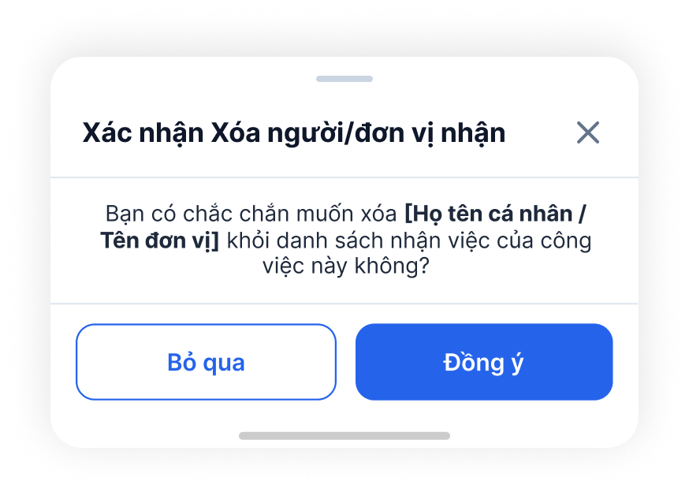
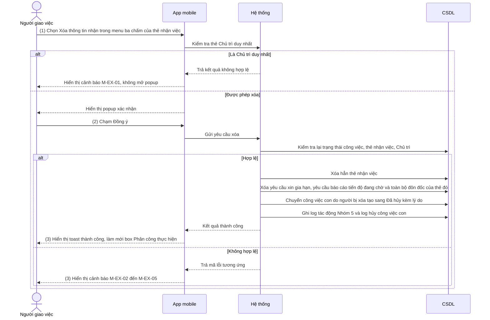

# NỘI DUNG

## ĐẶC TẢ YÊU CẦU CHỨC NĂNG HỆ THỐNG

### PHÂN HỆ QUẢN LÝ CÔNG VIỆC (APP MOBILE)

#### Module: Xóa thông tin nhận việc

##### Mô tả tóm tắt

Người giao việc xóa một cá nhân hoặc đơn vị ra khỏi danh sách nhận việc của công việc mình đã giao, tại box Phân công thực hiện trên màn hình Chi tiết công việc đã giao của app mobile. Chức năng bổ sung cho phần Phân công thực hiện của SRS Quản lý công việc app (`IOFFICE_SRS_V6_QUAN_LY_CONG_VIEC_APP_v1.0.docx`), dùng khi giao nhầm hoặc không còn cần cá nhân/đơn vị đó tham gia xử lý. Nghiệp vụ thống nhất với bản web đã duyệt (`docs/xoa-thong-tin-nhan-viec-web/SRS.md`); tài liệu này chỉ khác ở cách thao tác và hiển thị trên mobile.

---

##### Bảng thuật ngữ & Actor tham gia

**Từ viết tắt & thuật ngữ**

| Từ viết tắt / Thuật ngữ | Giải thích |
|---|---|
| Thẻ nhận việc | Một thẻ trong tab con "Phân công" của box Phân công thực hiện, thể hiện 1 cá nhân hoặc 1 đơn vị được giao công việc, kèm vai trò, hạn xử lý, trạng thái |
| Chủ trì | Vai trò có mã nghiệp vụ CHUTRI trong danh mục PHANCONG_CONGVIEC (tên hiển thị có thể được đơn vị đổi, mặc định là "Chủ trì"/"Xử lý chính") |
| Log tác động | Lịch sử tác động công việc, hiển thị tại Tab "Lịch sử tác động", ghi theo bảng "Thông tin log tác động công việc" trong SRS Quản lý công việc |

**Actor tham gia**

| Actor | Vai trò / Mô tả trong phạm vi module này |
|---|---|
| Người giao việc | Người tạo/giao công việc; người duy nhất được xóa thông tin nhận việc của công việc do mình giao |
| Cá nhân/đơn vị nhận việc | Bị xóa khỏi danh sách; sau khi xóa không còn thấy công việc này trong danh sách "Công việc cần xử lý" |

---

##### Phạm vi chỉnh sửa

- Màn hình Chi tiết công việc đã giao (Mobile) — Tab "Thông tin công việc" — box Phân công thực hiện — tab con "Phân công" (menu ba chấm của thẻ nhận việc)
- Ảnh hưởng gián tiếp:
  - Tab "Lịch sử tác động" của công việc (hiển thị thêm dòng log Nhóm 5 — Xóa người nhận việc)
  - Tab con "DS công việc con (N)" trong box Phân công thực hiện (số N giảm khi công việc con bị hủy)
  - Danh sách "Công việc cần xử lý" của cá nhân/đơn vị bị xóa
  - Công việc con do người bị xóa tạo (chuyển sang "Đã hủy")

---

##### Yêu cầu giao diện

- Hình ảnh giao diện / mockup:

  

  Hành vi UI đặc biệt:
  - Mỗi thẻ nhận việc mặc định hiển thị 2 icon chức năng, các chức năng còn lại nằm trong icon menu ba chấm theo thứ tự trong bảng quy định chức năng theo trạng thái. Chức năng "Xóa thông tin nhận" có thứ tự 3 nên nằm trong menu ba chấm.
  - Popup xác nhận hiển thị dạng khung nổi từ dưới lên như mockup, có thanh kéo ở đầu khung.

- Bảng mô tả các trường thông tin trên giao diện:

| Tên trường thông tin | Kiểu điều khiển | Độ dài | Ràng buộc / Điều kiện | Kiểu dữ liệu |
|---|---|---|---|---|
| **Box Phân công thực hiện — thẻ nhận việc** | | | | |
| Người/Đơn vị thực hiện | Label | 200 | Họ tên cá nhân hoặc tên đơn vị của thẻ; nội dung này được đưa vào popup xác nhận khi xóa | String |
| Vai trò | Label | 100 | Xử lý chính (Chủ trì) / Phối hợp / Theo dõi theo danh mục PHANCONG_CONGVIEC; dùng để xác định thẻ Chủ trì khi kiểm tra điều kiện xóa | String |
| Trạng thái | Badge màu | - | Trạng thái xử lý của thẻ nhận việc; thẻ có trạng thái "Đã hoàn thành" không được xóa | Enum/String |
| Mục "Xóa thông tin nhận" trong menu ba chấm | Menu item | - | Hiển thị theo từng thẻ nhận việc khi đồng thời thỏa: (1) người đăng nhập là Người giao việc/người tạo việc; (2) công việc ở trạng thái Chưa thực hiện hoặc Đang thực hiện; (3) trạng thái của thẻ nhận việc khác "Đã hoàn thành". Không thỏa → ẩn mục này. Chạm → mở popup xác nhận xóa | Action |
| **Popup xác nhận xóa** | | | | |
| Tiêu đề | Label | - | Hiển thị cố định: "Xác nhận Xóa người/đơn vị nhận" | String |
| Icon [X] | Icon Button | - | Chạm → đóng popup, không thực hiện gì (giống nút [Bỏ qua]) | Action |
| Nội dung xác nhận | Label | - | Hiển thị cố định: "Bạn có chắc chắn muốn xóa **[Họ tên cá nhân / Tên đơn vị]** khỏi danh sách nhận việc của công việc này không?"; phần trong ngoặc vuông in đậm, thay bằng họ tên cá nhân hoặc tên đơn vị của thẻ đang chọn | String |
| Nút [Bỏ qua] | Button (viền, nền trắng) | - | Chạm → đóng popup, không thực hiện gì | Action |
| Nút [Đồng ý] | Button (nền xanh) | - | Chạm → thực hiện xóa (→ Chức năng 1, Bước 2); disable trong lúc đang xử lý để tránh chạm 2 lần | Action |

---

##### Chức năng 1: Xóa thông tin nhận việc

###### Quy trình

###### Chức năng nghiệp vụ

**① Luồng xử lý thành công**

Bước 1: Người giao việc chọn "Xóa thông tin nhận" trong menu ba chấm của thẻ nhận việc, hệ thống thực hiện:

- Kiểm tra thẻ đang chọn có phải Chủ trì duy nhất không (→ M-EX-01)
- Hiển thị popup xác nhận xóa

Bước 2: Người giao việc chạm [Đồng ý] trên popup, hệ thống thực hiện:

- Kiểm tra lại quyền, trạng thái công việc, trạng thái thẻ nhận việc, điều kiện Chủ trì (→ M-EX-01 đến M-EX-05)
- Xóa hẳn thẻ nhận việc khỏi CSDL (→ M-BR-03, M-BR-04)
- Xóa yêu cầu xin gia hạn, yêu cầu báo cáo tiến độ đang chờ và toàn bộ đôn đốc của thẻ đó (→ M-BR-07)
- Chuyển công việc con do người bị xóa tạo sang "Đã hủy" kèm lý do hủy (→ M-BR-08, M-BR-09)
- Tính lại trạng thái chung của công việc (→ M-BR-06)
- Ghi log tác động: 1 log xóa thông tin nhận việc và 1 log hủy cho từng công việc con bị hủy
- Gửi thông báo
- Đóng popup, hiển thị toast thành công, làm mới box Phân công thực hiện và số (N) của tab "DS công việc con" (→ M-BR-10)

**② Luồng xử lý ngoại lệ**

| Mã | Tình huống | Xử lý |
|---|---|---|
| M-EX-01 | Thẻ đang xóa là Chủ trì duy nhất của công việc (sau khi xóa sẽ không còn Chủ trì nào) | Hiển thị toast cảnh báo "Không thể xóa Chủ trì duy nhất của công việc. Vui lòng thêm Chủ trì khác trước khi xóa." `[GIẢ ĐỊNH — wording, kế thừa bản web]`; không mở popup (Bước 1) hoặc không xóa và đóng popup (Bước 2) |
| M-EX-02 | Thẻ nhận việc đã chuyển sang trạng thái "Đã hoàn thành" trước khi chạm [Đồng ý] (thao tác đồng thời) | Hiển thị toast cảnh báo "Không thể xóa cá nhân/đơn vị đã hoàn thành công việc.", đóng popup, làm mới box Phân công thực hiện |
| M-EX-03 | Thẻ nhận việc đã bị xóa trước đó (bởi thao tác khác gần như đồng thời, kể cả trên web) | Hiển thị toast cảnh báo "Cá nhân/đơn vị này đã được xóa khỏi danh sách nhận việc trước đó.", đóng popup, làm mới box Phân công thực hiện |
| M-EX-04 | Công việc đã ở trạng thái Đã hoàn thành hoặc Đã hủy | Hiển thị toast cảnh báo "Không thể xóa thông tin nhận việc của công việc ở trạng thái hiện tại.", đóng popup, làm mới màn hình |
| M-EX-05 | Người dùng không phải Người giao việc/người tạo việc của công việc | Ẩn mục "Xóa thông tin nhận" trong menu ba chấm; nếu gọi trực tiếp API → trả lỗi 403, không thực hiện xóa |
| M-EX-06 | Mất kết nối mạng, lỗi máy chủ hoặc không phản hồi sau 10 giây `[GIẢ ĐỊNH — ngưỡng theo NFR chung của app]` khi chạm [Đồng ý] | Hiển thị toast "Không thể kết nối máy chủ, vui lòng thử lại.", giữ nguyên popup, không xóa, không ghi log |

**③ Quy tắc nghiệp vụ**

**Điều kiện được phép xóa**

- M-BR-01: Người giao việc mở box Phân công thực hiện → app hiển thị mục "Xóa thông tin nhận" trong menu ba chấm của từng thẻ nhận việc chỉ khi công việc ở trạng thái Chưa thực hiện/Đang thực hiện VÀ trạng thái của thẻ nhận việc khác "Đã hoàn thành" → các trường hợp còn lại không hiển thị mục này (→ M-EX-04, M-EX-05).
- M-BR-02: Người giao việc xóa thẻ có vai trò Chủ trì → hệ thống kiểm tra số thẻ Chủ trì hiện có → nếu đó là thẻ Chủ trì duy nhất thì không cho xóa (→ M-EX-01); nếu còn ít nhất 1 thẻ Chủ trì khác thì cho xóa. Sau mọi lần xóa, danh sách nhận việc luôn còn ít nhất 1 Chủ trì.

**Phạm vi và kết quả xóa**

- M-BR-03: Người giao việc xác nhận xóa → hệ thống xóa hẳn thẻ nhận việc (không đánh dấu ẩn) → cá nhân/đơn vị bị xóa không còn thấy công việc trong danh sách "Công việc cần xử lý". Dòng log tác động của lần xóa vẫn được giữ.
- M-BR-04: Người giao việc xóa thẻ nhận việc của đơn vị → hệ thống chỉ xóa đúng thẻ đơn vị đó → không xóa thẻ nhận việc nào khác. Lý do: khi giao việc cho đơn vị, danh sách nhận việc chỉ lưu thẻ đơn vị, không lưu thẻ của từng cá nhân thuộc đơn vị.
- M-BR-05: Người giao việc xóa thẻ của cá nhân → hệ thống chỉ xóa thẻ của đúng cá nhân đó, không ảnh hưởng thẻ đơn vị mà cá nhân đó trực thuộc (nếu có).
- M-BR-06: Sau khi xóa thẻ nhận việc → hệ thống tính lại trạng thái chung của công việc theo nguyên tắc góc nhìn Người giao việc trong "Danh mục trạng thái công việc" (ví dụ: thẻ bị xóa là thẻ chưa hoàn thành cuối cùng của các Chủ trì, các Chủ trì còn lại đã hoàn thành → công việc chuyển "Đã hoàn thành").

**Xử lý dữ liệu liên quan đến thẻ bị xóa**

- M-BR-07: Người giao việc xác nhận xóa thẻ nhận việc → hệ thống xóa hẳn các yêu cầu xin gia hạn, yêu cầu báo cáo tiến độ đang chờ xử lý và toàn bộ đôn đốc (nội dung, tệp đính kèm, số liệu thống kê "Số lần bị đôn đốc") của thẻ đó → log của các thao tác này ở Tab "Lịch sử tác động" vẫn giữ nguyên.
- M-BR-08: Người giao việc xác nhận xóa thẻ nhận việc → hệ thống chuyển trạng thái mọi công việc con do người bị xóa tạo từ công việc này sang "Đã hủy", kể cả công việc con đã hoàn thành (trạng thái "Đã hủy" lưu khác với trạng thái xử lý công việc); áp dụng cả bản ghi phía người giao và phía từng người/đơn vị nhận của công việc con; công việc con của công việc con được hủy theo, đệ quy nhiều cấp → lưu lý do hủy: "Người nhận việc đã bị xóa khỏi danh sách nhận việc của công việc cha." Không xóa bản ghi công việc con.
- M-BR-09: Công việc con đang ở trạng thái "Đã hủy" → giữ nguyên trạng thái, không hủy lại.

**Hiển thị sau khi xóa**

- M-BR-10: Xóa thành công, có công việc con bị hủy → số (N) tại tab "DS công việc con" giảm tương ứng số công việc con bị hủy; công việc con "Đã hủy" không còn hiển thị trong tab `[GIẢ ĐỊNH — danh sách hiển thị đồng bộ với số N]`.

###### Thông báo và thông tin lưu vết log

**Thông báo hệ thống**

| Sự kiện kích hoạt | Người nhận | Kênh | Nội dung thông báo |
|---|---|---|---|
| Xóa thông tin nhận việc thành công | Cá nhân bị xóa; hoặc các user thuộc đơn vị bị xóa | Tất cả các kênh thông báo (gồm thông báo đẩy trên app) | Xem EVT_XOA_NGUOI_NHAN_VIEC |
| Xóa thông tin nhận việc thành công | Người giao việc (người đang thao tác) | Toast trên app | "Đã xóa [Họ tên cá nhân / Tên đơn vị] khỏi danh sách nhận việc." `[GIẢ ĐỊNH — wording]` |

**Log hệ thống (Audit Trail)**

Lưu vào log tác động công việc (Nhóm 5 — Thay đổi người xử lý, trường hợp "Xóa người nhận việc" trong bảng "Thông tin log tác động công việc" của SRS Quản lý công việc), với các thông tin:
- Người cập nhật (user ID + tên; lưu cả thông tin đăng nhập và thông tin switch nếu có)
- Thời gian thay đổi (giờ, phút, ngày, tháng, năm)
- Thao tác: "Xóa thông tin nhận việc"
- Nội dung: Họ tên kèm userid của cá nhân bị xóa, hoặc tên đơn vị bị xóa, kèm Vai trò nhận việc của thẻ đó

Log hiển thị tại Tab "Lịch sử tác động" theo quy tắc hiển thị đã có (dòng log gạch ngang, nền đỏ nhạt).

Với mỗi công việc con bị hủy theo M-BR-08, ghi thêm log vào lịch sử tác động của công việc con đó (Nhóm 7 — "Xóa công việc/Hủy công việc"): thao tác "Hủy công việc", nội dung là lý do hủy ở M-BR-08; người cập nhật là Người giao việc đang thao tác.

###### Edge cases

- Người giao việc và người nhận thao tác đồng thời trên cùng thẻ (người nhận cập nhật hoàn thành đúng lúc người giao việc chạm [Đồng ý]) → thứ tự xử lý theo thời điểm hệ thống ghi nhận trước; bên sau nhận cảnh báo M-EX-02/M-EX-03.
- Hai người cùng có quyền giao việc của công việc xóa 2 thẻ Chủ trì cùng lúc, để lại 0 Chủ trì → việc kiểm tra lại điều kiện Chủ trì (M-BR-02) phải thực hiện trong cùng giao dịch với việc xóa.
- Công việc có nhiều công việc con (cây nhiều cấp) do người bị xóa tạo → cần đánh giá hiệu năng khi hủy đệ quy trong 1 lần thao tác; nếu hủy công việc con thất bại giữa chừng thì không xóa thẻ nhận việc (thực hiện trong cùng 1 giao dịch).
- App bị đóng hoặc mất mạng ngay sau khi chạm [Đồng ý], trước khi nhận phản hồi → khi mở lại, làm mới box Phân công thực hiện để hiển thị đúng kết quả; chạm [Đồng ý] lần nữa cho thẻ đã bị xóa sẽ nhận cảnh báo M-EX-03 (không xóa/hủy lặp).
- Xóa thẻ đơn vị: chưa rõ công việc con do người thuộc đơn vị đó tạo có bị hủy hay không `[CẦN XÁC NHẬN — đồng bộ với bản web]`.
- Cá nhân bị xóa đang mở màn hình Chi tiết công việc cần xử lý của công việc trên app → thao tác tiếp theo của họ báo công việc không còn quyền truy cập `[CẦN XÁC NHẬN — wording]`.

---

## ĐIỀU KIỆN NGHIỆM THU HỆ THỐNG `[CẦN XÁC NHẬN]`

Hệ thống được nghiệm thu khi thỏa các điều kiện sau:

- Hệ thống được thiết kế và vận hành theo mô tả trong tài liệu này, đồng thời đáp ứng toàn bộ các Yêu cầu Chức năng ghi nhận trong tài liệu
- Hệ thống được hiệu chỉnh sau khi triển khai thử nghiệm
- Tổ chức hướng dẫn sử dụng cho người dùng
- Người sử dụng thao tác tốt trên hệ thống sau khi qua khóa đào tạo
- Tất cả tài liệu và source chương trình được bàn giao đầy đủ

---

# PHỤ LỤC

Không có.
