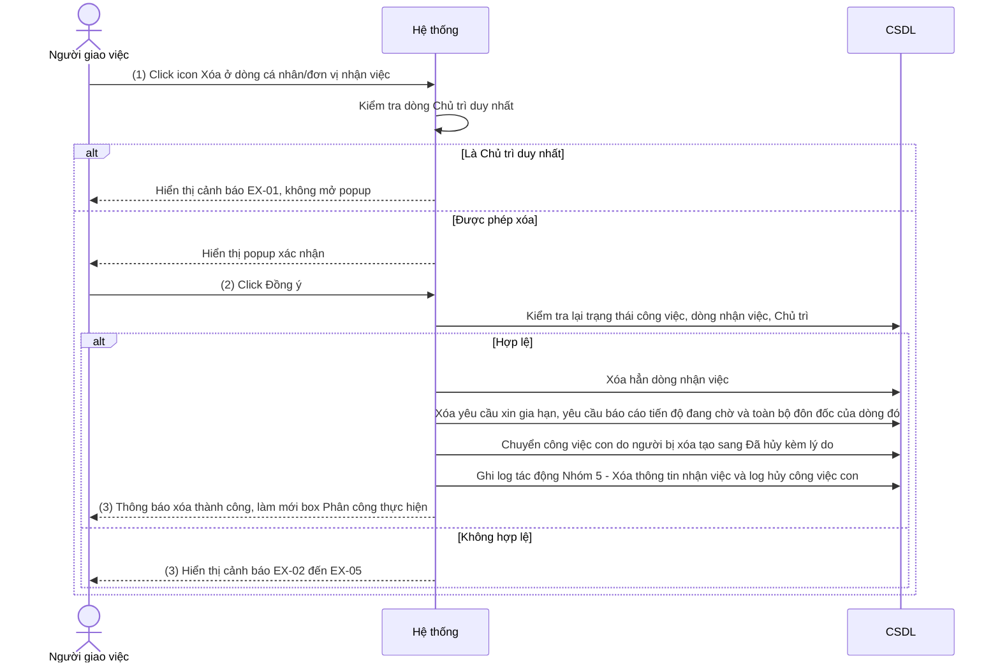

# NỘI DUNG

## ĐẶC TẢ YÊU CẦU CHỨC NĂNG HỆ THỐNG

### PHÂN HỆ QUẢN LÝ CÔNG VIỆC (WEB)

#### Module: Xóa thông tin nhận việc

##### Mô tả tóm tắt

Người giao việc xóa một cá nhân hoặc đơn vị ra khỏi danh sách nhận việc của công việc mình đã giao, tại box Phân công thực hiện trên màn hình Chi tiết công việc đã giao. Chức năng bổ sung cho phần Phân công thực hiện của SRS Quản lý công việc (`IOFFICE_SRS_V6_QUAN_LY_CONG_VIEC_v1.0.docx`), dùng khi giao nhầm hoặc không còn cần cá nhân/đơn vị đó tham gia xử lý.

---

##### Bảng thuật ngữ & Actor tham gia

**Từ viết tắt & thuật ngữ**

| Từ viết tắt / Thuật ngữ | Giải thích                                                                                                                                    |
| ----------------------- | --------------------------------------------------------------------------------------------------------------------------------------------- |
| Dòng nhận việc          | Một dòng trong box Phân công thực hiện, thể hiện 1 cá nhân hoặc 1 đơn vị được giao công việc, kèm vai trò, hạn xử lý, trạng thái              |
| Chủ trì                 | Vai trò có mã nghiệp vụ CHUTRI trong danh mục PHANCONG_CONGVIEC (tên hiển thị có thể được đơn vị đổi, mặc định là "Chủ trì"/"Xử lý chính")    |
| Log tác động            | Lịch sử tác động công việc, hiển thị tại Tab "Lịch sử tác động", ghi theo bảng "Thông tin log tác động công việc" trong SRS Quản lý công việc |

**Actor tham gia**

| Actor                    | Vai trò / Mô tả trong phạm vi module này                                                              |
| ------------------------ | ----------------------------------------------------------------------------------------------------- |
| Người giao việc          | Người tạo/giao công việc; người duy nhất được xóa thông tin nhận việc của công việc do mình giao      |
| Cá nhân/đơn vị nhận việc | Bị xóa khỏi danh sách; sau khi xóa không còn thấy công việc này trong danh sách "Công việc cần xử lý" |

---

##### Phạm vi chỉnh sửa

- Màn hình Chi tiết công việc đã giao — Tab "Thông tin công việc" — box Phân công thực hiện (cột Thao tác)
- Ảnh hưởng gián tiếp:
  - Tab "Lịch sử tác động" của công việc (hiển thị thêm dòng log Nhóm 5 — Xóa người nhận việc)
  - Danh sách "Công việc cần xử lý" của cá nhân/đơn vị bị xóa
  - Công việc con do người bị xóa tạo (chuyển sang "Đã hủy") và người giao/người nhận của các công việc con đó

---

##### Yêu cầu giao diện

- Hình ảnh giao diện / mockup:
  
  `[CẦN BỔ SUNG ẢNH]` — `images/FC-001-xoa-thong-tin-nhan-viec-mockup.png` (box Phân công thực hiện có icon Xóa và popup xác nhận). Chưa có ảnh mockup từ người dùng.
  
  Hành vi UI đặc biệt: icon Xóa hiển thị theo từng dòng nhận việc, nằm trong cột Thao tác cùng các icon chức năng khác (mặc định hiển thị 2 icon, các icon còn lại nằm trong menu ba chấm theo thứ tự trong bảng quy định chức năng theo trạng thái).

- Bảng mô tả các trường thông tin trên giao diện:

| Tên trường thông tin   | Kiểu điều khiển | Độ dài | Ràng buộc / Điều kiện                                                                                                                                                            | Kiểu dữ liệu |
| ---------------------- | --------------- | ------ | -------------------------------------------------------------------------------------------------------------------------------------------------------------------------------- | ------------ |
| **Popup xác nhận xóa** |                 |        |                                                                                                                                                                                  |              |
| Nội dung xác nhận      | Label           | -      | Hiển thị cố định: "Bạn có chắc chắn muốn xóa [Họ tên cá nhân / Tên đơn vị] khỏi danh sách nhận việc của công việc này không?" `[GIẢ ĐỊNH — wording, cần BA/khách hàng xác nhận]` | String       |
| Nút [Đồng ý]           | Button          | -      | Click → thực hiện xóa (→ Chức năng 1, Bước 2); disable trong lúc đang xử lý để tránh bấm 2 lần                                                                                   | Action       |
| Nút [Bỏ qua]           | Button          | -      | Click → đóng popup, không thực hiện gì                                                                                                                                           | Action       |

---

##### Chức năng 1: Xóa thông tin nhận việc

###### Quy trình

###### Chức năng nghiệp vụ

**① Luồng xử lý thành công**

Bước 1: Người giao việc click icon Xóa ở dòng cá nhân/đơn vị nhận việc trong box Phân công thực hiện, hệ thống thực hiện:

- Kiểm tra dòng đang chọn có phải Chủ trì duy nhất không (→ EX-01)
- Hiển thị popup xác nhận xóa

Bước 2: Người giao việc click [Đồng ý] trên popup, hệ thống thực hiện:

- Kiểm tra lại quyền, trạng thái công việc, trạng thái dòng nhận việc, điều kiện Chủ trì (→ EX-01 đến EX-05)
- Xóa hẳn dòng nhận việc khỏi CSDL (→ BR-03, BR-04)
- Xóa yêu cầu xin gia hạn, yêu cầu báo cáo tiến độ đang chờ và toàn bộ đôn đốc của dòng đó (→ BR-07)
- Chuyển công việc con do người bị xóa tạo sang "Đã hủy" kèm lý do hủy (→ BR-08, BR-09)
- Tính lại trạng thái chung của công việc (→ BR-06)
- Ghi log tác động: 1 log xóa thông tin nhận việc và 1 log hủy cho từng công việc con bị hủy
- Gửi thông báo
- Đóng popup, hiển thị thông báo xóa thành công, làm mới box Phân công thực hiện

**② Luồng xử lý ngoại lệ**

| Mã    | Tình huống                                                                                           | Xử lý                                                                                                                                                                                             |
| ----- | ---------------------------------------------------------------------------------------------------- | ------------------------------------------------------------------------------------------------------------------------------------------------------------------------------------------------- |
| EX-01 | Dòng đang xóa là Chủ trì duy nhất của công việc (sau khi xóa sẽ không còn Chủ trì nào)               | Hiển thị cảnh báo "Không thể xóa Chủ trì duy nhất của công việc. Vui lòng thêm Chủ trì khác trước khi xóa." `[GIẢ ĐỊNH — wording]`; không mở popup (Bước 1) hoặc không xóa và đóng popup (Bước 2) |
| EX-02 | Dòng nhận việc đã chuyển sang trạng thái "Đã hoàn thành" trước khi bấm [Đồng ý] (thao tác đồng thời) | Hiển thị cảnh báo "Không thể xóa cá nhân/đơn vị đã hoàn thành công việc.", đóng popup, làm mới box Phân công thực hiện                                                                            |
| EX-03 | Dòng nhận việc đã bị xóa trước đó (bởi thao tác khác gần như đồng thời)                              | Hiển thị cảnh báo "Cá nhân/đơn vị này đã được xóa khỏi danh sách nhận việc trước đó.", đóng popup, làm mới box Phân công thực hiện                                                                |
| EX-04 | Công việc đã ở trạng thái Đã hoàn thành hoặc Đã hủy                                                  | Hiển thị cảnh báo "Không thể xóa thông tin nhận việc của công việc ở trạng thái hiện tại.", đóng popup, làm mới màn hình                                                                          |
| EX-05 | Người dùng không phải Người giao việc/người tạo việc của công việc                                   | Ẩn icon Xóa; nếu gọi trực tiếp API → trả lỗi 403, không thực hiện xóa                                                                                                                             |
| EX-06 | Mất kết nối mạng hoặc lỗi máy chủ khi bấm [Đồng ý]                                                   | Hiển thị cảnh báo "Không thể kết nối máy chủ, vui lòng thử lại.", giữ nguyên popup, không xóa, không ghi log                                                                                      |

**③ Quy tắc nghiệp vụ**

**Điều kiện được phép xóa**

- BR-01: Người giao việc mở box Phân công thực hiện → hệ thống hiển thị icon Xóa ở từng dòng nhận việc chỉ khi công việc ở trạng thái Chưa thực hiện/Đang thực hiện VÀ trạng thái của dòng nhận việc khác "Đã hoàn thành" → các trường hợp còn lại không hiển thị icon (→ EX-04, EX-05).
- BR-02: Người giao việc xóa dòng có vai trò Chủ trì → hệ thống kiểm tra số dòng Chủ trì hiện có → nếu đó là dòng Chủ trì duy nhất thì không cho xóa (→ EX-01); nếu còn ít nhất 1 dòng Chủ trì khác thì cho xóa. Sau mọi lần xóa, danh sách nhận việc luôn còn ít nhất 1 Chủ trì.

**Phạm vi và kết quả xóa**

- BR-03: Người giao việc xác nhận xóa → hệ thống xóa hẳn dòng nhận việc (không đánh dấu ẩn) → cá nhân/đơn vị bị xóa không còn thấy công việc trong danh sách "Công việc cần xử lý". Dòng log tác động của lần xóa vẫn được giữ.
- BR-04: Người giao việc xóa dòng nhận việc của đơn vị → hệ thống chỉ xóa đúng dòng đơn vị đó → không xóa dòng nhận việc nào khác. Lý do: khi giao việc cho đơn vị, danh sách nhận việc chỉ lưu dòng đơn vị, không lưu dòng của từng cá nhân thuộc đơn vị.
- BR-05: Người giao việc xóa dòng của cá nhân → hệ thống chỉ xóa dòng của đúng cá nhân đó, không ảnh hưởng dòng đơn vị mà cá nhân đó trực thuộc (nếu có).
- BR-06: Sau khi xóa dòng nhận việc → hệ thống tính lại trạng thái chung của công việc theo nguyên tắc góc nhìn Người giao việc trong "Danh mục trạng thái công việc" (ví dụ: dòng bị xóa là dòng chưa hoàn thành cuối cùng của các Chủ trì, các Chủ trì còn lại đã hoàn thành → công việc chuyển "Đã hoàn thành").

**Xử lý dữ liệu liên quan đến dòng bị xóa**

- BR-07: Người giao việc xác nhận xóa dòng nhận việc → hệ thống xóa hẳn các yêu cầu xin gia hạn, yêu cầu báo cáo tiến độ đang chờ xử lý và toàn bộ đôn đốc (nội dung, tệp đính kèm, số liệu thống kê "Số lần bị đôn đốc") của dòng đó → log của các thao tác này ở Tab "Lịch sử tác động" vẫn giữ nguyên.
- BR-08: Người giao việc xác nhận xóa dòng nhận việc → hệ thống chuyển trạng thái mọi công việc con do người bị xóa tạo từ công việc này sang "Đã hủy" - kể cả với trường hợp công việc con đó đã hoàn thành cũng chuyển sang trạng thái đã hủy (trạng thái đã hủy lưu khác với trạng thái xử lý công việc) (áp dụng cả bản ghi phía người giao và phía từng người/đơn vị nhận của công việc con; công việc con của công việc con được hủy theo, đệ quy nhiều cấp) → lưu lý do hủy: "Người nhận việc đã bị xóa khỏi danh sách nhận việc của công việc cha." Không xóa bản ghi công việc con.
- BR-09: Công việc con đang ở trạng thái "Đã hủy" → giữ nguyên trạng thái, không hủy lại.

###### Thông báo và thông tin lưu vết log

**Thông báo hệ thống**

| Sự kiện kích hoạt                  | Người nhận                                        | Kênh                      | Nội dung thông báo          |
| ---------------------------------- | ------------------------------------------------- | ------------------------- | --------------------------- |
| Xóa thông tin nhận việc thành công | Cá nhân bị xóa; hoặc các user thuộc đơn vị bị xóa | tất cả các kênh thông báo | xem EVT_XOA_NGUOI_NHAN_VIEC |

**Log hệ thống (Audit Trail)**

Lưu vào log tác động công việc (Nhóm 5 — Thay đổi người xử lý, trường hợp "Xóa người nhận việc" trong bảng "Thông tin log tác động công việc" của SRS Quản lý công việc), với các thông tin:

- Người cập nhật (user ID + tên; lưu cả thông tin đăng nhập và thông tin switch nếu có)
- Thời gian thay đổi (giờ, phút, ngày, tháng, năm)
- Thao tác: "Xóa thông tin nhận việc"
- Nội dung: Họ tên kèm userid của cá nhân bị xóa, hoặc tên đơn vị bị xóa, kèm Vai trò nhận việc của dòng đó

Log hiển thị tại Tab "Lịch sử tác động" theo quy tắc hiển thị đã có (dòng log gạch ngang, nền đỏ nhạt).

Với mỗi công việc con bị hủy theo BR-08, ghi thêm log vào lịch sử tác động của công việc con đó (Nhóm 7 — "Xóa công việc/Hủy công việc"): thao tác "Hủy công việc", nội dung là lý do hủy ở BR-08; người cập nhật là Người giao việc đang thao tác.

###### Edge cases

- Người giao việc và người nhận thao tác đồng thời trên cùng dòng (người nhận cập nhật hoàn thành đúng lúc người giao việc bấm [Đồng ý]) → thứ tự xử lý theo thời điểm hệ thống ghi nhận trước; bên sau nhận cảnh báo EX-02/EX-03.
- Hai người cùng có quyền giao việc của công việc xóa 2 dòng Chủ trì cùng lúc, để lại 0 Chủ trì → việc kiểm tra lại điều kiện Chủ trì (BR-02) phải thực hiện trong cùng giao dịch với việc xóa.
- Công việc có nhiều công việc con (cây nhiều cấp) do người bị xóa tạo → cần đánh giá hiệu năng khi hủy đệ quy trong 1 lần thao tác; nếu hủy công việc con thất bại giữa chừng thì không xóa dòng nhận việc (thực hiện trong cùng 1 giao dịch).
- Xóa dòng đơn vị: chưa rõ công việc con do người thuộc đơn vị đó tạo có bị hủy hay không `[CẦN XÁC NHẬN]`.
- Cá nhân bị xóa đang mở màn hình Chi tiết công việc cần xử lý của công việc → thao tác tiếp theo của họ báo công việc không còn quyền truy cập `[CẦN XÁC NHẬN — wording]`.

---
